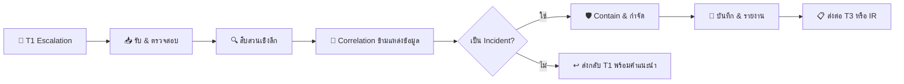
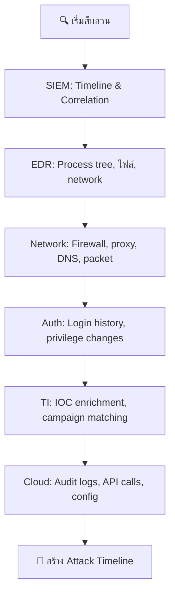
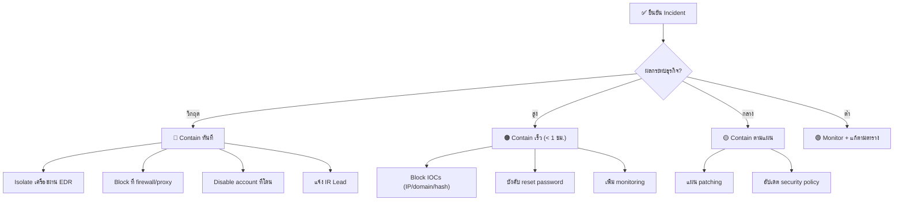

# คู่มือปฏิบัติงาน SOC Tier 2

> **รหัสเอกสาร:** RB-T2-001  
> **เวอร์ชัน:** 1.0  
> **อัปเดตล่าสุด:** 2026-02-16  
> **เจ้าของ:** SOC Manager  
> **กลุ่มเป้าหมาย:** Tier 2 / Senior SOC Analyst

---

## ภาพรวมบทบาท

ในฐานะ Tier 2 analyst คุณคือ **กระดูกสันหลังด้านการสืบสวน** ของ SOC คุณรับ escalation จาก Tier 1 ทำการวิเคราะห์เชิงลึก ประสานงานการ contain และตัดสินว่าเหตุการณ์เป็น incident จริงที่ต้องเปิด IR หรือไม่



---

## 🆕 สิ่งที่ Tier 2 ต้องมี

ก่อนเริ่ม ต้องมั่นใจว่ามีสิ่งเหล่านี้:

```
□ SIEM access เต็มรูปแบบ (read + write + saved searches)
□ EDR console access (isolate, collect, remediate)
□ Threat intelligence platform (MISP, ThreatConnect ฯลฯ)
□ เครื่องมือ forensic (Velociraptor, KAPE, Volatility)
□ Sandbox (Any.Run, Hybrid Analysis, หรือ internal)
□ Network packet capture (Wireshark, Zeek, tcpdump)
□ Ticketing system — incident management permissions
□ ช่องสื่อสาร: #soc-incidents, #ir-team, bridge call access
□ เข้าใจ: IR Framework, Playbook ทั้ง 35 ชุด, MITRE ATT&CK
□ ผ่านงาน T1 มาอย่างน้อย 6 เดือน
```

---

## ขั้นตอนการทำงานประจำวัน

```
08:00  เริ่มกะ → ตรวจ T1 escalation queue
08:15  เช็ค incident ที่เปิดอยู่ → อัปเดตสถานะ
08:30  ดำเนินการ T1 escalations (เป้า: 5–8 investigation/วัน)
       ↓ วงจรการสืบสวน ↓
       ตรวจสอบ → สืบสวน → Correlate → Contain หรือ Close
11:00  Review threat intelligence — IOCs ใหม่, advisory
12:00  Standup กับ SOC Manager + T3
14:00  สืบสวนต่อ + mentor T1
16:00  เตรียม handoff + อัปเดต incident timeline
16:30  ส่งมอบกะ
```

---

## รับ Escalation จาก T1

### ขั้นที่ 1: ตรวจสอบ Escalation (5 นาที)

| ตรวจอะไร | ทำอะไร |
|:---|:---|
| Ticket ครบไหม? | ยืนยัน T1 บันทึก: alert ID, IOCs, สิ่งที่ทำแล้ว |
| เป็น scope ของ T2 จริงไหม? | ส่งปัญหา operation กลับ IT, FP กลับ T1 |
| Priority ถูกไหม? | ประเมินซ้ำตาม asset criticality + threat context |
| แก้เร็วได้ไหม? | จัดการได้ใน < 5 นาทีไหม? (เช่น FP ที่ T1 พลาด) |

### ขั้นที่ 2: จำแนก Investigation

| หมวด | ตัวอย่าง | ระยะเวลาปกติ |
|:---|:---|:---:|
| 🔴 **ถูกบุกรุกจริง** | Malware ทำงาน, ข้อมูลรั่วอยู่ | 1–4 ชม. |
| 🟠 **อาจถูกบุกรุก** | IOC น่าสงสัย, พฤติกรรมผิดปกติ | 2–8 ชม. |
| 🟡 **ละเมิดนโยบาย** | เข้าถึงไม่ได้รับอนุญาต, shadow IT | 1–2 ชม. |
| 🟢 **ตรวจ FP ซับซ้อน** | FP ที่ต้องวิเคราะห์ลึก | 30–60 นาที |

---

## วิธีการสืบสวนเชิงลึก

### Phase 1: ประเมินขอบเขต (15 นาที)

```
□ มีกี่เครื่อง/กี่ user โดน?
□ Asset ที่โดนมี business criticality แค่ไหน?
□ ข้อมูลที่อาจรั่วมีอะไรบ้าง?
□ มี lateral movement เกิดขึ้นไหม?
□ Timeline: เริ่มเกิดเมื่อไร? (หลักฐานแรกสุด)
```

### Phase 2: เก็บหลักฐาน (30–60 นาที)



#### SIEM Correlation Queries

```spl
# Splunk: Activity ทั้งหมดจากเครื่องที่โดน (48 ชม.)
index=* host="COMPROMISED_HOST" earliest=-48h
| stats count by sourcetype, action | sort -count

# ตรวจ lateral movement
index=auth (EventCode=4624 OR EventCode=4648) Logon_Type=3
src_ip="COMPROMISED_IP" earliest=-7d
| stats count dc(dest) as unique_targets by src_ip, user
| where unique_targets > 3

# Process lineage — อะไร spawn อะไร
index=edr host="HOSTNAME" earliest=-48h
| table _time, parent_process, process_name, command_line, user
| sort _time

# DNS query ไป domain ใหม่/หายาก
index=dns src_ip="HOST_IP" earliest=-7d
| stats count by query | where count < 5

# ปริมาณ data transfer ตามปลายทาง
index=firewall src_ip="HOST_IP" action=allowed earliest=-48h
| stats sum(bytes_out) as MB by dest_ip | eval MB=MB/1048576
| where MB > 100 | sort -MB
```

#### Elastic Queries

```
# Event ทั้งหมดจากเครื่องที่โดน
host.name: "COMPROMISED_HOST" AND @timestamp > "now-48h"

# Process execution ที่น่าสงสัย
event.category: "process" AND host.name: "HOSTNAME"
  AND process.name: ("powershell.exe" OR "certutil.exe" OR "mshta.exe"
    OR "regsvr32.exe" OR "rundll32.exe" OR "bitsadmin.exe")

# Network connection ไป IP ภายนอก
event.category: "network" AND source.ip: "INTERNAL_IP"
  AND NOT destination.ip: (10.0.0.0/8 OR 172.16.0.0/12 OR 192.168.0.0/16)
```

### Phase 3: IOC Deep Enrichment

| IOC | Basic (T1 ทำแล้ว) | Deep (T2 ทำเพิ่ม) |
|:---|:---|:---|
| IP Address | VT reputation | Passive DNS, ASN history, BGP peers |
| Domain | WHOIS lookup | อายุ domain, registrant, ประวัติ SSL cert |
| Hash | VT detection | Sandbox detonation, YARA match, family ID |
| URL | Reputation check | Redirect chain ครบ, content analysis |
| Email | Header check | SPF/DKIM/DMARC analysis, campaign คล้ายกัน |

#### Sandbox Analysis Checklist
```
□ ส่ง hash/URL ไป sandbox (Any.Run, Hybrid Analysis, Joe Sandbox)
□ บันทึก: dropped files, registry changes, network callbacks
□ Extract IOCs เพิ่ม: C2 domains, secondary payloads
□ ตรวจ MITRE ATT&CK techniques ที่สังเกตเห็น
□ เปรียบเทียบกับ malware families ที่รู้จัก
```

---

## กรอบการตัดสินใจ Containment



### Containment Actions Quick Reference

| Action | เครื่องมือ | ใช้เมื่อ |
|:---|:---|:---|
| Isolate host | EDR (CrowdStrike/Defender) | Malware, C2, lateral movement |
| Block IP/Domain | Firewall, DNS sinkhole, Proxy | C2, malicious infrastructure |
| Disable account | AD/Azure AD/Okta | Account ถูก compromise |
| Block hash | EDR, Email gateway | ไฟล์อันตราย |
| Reset password | AD/Azure AD | สงสัย credential theft |
| Revoke sessions | Azure AD, Okta, AWS IAM | Token theft, session hijacking |
| Kill process | EDR remote shell | Malware ทำงานอยู่ |
| Quarantine email | Email gateway | Phishing campaign |

### ⚠️ กฎ Containment

```
ควรทำ:
  ✅ บันทึกทุก containment action พร้อม timestamp
  ✅ ขออนุมัติ IR Lead ก่อน isolate production server
  ✅ ยืนยัน backup มีก่อนทำ destructive action
  ✅ แจ้ง business unit ก่อน contain
  ✅ เก็บหลักฐาน — snapshot/image ก่อน wipe

ห้ามทำ:
  ❌ Isolate โดยไม่บันทึก
  ❌ ลบ malware โดยไม่เก็บ sample ก่อน
  ❌ Reboot เครื่องที่โดน (ทำลาย volatile memory)
  ❌ แจ้ง insider ที่ต้องสงสัย
  ❌ ทำ containment จำนวนมากโดยไม่ขออนุมัติ
```

---

## MITRE ATT&CK Mapping

Map แต่ละ investigation กับ ATT&CK techniques:

| Phase | Techniques ที่พบบ่อย | มองหาอะไร |
|:---|:---|:---|
| **Initial Access** | T1566 Phishing, T1078 Valid Accounts | Email IOCs, credential ที่ขโมย |
| **Execution** | T1059 Command/Script, T1204 User Execution | PowerShell, WScript, macro |
| **Persistence** | T1053 Scheduled Task, T1547 Boot Autostart | Registry, services, crontab |
| **Privilege Escalation** | T1068 Exploitation, T1548 Abuse Elevation | UAC bypass, sudo abuse |
| **Defense Evasion** | T1070 Indicator Removal, T1027 Obfuscation | ล้าง log, encoding |
| **Credential Access** | T1003 OS Credential Dumping | Mimikatz, LSASS access |
| **Lateral Movement** | T1021 Remote Services, T1570 Lateral Transfer | RDP, PsExec, WMI |
| **Exfiltration** | T1041 Over C2, T1567 Over Web Service | Cloud upload, DNS tunnel |

---

## Template บันทึก Incident

```markdown
## สรุป Incident
- Ticket ID: [INCT-XXXX]
- Severity: [P1/P2/P3/P4]
- สถานะ: [สืบสวน / Contained / กำจัดแล้ว / แก้ไขแล้ว]
- Analyst: [ชื่อ]
- เวลาเริ่ม: [alert แรกเมื่อไร]
- เวลาตรวจพบ: [SOC รู้เมื่อไร]
- เวลา Contain: [contain เมื่อไร]

## เรื่องราวการโจมตี
[สรุป 1 ย่อหน้า: ใครโจมตีอะไร อย่างไร เมื่อไร ผลกระทบ]

## ระบบที่ได้รับผลกระทบ
| Host | IP | บทบาท | สถานะ |
|:---|:---|:---|:---|
| [hostname] | [IP] | [server/workstation] | [isolated/clean/compromised] |

## สรุป IOC
| ประเภท | ค่า | แหล่ง | Action |
|:---|:---|:---|:---|
| IP | x.x.x.x | VT (45/90) | Block ที่ firewall |
| Hash | abc123 | Sandbox | Block ใน EDR |
| Domain | evil.com | TI feed | DNS sinkhole |

## MITRE ATT&CK
- Initial Access: T1566.001 (Spearphishing Attachment)
- Execution: T1059.001 (PowerShell)
- Persistence: T1053.005 (Scheduled Task)

## Timeline
| เวลา | เหตุการณ์ | แหล่ง |
|:---|:---|:---|
| 09:15 | รับ phishing email | Email gateway |
| 09:22 | User คลิก link | Proxy log |
| 09:23 | Malware ดาวน์โหลด | EDR |
| 09:30 | C2 callback | Firewall |
| 09:35 | T1 escalate T2 | Ticket |
| 09:50 | Isolate เครื่อง | EDR |

## Containment Actions
1. [action + เวลา + ใครอนุมัติ]

## Root Cause
[วิเคราะห์สาเหตุโดยย่อ]

## ข้อเสนอแนะ
1. [ปรับ alert tuning]
2. [ปรับปรุง process]
3. [ช่องโหว่ security control]
```

---

## การ Mentor T1 Analyst

เป็นส่วนหนึ่งของบทบาท — พัฒนาทักษะ T1:

| สถานการณ์ | สิ่งที่ควรทำ |
|:---|:---|
| T1 escalate ผิด | อธิบายเหตุผล, ชี้สิ่งที่พลาด, ไม่ลงโทษ |
| T1 พลาด true positive | Walk-through ตัวบ่งชี้ที่พลาดด้วยกัน |
| FP ซ้ำๆ | ช่วย T1 เขียน tuning request, review ด้วยกัน |
| T1 ถามคำถามดี | ชม, แชร์ resource, ให้โอกาสท้าทาย |
| T1 ใหม่ onboard | จัด shadow sessions, review 10 ticket แรก |

---

## ตัวชี้วัดประสิทธิภาพ T2

| Metric | เป้าหมาย | หมายเหตุ |
|:---|:---:|:---|
| Investigation/วัน | 5–8 | แตกต่างตามความซับซ้อน |
| Mean Time to Investigate | ≤ 2 ชม. | เริ่ม-ถึง-ตัดสินใจ |
| Mean Time to Contain | ≤ 4 ชม. | ตัดสินใจ-ถึง-contain |
| Incident Detection Accuracy | > 95% | ตรวจสอบหลัง review |
| IOC Feed Contribution | ≥ 5/สัปดาห์ | แชร์ findings กับ TI team |
| ชม. Mentor T1 | ≥ 2/สัปดาห์ | ลงทุนพัฒนาทีม |
| ATT&CK Coverage | ติดตามรายเดือน | Dashboard metrics |

---

## Shift Handoff — T2

```
=== T2 Shift Handoff: [วันที่] [กะ] ===
Analyst: [ชื่อ]

📊 Investigation:
  ✅ เสร็จ: [N] investigations
  ⏳ กำลังดำเนินการ: [N] — รายละเอียด:
    - [INCT-XXX] — [สถานะ, ขั้นตอนถัดไป]
  
🔴 Incident ที่ active:
  - [INCT-XXX] — [severity, สถานะ, ใครรับผิดชอบ]

🛡️ Containment Actions ที่ทำ:
  - [รายการ blocks, isolations, หรือ resets ที่ทำกะนี้]

📝 Feedback T1:
  - [บันทึก mentoring, ข้อผิดพลาดที่พบบ่อยวันนี้]

⚠️ ระวัง:
  - [follow-up ที่รอ, ผล pending, TI advisories]
```

---

## รายชื่อติดต่อ

| บทบาท | ติดต่อเมื่อ |
|:---|:---|
| T1 Analyst | ส่ง escalation กลับ, ให้คำแนะนำ |
| T3 / Threat Hunter | Advanced threats, APT, malware RE |
| IR Lead | P1 incidents, อนุมัติ containment |
| SOC Manager | ต้องการ resource, ปัญหา process |
| IT Ops / SysAdmin | เข้าระบบ, ปัญหา log collection |
| Network Team | Firewall rules, packet captures |
| Cloud Team | Cloud IAM, API investigation |
| Legal / Compliance | Data breach, แจ้ง PDPA |

---

## เอกสารที่เกี่ยวข้อง

- [กรอบ IR](Framework.th.md)
- [ตารางความรุนแรง](Severity_Matrix.th.md)
- [ตาราง Escalation](Escalation_Matrix.th.md)
- [Tier 1 Runbook](Tier1_Runbook.th.md)
- [การสืบสวน Forensic](Forensic_Investigation.th.md)
- [การเก็บหลักฐาน](Evidence_Collection.th.md)
- [Playbook ทั้งหมด (PB-01 ถึง PB-35)](Playbooks/)
