# SOC Tier 3 Analyst Runbook

> **Document ID:** RB-T3-001  
> **Version:** 1.0  
> **Last Updated:** 2026-02-16  
> **Owner:** SOC Manager  
> **Audience:** Tier 3 / Threat Hunters / Senior IR Analysts

---

## Role Overview

As a Tier 3 analyst, you are the **most senior technical resource** in the SOC. You proactively hunt for threats, reverse-engineer malware, lead complex incident response, develop detection content, and drive strategic improvements to security posture.

```mermaid
graph LR
    Proactive["🎯 Proactive Hunting"] --> Discover["💡 Discover Threats"]
    Reactive["🔴 T2 Escalation"] --> Analyze["🔬 Advanced Analysis"]
    Discover --> Intel["📊 Produce Intelligence"]
    Analyze --> Intel
    Intel --> Detection["🛡️ Create New Detections"]
    Detection --> Improve["📈 Improve SOC Capability"]
    Improve --> Proactive
```



---

## 🆕 Tier 3 Prerequisites

```
□ Expert-level SIEM (custom detection rules, advanced SPL/KQL)
□ EDR advanced hunting / threat hunting modules
□ Malware analysis environment (RE lab, disassembler, debugger)
□ Forensic toolkit (KAPE, Volatility, Autopsy, FTK)
□ Network forensics (Wireshark deep analysis, Zeek scripting)
□ Threat intelligence platform — contributor access
□ Detection engineering pipeline (Sigma → SIEM rule deployment)
□ Purple team tooling (Atomic Red Team, MITRE Caldera)
□ Programming: Python, PowerShell, Bash (automating analysis)
□ Minimum 2 years Tier 2 experience + relevant certifications
```

---

## Daily Responsibilities

Unlike T1/T2 with fixed shift routines, T3 work is project-based:

| Time Allocation | Activity | Frequency |
|:---|:---|:---|
| 30% | **Threat Hunting** — Hypothesis-driven hunts | Ongoing |
| 25% | **Advanced IR** — Complex incident investigation | As needed |
| 20% | **Detection Engineering** — New Sigma/YARA rules | Weekly |
| 15% | **Research & Intelligence** — Threat landscape, TTP analysis | Daily |
| 10% | **Mentoring & Knowledge Share** — T1/T2 training, postmortems | Weekly |

---

## Threat Hunting Framework

### Hypothesis-Driven Hunting Process

```mermaid
graph TD
    Hypothesis["💭 Form Hypothesis"] --> Data["📊 Identify Data Sources"]
    Data --> Hunt["🔍 Execute Hunt"]
    Hunt --> Analyze["🔬 Analyze Results"]
    Analyze --> Found{Threat Found?}
    Found -->|Yes| Incident["🚨 Create Incident"]
    Found -->|No| Improve["📝 Detection Gap Analysis"]
    Incident --> IOC["Extract IOCs + TTPs"]
    IOC --> Detection["🛡️ Create New Detection Rule"]
    Improve --> Detection
    Detection --> Document["📋 Document Hunt Results"]
    Document --> Hypothesis
```



### Hypothesis Templates

| Source | Hypothesis Example |
|:---|:---|
| **TI Report** | "APT group X uses DLL side-loading via legit app Y — are we vulnerable?" |
| **MITRE Gap** | "We have no detection for T1218.011 (Rundll32) — is it being abused?" |
| **Industry Alert** | "Healthcare sector seeing Akira ransomware — do we have precursors?" |
| **Anomaly** | "DNS query volume to .tk domains spiked 300% — what's driving it?" |
| **Post-Incident** | "Last incident used scheduled tasks for persistence — are there others?" |

### Hunt Execution Queries

#### Living-Off-the-Land (LOLBin) Detection

```spl
# PowerShell with encoded commands
index=edr process_name="powershell.exe"
  (command_line="*-enc*" OR command_line="*-EncodedCommand*"
   OR command_line="*FromBase64*" OR command_line="*[Convert]*")
| stats count by host, user, command_line | sort -count

# Certutil abuse (download/decode)
index=edr process_name="certutil.exe"
  (command_line="*-urlcache*" OR command_line="*-decode*"
   OR command_line="*-decodehex*")
| stats count by host, user, command_line

# Rundll32 executing unusual DLLs
index=edr process_name="rundll32.exe"
  NOT command_line="*shell32*" NOT command_line="*setupapi*"
  NOT command_line="*ieframe*" NOT command_line="*shdocvw*"
| stats count by host, command_line | where count < 3

# MSHTA executing remote content
index=edr process_name="mshta.exe"
  (command_line="*http*" OR command_line="*javascript*"
   OR command_line="*vbscript*")
| stats count by host, user, command_line
```

#### Persistence Hunting

```spl
# New services installed
index=wineventlog EventCode=7045
| stats count by host, Service_Name, Service_File_Name
| where count=1 | sort -_time

# Scheduled tasks created
index=wineventlog EventCode=4698
| stats count by host, user, TaskName | where count=1

# Registry run key modifications
index=edr registry_path="*\\Run\\*" OR registry_path="*\\RunOnce\\*"
| stats count by host, registry_path, registry_value
```

#### C2 & Beaconing Detection

```spl
# Beaconing detection (fixed interval connections)
index=firewall direction=outbound
| bin _time span=60s
| stats count by dest_ip, _time
| streamstats count as beacon_count range(_time) as time_range by dest_ip
| where beacon_count > 100 AND time_range > 3600
| stats avg(count) stdev(count) by dest_ip
| eval jitter=stdev/avg*100
| where jitter < 15

# DNS tunneling (high-entropy subdomains)
index=dns query_type=TXT OR query_length > 50
| eval subdomain=replace(query, "\.[^.]+\.[^.]+$", "")
| eval entropy=len(subdomain)
| where entropy > 30
| stats count by query | sort -count

# Long connections (potential C2)
index=firewall duration > 28800 direction=outbound
  NOT dest_port IN (443, 80, 53)
| stats count by src_ip, dest_ip, dest_port, duration
```

---

## Malware Analysis

### Triage Analysis Workflow (30 min)

```
Step 1: Static Analysis
  □ File metadata (PE headers, strings, imports)
  □ Hashing (MD5, SHA-256, imphash, ssdeep)
  □ VirusTotal / MalwareBazaar family identification
  □ YARA signature matching
  □ Packer/obfuscation detection

Step 2: Dynamic Analysis (Sandbox)
  □ Execute in isolated sandbox environment
  □ Record: processes spawned, files created/modified
  □ Record: registry modifications
  □ Record: network connections (IPs, domains, protocols)
  □ Record: API calls of interest

Step 3: Behavioral Classification
  □ Map behaviors to MITRE ATT&CK techniques
  □ Identify malware family (RAT, loader, stealer, ransomware)
  □ Extract C2 configuration if possible
  □ Extract all IOCs for blocking/detection
```

### Key Static Analysis Tools

| Tool | Purpose |
|:---|:---|
| PEStudio | PE file analysis, imports, strings |
| FLOSS | Advanced string extraction (deobfuscation) |
| ssdeep / imphash | Fuzzy hashing, similarity matching |
| Detect It Easy (DIE) | Packer/compiler identification |
| Capa | Capability identification (MITRE mapped) |
| Ghidra / IDA | Disassembly and decompilation |

### Key Dynamic Analysis Tools

| Tool | Purpose |
|:---|:---|
| Any.Run | Interactive sandbox |
| Hybrid Analysis | Automated sandbox |
| Process Monitor | Windows API monitoring |
| Wireshark | Network capture during execution |
| Regshot | Registry change comparison |
| Volatility | Memory forensics |

---

## Detection Engineering

### Sigma Rule Development Workflow

```mermaid
graph LR
    TTP["🎯 Identify TTP"] --> Research["📚 Research"]
    Research --> Write["✍️ Write Sigma Rule"]
    Write --> Test["🧪 Test in Lab"]
    Test --> Tune["🔧 Tune FP Rate"]
    Tune --> Deploy["🚀 Deploy to SIEM"]
    Deploy --> Monitor["📊 Monitor Performance"]
    Monitor --> Refine["🔄 Refine"]
    Refine --> TTP
```



### Sigma Rule Template

```yaml
title: [Descriptive Title]
id: [UUID]
status: experimental
description: >
    Detects [what this detects] which is indicative of [threat].
references:
    - https://attack.mitre.org/techniques/TXXXX/
author: [Your Name]
date: 2026/02/16
modified: 2026/02/16
tags:
    - attack.execution
    - attack.tXXXX.XXX
logsource:
    category: process_creation
    product: windows
detection:
    selection:
        ParentImage|endswith: '\explorer.exe'
        Image|endswith: '\powershell.exe'
        CommandLine|contains:
            - '-enc'
            - '-EncodedCommand'
    condition: selection
falsepositives:
    - Legitimate admin scripts
level: high
```

### YARA Rule Template

```yara
rule Malware_Family_Variant : malware
{
    meta:
        author      = "[Your Name]"
        date        = "2026-02-16"
        description = "Detects [malware family] variant"
        reference   = "[URL]"
        hash        = "[sample hash]"

    strings:
        $s1 = "suspicious_string_1" ascii wide
        $s2 = { 4D 5A 90 00 }  // PE header
        $s3 = /https?:\/\/[a-z0-9]+\.(tk|ml|ga)\// nocase

    condition:
        uint16(0) == 0x5A4D and
        filesize < 5MB and
        2 of ($s*)
}
```

---

## Forensic Investigation

### Memory Forensics (Volatility 3)

```bash
# List processes
python3 vol.py -f memory.dmp windows.pslist

# Detect injected code
python3 vol.py -f memory.dmp windows.malfind

# Network connections at time of capture
python3 vol.py -f memory.dmp windows.netscan

# Command history
python3 vol.py -f memory.dmp windows.cmdline

# DLL injection detection
python3 vol.py -f memory.dmp windows.dlllist --pid [PID]

# Registry hive extraction
python3 vol.py -f memory.dmp windows.registry.hivelist
```

### Disk Forensics

```bash
# Timeline generation with KAPE
KAPE.exe --tsource C: --target !SANS_Triage --tdest E:\Evidence

# Super timeline with plaso
log2timeline.py timeline.plaso /path/to/image
psort.py -o l2tcsv timeline.plaso -w timeline.csv

# Parse Windows event logs
python3 hayabusa -d C:\Windows\System32\winevt\Logs -o results.csv
```

---

## Purple Team & Adversary Simulation

### Atomic Red Team Testing

```powershell
# Install
Install-Module -Name invoke-atomicredteam

# Run specific technique test
Invoke-AtomicTest T1053.005 -TestNumbers 1  # Scheduled Task
Invoke-AtomicTest T1059.001 -TestNumbers 1  # PowerShell
Invoke-AtomicTest T1003.001 -TestNumbers 1  # LSASS Dump

# Run all tests for a tactic
Invoke-AtomicTest T1053 -ShowDetailsBrief
```

### Detection Validation Matrix

| Technique | Test Method | Expected Detection | Result |
|:---|:---|:---|:---|
| T1059.001 | Encoded PowerShell | Sigma rule `proc_powershell_encoded` | ✅/❌ |
| T1003.001 | Mimikatz/LSASS | EDR + SIEM alert | ✅/❌ |
| T1053.005 | Scheduled Task | Event 4698 rule | ✅/❌ |
| T1021.001 | RDP brute force | SIEM multi-fail rule | ✅/❌ |

---

## Threat Intelligence Production

### Intelligence Report Template

```markdown
## TI Report: [Campaign/Threat Name]
Date: [YYYY-MM-DD]
TLP: [WHITE/GREEN/AMBER/RED]
Confidence: [High/Medium/Low]

### Executive Summary
[2-3 sentences for management]

### Technical Analysis
- Attack vector: [how it arrives]
- Malware family: [name, capabilities]
- C2 infrastructure: [domains, IPs, protocols]
- MITRE ATT&CK chain: [technique IDs]

### IOCs
| Type | Value | Context |
|:---|:---|:---|
| [IP/Hash/Domain] | [value] | [what it's used for] |

### Recommended Actions
1. [Blocking action]
2. [Detection rule to create]
3. [Hunt query to run]

### References
- [Source URLs]
```

---

## T3 Performance Metrics

| Metric | Target | Notes |
|:---|:---:|:---|
| Threat hunts completed/month | ≥ 4 | 1 per week minimum |
| New detection rules/month | ≥ 8 | Sigma + YARA combined |
| Detection rule FP rate | < 5% | After 30-day tuning period |
| Malware samples analyzed/month | ≥ 10 | Triage + deep analysis |
| TI reports produced/month | ≥ 2 | Actionable intelligence |
| Purple team exercises/quarter | ≥ 2 | Validate detection gaps |
| Knowledge sharing sessions/month | ≥ 2 | Training T1/T2 |
| Mean Time to detect new TTP | ≤ 48 hours | From TI alert to detection rule |

---

## Key Contacts

| Role | When to Contact |
|:---|:---|
| T2 Analyst | Complex case assistance, investigation guidance |
| IR Lead | Major incident coordination |
| SOC Manager | Strategic priorities, resource planning |
| CISO | Threat landscape briefings, risk decisions |
| Red Team | Purple team exercises, adversary simulation |
| Vendor TAM | Product-specific threat intel, beta features |
| External TI | ISAC sharing, vendor intelligence feeds |
| Law Enforcement | Attribution, takedown coordination |

---

## Related Documents

- [IR Framework](Framework.en.md)
- [Forensic Investigation](Forensic_Investigation.en.md)
- [Evidence Collection](Evidence_Collection.en.md)
- [Threat Hunting Playbook](Threat_Hunting_Playbook.en.md)
- [Tier 1 Runbook](Tier1_Runbook.en.md)
- [Tier 2 Runbook](Tier2_Runbook.en.md)
- [All Playbooks (PB-01 to PB-35)](Playbooks/)
- [Sigma Rules Index](../08_Detection_Engineering/README.en.md)
