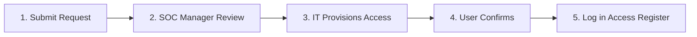

# SOC Access Control Policy

> **Document ID:** ACC-001  
> **Version:** 1.0  
> **Last Updated:** 2026-02-15  
> **Owner:** SOC Manager / CISO

---

## Purpose

Defines who can access SOC tools, at what privilege level, and how access is granted, reviewed, and revoked. The SOC must protect itself as rigorously as it protects the organization.

---

## Role-Based Access Matrix

| SOC Tool | T1 Analyst | T2 Analyst | SOC Lead | SOC Manager | Detection Eng | External (MSSP) |
|:---|:---:|:---:|:---:|:---:|:---:|:---:|
| **SIEM — Read/Search** | ✅ | ✅ | ✅ | ✅ | ✅ | ✅ (limited) |
| **SIEM — Create Rules** | ❌ | ✅ | ✅ | ✅ | ✅ | ❌ |
| **SIEM — Admin/Config** | ❌ | ❌ | ❌ | ✅ | ✅ | ❌ |
| **EDR — View Alerts** | ✅ | ✅ | ✅ | ✅ | ✅ | ✅ (limited) |
| **EDR — Isolate Host** | ❌ | ✅ | ✅ | ✅ | ❌ | ❌ |
| **EDR — Uninstall Agent** | ❌ | ❌ | ❌ | ✅ | ❌ | ❌ |
| **Ticketing — Create** | ✅ | ✅ | ✅ | ✅ | ✅ | ✅ |
| **Ticketing — Close P1/P2** | ❌ | ❌ | ✅ | ✅ | ❌ | ❌ |
| **Firewall — View Rules** | ❌ | ✅ | ✅ | ✅ | ❌ | ❌ |
| **Firewall — Block IP** | ❌ | ✅ (temp) | ✅ | ✅ | ❌ | ❌ |
| **SOAR — Execute Playbook** | ✅ | ✅ | ✅ | ✅ | ✅ | ❌ |
| **SOAR — Edit Playbook** | ❌ | ❌ | ✅ | ✅ | ✅ | ❌ |
| **TI Platform (MISP)** | Read | Read/Write | Admin | Admin | Read/Write | Read |
| **SOC Documentation** | Read | Read/Write | Admin | Admin | Read/Write | Read |

---

## Access Request Process



### Request Requirements

| Field | Required |
|:---|:---:|
| Requester name | ✅ |
| Tool/system requested | ✅ |
| Access level (read/write/admin) | ✅ |
| Business justification | ✅ |
| Duration (permanent/temporary) | ✅ |
| Manager approval | ✅ |

---

## Account Security Requirements

| Control | Requirement |
|:---|:---|
| **Authentication** | MFA required for ALL SOC tools |
| **Password** | Min 14 chars, complexity enforced, no reuse (12 history) |
| **Session timeout** | 15 min inactive → lock, 8 hrs max → force re-auth |
| **Service accounts** | Unique per tool, no shared passwords, rotate every 90 days |
| **API keys** | Per-user, rotate every 90 days, stored in vault (not plaintext) |
| **VPN/Zero Trust** | Required for remote access to SOC tools |
| **Privileged access** | JIT (Just-In-Time) for admin access where possible |

---

## Access Review Schedule

| Review Type | Frequency | Reviewer | Action |
|:---|:---:|:---|:---|
| Active accounts | Monthly | SOC Manager | Remove departed staff |
| Privilege levels | Quarterly | SOC Manager + CISO | Right-size permissions |
| Service accounts | Quarterly | SOC Engineer | Rotate credentials |
| API keys | Quarterly | SOC Engineer | Rotate and audit usage |
| MSSP access | Monthly | SOC Manager | Validate scope |
| Full audit | Annually | CISO + Internal Audit | Comprehensive review |

---

## Offboarding Checklist

When a SOC team member departs:

```
□ Disable AD/Azure AD account (within 1 hour of departure)
□ Revoke SIEM access
□ Revoke EDR access
□ Revoke ticketing system access
□ Revoke SOAR access
□ Revoke VPN/remote access
□ Revoke TI platform access
□ Rotate any shared credentials the person had access to
□ Remove from SOC communication channels (Slack/Teams)
□ Remove from on-call/shift rotation
□ Transfer ownership of dashboards/rules they created
□ Document in Access Register
```

---

## Audit Logging

All SOC tool access must be logged:

| Log Type | What to Capture | Retention |
|:---|:---|:---:|
| Login events | User, time, source IP, success/fail | 1 year |
| Configuration changes | Who, what, when, before/after | 2 years |
| Rule modifications | Rule name, author, old/new logic | 2 years |
| Data exports | Who, dataset, volume, destination | 1 year |
| Admin actions | All privileged operations | 2 years |

---

## Related Documents

- [SOC Team Structure](SOC_Team_Structure.en.md)
- [Change Management SOP](Change_Management.en.md)
- [Data Handling Protocol](Data_Handling_Protocol.en.md)
