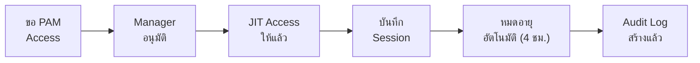

# นโยบายควบคุมการเข้าถึง SOC

> **รหัสเอกสาร:** ACC-001  
> **เวอร์ชัน:** 1.0  
> **อัปเดตล่าสุด:** 2026-02-15  
> **เจ้าของ:** SOC Manager / CISO

---

## ตาราง Access ตามบทบาท

| เครื่องมือ | T1 | T2 | Lead | Manager | DetEng | MSSP |
|:---|:---:|:---:|:---:|:---:|:---:|:---:|
| SIEM อ่าน/ค้นหา | ✅ | ✅ | ✅ | ✅ | ✅ | ✅ จำกัด |
| SIEM สร้าง Rule | ❌ | ✅ | ✅ | ✅ | ✅ | ❌ |
| SIEM Admin | ❌ | ❌ | ❌ | ✅ | ✅ | ❌ |
| EDR ดู Alert | ✅ | ✅ | ✅ | ✅ | ✅ | ✅ จำกัด |
| EDR Isolate | ❌ | ✅ | ✅ | ✅ | ❌ | ❌ |
| Ticketing สร้าง | ✅ | ✅ | ✅ | ✅ | ✅ | ✅ |
| Ticketing ปิด P1/P2 | ❌ | ❌ | ✅ | ✅ | ❌ | ❌ |
| Firewall Block IP | ❌ | ✅ ชั่วคราว | ✅ | ✅ | ❌ | ❌ |
| SOAR แก้ Playbook | ❌ | ❌ | ✅ | ✅ | ✅ | ❌ |

---

## ข้อกำหนดความปลอดภัยบัญชี

| การควบคุม | ข้อกำหนด |
|:---|:---|
| **Authentication** | MFA บังคับทุกเครื่องมือ SOC |
| **Password** | ≥ 14 ตัวอักษร, ไม่ซ้ำ 12 รอบ |
| **Session timeout** | 15 นาที inactive → lock |
| **Service accounts** | เฉพาะแต่ละเครื่องมือ, rotate 90 วัน |
| **API keys** | ต่อคน, rotate 90 วัน, เก็บใน vault |
| **Remote access** | VPN/Zero Trust บังคับ |

---

## ตารางทบทวน Access

| ทบทวน | ความถี่ | ผู้รับผิดชอบ |
|:---|:---:|:---|
| บัญชี active | รายเดือน | SOC Manager |
| ระดับสิทธิ์ | รายไตรมาส | SOC Manager + CISO |
| Service accounts | รายไตรมาส | SOC Engineer |
| MSSP access | รายเดือน | SOC Manager |
| Full audit | รายปี | CISO + Internal Audit |

---

## Checklist เมื่อคนออก

```
□ ปิดบัญชี AD/Azure AD (ภายใน 1 ชม.)
□ เพิกถอน SIEM, EDR, Ticketing, SOAR, VPN, TI access
□ Rotate shared credentials ที่คนนั้นเข้าถึงได้
□ ลบจาก Slack/Teams SOC
□ ลบจาก on-call/shift rotation
□ โอนย้าย dashboards/rules ที่สร้างไว้
□ บันทึกใน Access Register
```

---

## ตารางสิทธิ์ตามบทบาท (RBAC)

| สิทธิ์ | Tier 1 | Tier 2 | Tier 3 | Engineer | Manager |
|:---|:---:|:---:|:---:|:---:|:---:|
| ดู Dashboard | ✅ | ✅ | ✅ | ✅ | ✅ |
| คัดกรอง Alert | ✅ | ✅ | ✅ | ✅ | ✅ |
| แยก Endpoint | ❌ | ✅ | ✅ | ✅ | ✅ |
| แก้ไข Config | ❌ | ❌ | ✅ | ✅ | ✅ |
| จัดการผู้ใช้ | ❌ | ❌ | ❌ | ✅ | ✅ |
| ดูข้อมูล Raw | ❌ | ❌ | ✅ | ✅ | ✅ |

## ตารางทบทวนสิทธิ์

| การทบทวน | ความถี่ | ผู้รับผิดชอบ | ผลลัพธ์ |
|:---|:---|:---|:---|
| ทบทวนสิทธิ์ผู้ใช้ | รายไตรมาส | SOC Manager | รายงานสิทธิ์ |
| ตรวจสอบบัญชีที่ไม่ได้ใช้ | รายเดือน | SOC Engineer | ปิดบัญชี inactive |
| ทบทวน MFA compliance | รายเดือน | SOC Engineer | รายงาน compliance |
| ตรวจสอบ Privileged access | รายไตรมาส | SOC Manager + CISO | การตรวจสอบ PAM |

## Access Control Matrix

### Role-based Permissions

| Role | SIEM | EDR | Firewall | Ticketing |
|:---|:---|:---|:---|:---|
| Tier 1 Analyst | Read | Read | None | Read/Write |
| Tier 2 Analyst | Read/Write | Read/Write | Read | Read/Write |
| Tier 3 Engineer | Admin | Admin | Read | Admin |
| SOC Manager | Admin | Admin | Read/Write | Admin |

### Access Review Schedule

| Review Type | Frequency | Reviewer | SLA |
|:---|:---|:---|:---|
| New access | ทุกครั้ง | SOC Manager | 24 ชม. |
| Quarterly review | ทุก 3 เดือน | CISO | 5 วัน |
| Termination | ทันที | HR + IT | 4 ชม. |
| Privilege escalation | ทุกครั้ง | CISO | 48 ชม. |

### Emergency Access Procedure

| Step | Action | SLA |
|:---|:---|:---|
| 1 | ขอ emergency access | ทันที |
| 2 | Verbal approval จาก CISO | 15 min |
| 3 | Grant temporary access | 30 min |
| 4 | Log all activities | Real-time |
| 5 | Revoke เมื่อเสร็จ | ทันที |
| 6 | Post-review | 24 hrs |

### Access Log Monitoring

| Event | Alert? | Review |
|:---|:---|:---|
| Admin login | ✅ | Real-time |
| After-hours | ✅ | Next day |
| Failed attempt | >5 = ✅ | Daily |

## การเข้าถึงฉุกเฉิน (Break-Glass)

เมื่อเกิด incident วิกฤตที่เข้าระบบปกติไม่ได้:

| สถานการณ์ | ขั้นตอน Break-Glass | หลังเหตุการณ์ |
|:---|:---|:---|
| SSO/IdP ล่ม เข้า SIEM ไม่ได้ | ใช้ local admin account (ซองปิดผนึก) | เปลี่ยน password ทันที, บันทึกการใช้ |
| MFA provider ล่ม | ใช้ backup codes (ออกล่วงหน้า) | แจ้ง IT, ตรวจสอบ session ทั้งหมด |
| Analyst หลักไม่อยู่ตอน P1 | SOC Manager ให้ temp access แก่คนสำรอง | ถอน access ภายใน 24 ชม. |
| SOAR API credentials หมดอายุระหว่าง incident | ใช้ manual command override | Rotate credentials, อัปเดต vault |

### กฎ Break-Glass
1. **กฎสองคน** — ต้อง SOC Manager หรือ CISO อนุมัติ
2. **Audit trail** — บันทึกการใช้ทั้งหมดใน incident ticket
3. **จำกัดเวลา** — ใช้ได้เฉพาะช่วง incident (สูงสุด 24 ชม.)
4. **Post-mortem** — ทบทวน break-glass ทุกครั้งในการประชุม ops สัปดาห์

## Privileged Access Management (PAM)



| PAM Control | การใช้งาน |
|:---|:---|
| Just-In-Time (JIT) access | Admin access ให้เป็นรอบ 4 ชม. เท่านั้น |
| บันทึก Session | Admin session ทุกครั้งถูกบันทึกเก็บ 1 ปี |
| Password vaulting | Service account passwords ใน CyberArk/HashiCorp Vault |
| Credential rotation | หมุนอัตโนมัติทุก 90 วัน |
| อนุมัติหลายระดับ | P1 incident: SOC Manager; Config changes: CISO |

## เอกสารที่เกี่ยวข้อง

- [โครงสร้างทีม SOC](SOC_Team_Structure.th.md)
- [SOP จัดการเปลี่ยนแปลง](Change_Management.th.md)
- [โปรโตคอลข้อมูล](Data_Handling_Protocol.th.md)
