# Alert Tuning SOP

**Document ID**: OPS-SOP-016
**Version**: 1.0
**Classification**: Internal
**Last Updated**: 2026-02-15

> Systematic approach to **reduce false positives**, **improve alert quality**, and **prevent analyst fatigue**. Every SOC should tune continuously — this SOP defines when, how, and what to tune.

---

## Why Tune?

| Problem | Impact | Tuning Outcome |
|:---|:---|:---|
| High false positive rate (> 30%) | Analyst fatigue, missed real alerts | TP rate ≥ 80% |
| Alert floods (> 200/analyst/day) | Cannot investigate properly | Manageable volume (< 50/day) |
| Duplicate/redundant alerts | Wasted analyst time | Deduplicated, correlated |
| Irrelevant alerts for environment | Noise, eroded trust in tools | Contextual, relevant alerts |
| No severity differentiation | Everything looks the same | Prioritized, risk-scored |

---

## Tuning Lifecycle


---

## Step 1: Identify Noisy Rules

### Metrics to Track

| Metric | Threshold for Tuning | Data Source |
|:---|:---:|:---|
| **False positive rate** | > 30% per rule | SIEM + analyst feedback |
| **Alert volume per rule** | > 50/day (single rule) | SIEM dashboard |
| **Analyst close rate without action** | > 50% | Ticketing system |
| **Average investigation time** | < 1 minute (auto-close) | Ticketing system |
| **Duplicate alert ratio** | > 20% | SIEM correlation |

### Weekly Tuning Report (Template)

| Rank | Rule Name | Rule ID | TP | FP | Volume/Day | FP Rate | Action |
|:---:|:---|:---|:---:|:---:|:---:|:---:|:---|
| 1 | ______________ | _____ | _____ | _____ | _____ | ___% | Tune/Disable/Keep |
| 2 | ______________ | _____ | _____ | _____ | _____ | ___% | Tune/Disable/Keep |
| 3 | ______________ | _____ | _____ | _____ | _____ | ___% | Tune/Disable/Keep |

> 📊 Generate this report weekly. Focus on top 10 noisiest rules.

---

## Step 2: Analyze Root Cause

### Common FP Root Causes

| Root Cause | Example | Typical Fix |
|:---|:---|:---|
| **Legitimate software** | AV flagging admin tools (PsExec, WinRM) | Allowlist by hash + source |
| **Scheduled jobs** | Cron/scheduled task triggering process creation alerts | Time-based exclusion |
| **Service accounts** | Service accounts triggering brute-force rules | Identity-based exclusion |
| **Known infrastructure** | Vulnerability scanners triggering IDS | Source IP exclusion |
| **Over-broad detection** | "Any PowerShell execution" rule | Narrow to suspicious cmdlets |
| **Missing context** | Alert lacks user/host context | Add enrichment, refine conditions |
| **Duplicate data sources** | Same event from Sysmon + EDR | Deduplicate sources |
| **Threshold too low** | Failed login threshold = 3 | Raise to 10+ in 5 min |

### Analysis Template

```markdown
## Tuning Request: [Rule Name]

**Rule ID**: _____
**Current FP Rate**: ____%
**Alert Volume**: _____ /day
**Analysis Period**: [date range]

### False Positive Patterns
- Pattern 1: _____________________________
- Pattern 2: _____________________________

### True Positive Examples
- Example 1: _____________________________

### Root Cause
[  ] Legitimate software
[  ] Scheduled jobs
[  ] Service accounts
[  ] Known infrastructure
[  ] Over-broad detection
[  ] Other: _____

### Proposed Fix
___________________________________________

### Risk of Missing True Positives
[  ] Low — fix is narrowly targeted
[  ] Medium — some edge cases possible
[  ] High — needs careful monitoring
```

---

## Step 3: Design Tuning Fix

### Tuning Techniques

| Technique | When to Use | Example | Risk |
|:---|:---|:---|:---:|
| **Allowlist by entity** | Known safe source | Exclude scanner IP from IDS | Low |
| **Allowlist by hash** | Known safe binary | Exclude signed PsExec | Low |
| **Time-based exclusion** | Scheduled activity | Exclude backups 02:00–04:00 | Medium |
| **Threshold adjustment** | Too sensitive | Failed logins: 3 → 10 in 5 min | Medium |
| **Add conditions** | Rule too broad | PowerShell + encoded + unsigned | Low |
| **Correlation rule** | Multi-stage attack | Alert only if followed by lateral movement | Medium |
| **Severity downgrade** | Alert not P1-worthy | Move from P2 to P4 | Low |
| **Deduplication** | Same alert repeated | Alert once per host per hour | Low |
| **Enrichment-based** | Needs more context | Suppress if user is VIP with MFA | Medium |
| **Disable rule** | Zero value for environment | Disable macOS rule on Windows-only | High |

### Decision Matrix

```mermaid
flowchart TD
    A[Noisy Rule Identified] --> B{Any TP in last 30 days?}
    B -->|No| C{Relevant to our environment?}
    C -->|No| D[🔴 DISABLE rule]
    C -->|Yes| E[🟡 KEEP but add conditions]
    B -->|Yes| F{FP rate > 50%?}
    F -->|Yes| G{Can narrow detection logic?}
    G -->|Yes| H[🟢 TUNE — add exclusions/conditions]
    G -->|No| I[🟡 DOWNGRADE severity + add enrichment]
    F -->|No| J{Volume > 50/day?}
    J -->|Yes| K[🟢 Deduplicate + adjust threshold]
    J -->|No| L[✅ KEEP — acceptable noise]

    style D fill:#dc2626,color:#fff
    style H fill:#22c55e,color:#fff
    style K fill:#22c55e,color:#fff
    style L fill:#3b82f6,color:#fff
```



---

## Step 4: Test in Staging

### Testing Checklist

- [ ] Tuning change documented (what/why/how)
- [ ] Applied to staging/test environment
- [ ] Replay historical logs through tuned rule
- [ ] Verify: known TP samples still detected
- [ ] Verify: known FP patterns now suppressed
- [ ] No unintended side effects on other rules
- [ ] Peer review by another analyst
- [ ] Change approved per change management process

---

## Step 5: Deploy to Production

### Deployment Procedure

| Step | Action | Owner |
|:---:|:---|:---|
| 1 | Create change ticket with tuning details | SOC Analyst |
| 2 | Get approval from SOC Lead | SOC Lead |
| 3 | Apply change during low-traffic window | Detection Engineer |
| 4 | Tag rule with tuning metadata (date, analyst, ticket) | Detection Engineer |
| 5 | Set 7-day monitoring window | SOC Lead |
| 6 | Review impact after 7 days | SOC Analyst |
| 7 | Close change ticket with results | SOC Analyst |

### Rule Metadata Tags

```yaml
# Add to rule metadata after tuning
tuning:
  last_tuned: "2026-02-15"
  tuned_by: "analyst@example.com"
  ticket: "TUNE-001"
  change_type: "exclusion_added"
  fp_rate_before: 65%
  fp_rate_after: 12%
  next_review: "2026-05-15"
```

---

## Step 6: Monitor Impact

### 7-Day Review Template

| Metric | Before Tuning | After Tuning (7 days) | Change |
|:---|:---:|:---:|:---:|
| Alert volume/day | _____ | _____ | ↓ ___% |
| True positive count | _____ | _____ | Should be stable |
| False positive count | _____ | _____ | ↓ ___% |
| FP rate | ___% | ___% | ↓ ___pp |
| Avg investigation time | ___ min | ___ min | ↓ ___% |
| Missed detections | 0 | 0 | Must be 0 |

> ⚠️ If **True Positive count drops**, investigate immediately — tuning may be too aggressive.

---

## Step 7: Document & Close

### Tuning Record

| Field | Value |
|:---|:---|
| Rule Name | ______________ |
| Rule ID | _____ |
| Tuning Date | ____-__-__ |
| Analyst | ______________ |
| Change Ticket | _____ |
| FP Rate (before) | ___% |
| FP Rate (after) | ___% |
| Volume (before) | _____/day |
| Volume (after) | _____/day |
| Tuning Type | Exclusion / Threshold / Condition / Severity / Disable |
| Next Review | ____-__-__ |

---

## Recurring Tuning Schedule

| Activity | Frequency | Owner | Output |
|:---|:---:|:---|:---|
| Top 10 noisy rules review | **Weekly** | SOC Analyst (rotating) | Tuning requests |
| New rule validation (7-day review) | **Per new rule** | Detection Engineer | Validation report |
| Rule effectiveness review | **Monthly** | Detection Engineering Lead | Rule health report |
| Full rule audit | **Quarterly** | SOC Lead + Security Engineer | Audit report + cleanup |
| ATT&CK coverage gap + tuning sync | **Quarterly** | Detection Engineering | Coverage + tuning plan |

---

## Tuning Governance

### Who Can Tune?

| Role | Can Tune? | What |
|:---|:---:|:---|
| SOC Tier 1 | ❌ | Report FP patterns (via feedback form) |
| SOC Tier 2 | ⚠️ | Propose tuning, requires SOC Lead approval |
| SOC Tier 3 / Detection Engineer | ✅ | Design and implement tuning (with peer review) |
| SOC Lead | ✅ | Approve and deploy tuning changes |
| SOC Manager | ✅ | Override: disable/enable rules, approve high-risk changes |

### Escalation for Risky Tuning

| Risk Level | Criteria | Approval Required |
|:---|:---|:---|
| 🟢 Low | Allowlist specific entity, deduplication | Peer review |
| 🟡 Medium | Threshold change, adding conditions | SOC Lead approval |
| 🔴 High | Disabling rule, major logic change | SOC Manager + documented justification |

---

## Metrics

| Metric | Target | Measurement |
|:---|:---:|:---|
| Overall TP rate (all rules) | ≥ 80% | Monthly SIEM report |
| Rules with > 50% FP rate | 0 | Weekly noisy rules report |
| Tuning requests completed within SLA | ≥ 90% | Ticketing system |
| Time from tuning request to deployment | < 5 business days | Ticketing system |
| Rules reviewed per quarter | 100% | Quarterly audit |
| Alerts per analyst per day | < 50 | SIEM + shift report |

---

## Related Documents

-   [Detection Rule Testing](Detection_Rule_Testing.en.md) — Testing methodology
-   [SOC Metrics & KPIs](SOC_Metrics.en.md) — KPI definitions
-   [SOC Automation Catalog](SOC_Automation_Catalog.en.md) — Auto-tuning automation
-   [SOC Maturity Assessment](SOC_Maturity_Assessment.en.md) — Detection maturity
-   [Log Source Matrix](Log_Source_Matrix.en.md) — Data source coverage
-   [Change Management](Change_Management.en.md) — Change approval process
-   [SOC Checklists](SOC_Checklists.en.md) — Operational checklists
