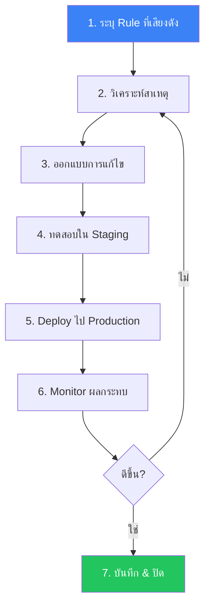
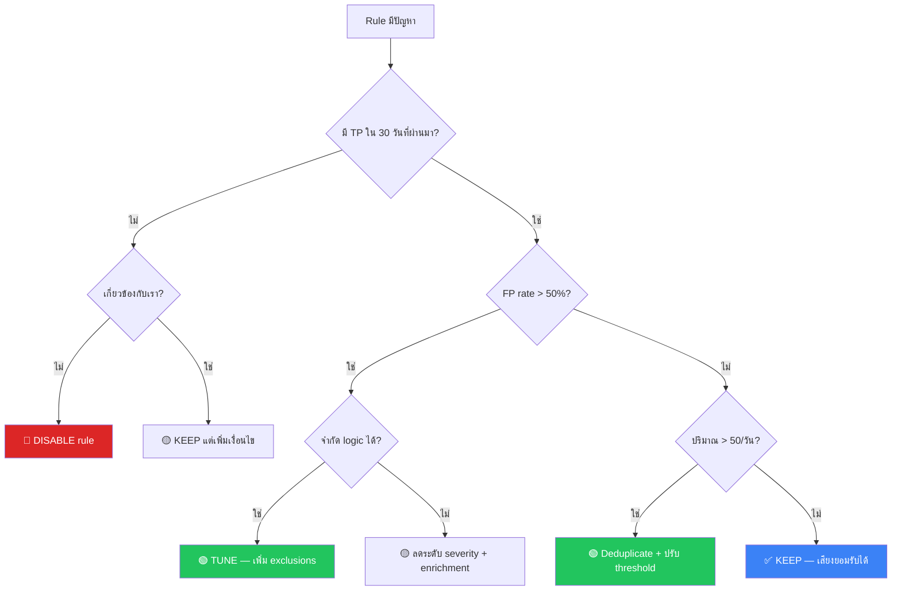

# Alert Tuning SOP / SOP การปรับจูน Alert

**รหัสเอกสาร**: OPS-SOP-016
**เวอร์ชัน**: 1.0
**การจัดชั้นความลับ**: ใช้ภายใน
**อัปเดตล่าสุด**: 2026-02-15

> แนวทางเป็นระบบในการ **ลด false positives**, **ปรับปรุงคุณภาพ alert**, และ **ป้องกัน analyst fatigue** SOC ทุกแห่งควร tune อย่างต่อเนื่อง — SOP นี้กำหนดว่าเมื่อไร, อย่างไร, และ tune อะไร

---

## ทำไมต้อง Tune?

| ปัญหา | ผลกระทบ | ผลลัพธ์จากการ Tune |
|:---|:---|:---|
| FP rate สูง (> 30%) | Analyst fatigue, พลาด alert จริง | TP rate ≥ 80% |
| Alert ท่วม (> 200/analyst/วัน) | ไม่สามารถสืบสวนได้ทั่วถึง | ปริมาณจัดการได้ (< 50/วัน) |
| Alert ซ้ำ | เสียเวลา analyst | Deduplicate + correlate |
| Alert ไม่เกี่ยวข้อง | เสียความเชื่อมั่นในเครื่องมือ | ตรงบริบท, เกี่ยวข้อง |

---

## วงจร Tuning

---

## ขั้นที่ 1: ระบุ Rule ที่มีปัญหา

### ตัวชี้วัดที่ต้องติดตาม

| ตัวชี้วัด | เกณฑ์ที่ต้อง Tune | แหล่งข้อมูล |
|:---|:---:|:---|
| **False positive rate** | > 30% ต่อ rule | SIEM + feedback จาก analyst |
| **ปริมาณ alert ต่อ rule** | > 50/วัน (rule เดียว) | SIEM dashboard |
| **อัตราปิด alert โดยไม่มี action** | > 50% | Ticketing |
| **เวลาสืบสวนเฉลี่ย** | < 1 นาที (auto-close) | Ticketing |

### รายงาน Tuning รายสัปดาห์

| อันดับ | ชื่อ Rule | Rule ID | TP | FP | ปริมาณ/วัน | FP Rate | Action |
|:---:|:---|:---|:---:|:---:|:---:|:---:|:---|
| 1 | ______________ | _____ | _____ | _____ | _____ | ___% | Tune/Disable/Keep |
| 2 | ______________ | _____ | _____ | _____ | _____ | ___% | Tune/Disable/Keep |
| 3 | ______________ | _____ | _____ | _____ | _____ | ___% | Tune/Disable/Keep |

---

## ขั้นที่ 2: วิเคราะห์สาเหตุ FP

### สาเหตุ FP ที่พบบ่อย

| สาเหตุ | ตัวอย่าง | วิธีแก้ |
|:---|:---|:---|
| **ซอฟต์แวร์ปกติ** | AV flag admin tools (PsExec) | Allowlist โดย hash + source |
| **งาน Schedule** | Cron/task ทำให้ process creation alert | exclusion ตามเวลา |
| **Service accounts** | Service account ทำให้เกิด brute-force alert | exclusion ตาม identity |
| **Infrastructure ที่รู้จัก** | Scanner ทำให้ IDS alert | exclusion ตาม source IP |
| **Detection กว้างเกินไป** | "PowerShell ทุกคำสั่ง" | จำกัดเฉพาะ cmdlets ที่น่าสงสัย |
| **Threshold ต่ำเกินไป** | Failed login threshold = 3 | เพิ่มเป็น 10+ ใน 5 นาที |

---

## ขั้นที่ 3: เทคนิคการ Tune

| เทคนิค | เมื่อไรใช้ | ความเสี่ยง |
|:---|:---|:---:|
| **Allowlist by entity** | แหล่งที่ปลอดภัยที่รู้จัก | ต่ำ |
| **Allowlist by hash** | Binary ที่ปลอดภัยที่รู้จัก | ต่ำ |
| **Time-based exclusion** | กิจกรรมตาม schedule | ปานกลาง |
| **ปรับ Threshold** | Rule อ่อนไหวเกินไป | ปานกลาง |
| **เพิ่มเงื่อนไข** | Rule กว้างเกินไป | ต่ำ |
| **Correlation rule** | โจมตีหลายขั้นตอน | ปานกลาง |
| **ลดระดับ Severity** | Alert ไม่สมควรเป็น P1 | ต่ำ |
| **Deduplication** | Alert เดิมซ้ำ | ต่ำ |
| **ใช้ Enrichment** | ต้องการ context เพิ่ม | ปานกลาง |
| **Disable rule** | ไม่มีคุณค่าสำหรับสภาพแวดล้อม | สูง |

### Decision Matrix

---

## ขั้นที่ 4: ทดสอบใน Staging

- [ ] บันทึกรายละเอียดการเปลี่ยนแปลง (อะไร/ทำไม/อย่างไร)
- [ ] Apply ใน staging environment
- [ ] Replay historical logs ผ่าน rule ที่ tune แล้ว
- [ ] ยืนยัน: TP samples ที่รู้จักยังตรวจพบได้
- [ ] ยืนยัน: FP patterns ที่รู้จักถูก suppress แล้ว
- [ ] ไม่มีผลข้างเคียงต่อ rule อื่น
- [ ] Peer review โดย analyst อีกคน
- [ ] อนุมัติตามกระบวนการ change management

---

## ขั้นที่ 5: Deploy ไป Production

| ขั้น | การดำเนินการ | ผู้รับผิดชอบ |
|:---:|:---|:---|
| 1 | สร้าง change ticket พร้อมรายละเอียด | SOC Analyst |
| 2 | ขออนุมัติจาก SOC Lead | SOC Lead |
| 3 | Apply การเปลี่ยนแปลงในช่วง low-traffic | Detection Engineer |
| 4 | Tag rule ด้วย tuning metadata | Detection Engineer |
| 5 | กำหนดช่วง monitor 7 วัน | SOC Lead |
| 6 | ทบทวนผลกระทบหลัง 7 วัน | SOC Analyst |

---

## ขั้นที่ 6: Monitor ผลกระทบ (7 วัน)

| ตัวชี้วัด | ก่อน Tune | หลัง Tune (7 วัน) | เปลี่ยนแปลง |
|:---|:---:|:---:|:---:|
| ปริมาณ alert/วัน | _____ | _____ | ↓ ___% |
| True positive count | _____ | _____ | ต้องคงที่ |
| False positive count | _____ | _____ | ↓ ___% |
| FP rate | ___% | ___% | ↓ ___pp |
| เวลาสืบสวนเฉลี่ย | ___ นาที | ___ นาที | ↓ ___% |
| Missed detections | 0 | 0 | ต้องเป็น 0 |

> ⚠️ ถ้า **TP count ลดลง** ให้สืบสวนทันที — การ tune อาจรุนแรงเกินไป

---

## ขั้นที่ 7: บันทึก & ปิด

| ฟิลด์ | ค่า |
|:---|:---|
| ชื่อ Rule | ______________ |
| Rule ID | _____ |
| วันที่ Tune | ____-__-__ |
| Analyst | ______________ |
| Change Ticket | _____ |
| FP Rate (ก่อน) | ___% |
| FP Rate (หลัง) | ___% |
| ปริมาณ (ก่อน) | _____/วัน |
| ปริมาณ (หลัง) | _____/วัน |
| ประเภท Tune | Exclusion / Threshold / Condition / Severity / Disable |
| ทบทวนครั้งต่อไป | ____-__-__ |

---

## ตาราง Tuning ประจำ

| กิจกรรม | ความถี่ | ผู้รับผิดชอบ | ผลลัพธ์ |
|:---|:---:|:---|:---|
| ทบทวน 10 rules ที่เสียงดังที่สุด | **รายสัปดาห์** | SOC Analyst (หมุนเวียน) | Tuning requests |
| ตรวจสอบ rule ใหม่ (7 วัน) | **ทุก rule ใหม่** | Detection Engineer | รายงาน validation |
| ทบทวนประสิทธิภาพ rule | **รายเดือน** | Detection Engineering Lead | รายงาน rule health |
| Audit rule ทั้งหมด | **รายไตรมาส** | SOC Lead + Security Engineer | รายงาน audit |

---

## Governance: ใครสามารถ Tune ได้?

| บทบาท | Tune ได้? | อะไร |
|:---|:---:|:---|
| SOC Tier 1 | ❌ | รายงาน FP patterns (ผ่านแบบฟอร์ม) |
| SOC Tier 2 | ⚠️ | เสนอ tuning, ต้องได้รับอนุมัติจาก SOC Lead |
| SOC Tier 3 / Detection Engineer | ✅ | ออกแบบและ implement (พร้อม peer review) |
| SOC Lead | ✅ | อนุมัติและ deploy |
| SOC Manager | ✅ | Override: disable/enable rules, อนุมัติ high-risk |

---

## ตัวชี้วัด

| ตัวชี้วัด | เป้าหมาย | วิธีวัด |
|:---|:---:|:---|
| TP rate รวม (ทุก rule) | ≥ 80% | SIEM report รายเดือน |
| Rules ที่มี FP > 50% | 0 | รายงานรายสัปดาห์ |
| Tuning requests เสร็จตาม SLA | ≥ 90% | Ticketing |
| เวลาจาก request ถึง deploy | < 5 วันทำการ | Ticketing |
| Alert ต่อ analyst ต่อวัน | < 50 | SIEM + shift report |

---

## เอกสารที่เกี่ยวข้อง

-   [Detection Rule Testing](Detection_Rule_Testing.en.md) — วิธีการทดสอบ
-   [SOC Metrics & KPIs](SOC_Metrics.en.md) — นิยาม KPI
-   [SOC Automation Catalog](SOC_Automation_Catalog.en.md) — Auto-tuning
-   [SOC Maturity Assessment](SOC_Maturity_Assessment.en.md) — วุฒิภาวะ detection
-   [Change Management](Change_Management.en.md) — กระบวนการอนุมัติ
