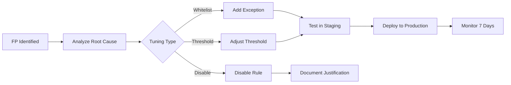

# Alert Tuning SOP

This document defines the standard process for tuning SOC detection rules to reduce false positives while maintaining detection coverage.

---

## Tuning Workflow

## When to Tune

| Trigger | FPR Threshold | Action |
|:---|:---|:---|
| Single rule generating > 50% FP | > 50% | Immediate tuning required |
| Overall FPR exceeding target | > 10% | Schedule tuning sprint |
| Analyst reports repeated FP | 3+ occurrences | Review and tune |
| New data source onboarded | N/A | Pre-tune expected noise |

## Tuning Methods

| Method | Use When | Risk |
|:---|:---|:---|
| **Whitelist/Exception** | Known-good activity (e.g., admin scripts) | Low — targeted |
| **Threshold Adjustment** | Alert triggers too frequently on normal volume | Medium — may miss low-volume attacks |
| **Field Filter** | Specific field values causing noise | Low — targeted |
| **Rule Modification** | Logic is too broad | Medium — requires testing |
| **Rule Disable** | Rule provides no value | High — loss of coverage |

## Tuning Request Template

| Field | Value |
|:---|:---|
| **Rule Name/ID** | |
| **Current FP Rate** | |
| **Sample FP Alerts** (3+) | |
| **Root Cause of FP** | |
| **Proposed Change** | |
| **Impact Assessment** | |
| **Requested By** | |
| **Approved By** | |

## Related Documents

- [SOC Metrics & KPIs](SOC_Metrics.en.md)
- [Content Management](../03_User_Guides/Content_Management.en.md)

## References

- [SANS Detection Engineering](https://www.sans.org/white-papers/)
