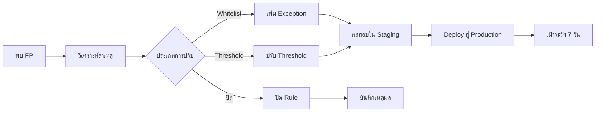

# ขั้นตอนปรับแต่ง Alert (Alert Tuning SOP)

เอกสารนี้กำหนดกระบวนการมาตรฐานสำหรับปรับแต่ง detection rules เพื่อลด false positives โดยยังคง detection coverage

---

## ขั้นตอนการปรับแต่ง

## เมื่อไหร่ควรปรับ

| เงื่อนไข | ขีด FPR | การดำเนินการ |
|:---|:---|:---|
| Rule เดียวสร้าง FP > 50% | > 50% | ปรับทันที |
| FPR รวมเกินเป้า | > 10% | จัด sprint ปรับแต่ง |
| Analyst แจ้ง FP ซ้ำ | 3+ ครั้ง | ทบทวนและปรับ |
| เพิ่ม data source ใหม่ | N/A | ปรับ noise ล่วงหน้า |

## วิธีการปรับแต่ง

| วิธี | ใช้เมื่อ | ความเสี่ยง |
|:---|:---|:---|
| **Whitelist/Exception** | กิจกรรมที่รู้ว่าปกติ (เช่น admin scripts) | ต่ำ |
| **ปรับ Threshold** | Alert ขึ้นบ่อยเกินในปริมาณปกติ | ปานกลาง |
| **Field Filter** | ค่าเฉพาะ field ทำให้เกิด noise | ต่ำ |
| **แก้ไข Rule** | Logic กว้างเกินไป | ปานกลาง |
| **ปิด Rule** | Rule ไม่มีคุณค่า | สูง |

## เอกสารที่เกี่ยวข้อง

- [ตัวชี้วัด SOC & KPIs](SOC_Metrics.th.md)
- [Content Management](../03_User_Guides/Content_Management.th.md)
