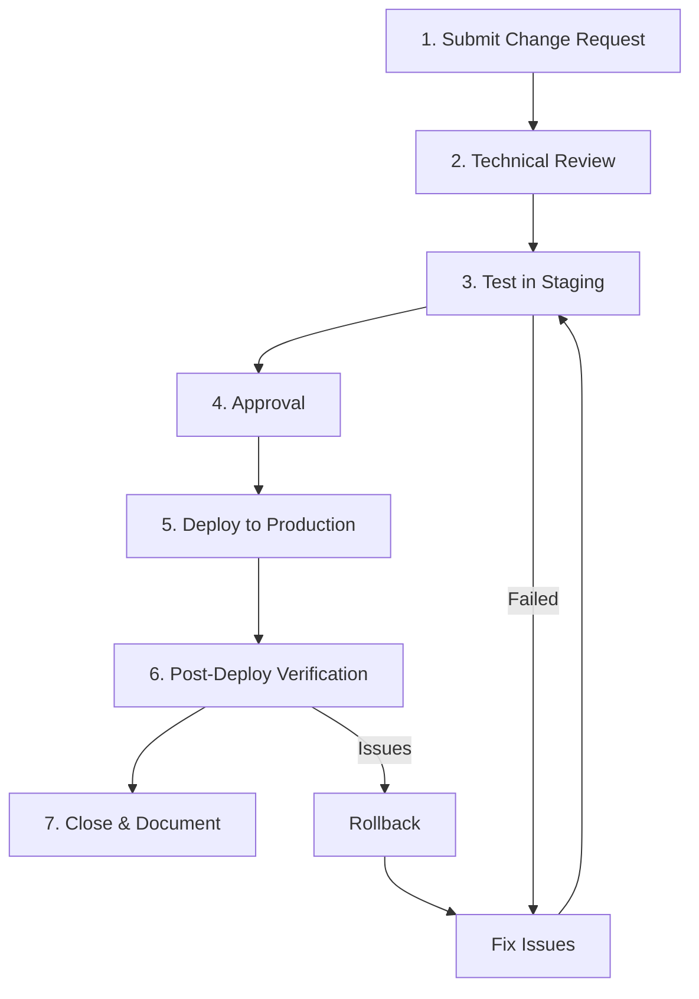
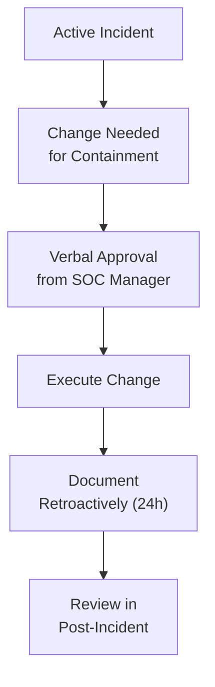

# SOC Change Management SOP

> **Document ID:** CHG-001  
> **Version:** 1.0  
> **Last Updated:** 2026-02-15  
> **Owner:** SOC Manager

---

## Purpose

Defines the process for making changes to SOC tools, detection rules, playbooks, and infrastructure. Ensures changes are reviewed, tested, approved, and documented before deployment.

---

## Scope

This SOP covers changes to:
- Detection rules (Sigma, YARA, custom SIEM rules)
- Playbooks and response procedures
- SIEM configuration (parsers, dashboards, alerts)
- EDR policies and exclusions
- Firewall rules managed by SOC
- SOAR workflows
- TI feed configuration
- SOC tooling (upgrades, patches, new tools)

---

## Change Categories

| Category | Risk | Approval | Lead Time | Examples |
|:---|:---:|:---|:---:|:---|
| **Standard** | Low | SOC Lead | 1 day | New Sigma rule, whitelist entry, dashboard update |
| **Normal** | Medium | SOC Manager | 3 days | SIEM parser change, new log source, playbook update |
| **Emergency** | High | SOC Manager + CISO | Immediate | Critical vulnerability patch, active incident response |
| **Major** | High | CAB (Change Advisory Board) | 5+ days | SIEM upgrade, new tool deployment, architecture change |

---

## Change Process



### Step 1: Submit Change Request

Use the [Change Request Template](../templates/change_request_rfc.en.md) and include:

| Field | Required | Description |
|:---|:---:|:---|
| Change title | ✅ | Clear summary of the change |
| Category | ✅ | Standard / Normal / Emergency / Major |
| Requester | ✅ | Who is requesting |
| Justification | ✅ | Why is this change needed? |
| Impact assessment | ✅ | What could go wrong? Affected systems? |
| Rollback plan | ✅ | How to undo if it fails |
| Test plan | ✅ | How will you verify success? |
| Target date | ✅ | When to deploy |

### Step 2: Technical Review

The assigned reviewer must verify:
- [ ] Change is technically sound
- [ ] No conflicts with existing rules/configs
- [ ] Rollback plan is viable
- [ ] Impact assessment is accurate

### Step 3: Test in Staging

**Detection Rules:**
```bash
# Validate Sigma rule syntax
python tools/sigma_validator.py rules/new_rule.yml

# Test against sample logs
sigmac -t splunk new_rule.yml | splunk search

# Verify no excessive false positives (run against 7 days of data)
```

**Playbook Changes:**
- Walk through with a peer (tabletop)
- Verify all referenced tools/contacts are accurate

**SIEM Changes:**
- Test in dev/staging SIEM instance
- Verify log parsing is correct
- Check performance impact

### Step 4: Approval

| Category | Approver | Method |
|:---|:---|:---|
| Standard | SOC Lead | Slack/Teams approval |
| Normal | SOC Manager | Ticket approval |
| Emergency | SOC Manager + CISO | Phone/verbal (document after) |
| Major | CAB | Meeting + formal sign-off |

### Step 5: Deploy to Production

- Deploy during **maintenance window** (if applicable)
- Use version control (git) for all rule/playbook changes
- Tag the deployment in git: `git tag -a v1.x -m "CHG-XXX: description"`

### Step 6: Post-Deploy Verification

Within 24 hours of deployment:
- [ ] Change is functioning as expected
- [ ] No unexpected alerts or errors
- [ ] No performance degradation
- [ ] Relevant team members notified

### Step 7: Close & Document

- Update change ticket with results
- Update relevant documentation
- Close the change request

---

## Emergency Change Process

```
⚡ Emergency changes bypass normal lead time but MUST:
   1. Be verbally approved by SOC Manager (or CISO if unavailable)
   2. Be documented WITHIN 24 HOURS after deployment
   3. Be reviewed in the next weekly SOC standup
   4. Have a rollback plan (even if informal)
```

---

## Change Log Template

| Date | Change ID | Description | Category | Deployed By | Status |
|:---|:---|:---|:---|:---|:---|
| 2026-02-15 | CHG-001 | Add Sigma rule for DNS tunneling | Standard | @analyst1 | ✅ |
| 2026-02-14 | CHG-002 | Update PB-01 Phishing playbook | Normal | @soc_lead | ✅ |

---

## Emergency Change Process

For changes required during active incidents:



### Emergency Change Rules
1. **Verbal approval** from SOC Manager or CISO is sufficient
2. **Document within 24 hours** after the incident is stabilized
3. **No testing required** if containment is urgent
4. **Rollback plan** must still be identified before execution
5. **Post-incident review** must evaluate whether the change should be permanent

## Post-Implementation Review Template

| Field | Details |
|:---|:---|
| **RFC ID** | RFC-XXXX |
| **Change Description** | [What was changed] |
| **Implementation Date** | YYYY-MM-DD HH:MM |
| **Implemented By** | [Name] |
| **Status** | ✅ Success / ⚠️ Partial / ❌ Failed |
| **Actual Downtime** | [Duration vs. planned] |
| **Issues Encountered** | [Any problems during change] |
| **Rollback Required?** | Yes/No |
| **Validation Results** | [All checks pass?] |
| **Follow-up Actions** | [Next steps if any] |

## Related Documents

- [Change Request Template](../templates/change_request_rfc.en.md)
- [Detection Rule Testing SOP](Detection_Rule_Testing.en.md)
- [SOC Checklists](SOC_Checklists.en.md)
