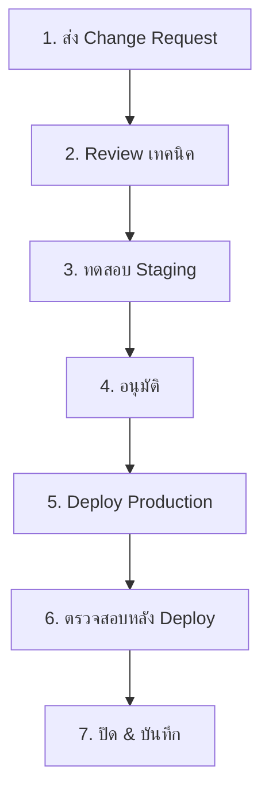
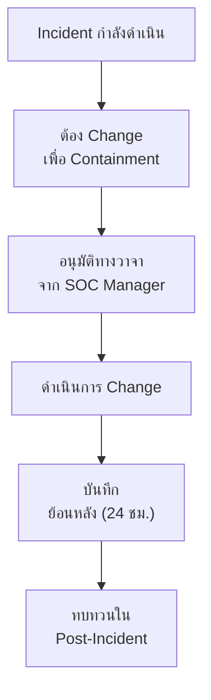

# SOP การจัดการเปลี่ยนแปลง SOC

> **รหัสเอกสาร:** CHG-001  
> **เวอร์ชัน:** 1.0  
> **อัปเดตล่าสุด:** 2026-02-15  
> **เจ้าของ:** SOC Manager

---

## ขอบเขต

ครอบคลุมการเปลี่ยนแปลง: Detection rules, Playbooks, SIEM config, EDR policies, Firewall rules, SOAR workflows, TI feeds, เครื่องมือ SOC

---

## ประเภทการเปลี่ยนแปลง

| ประเภท | ความเสี่ยง | อนุมัติโดย | เวลา | ตัวอย่าง |
|:---|:---:|:---|:---:|:---|
| **Standard** | ต่ำ | SOC Lead | 1 วัน | Sigma rule ใหม่, whitelist |
| **Normal** | กลาง | SOC Manager | 3 วัน | SIEM parser, log source ใหม่ |
| **Emergency** | สูง | SOC Manager + CISO | ทันที | Patch เร่งด่วน, ตอบเหตุ |
| **Major** | สูง | CAB | 5+ วัน | SIEM upgrade, เครื่องมือใหม่ |

---

## ขั้นตอน



### ขั้นตอนสำคัญ:
1. **ส่ง Change Request** — ใช้ [แม่แบบ](../templates/change_request_rfc.th.md)
2. **Review เทคนิค** — ตรวจสอบความถูกต้อง, conflict, rollback plan
3. **ทดสอบ** — Validate syntax, ทดสอบกับข้อมูลจริง 7 วัน
4. **อนุมัติ** — ตามระดับประเภท
5. **Deploy** — ใช้ version control (git), ติด tag
6. **ตรวจหลัง Deploy** — ภายใน 24 ชม.
7. **ปิด** — อัปเดตเอกสาร

---

## กรณีฉุกเฉิน

```
⚡ Emergency change:
   1. ขออนุมัติปากเปล่าจาก SOC Manager
   2. บันทึกภายใน 24 ชม.
   3. ทบทวนใน standup ถัดไป
   4. ต้องมี rollback plan เสมอ
```

---

## การประเมินความเสี่ยง

| ระดับ | เกณฑ์ | การอนุมัติ | หน้าต่างบำรุงรักษา |
|:---|:---|:---|:---|
| **ต่ำ** | เอกสาร, ไม่กระทบ | SOC Lead | ทุกเวลา |
| **กลาง** | Detection rule, Parser | SOC Manager | เวลาทำการ |
| **สูง** | SIEM config, Integration | SOC Manager + CAB | กำหนดเวลา |
| **วิกฤต** | โครงสร้างพื้นฐาน, Auth | CISO + CAB | Downtime กำหนด |

## รายการตรวจสอบการเปลี่ยนแปลง

| # | ขั้นตอน | ผู้รับผิดชอบ | เสร็จ |
|:---:|:---|:---|:---:|
| 1 | RFC ถูกส่งและอนุมัติ | Engineer | ☐ |
| 2 | Peer review เสร็จ | Detection Eng | ☐ |
| 3 | สำรองข้อมูลก่อน Deploy | Engineer | ☐ |
| 4 | ทดสอบใน Staging | Engineer | ☐ |
| 5 | แผน Rollback พร้อม | Engineer | ☐ |
| 6 | Deploy ไปยัง Production | Engineer | ☐ |
| 7 | ตรวจสอบ 30 นาทีหลัง Deploy | SOC Lead | ☐ |

## Change Advisory Board (CAB)

| สมาชิก | บทบาท |
|:---|:---|
| SOC Manager | ประเมินผลกระทบด้าน security |
| IT Operations Lead | ประเมินผลกระทบด้าน infrastructure |
| Application Owner | ประเมินผลกระทบด้าน application |
| CISO (สำหรับ Major change) | อนุมัติ change ที่มี risk สูง |

## Change Risk Matrix

| ผลกระทบ / ความน่าจะเกิด | ต่ำ | กลาง | สูง |
|:---|:---:|:---:|:---:|
| **สูง** | 🟡 Medium | 🔴 High | 🔴 Critical |
| **กลาง** | 🟢 Low | 🟡 Medium | 🔴 High |
| **ต่ำ** | 🟢 Low | 🟢 Low | 🟡 Medium |

## Rollback Procedures

| ประเภท Change | Rollback Method | เวลาสูงสุด |
|:---|:---|:---:|
| Detection rule update | Revert ไป version ก่อน | < 15 นาที |
| SIEM configuration | Restore config backup | < 30 นาที |
| Agent update | Rollback agent version | < 1 ชม. |
| Network policy | Revert firewall rules | < 15 นาที |
| SOAR playbook | Disable + revert | < 10 นาที |

## Post-Implementation Review

| คำถาม | คำตอบ |
|:---|:---|
| Change สำเร็จตามวัตถุประสงค์? | [ใช่/ไม่] |
| มีผลกระทบไม่คาดคิด? | [ระบุ] |
| ต้อง rollback หรือไม่? | [ใช่/ไม่ — เหตุผล] |
| บทเรียนที่ได้ | [ระบุ] |

## Change Advisory Board (CAB) Process

### Change Classification

| Type | Risk | Approval | Lead Time |
|:---|:---|:---|:---|
| Standard | ต่ำ | Pre-approved | No wait |
| Normal | กลาง | CAB | 5 วันทำการ |
| Emergency | สูง | Emergency CAB | ทันที |

### Change Request Checklist

- [ ] Description of change
- [ ] Business justification
- [ ] Risk assessment
- [ ] Rollback plan
- [ ] Test results (non-prod)
- [ ] Impact analysis
- [ ] Communication plan
- [ ] Post-change verification plan

### Post-Change Verification

| Check | Timeframe | Owner |
|:---|:---|:---|
| Functionality test | 0-30 min | Implementer |
| Alert verification | 30-60 min | SOC Analyst |
| Performance check | 1-4 hrs | IT Operations |
| Full review | 24 hrs | Change owner |

### Change Success Rate Tracking

| Month | Total | Success | Rate |
|:---|:---|:---|:---|
| Target | - | - | > 95% |

## กระบวนการ Emergency Change

สำหรับ change ที่ต้องทำระหว่าง active incident:



### กฎ Emergency Change
1. **อนุมัติทางวาจา** จาก SOC Manager หรือ CISO เพียงพอ
2. **บันทึกภายใน 24 ชม.** หลัง incident สงบ
3. **ไม่ต้องทดสอบ** ถ้า containment เร่งด่วน
4. **Rollback plan** ต้องระบุก่อนดำเนินการ
5. **Post-incident review** ต้องประเมินว่า change ควรเป็นถาวรไหม

## Template ทบทวนหลังดำเนินการ

| ฟิลด์ | รายละเอียด |
|:---|:---|
| **RFC ID** | RFC-XXXX |
| **คำอธิบาย Change** | [เปลี่ยนอะไร] |
| **วันดำเนินการ** | YYYY-MM-DD HH:MM |
| **ดำเนินการโดย** | [ชื่อ] |
| **สถานะ** | ✅ สำเร็จ / ⚠️ บางส่วน / ❌ ล้มเหลว |
| **Downtime จริง** | [ระยะเวลา vs. แผน] |
| **ปัญหาที่พบ** | [ปัญหาระหว่าง change] |
| **ต้อง Rollback?** | ใช่/ไม่ |
| **ผลตรวจสอบ** | [ตรวจทุกข้อผ่าน?] |
| **Follow-up Actions** | [ขั้นตอนต่อไปถ้ามี] |

## เอกสารที่เกี่ยวข้อง

- [แม่แบบ Change Request](../templates/change_request_rfc.th.md)
- [SOP ทดสอบ Detection Rule](Detection_Rule_Testing.th.md)
- [รายการตรวจสอบ SOC](SOC_Checklists.th.md)
