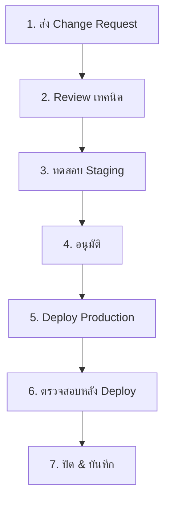

# SOP การจัดการเปลี่ยนแปลง SOC

> **รหัสเอกสาร:** CHG-001  
> **เวอร์ชัน:** 1.0  
> **อัปเดตล่าสุด:** 2026-02-15  
> **เจ้าของ:** SOC Manager

---

## ขอบเขต

ครอบคลุมการเปลี่ยนแปลง: Detection rules, Playbooks, SIEM config, EDR policies, Firewall rules, SOAR workflows, TI feeds, เครื่องมือ SOC

---

## ประเภทการเปลี่ยนแปลง

| ประเภท | ความเสี่ยง | อนุมัติโดย | เวลา | ตัวอย่าง |
|:---|:---:|:---|:---:|:---|
| **Standard** | ต่ำ | SOC Lead | 1 วัน | Sigma rule ใหม่, whitelist |
| **Normal** | กลาง | SOC Manager | 3 วัน | SIEM parser, log source ใหม่ |
| **Emergency** | สูง | SOC Manager + CISO | ทันที | Patch เร่งด่วน, ตอบเหตุ |
| **Major** | สูง | CAB | 5+ วัน | SIEM upgrade, เครื่องมือใหม่ |

---

## ขั้นตอน



### ขั้นตอนสำคัญ:
1. **ส่ง Change Request** — ใช้ [แม่แบบ](../templates/change_request_rfc.th.md)
2. **Review เทคนิค** — ตรวจสอบความถูกต้อง, conflict, rollback plan
3. **ทดสอบ** — Validate syntax, ทดสอบกับข้อมูลจริง 7 วัน
4. **อนุมัติ** — ตามระดับประเภท
5. **Deploy** — ใช้ version control (git), ติด tag
6. **ตรวจหลัง Deploy** — ภายใน 24 ชม.
7. **ปิด** — อัปเดตเอกสาร

---

## กรณีฉุกเฉิน

```
⚡ Emergency change:
   1. ขออนุมัติปากเปล่าจาก SOC Manager
   2. บันทึกภายใน 24 ชม.
   3. ทบทวนใน standup ถัดไป
   4. ต้องมี rollback plan เสมอ
```

---

## เอกสารที่เกี่ยวข้อง

- [แม่แบบ Change Request](../templates/change_request_rfc.th.md)
- [SOP ทดสอบ Detection Rule](Detection_Rule_Testing.th.md)
- [รายการตรวจสอบ SOC](SOC_Checklists.th.md)
