# Cloud Security Monitoring SOP

**Document ID**: OPS-SOP-018
**Version**: 1.0
**Classification**: Internal
**Last Updated**: 2026-02-15

> SOC procedures for monitoring **AWS, Azure, and GCP** environments. Covers log sources to collect, critical detections to build, cloud-native attack patterns, and response actions specific to cloud infrastructure.

---

## Cloud Shared Responsibility Model

```mermaid
graph TB
    subgraph Customer["🏢 Customer Responsibility (SOC Focus)"]
        A[Data & Content]
        B[Applications & Workloads]
        C[Identity & Access (IAM)]
        D[OS & Network Config]
        E[Client-Side Encryption]
    end
    
    subgraph Provider["☁️ Cloud Provider Responsibility"]
        F[Physical Infrastructure]
        G[Hypervisor & Host OS]
        H[Network Infrastructure]
        I[Storage Infrastructure]
    end
    
    style Customer fill:#3b82f6,color:#fff
    style Provider fill:#6b7280,color:#fff
```

> The SOC is responsible for monitoring **everything above the hypervisor**.

---

## Cloud Log Sources

### AWS

| Log Source | Service | Key Events | Retention | Priority |
|:---|:---|:---|:---:|:---:|
| **CloudTrail** | All API calls | IAM changes, S3 access, EC2 actions | 90 days (default) | 🔴 Critical |
| **CloudTrail Data Events** | S3 object-level, Lambda | GetObject, PutObject, Invoke | Custom | 🔴 Critical |
| **GuardDuty** | Threat detection | Findings (crypto mining, recon, C2) | 90 days | 🔴 Critical |
| **VPC Flow Logs** | Network traffic | Accept/reject, traffic patterns | Custom | 🟠 High |
| **Config** | Resource changes | Configuration compliance | Custom | 🟡 Medium |
| **IAM Access Analyzer** | Access analysis | Overly permissive policies | Continuous | 🟡 Medium |
| **CloudWatch Logs** | Applications, OS | App errors, OS events | Custom | 🟡 Medium |
| **Security Hub** | Aggregated findings | CIS benchmarks, best practices | 90 days | 🟡 Medium |
| **WAF** | Web application | Blocked requests, rules matched | Custom | 🟡 Medium |
| **Route 53 DNS** | DNS queries | Domain resolution logs | Custom | 🟢 Low |

### Azure

| Log Source | Service | Key Events | Retention | Priority |
|:---|:---|:---|:---:|:---:|
| **Azure Activity Log** | All resource operations | Create, delete, modify resources | 90 days | 🔴 Critical |
| **Entra ID Sign-in Logs** | Authentication | Success, failure, MFA, locations | 30 days (free) | 🔴 Critical |
| **Entra ID Audit Logs** | Identity changes | Role assignments, user management | 30 days (free) | 🔴 Critical |
| **Microsoft Defender for Cloud** | Threat detection | Security alerts, recommendations | 30 days | 🔴 Critical |
| **NSG Flow Logs** | Network traffic | Accept/deny, traffic flows | Custom | 🟠 High |
| **Key Vault Diagnostics** | Secret access | Key/secret/cert operations | Custom | 🟠 High |
| **Diagnostic Settings** | Platform logs | Resource-specific logs | Custom | 🟡 Medium |
| **Azure Firewall Logs** | Firewall | App rules, network rules, threat intel | Custom | 🟡 Medium |

### GCP

| Log Source | Service | Key Events | Retention | Priority |
|:---|:---|:---|:---:|:---:|
| **Cloud Audit Logs** (Admin) | All admin operations | IAM, resource create/delete | 400 days | 🔴 Critical |
| **Cloud Audit Logs** (Data) | Data access | BigQuery, GCS read/write | 30 days (default) | 🔴 Critical |
| **Security Command Center** | Threat detection | Findings, vulnerabilities | Continuous | 🔴 Critical |
| **VPC Flow Logs** | Network traffic | Source/dest, ports, protocols | Custom | 🟠 High |
| **Cloud DNS Logs** | DNS queries | Domain resolution | Custom | 🟡 Medium |
| **Cloud Armor** | WAF/DDoS | Blocked requests, rules matched | Custom | 🟡 Medium |
| **Access Transparency** | Google access | Google staff access to your data | 400 days | 🟡 Medium |

---

## Critical Cloud Detections

### Identity & Access (All Platforms)

| Detection | Description | Log Source | Severity | MITRE |
|:---|:---|:---|:---:|:---|
| Root/global admin login | Root account or global admin used | CloudTrail / Entra ID / Audit | 🔴 P1 | T1078.004 |
| MFA disabled for user | MFA removed from account | IAM / Entra ID / Audit | 🔴 P1 | T1556 |
| New admin role assigned | Privilege escalation | IAM / Entra ID / Audit | 🔴 P1 | T1098 |
| API key created | Long-lived credential exposed | CloudTrail / Audit / Audit Logs | 🟠 P2 | T1098.001 |
| Login from unusual country | Impossible travel / new location | CloudTrail / Sign-in / Audit | 🟠 P2 | T1078.004 |
| Excessive failed logins | Brute-force attempt | CloudTrail / Sign-in / Audit | 🟠 P2 | T1110 |
| Service account key download | SA key exported | CloudTrail / Audit / Audit Logs | 🟡 P3 | T1552.001 |

### Data Exfiltration

| Detection | Description | Log Source | Severity | MITRE |
|:---|:---|:---|:---:|:---|
| S3/GCS bucket made public | Storage publicly accessible | CloudTrail / Activity / Audit | 🔴 P1 | T1537 |
| Large data download | Unusual volume exported | S3 Data Events / Storage Logs | 🔴 P1 | T1530 |
| Snapshot shared externally | Disk/DB snapshot shared to external account | CloudTrail / Activity / Audit | 🔴 P1 | T1537 |
| Cross-account data transfer | Data moved to unfamiliar account | VPC Flow / Activity / Flow Logs | 🟠 P2 | T1537 |

### Infrastructure Attacks

| Detection | Description | Log Source | Severity | MITRE |
|:---|:---|:---|:---:|:---|
| Crypto mining detected | GuardDuty/Defender/SCC finding | GuardDuty / Defender / SCC | 🔴 P1 | T1496 |
| Security group 0.0.0.0/0 | Wide-open inbound rule | CloudTrail / Activity / Audit | 🔴 P1 | T1562.007 |
| Logging disabled | CloudTrail/audit logging stopped | CloudTrail / Activity / Audit | 🔴 P1 | T1562.008 |
| EC2/VM in unusual region | Resource launched in new region | CloudTrail / Activity / Audit | 🟠 P2 | T1578.002 |
| Lambda/Function created | Serverless function created | CloudTrail / Activity / Audit | 🟡 P3 | T1204 |

---

## Cloud Incident Response

### Response Actions by Platform

| Action | AWS | Azure | GCP |
|:---|:---|:---|:---|
| **Revoke session** | `aws iam delete-login-profile` | Revoke sessions in Entra | `gcloud auth revoke` |
| **Disable API key** | `aws iam update-access-key --status Inactive` | Reset credentials in Entra | `gcloud iam service-accounts keys disable` |
| **Isolate instance** | Replace SG with deny-all | Remove from subnet/NSG deny | Remove firewall rules |
| **Block IP** | WAF/Security Group | NSG/Azure Firewall | Cloud Armor/Firewall |
| **Preserve evidence** | Create EBS snapshot | Create disk snapshot | Create disk snapshot |
| **Disable user** | `aws iam update-user --no-login` | Block sign-in in Entra | `gcloud iam update --disabled` |
| **Revoke permissions** | Remove IAM policies | Remove role assignments | Remove IAM bindings |

### Cloud IR Workflow


---

## Cloud Security Posture Management (CSPM)

### Daily Checks

| Check | AWS Tool | Azure Tool | GCP Tool |
|:---|:---|:---|:---|
| Public S3/Blob/GCS buckets | S3 Access Analyzer | Defender for Storage | SCC Asset Discovery |
| Overly permissive IAM | IAM Access Analyzer | Entra PIM | IAM Recommender |
| Unencrypted storage | Config Rules | Defender for Cloud | SCC |
| Open security groups | Config Rules | Defender for Cloud | SCC |
| MFA not enabled | IAM Credential Report | Entra Reports | Org Policy |

### Weekly Checks

| Check | Tool |
|:---|:---|
| CIS benchmark compliance | AWS Config / Defender / SCC |
| Unused resources (cost + risk) | Cost Explorer / Cost Management / Billing |
| Expired/unused credentials | IAM Credential Report / Entra / IAM |
| Cross-account access review | IAM Access Analyzer / PIM / IAM |

---

## Multi-Cloud SIEM Integration

### Architecture

```mermaid
graph LR
    subgraph AWS
        CT[CloudTrail] --> S3A[S3 Bucket]
        GD[GuardDuty] --> S3A
    end
    
    subgraph Azure
        AL[Activity Log] --> EH[Event Hub]
        EID[Entra ID] --> EH
    end
    
    subgraph GCP
        CAL[Cloud Audit] --> PS[Pub/Sub]
        SCC[SCC] --> PS
    end
    
    S3A --> SIEM[🔍 SIEM]
    EH --> SIEM
    PS --> SIEM
    
    SIEM --> SOAR[⚡ SOAR]
    SOAR --> |Auto-remediate| AWS
    SOAR --> |Auto-remediate| Azure
    SOAR --> |Auto-remediate| GCP

    style SIEM fill:#3b82f6,color:#fff
    style SOAR fill:#8b5cf6,color:#fff
```



### Log Ingestion Checklist

- [ ] AWS CloudTrail → SIEM (via S3 + SQS)
- [ ] AWS GuardDuty findings → SIEM
- [ ] AWS VPC Flow Logs → SIEM (sampled)
- [ ] Azure Activity Log → SIEM (via Event Hub)
- [ ] Azure Entra ID logs → SIEM (via Event Hub)
- [ ] Azure Defender alerts → SIEM
- [ ] GCP Audit Logs → SIEM (via Pub/Sub)
- [ ] GCP SCC findings → SIEM
- [ ] GCP VPC Flow Logs → SIEM (sampled)

---

## Metrics

| Metric | Target | Measurement |
|:---|:---:|:---|
| Cloud log ingestion uptime | ≥ 99.5% | SIEM health dashboard |
| Cloud alerts MTTD | < 5 min | SIEM → alert time |
| Cloud alerts MTTR | < 30 min for P1 | Ticket resolution time |
| CSPM compliance score | ≥ 90% | Weekly CSPM report |
| Public resource detection | < 15 min | Time from exposure to alert |
| Cloud detection rule coverage | ≥ 70% of critical patterns | Monthly detection audit |

---

## Related Documents

-   [Log Source Matrix](Log_Source_Matrix.en.md) — All data sources
-   [SOC Automation Catalog](SOC_Automation_Catalog.en.md) — Cloud automations
-   [Alert Tuning SOP](Alert_Tuning.en.md) — Tuning cloud alerts
-   [Third-Party Risk](Third_Party_Risk.en.md) — Cloud vendor risk
-   [Disaster Recovery / BCP](../05_Incident_Response/Disaster_Recovery_BCP.en.md) — Cloud DR
-   [Forensic Investigation](../05_Incident_Response/Forensic_Investigation.en.md) — Cloud forensics
