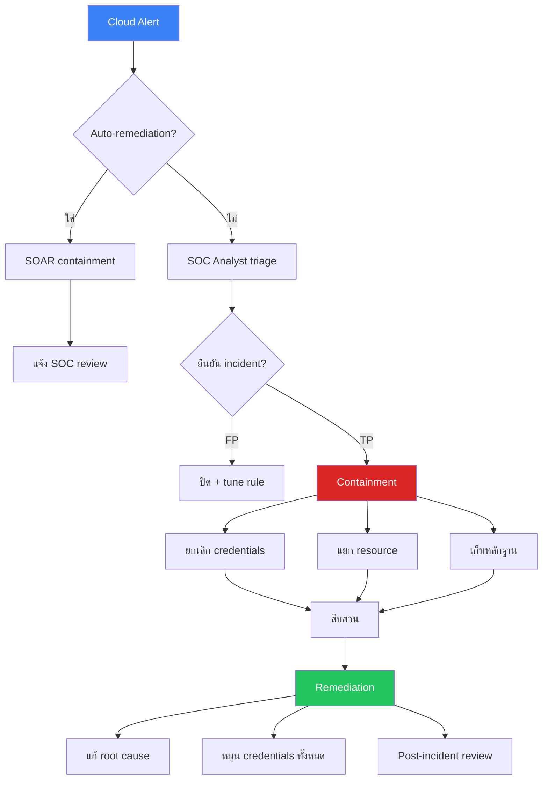

# Cloud Security Monitoring SOP / SOP การเฝ้าระวัง Cloud Security

**รหัสเอกสาร**: OPS-SOP-018
**เวอร์ชัน**: 1.0
**การจัดชั้นความลับ**: ใช้ภายใน
**อัปเดตล่าสุด**: 2026-02-15

> ขั้นตอนสำหรับ SOC ในการเฝ้าระวัง **AWS, Azure และ GCP** ครอบคลุม log sources, critical detections, cloud attack patterns และ response actions เฉพาะ cloud

---

## Cloud Log Sources

### AWS

| Log Source | บริการ | เหตุการณ์สำคัญ | ลำดับ |
|:---|:---|:---|:---:|
| **CloudTrail** | API calls ทั้งหมด | IAM changes, S3 access, EC2 | 🔴 Critical |
| **CloudTrail Data Events** | S3 object-level, Lambda | GetObject, PutObject, Invoke | 🔴 Critical |
| **GuardDuty** | Threat detection | Crypto mining, recon, C2 | 🔴 Critical |
| **VPC Flow Logs** | Network traffic | Accept/reject, traffic patterns | 🟠 High |
| **Config** | Resource changes | Configuration compliance | 🟡 Medium |
| **IAM Access Analyzer** | การวิเคราะห์สิทธิ์ | Policy ที่กว้างเกินไป | 🟡 Medium |
| **Security Hub** | Findings รวม | CIS benchmarks | 🟡 Medium |

### Azure

| Log Source | บริการ | เหตุการณ์สำคัญ | ลำดับ |
|:---|:---|:---|:---:|
| **Activity Log** | Resource operations | Create, delete, modify | 🔴 Critical |
| **Entra ID Sign-in** | Authentication | Success, failure, MFA | 🔴 Critical |
| **Entra ID Audit** | Identity changes | Role assignments | 🔴 Critical |
| **Defender for Cloud** | Threat detection | Security alerts | 🔴 Critical |
| **NSG Flow Logs** | Network traffic | Accept/deny flows | 🟠 High |
| **Key Vault Diagnostics** | Secret access | Key/secret operations | 🟠 High |

### GCP

| Log Source | บริการ | เหตุการณ์สำคัญ | ลำดับ |
|:---|:---|:---|:---:|
| **Cloud Audit Logs** (Admin) | Admin operations | IAM, resource create/delete | 🔴 Critical |
| **Cloud Audit Logs** (Data) | Data access | BigQuery, GCS read/write | 🔴 Critical |
| **Security Command Center** | Threat detection | Findings, vulnerabilities | 🔴 Critical |
| **VPC Flow Logs** | Network traffic | Source/dest, ports | 🟠 High |

---

## Cloud Detections ที่สำคัญ

### Identity & Access

| Detection | คำอธิบาย | Severity | MITRE |
|:---|:---|:---:|:---|
| Root/global admin login | ใช้ root account หรือ global admin | 🔴 P1 | T1078.004 |
| MFA ถูกปิด | MFA ถูกลบออกจาก account | 🔴 P1 | T1556 |
| กำหนด admin role ใหม่ | Privilege escalation | 🔴 P1 | T1098 |
| สร้าง API key | Long-lived credential | 🟠 P2 | T1098.001 |
| Login จากประเทศผิดปกติ | Impossible travel | 🟠 P2 | T1078.004 |
| Failed login มากเกินไป | Brute-force attempt | 🟠 P2 | T1110 |

### Data Exfiltration

| Detection | คำอธิบาย | Severity | MITRE |
|:---|:---|:---:|:---|
| Bucket ถูกเปิด public | Storage เข้าถึงได้จากภายนอก | 🔴 P1 | T1537 |
| ดาวน์โหลดข้อมูลจำนวนมาก | ปริมาณผิดปกติ | 🔴 P1 | T1530 |
| แชร์ Snapshot ภายนอก | Disk/DB snapshot ไปยัง account อื่น | 🔴 P1 | T1537 |

### Infrastructure Attacks

| Detection | คำอธิบาย | Severity | MITRE |
|:---|:---|:---:|:---|
| Crypto mining | GuardDuty/Defender/SCC finding | 🔴 P1 | T1496 |
| Security group 0.0.0.0/0 | เปิด inbound ทั้งหมด | 🔴 P1 | T1562.007 |
| Logging ถูกปิด | CloudTrail/audit ถูกหยุด | 🔴 P1 | T1562.008 |

---

## Cloud Incident Response

### Response Actions ตาม Platform

| Action | AWS | Azure | GCP |
|:---|:---|:---|:---|
| **ยกเลิก session** | `delete-login-profile` | Revoke sessions Entra | `gcloud auth revoke` |
| **ปิด API key** | `update-access-key --status Inactive` | Reset credentials | `keys disable` |
| **แยก instance** | เปลี่ยน SG เป็น deny-all | ลบ NSG deny | ลบ firewall rules |
| **บล็อก IP** | WAF/Security Group | NSG/Azure Firewall | Cloud Armor |
| **เก็บหลักฐาน** | สร้าง EBS snapshot | สร้าง disk snapshot | สร้าง disk snapshot |
| **ปิด user** | `update-user --no-login` | Block sign-in Entra | `update --disabled` |

### Cloud IR Workflow

```mermaid
flowchart TD
    A[Cloud Alert] --> B{Auto-remediation?}
    B -->|ใช่| C[SOAR containment]
    B -->|ไม่| D[SOC Analyst triage]
    C --> E[แจ้ง SOC review]
    D --> F{ยืนยัน incident?}
    F -->|FP| G[ปิด + tune rule]
    F -->|TP| H[Containment]
    H --> I[ยกเลิก credentials]
    H --> J[แยก resource]
    H --> K[เก็บหลักฐาน]
    I --> L[สืบสวน]
    J --> L
    K --> L
    L --> M[Remediation]
    M --> N[แก้ root cause]
    M --> O[หมุน credentials ทั้งหมด]
    M --> P[Post-incident review]

    style A fill:#3b82f6,color:#fff
    style H fill:#dc2626,color:#fff
    style M fill:#22c55e,color:#fff
```

---

## CSPM ตรวจสอบประจำ

### รายวัน

| ตรวจสอบ | เครื่องมือ |
|:---|:---|
| Public buckets/storage | S3 Access Analyzer / Defender / SCC |
| IAM ที่กว้างเกินไป | IAM Access Analyzer / Entra PIM / IAM Recommender |
| Storage ไม่เข้ารหัส | Config / Defender / SCC |
| Security groups เปิดกว้าง | Config / Defender / SCC |
| MFA ไม่เปิด | IAM Credential Report / Entra / Org Policy |

### รายสัปดาห์

| ตรวจสอบ | เครื่องมือ |
|:---|:---|
| CIS benchmark compliance | AWS Config / Defender / SCC |
| Resources ที่ไม่ได้ใช้ | Cost Explorer / Cost Management / Billing |
| Credentials หมดอายุ/ไม่ได้ใช้ | IAM Credential Report / Entra / IAM |

---

## Multi-Cloud SIEM Integration

### Log Ingestion Checklist

- [ ] AWS CloudTrail → SIEM (ผ่าน S3 + SQS)
- [ ] AWS GuardDuty → SIEM
- [ ] AWS VPC Flow Logs → SIEM (sampled)
- [ ] Azure Activity Log → SIEM (ผ่าน Event Hub)
- [ ] Azure Entra ID → SIEM (ผ่าน Event Hub)
- [ ] Azure Defender alerts → SIEM
- [ ] GCP Audit Logs → SIEM (ผ่าน Pub/Sub)
- [ ] GCP SCC findings → SIEM
- [ ] GCP VPC Flow Logs → SIEM (sampled)

---

## ตัวชี้วัด

| ตัวชี้วัด | เป้าหมาย |
|:---|:---:|
| Cloud log ingestion uptime | ≥ 99.5% |
| Cloud alerts MTTD | < 5 นาที |
| Cloud alerts MTTR (P1) | < 30 นาที |
| CSPM compliance score | ≥ 90% |
| Public resource detection | < 15 นาที |

---

## Baseline ขั้นต่ำก่อนถือว่า Monitoring พร้อมใช้งาน

| พื้นที่ | สิ่งที่ต้องมีขั้นต่ำ | ทำไมจึงสำคัญ |
|:---|:---|:---|
| **Identity** | sign-in logs, audit logs, MFA events, privileged role changes | incident บน cloud ส่วนใหญ่เริ่มจาก identity misuse |
| **Management plane** | เปิด CloudTrail / Activity Log / Cloud Audit Logs และเก็บ retention เพียงพอ | ต้องใช้ reconstruct การกระทำของ admin |
| **Storage access** | object-level audit สำหรับ storage สำคัญเท่าที่ทำได้ | ต้องใช้พิสูจน์เส้นทางการเข้าถึงและ exfiltration |
| **Network** | flow logs สำหรับส่วนที่ internet-facing และ segment สำคัญ | ใช้ยืนยัน exposure, scanning และ egress |
| **Detection path** | มี ingestion health ใน SIEM และมี owner ต่อ critical use case | ป้องกัน onboarding แล้ว detection เงียบโดยไม่มีคนรู้ |

## Trigger สำหรับ Escalate เหตุการณ์ Cloud

| Trigger | Owner เริ่มต้น | ต้อง escalate ไปหา | เหตุผล |
|:---|:---|:---|:---|
| **root/global admin login นอกขั้นตอนที่อนุมัติ** | SOC Analyst | IR Engineer + CISO | เป็น privileged access event ที่ impact สูง |
| **cloud logging ถูกปิดหรือถูกแก้ไข** | SOC Analyst | Security Engineer + SOC Manager | กระทบทั้งหลักฐานและความสามารถตรวจจับ |
| **public storage exposure ที่มีข้อมูลสำคัญ** | SOC Analyst | IR Engineer + Privacy / Legal | อาจเป็นเหตุการณ์ที่ต้องรายงาน |
| **มี cross-account trust หรือ admin role grant ใหม่** | Security Engineer | SOC Manager | blast radius ขยายเร็ว |
| **cryptomining หรือ compute ที่ไม่ได้รับอนุญาต** | SOC Analyst | Security Engineer | บ่งชี้ credential/platform abuse และกระทบค่าใช้จ่าย |

## Blind Spots ที่ต้องรู้ในการเฝ้าระวัง Cloud

| Control หรือ Log ที่ขาด | ผลกระทบเชิงปฏิบัติการ | แนวทางลดความเสี่ยง |
|:---|:---|:---|
| **ไม่มี object-level storage audit** | ยืนยันไม่ได้ว่า record ใดถูกอ่านหรือดาวน์โหลด | เปิด data events ให้ storage สำคัญตามระดับความเสี่ยง |
| **ไม่มี flow logs ใน segment สำคัญ** | ยืนยัน scanning, lateral movement, exfiltration ได้ยาก | เปิด flow logging แบบ targeted พร้อม retention ที่รองรับ IR |
| **ไม่มี feed ของ CSPM/posture findings** | misconfiguration จะรอคนไปเจอเอง | ingest native posture findings เข้า SIEM หรือ workflow |
| **ไม่มีการทบทวน privileged identity** | role abuse อาจดูเหมือน admin activity ปกติ | ทำ review รอบเวลาให้ admin actions และ break-glass use |

## เอกสารที่เกี่ยวข้อง

-   [Log Source Matrix](Log_Source_Matrix.th.md) — แหล่งข้อมูลทั้งหมด
-   [SOC Automation Catalog](SOC_Automation_Catalog.th.md) — Cloud automations
-   [Alert Tuning SOP](Alert_Tuning.th.md) — การ tune cloud alerts
-   [Third-Party Risk](Third_Party_Risk.th.md) — ความเสี่ยง cloud vendor

## References

- [NIST SP 800-61 Rev. 2](https://csrc.nist.gov/publications/detail/sp/800-61/rev-2/final)
- [MITRE ATT&CK](https://attack.mitre.org/)
