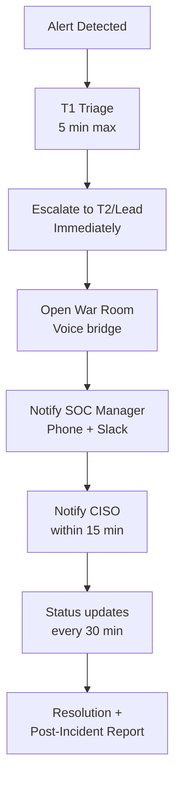

# SOC Communication SOP

> **Document ID:** COMM-001  
> **Version:** 1.0  
> **Last Updated:** 2026-02-15  
> **Owner:** SOC Manager

---

## Purpose

Defines communication channels, escalation paths, and protocols for SOC teams during normal operations and incidents. Ensures the right people get the right information at the right time.

---

## Communication Channels

### Channel Matrix

| Channel | Use Case | Urgency | Platform |
|:---|:---|:---:|:---|
| **#soc-alerts** | Automated SIEM/EDR alerts | Low–Med | Slack / Teams |
| **#soc-triage** | Active triage discussion | Medium | Slack / Teams |
| **#soc-incidents** | Active incident coordination | High | Slack / Teams |
| **#soc-general** | Team announcements, shift notes | Low | Slack / Teams |
| **War Room** (voice) | P1/P2 incident bridge call | Critical | Teams / Zoom / Google Meet |
| **Email** | Formal notifications, reports | Low | Corporate email |
| **Phone/SMS** | Emergency escalation | Critical | Personal/on-call phone |
| **Ticketing System** | All incident tracking | All | Jira / ServiceNow / TheHive |

### Channel Rules

```
📌 Rules:
1. ALL incidents MUST be tracked in the ticketing system (single source of truth)
2. Slack/Teams is for real-time coordination — NOT the record of decision
3. Sensitive IOCs, credentials, and PII must NEVER be shared in chat
4. Use threads in #soc-incidents to avoid noise
5. Pin important updates in the incident channel
6. War Room is mandatory for all P1 incidents
```

---

## Normal Operations Communication

### Shift Handoff

| Item | Detail |
|:---|:---|
| **When** | Start of each shift |
| **Channel** | #soc-general + ticketing system |
| **Duration** | 10–15 minutes |
| **Format** | Use [Shift Handover Template](../templates/shift_handover.en.md) |
| **Required** | Open incidents, pending actions, system health, queue volume |

### Daily Standup

| Item | Detail |
|:---|:---|
| **When** | Start of business (day shift) |
| **Channel** | Voice/video + #soc-general |
| **Duration** | 15 minutes max |
| **Agenda** | Overnight highlights, pending P2/P3s, rule tuning needs, blockers |

### Weekly SOC Meeting

| Item | Detail |
|:---|:---|
| **When** | Weekly (e.g., Monday 10:00) |
| **Attendees** | All SOC analysts + SOC Manager |
| **Agenda** | KPI review, incident trends, detection gaps, training, process improvement |
| **Output** | Action items tracked in ticketing system |

---

## Incident Communication Protocol

### P1 — Critical Incident



**War Room Setup:**
1. Create dedicated incident channel: `#inc-YYYY-MM-DD-short-name`
2. Start voice bridge (Teams/Zoom permanent link)
3. Pin incident summary at top of channel
4. Assign roles: **Incident Commander**, **Scribe**, **Technical Lead**

**Status Update Template:**
```
🔴 INCIDENT UPDATE — [INC-YYYY-NNN]
━━━━━━━━━━━━━━━━━━━━━━
Time: HH:MM
Status: Investigating / Containing / Eradicating / Recovering
Summary: [1-2 sentences]
Actions taken: [bullets]
Next steps: [bullets]
ETA to resolution: [estimate]
━━━━━━━━━━━━━━━━━━━━━━
```

### P2 — High

| Step | Action | Timeline |
|:---|:---|:---:|
| 1 | Post in #soc-incidents | Immediately |
| 2 | Notify SOC Lead (Slack + mention) | < 15 min |
| 3 | Status updates | Every 1 hour |
| 4 | Notify SOC Manager | < 1 hour |

### P3 — Medium

| Step | Action | Timeline |
|:---|:---|:---:|
| 1 | Create ticket | Immediately |
| 2 | Post summary in #soc-triage | < 30 min |
| 3 | Handle during normal workflow | Business hours |

### P4 — Low

| Step | Action | Timeline |
|:---|:---|:---:|
| 1 | Create ticket | Next business day |
| 2 | Track in queue | Normal priority |

---

## External Communication

### Who Communicates Externally

| Audience | Communicator | Approval Required |
|:---|:---|:---|
| Executive / Board | CISO | — |
| Legal / Regulators (PDPA) | DPO + Legal | CISO |
| Media / Public | PR/Comms | CISO + CEO |
| Affected customers | Account team | CISO + Legal |
| Law enforcement | CISO | CEO |
| Insurance provider | CFO | CISO |

> ⚠️ **SOC analysts must NEVER communicate externally about incidents** without explicit approval from SOC Manager or CISO.

---

## On-Call Communication

| Item | Detail |
|:---|:---|
| **On-call schedule** | Maintained in PagerDuty / Opsgenie / shared calendar |
| **Primary contact** | Phone call (not just Slack) |
| **Response time** | Acknowledge within 15 minutes |
| **Escalation** | If no response in 15 min → escalate to backup |
| **Backup** | Always have a backup on-call designated |

---

## Communication Tools Checklist

```
□ Slack/Teams workspace configured with SOC channels
□ Voice bridge (permanent meeting link) ready
□ On-call rotation tool configured (PagerDuty/Opsgenie)
□ Phone numbers for all SOC team members (secured)
□ Distribution lists: soc-team@, soc-management@, incident-response@
□ Incident channel naming convention documented
□ Status update templates saved as snippets/bookmarks
□ External contact list maintained (Legal, PR, DPO, Insurance)
```

---

## Related Documents

- [Shift Handoff SOP](Shift_Handoff.en.md)
- [SLA Template](SLA_Template.en.md)
- [Communication Templates (IR)](../05_Incident_Response/Communication_Templates.en.md)
- [SOC Team Structure](SOC_Team_Structure.en.md)
