# SOP การสื่อสาร SOC

> **รหัสเอกสาร:** COMM-001  
> **เวอร์ชัน:** 1.0  
> **อัปเดตล่าสุด:** 2026-02-15  
> **เจ้าของ:** SOC Manager

---

## ช่องทางการสื่อสาร

| ช่องทาง | ใช้เมื่อ | ความเร่งด่วน | Platform |
|:---|:---|:---:|:---|
| **#soc-alerts** | Alert อัตโนมัติจาก SIEM/EDR | ต่ำ–กลาง | Slack / Teams |
| **#soc-triage** | ถกเรื่อง triage | กลาง | Slack / Teams |
| **#soc-incidents** | ประสานเหตุการณ์ | สูง | Slack / Teams |
| **War Room** (เสียง) | P1/P2 bridge call | วิกฤต | Teams / Zoom |
| **โทรศัพท์/SMS** | Escalation ฉุกเฉิน | วิกฤต | โทรศัพท์ on-call |
| **Ticketing** | ติดตามทุก incident | ทุกระดับ | Jira / TheHive |

### กฎช่องทาง
1. ทุก incident **ต้อง** track ใน ticketing system
2. Slack/Teams ใช้ประสานงาน — ไม่ใช่บันทึกการตัดสินใจ
3. **ห้าม** แชร์ IOC, credentials, PII ใน chat
4. ใช้ thread ใน #soc-incidents เพื่อลด noise

---

## การสื่อสารปกติ

| รายการ | รายละเอียด |
|:---|:---|
| **Shift Handoff** | ต้นกะทุกครั้ง, 10–15 นาที, ใช้[แม่แบบ](../templates/shift_handover.th.md) |
| **Daily Standup** | ต้นวัน, 15 นาที, สรุปเหตุข้ามคืน + pending + blockers |
| **Weekly Meeting** | ทุกสัปดาห์, KPI + trends + detection gaps + training |

---

## Protocol ตามระดับเหตุ

### P1 — วิกฤต

```mermaid
graph TD
    A[ตรวจพบ Alert] --> B[T1 Triage ≤ 5 นาที]
    B --> C[Escalate T2/Lead ทันที]
    C --> D[เปิด War Room]
    D --> E[แจ้ง SOC Manager ทันที]
    E --> F[แจ้ง CISO ≤ 15 นาที]
    F --> G[อัปเดตทุก 30 นาที]
```

**War Room:**
1. สร้างช่อง `#inc-YYYY-MM-DD-ชื่อย่อ`
2. เปิดสาย voice bridge
3. Pin สรุปเหตุที่หัวช่อง
4. กำหนดบทบาท: **Incident Commander**, **Scribe**, **Technical Lead**

### P2 — สูง
- แจ้ง #soc-incidents ทันที
- แจ้ง SOC Lead ≤ 15 นาที
- อัปเดตทุก 1 ชม.

### P3 — กลาง
- สร้าง ticket, โพสต์ใน #soc-triage ≤ 30 นาที

### P4 — ต่ำ
- สร้าง ticket วันทำการถัดไป

---

## การสื่อสารภายนอก

| ผู้รับ | ผู้สื่อสาร | ต้อง approve |
|:---|:---|:---|
| ผู้บริหาร/Board | CISO | — |
| กฎหมาย/PDPA | DPO + Legal | CISO |
| สื่อ/สาธารณะ | PR | CISO + CEO |
| ลูกค้า | Account team | CISO + Legal |

> ⚠️ SOC analyst **ห้ามสื่อสารภายนอกเรื่อง incident** โดยไม่ได้รับอนุญาต

---

## On-Call

| รายการ | รายละเอียด |
|:---|:---|
| ตาราง | PagerDuty / Opsgenie / ปฏิทินร่วม |
| ตอบรับ | ภายใน 15 นาที |
| ถ้าไม่ตอบ | Escalate ไป backup |

---

## Communication Flow by Severity

```mermaid
graph TD
    Alert["🚨 Alert"] --> Severity{"ระดับ?"}
    Severity -->|Low| Log["📝 บันทึก + Ticket"]
    Severity -->|Medium| Team["👥 แจ้งทีม SOC"]
    Severity -->|High| Lead["📱 แจ้ง Shift Lead + Manager"]
    Severity -->|Critical| Exec["📞 แจ้ง CISO + Management"]
    Lead --> Update["📊 อัปเดตทุก 2 ชม."]
    Exec --> War["🏠 War Room"]
    War --> Update60["📊 อัปเดตทุก 1 ชม."]
```

## Communication Matrix

| สิ่งที่ต้องสื่อสาร | ผู้รับ | ช่องทาง | เวลา | เทมเพลต |
|:---|:---|:---|:---|:---|
| Alert triage result | SOC Team | Chat/Ticket | ทันที | N/A |
| Incident เปิดใหม่ (P3-P4) | SOC Manager | Email/Chat | < 1 ชม. | Incident Notification |
| Incident เปิดใหม่ (P1-P2) | CISO + Legal | Phone + Email | < 30 นาที | Critical Alert |
| สรุป incident รายวัน | SOC Manager | Email | สิ้นวัน | Daily Summary |
| Monthly SOC report | Management | Email + Meeting | สิ้นเดือน | Monthly Report |
| Data breach | DPO + Regulator | จดหมาย + ระบบ | ≤ 72 ชม. | PDPA Notification |

## Stakeholder Contact List

| ลำดับ | บทบาท | ชื่อ | โทร | Email | ช่วงเวลา |
|:---:|:---|:---|:---|:---|:---|
| 1 | SOC Manager | [ชื่อ] | [เบอร์] | [email] | 24/7 |
| 2 | CISO | [ชื่อ] | [เบอร์] | [email] | Business hours |
| 3 | IT Director | [ชื่อ] | [เบอร์] | [email] | Business hours |
| 4 | Legal / DPO | [ชื่อ] | [เบอร์] | [email] | Business hours |
| 5 | PR / Comms | [ชื่อ] | [เบอร์] | [email] | On-call |
| 6 | External IR (retainer) | [บริษัท] | [เบอร์] | [email] | Per contract |

## การจัดการสื่อ (Media Handling)

| ✅ ควรทำ | ❌ ไม่ควรทำ |
|:---|:---|
| ส่งต่อคำถามจากสื่อไปยัง PR/Comms | ตอบสื่อโดยตรง |
| ใช้ approved talking points เท่านั้น | เดาสาเหตุหรือขอบเขต |
| ให้ข้อเท็จจริงที่ยืนยันแล้วเท่านั้น | แชร์รายละเอียดทางเทคนิค |
| บันทึกทุกปฏิสัมพันธ์กับสื่อ | สัญญาว่า "จะไม่เกิดอีก" |

## เอกสารที่เกี่ยวข้อง

- [SOP ส่งมอบกะ](Shift_Handoff.th.md)
- [แม่แบบ SLA](SLA_Template.th.md)
- [แม่แบบการสื่อสาร IR](../05_Incident_Response/Communication_Templates.th.md)
