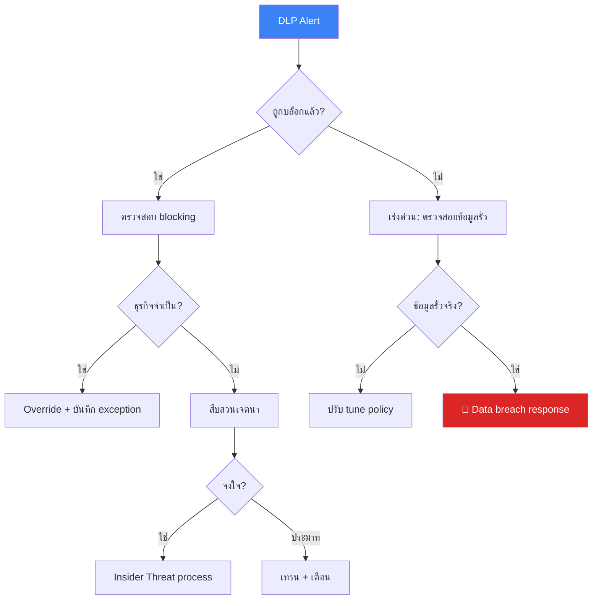
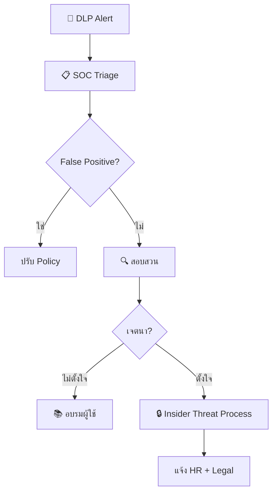

# Data Loss Prevention (DLP) SOP / SOP การป้องกันข้อมูลรั่วไหล

**รหัสเอกสาร**: OPS-SOP-024
**เวอร์ชัน**: 1.0
**การจัดชั้นความลับ**: ลับ
**อัปเดตล่าสุด**: 2026-02-15

> ขั้นตอน SOC สำหรับ **ตรวจจับ, สืบสวน, และป้องกันข้อมูลรั่วไหล** ผ่าน DLP technology, การบังคับนโยบาย, และ incident response ครอบคลุม endpoint, network, cloud และ email DLP

---

## การจำแนกข้อมูล

| ระดับ | ป้าย | ตัวอย่าง | DLP Action |
|:---|:---:|:---|:---|
| **L4** | 🔴 ความลับสูงสุด | Encryption keys, board minutes | บล็อก + alert + แจ้ง CISO |
| **L3** | 🟠 ลับ | PII, ข้อมูลการเงิน, source code, ข้อมูลลูกค้า | บล็อก + alert |
| **L2** | 🟡 ใช้ภายใน | รายงานภายใน, บันทึกประชุม, เอกสาร HR | Alert เมื่อส่งภายนอก |
| **L1** | 🟢 สาธารณะ | สื่อการตลาด, เว็บไซต์สาธารณะ | บันทึก log |

---

## DLP Policies

| Policy ID | หมวด | วิธีตรวจจับ | Action | Severity |
|:---|:---|:---|:---|:---:|
| DLP-001 | **เลขบัตรเครดิต** | Regex + Luhn validation | บล็อก + alert | P1 |
| DLP-002 | **เลขบัตรประชาชน** | 13 หลัก + checksum | บล็อก + alert | P1 |
| DLP-003 | **PII (ชื่อ+ที่อยู่+เบอร์โทร)** | Named entity + proximity | Alert | P2 |
| DLP-004 | **Source code** | นามสกุลไฟล์ + keyword | บล็อกภายนอก | P2 |
| DLP-005 | **งบการเงิน** | Keyword + document class | บล็อกภายนอก | P2 |
| DLP-006 | **ไฟล์ password/credential** | ชื่อไฟล์ + content pattern | บล็อกทุกช่องทาง | P1 |
| DLP-007 | **Export ฐานข้อมูลลูกค้า** | CSV/Excel ขนาดใหญ่ + PII columns | บล็อก + alert | P1 |
| DLP-008 | **ทรัพย์สินทางปัญญา** | Classification label + keyword | บล็อกภายนอก | P2 |

---

## การตอบสนอง DLP Incident

### DLP Alert Triage

### ระดับ Severity

| Severity | เกณฑ์ | SLA | แจ้ง |
|:---|:---|:---:|:---|
| 🔴 P1 | L4 ยืนยันรั่วไหล | 30 นาที | CISO + Legal + DPO |
| 🔴 P1 | L3 ข้อมูลจำนวนมากไปภายนอก | 30 นาที | CISO + Legal |
| 🟠 P2 | L3 ไปยังบุคคลภายในที่ไม่ได้รับอนุญาต | 2 ชม. | SOC Lead + data owner |
| 🟡 P3 | L2 ไปภายนอก (bulk) | 8 ชม. | SOC Lead |
| 🟢 P4 | FP / ต้อง tune | 72 ชม. | Analyst handles |

---

## การประเมิน PDPA Breach

### ตัดสินใจแจ้ง

| ปัจจัย | แจ้ง DPO | แจ้ง PDPC | แจ้งเจ้าของข้อมูล |
|:---|:---:|:---:|:---:|
| L4 ยืนยันรั่วไหลภายนอก | ✅ | ✅ | ✅ |
| L3 PII ภายนอก (> 500 records) | ✅ | ✅ | ✅ |
| L3 PII ภายนอก (< 500 records) | ✅ | ประเมิน | ประเมิน |
| L3 ไปยังภายในที่ไม่ได้รับอนุญาต | ✅ | ❌ | ❌ |
| ข้อมูลเข้ารหัสและ key ไม่ compromise | ✅ | ❌ | ❌ |

### กรอบเวลาแจ้ง PDPA

| Action | กำหนด |
|:---|:---:|
| แจ้ง DPO | ภายใน 24 ชม. |
| แจ้ง PDPC (ถ้าจำเป็น) | ภายใน 72 ชม. |
| แจ้งเจ้าของข้อมูล (ถ้าเสี่ยงสูง) | โดยไม่ชักช้า |
| จัดทำเอกสารประเมิน breach | ภายใน 7 วัน |

---

## การจัดการ Exception

| ขั้น | ผู้รับผิดชอบ | ผลลัพธ์ |
|:---:|:---|:---|
| 1 | ผู้ใช้ส่งคำขอ exception | แบบฟอร์ม |
| 2 | ผู้จัดการอนุมัติเหตุผลทางธุรกิจ | อนุมัติผู้จัดการ |
| 3 | เจ้าของข้อมูลยืนยันการจำแนก | sign-off |
| 4 | SOC ประเมินความเสี่ยง | การประเมิน |
| 5 | Security Manager อนุมัติ (L2) หรือ CISO (L3/L4) | อนุมัติ |
| 6 | ใช้ exception พร้อม monitoring | enhanced monitoring |
| 7 | ทบทวนเมื่อหมดอายุ (สูงสุด 90 วัน) | ต่อหรือยกเลิก |

---

## การ Tune DLP

| ปรับจูน | เมื่อไร | ผลกระทบ |
|:---|:---|:---|
| **Whitelist senders** | Partner domains ที่เชื่อถือ | ลด FP email |
| **Approved cloud apps** | Business tools ที่อนุมัติ | ลด FP cloud |
| **ปรับ threshold** | Alert เล็กน้อยเยอะเกินไป | ลด noise |
| **Context rules** | Exception ตามแผนก | ลดที่เป้าหมาย |

---

## ตัวชี้วัด

| ตัวชี้วัด | เป้าหมาย |
|:---|:---:|
| DLP alert response time (P1) | < 30 นาที |
| DLP alert response time (P2) | < 2 ชม. |
| DLP policy coverage | 100% |
| False positive rate | < 20% |
| Exception compliance (ภายใน 90 วัน) | 100% |
| PDPA notification compliance | 100% |

---

## ตัวอย่าง DLP Policies เพิ่มเติม

### Personal Data (PII) Detection

| ประเภทข้อมูล | Pattern | ตัวอย่าง | Action |
|:---|:---|:---|:---|
| เลขบัตรประชาชน | `\d{1}-\d{4}-\d{5}-\d{2}-\d{1}` | 1-1234-56789-01-2 | Block + Alert |
| เลขบัตรเครดิต | Luhn algorithm match | 4111-xxxx-xxxx-1111 | Block + Alert |
| เลขหนังสือเดินทาง | `[A-Z]{2}\d{7}` | AA1234567 | Alert |
| เบอร์โทรศัพท์ | `0[689]\d-\d{3}-\d{4}` | 081-234-5678 | Log |

### Source Code Exfiltration

| Channel | Detection Method | Action |
|:---|:---|:---|
| Email + attachment (.py, .js, .go) | File extension matching | Alert + Hold |
| Cloud storage upload | API monitoring | Block + Alert |
| USB copy | Endpoint DLP agent | Block + Alert |
| Git push to personal repo | URL pattern matching | Block + Alert |

## Incident Response สำหรับ DLP Events

## DLP Tool Comparison

| คุณสมบัติ | Microsoft Purview | Symantec DLP | Forcepoint | Wazuh FIM |
|:---|:---:|:---:|:---:|:---:|
| Network DLP | ✅ | ✅ | ✅ | ❌ |
| Endpoint DLP | ✅ | ✅ | ✅ | ✅ (FIM) |
| Cloud DLP | ✅ | ✅ | ✅ | ❌ |
| Content Inspection | ✅ | ✅ | ✅ | ❌ |
| Price | M365 bundle | Commercial | Commercial | ฟรี |

## DLP KPIs

| ตัวชี้วัด | เป้าหมาย | ปัจจุบัน |
|:---|:---|:---|
| DLP Alerts/เดือน | < 100 (หลัง tuning) | [XX] |
| False Positive Rate | < 15% | [XX]% |
| เวลาตอบสนอง DLP Alert | < 30 นาที | [XX] นาที |
| จำนวน Policy violations/เดือน | ลดลง MoM | [XX] |
| ผู้ใช้ที่ผ่านอบรม DLP | ≥ 90% | [XX]% |

## DLP Policy Templates

### Classification-based Actions

| Data Class | ตรวจจับ | Action | แจ้งเตือน |
|:---|:---|:---|:---|
| Restricted | Exact match | Block + Alert | SOC + DPO |
| Confidential | Pattern match | Warn + Log | SOC |
| Internal | Keyword | Log only | Monthly review |
| Public | N/A | Allow | None |

### Common DLP Channels

| Channel | Detection Method | False Positive Rate |
|:---|:---|:---|
| Email | Content inspection | 15-20% |
| Web Upload | URL + content | 10-15% |
| USB | Device control | 5% |
| Cloud Storage | API + CASB | 20-25% |
| Print | Print server hook | 10% |

### Incident Response for DLP Violations

| Severity | Response Time | Action | Escalation |
|:---|:---|:---|:---|
| Critical | 15 min | Block + Investigate | CISO + Legal |
| High | 1 hr | Alert + Review | SOC Manager |
| Medium | 4 hrs | Log + Queue review | SOC Analyst |
| Low | 24 hrs | Awareness reminder | Auto-email |

### DLP Tuning Schedule

| Activity | Frequency | Owner |
|:---|:---|:---|
| FP review | Weekly | SOC Analyst |
| Policy update | Monthly | Security Engineer |
| Threshold tuning | Quarterly | SOC Manager |
| Full policy review | Annual | CISO |

## เอกสารที่เกี่ยวข้อง

-   [Insider Threat Program](Insider_Threat_Program.en.md) — ตรวจจับ insider threat
-   [Forensic Investigation](../05_Incident_Response/Forensic_Investigation.en.md) — การจัดการหลักฐาน
-   [Alert Tuning SOP](Alert_Tuning.en.md) — การ tune DLP alerts
-   [Cloud Security Monitoring](Cloud_Security_Monitoring.en.md) — Cloud DLP integration
