# โปรโตคอลการจัดการข้อมูล (TLP 2.0)

**วันที่มีผลบังคับใช้**: 2026-02-15
**เวอร์ชัน**: 1.0

## 1. ภาพรวม
Traffic Light Protocol (TLP) คือมาตรฐานสากลที่ใช้กำหนดขอบเขตในการแบ่งปันข้อมูล เพื่อให้มั่นใจว่าข้อมูลที่มีความละเอียดอ่อนจะถูกส่งต่อไปยังผู้ที่เกี่ยวข้องเท่านั้น

## 2. ขั้นตอนการจำแนกข้อมูล (Classification Logic)
ใช้แผนผังด้านล่างเพื่อตัดสินใจเลือก TLP Level

```mermaid
graph TD
    Start[ข้อมูล/ข่าวสาร] --> IsPublic{เป็นสาธารณะหรือไม่?}
    IsPublic -->|ใช่| CLEAR[TLP:CLEAR]
    IsPublic -->|ไม่| IsRestricted{จำกัดเฉพาะกลุ่มชุมชน?}
    IsRestricted -->|ใช่| GREEN[TLP:GREEN]
    IsRestricted -->|ไม่| IsOrgOnly{จำกัดเฉพาะองค์กร?}
    IsOrgOnly -->|ใช่| AMBER[TLP:AMBER]
    IsOrgOnly -->|ไม่| IsPersonal{จำกัดเฉพาะบุคคล?}
    IsPersonal -->|ใช่| RED[TLP:RED]
    
    style RED fill:#ff0000,color:#fff
    style AMBER fill:#ffbf00,color:#000
    style GREEN fill:#00ff00,color:#000
    style CLEAR fill:#ffffff,color:#000,stroke:#333
```

## 3. คำนิยาม TLP

### 🔴 TLP:RED (ลับที่สุด / เฉพาะบุคคล)
-   **คำนิยาม**: ห้ามเปิดเผยต่อผู้อื่น จำกัดไว้เฉพาะผู้รับสารโดยตรงเท่านั้น
-   **ตัวอย่าง**: Log ที่มีรหัสผ่าน, รายงาน Forensics ที่ระบุชื่อพนักงานที่ทำผิด, การเจรจากับแฮกเกอร์
-   **การแบ่งปัน**: ห้ามส่งต่อ หรือบอกกล่าวแก่บุคคลอื่นนอกเหนือจากคู่สนทนา

### 🟡 TLP:AMBER (จำกัดภายในองค์กร)
-   **คำนิยาม**: เปิดเผยได้จำกัด เฉพาะผู้ที่มีความจำเป็นต้องรู้ (Need-to-know) ภายในองค์กร
-   **ตัวอย่าง**: รายงานเหตุการณ์ภัยคุกคามภายใน, ผล Scan ช่องโหว่, ผังเครือข่ายภายใน
-   **การแบ่งปัน**: ส่งต่อได้เฉพาะพนักงานภายในองค์กรที่เกี่ยวข้อง

### 🟢 TLP:GREEN (จำกัดภายในกลุ่มเครือข่าย)
-   **คำนิยาม**: เปิดเผยได้ภายในกลุ่มชุมชนหรืออุตสาหกรรมเดียวกัน
-   **ตัวอย่าง**: IoC (IP/Hash) ของกลุ่มแฮกเกอร์, คำแนะนำการป้องกันทั่วไป
-   **การแบ่งปัน**: แชร์กับบริษัทคู่ค้า หรือกลุ่มอุตสาหกรรมเดียวกันได้ (เช่น กลุ่มธนาคาร)

### ⚪ TLP:CLEAR (สาธารณะ)
-   **คำนิยาม**: เปิดเผยได้ไม่จำกัด
-   **ตัวอย่าง**: แถลงการณ์ข่าว, บทความวิชาการ, รายละเอียด Patch
-   **การแบ่งปัน**: เผยแพร่สู่สาธารณะได้ทันที

## 4. การใข้งานในรายงาน (Incident Reports)
รายงานเหตุการณ์ทุกฉบับ ต้องระบุระดับ TLP อย่างชัดเจนที่ส่วนหัวของเอกสาร

## ขั้นตอนการจัดการตามระดับ TLP

| ระดับ TLP | การจัดเก็บ | การส่ง | การแชร์ |
|:---|:---|:---|:---|
| 🔴 RED | เข้ารหัส + โฟลเดอร์จำกัด | ช่องทางเข้ารหัสเท่านั้น | บุคคลที่ระบุชื่อเท่านั้น |
| 🟡 AMBER | เข้ารหัสขณะจัดเก็บ | TLS 1.2+ / อีเมลเข้ารหัส | ภายในองค์กร + พันธมิตร NDA |
| 🟢 GREEN | จัดเก็บ SOC มาตรฐาน | ช่องทางปลอดภัย | ชุมชนภาคส่วน / ISACs |
| ⚪ CLEAR | จัดเก็บทั่วไป | ช่องทางใดก็ได้ | สาธารณะ |

## สถานการณ์ทั่วไปและ TLP ที่ถูกต้อง

| สถานการณ์ | TLP ที่ถูกต้อง | เหตุผล |
|:---|:---|:---|
| IoCs จากเหตุการณ์ที่ active แชร์กับ ISP | 🟡 AMBER | มีรายละเอียดเฉพาะองค์กร |
| Hash จากการวิเคราะห์ Malware สาธารณะ | ⚪ CLEAR | ข้อมูลที่เปิดเผยสาธารณะ |
| Forensic image ของแล็ปท็อปพนักงาน | 🔴 RED | มีข้อมูลส่วนบุคคล/Credential |
| รายงานภัยคุกคามรายไตรมาสสำหรับ SOC พันธมิตร | 🟢 GREEN | ใช้ได้ทั่วไปในภาคส่วน |

## การตอบสนองต่อการฝ่าฝืน

| การฝ่าฝืน | ระดับ | การตอบสนอง |
|:---|:---|:---|
| TLP:RED ถูกแชร์ภายนอก | 🔴 วิกฤต | ควบคุมทันที, แจ้ง CISO |
| TLP:AMBER โพสต์สาธารณะ | 🟠 สูง | ลบเนื้อหา, รายงานเหตุการณ์ |
| ไม่มีเครื่องหมาย TLP | 🟡 กลาง | ส่งกลับผู้เขียน, ถือเป็น AMBER |

## เอกสารที่เกี่ยวข้อง (Related Documents)
-   [กรอบการตอบสนองเหตุการณ์](../05_Incident_Response/Framework.th.md)
-   [แบบประเมิน SOC](SOC_Assessment_Checklist.th.md)
-   [ตัวชี้วัด SOC](SOC_Metrics.th.md)

### Data Retention Schedule

| Data Type | Retention | Archive | Destroy |
|:---|:---|:---|:---|
| Security logs | 1 ปี | 3 ปี | Secure wipe |
| Incident data | 3 ปี | 5 ปี | Secure wipe |
| PII evidence | ตาม PDPA | ตาม PDPA | Certified destroy |
| Threat intel | 2 ปี | 5 ปี | Secure wipe |

### Quick Classification Guide

| Question | Yes → | No → |
|:---|:---|:---|
| Contains PII? | Restricted | Check next |
| Business sensitive? | Confidential | Check next |
| Internal only? | Internal | Public |

## References
-   [FIRST.org TLP 2.0 Standard](https://www.first.org/tlp/)
-   [CISA Traffic Light Protocol](https://www.cisa.gov/tlp)
