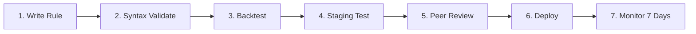
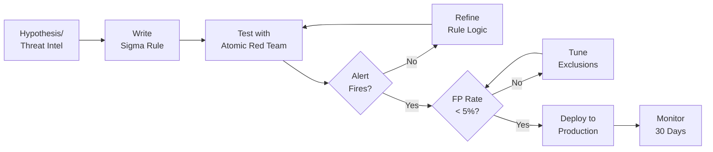

# Detection Rule Testing SOP

> **Document ID:** DRT-001  
> **Version:** 1.0  
> **Last Updated:** 2026-02-15  
> **Owner:** Detection Engineer / SOC Lead

---

## Purpose

Defines the process for testing detection rules (Sigma, YARA, custom SIEM) before deploying to production. Ensures rules detect real threats without excessive false positives.

---

## Testing Pipeline



### Step 1: Write Rule
- Follow [Sigma specification](https://sigmahq.io/docs/basics/rules.html)
- Include: title, description, author, date, MITRE ATT&CK mapping

### Step 2: Syntax Validation

```bash
# Use the project's validator
python tools/sigma_validator.py path/to/rule.yml

# Or use sigmac directly
sigmac -t splunk path/to/rule.yml
```

**Pass criteria:** Zero syntax errors, valid MITRE mapping.

### Step 3: Backtest (Historical Data)

Run the rule against **7–30 days** of historical logs:

```bash
# Splunk
index=windows sourcetype=WinEventLog:Security
| where [translate_sigma_to_spl]
| stats count by ComputerName, User

# Elastic
GET /logs-*/_search
{
  "query": { ... translated sigma ... },
  "aggs": { "per_host": { "terms": { "field": "host.name" } } }
}
```

**Pass criteria:**
- [ ] Detects known-bad events (if available in test data)
- [ ] False positive rate ≤ 20% (review top 20 hits manually)
- [ ] Alert volume ≤ 50/day (otherwise needs tuning)

### Step 4: Staging Test

If you have a staging SIEM:
1. Deploy rule to staging
2. Run Atomic Red Team test for the corresponding technique
3. Verify alert triggers with correct severity and context

If no staging:
1. Deploy rule as **disabled** in production
2. Run manually against live data for 24 hours
3. Review results before enabling

### Step 5: Peer Review

Another detection engineer or T2 analyst reviews:
- [ ] Logic is correct (no gaps, no over-matching)
- [ ] Whitelist/exclusions are appropriate
- [ ] MITRE mapping is accurate
- [ ] Description is clear for T1 analysts
- [ ] Related playbook is referenced

### Step 6: Deploy via Change Management

Follow [Change Management SOP](Change_Management.en.md):
- Standard category for new rules
- Git commit with descriptive message
- Tag with version

### Step 7: Monitor (7-Day Bake Period)

After deployment, monitor for 7 days:

| Metric | Target | Action if Failed |
|:---|:---:|:---|
| False positive rate | ≤ 20% | Tune whitelists |
| Alert volume | ≤ 50/day | Adjust thresholds |
| True positive detection | ≥ 1 (if applicable) | Verify by simulation |
| Performance impact | ≤ 5% query time increase | Optimize query |

---

## Rule Quality Checklist

```
□ Title is descriptive and unique
□ Description explains what the rule detects
□ Author and date are set
□ MITRE ATT&CK technique is mapped
□ Level (severity) is appropriate
□ Logsource is specified correctly
□ Detection logic uses correct field names
□ False positive section documents known FPs
□ References include source/blog/CVE
□ Tests pass: syntax, backtest, staging
□ Peer review approved
□ Change request submitted
```

---

## Automated Testing Framework

### Test-Driven Detection (TDD) Workflow



### CI/CD Pipeline for Detection Rules

```yaml
# .github/workflows/detection-ci.yml
name: Detection Rule CI
on:
  pull_request:
    paths: ['rules/**/*.yml']

jobs:
  validate:
    runs-on: ubuntu-latest
    steps:
      - uses: actions/checkout@v4
      - name: Validate Sigma syntax
        run: sigma check rules/
      - name: Check for duplicates
        run: python scripts/check_duplicates.py
      - name: Run against test logs
        run: python scripts/test_rules.py --log-dir test_logs/
      - name: MITRE coverage report
        run: python scripts/coverage_report.py
```

## Detection Rule Quality Benchmarks

| Metric | Target | Measurement |
|:---|:---|:---|
| **False Positive Rate** | < 5% per rule | FP alerts / total alerts per rule |
| **Detection Latency** | < 5 min from event to alert | Timestamp delta: event → alert |
| **Coverage** | > 60% MITRE ATT&CK techniques | Covered techniques / total |
| **Rule-to-Incident Ratio** | > 10% (1 in 10 alerts = real) | Incidents / total alerts |
| **Time to Deploy** | < 48h from discovery to production | PR created → merged → live |
| **Documentation** | 100% rules have description + references | Automated check |

## Rule Lifecycle Status Tracking

| Status | Definition | Action Required |
|:---|:---|:---|
| 🔵 **Draft** | Rule written, not yet tested | Schedule test in lab |
| 🟡 **Testing** | Deployed to test environment | Monitor for 7 days |
| 🟢 **Active** | Production, generating alerts | Normal monitoring |
| 🟠 **Tuning** | Active but high FP rate | Add exclusions, refine logic |
| ⚪ **Deprecated** | No longer relevant | Remove after 30-day notice |
| 🔴 **Broken** | Syntax error or produces no output | Fix within 24h |

## Related Documents

- [Change Management SOP](Change_Management.en.md)
- [Detection Rules Index](../08_Detection_Engineering/README.en.md)
- [Use Case Prioritization](../01_SOC_Fundamentals/Use_Case_Prioritization.en.md)
