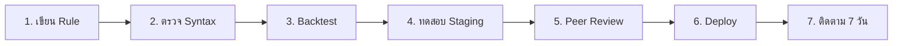

# SOP ทดสอบ Detection Rule

> **รหัสเอกสาร:** DRT-001  
> **เวอร์ชัน:** 1.0  
> **อัปเดตล่าสุด:** 2026-02-15  
> **เจ้าของ:** Detection Engineer / SOC Lead

---

## Pipeline การทดสอบ



### ขั้นตอนสำคัญ:

**2. ตรวจ Syntax:**
```bash
python tools/sigma_validator.py path/to/rule.yml
```

**3. Backtest (7–30 วัน):**
- ตรวจจับ known-bad ได้ไหม?
- FP rate ≤ 20%?
- Alert ≤ 50/วัน?

**4. Staging:**
- Deploy เป็น disabled ก่อน
- รัน Atomic Red Team test
- ตรวจ alert trigger ถูกต้อง

**5. Peer Review:**
- [ ] Logic ถูกต้อง
- [ ] Whitelist เหมาะสม
- [ ] MITRE mapping ถูก
- [ ] คำอธิบายชัดเจนสำหรับ T1

**7. ติดตาม 7 วัน:**

| ตัวชี้วัด | เป้า | ถ้าไม่ผ่าน |
|:---|:---:|:---|
| FP rate | ≤ 20% | ปรับ whitelist |
| Alert volume | ≤ 50/วัน | ปรับ threshold |
| Performance | ≤ 5% เพิ่ม | optimize query |

---

## Checklist คุณภาพ Rule

```
□ Title ชัดเจน
□ มี MITRE ATT&CK mapping
□ Level (severity) เหมาะสม
□ Detection logic ใช้ field name ถูกต้อง
□ มี false positive section
□ ผ่านทดสอบ: syntax, backtest, staging
□ Peer review อนุมัติแล้ว
□ Submit Change Request แล้ว
```

---

## เอกสารที่เกี่ยวข้อง

- [SOP จัดการเปลี่ยนแปลง](Change_Management.th.md)
- [ดัชนี Detection Rules](../07_Detection_Rules/README.md)
