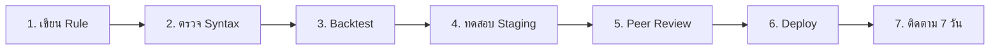
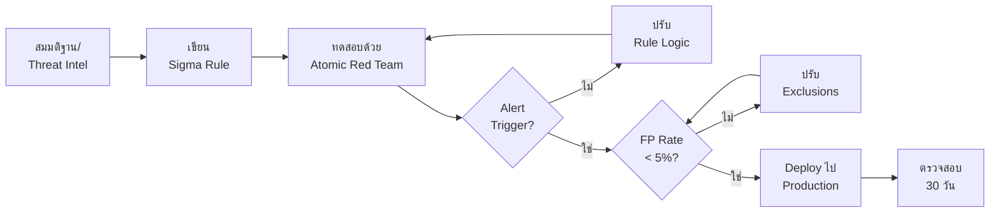

# SOP ทดสอบ Detection Rule

> **รหัสเอกสาร:** DRT-001  
> **เวอร์ชัน:** 1.0  
> **อัปเดตล่าสุด:** 2026-02-15  
> **เจ้าของ:** Detection Engineer / SOC Lead

---

## Pipeline การทดสอบ


```mermaid
graph LR
    A[1. เขียน Rule] --> B[2. ตรวจ Syntax]
    B --> C[3. Backtest]
    C --> D[4. ทดสอบ Staging]
    D --> E[5. Peer Review]
    E --> F[6. Deploy]
    F --> G[7. ติดตาม 7 วัน]
```

### ขั้นตอนสำคัญ:

**2. ตรวจ Syntax:**
```bash
python tools/sigma_validator.py path/to/rule.yml
```

**3. Backtest (7–30 วัน):**
- ตรวจจับ known-bad ได้ไหม?
- FP rate ≤ 20%?
- Alert ≤ 50/วัน?

**4. Staging:**
- Deploy เป็น disabled ก่อน
- รัน Atomic Red Team test
- ตรวจ alert trigger ถูกต้อง

**5. Peer Review:**
- [ ] Logic ถูกต้อง
- [ ] Whitelist เหมาะสม
- [ ] MITRE mapping ถูก
- [ ] คำอธิบายชัดเจนสำหรับ T1

**7. ติดตาม 7 วัน:**

| ตัวชี้วัด | เป้า | ถ้าไม่ผ่าน |
|:---|:---:|:---|
| FP rate | ≤ 20% | ปรับ whitelist |
| Alert volume | ≤ 50/วัน | ปรับ threshold |
| Performance | ≤ 5% เพิ่ม | optimize query |

---

## Checklist คุณภาพ Rule

```
□ Title ชัดเจน
□ มี MITRE ATT&CK mapping
□ Level (severity) เหมาะสม
□ Detection logic ใช้ field name ถูกต้อง
□ มี false positive section
□ ผ่านทดสอบ: syntax, backtest, staging
□ Peer review อนุมัติแล้ว
□ Submit Change Request แล้ว
```

---

## ตารางผลการทดสอบ

| Rule ID | ชื่อกฎ | ผลลัพธ์ | หมายเหตุ |
|:---|:---|:---:|:---|
| [ID] | [ชื่อ] | [✅/⚠️/❌] | [หมายเหตุ] |

## เกณฑ์การทดสอบ

| ระดับ | เกณฑ์ | การดำเนินการ |
|:---:|:---|:---|
| ✅ ผ่าน | แจ้งเตือนถูกต้อง, context ครบ, severity ถูก | Deploy ไปยัง Production |
| ⚠️ บางส่วน | แจ้งเตือนแต่ context ไม่ครบหรือ severity ผิด | ปรับปรุงแล้ว retest |
| ❌ ไม่ผ่าน | ไม่มีแจ้งเตือนหรือ FP สูง | แก้ไข logic แล้ว retest |

## รอบการทดสอบ

| การทดสอบ | ความถี่ | ผู้รับผิดชอบ |
|:---|:---|:---|
| ทดสอบกฎใหม่ | ก่อน deploy ทุกครั้ง | Detection Engineering |
| ทดสอบกฎที่มีอยู่ (regression) | รายเดือน | Detection Engineering |
| Full coverage test | รายไตรมาส | SOC Manager + Detection Eng |

## Rule Testing Methodology

### Test Plan Template

| Phase | Activity | Duration |
|:---|:---|:---|
| 1 | Unit test (lab) | 1-2 วัน |
| 2 | Integration test (staging) | 2-3 วัน |
| 3 | Shadow mode (prod) | 5-7 วัน |
| 4 | Active mode (prod) | Go-live |

### Rule Quality Metrics

| Metric | Target | Measurement |
|:---|:---|:---|
| True Positive Rate | > 90% | Weekly |
| False Positive Rate | < 10% | Weekly |
| Detection Latency | < 5 min | Per alert |
| Coverage (tactics) | > 70% | Monthly |

### Test Evidence Template

| Field | Content |
|:---|:---|
| Rule Name | [ชื่อ rule] |
| Test Date | [วันที่] |
| Tester | [ชื่อ] |
| Test Data | [description] |
| Expected Alert | [Yes/No + details] |
| Actual Result | [Pass/Fail + evidence] |

### Test Status Tracking

| Status | Meaning |
|:---|:---|
| Draft | ยังไม่ทดสอบ |
| Testing | กำลังทดสอบ |

## กรอบทดสอบอัตโนมัติ

### ขั้นตอน Test-Driven Detection (TDD)


```mermaid
graph LR
    Hypothesis["สมมติฐาน/<br/>Threat Intel"] --> Write["เขียน<br/>Sigma Rule"]
    Write --> Test["ทดสอบด้วย<br/>Atomic Red Team"]
    Test --> Validate{"Alert<br/>Trigger?"}
    Validate -->|ไม่| Refine["ปรับ<br/>Rule Logic"]
    Refine --> Test
    Validate -->|ใช่| FPCheck{"FP Rate<br/>< 5%?"}
    FPCheck -->|ไม่| Tune["ปรับ<br/>Exclusions"]
    Tune --> FPCheck
    FPCheck -->|ใช่| Deploy["Deploy ไป<br/>Production"]
    Deploy --> Monitor["ตรวจสอบ<br/>30 วัน"]
```

### CI/CD Pipeline สำหรับ Detection Rules

```yaml
# .github/workflows/detection-ci.yml
name: Detection Rule CI
on:
  pull_request:
    paths: ['rules/**/*.yml']

jobs:
  validate:
    runs-on: ubuntu-latest
    steps:
      - uses: actions/checkout@v4
      - name: ตรวจ Sigma syntax
        run: sigma check rules/
      - name: ตรวจ duplicates
        run: python scripts/check_duplicates.py
      - name: ทดสอบกับ test logs
        run: python scripts/test_rules.py --log-dir test_logs/
      - name: MITRE coverage report
        run: python scripts/coverage_report.py
```

## เกณฑ์คุณภาพ Detection Rule

| Metric | เป้าหมาย | วิธีวัด |
|:---|:---|:---|
| **False Positive Rate** | < 5% ต่อ rule | FP alerts / total alerts ต่อ rule |
| **Detection Latency** | < 5 นาทีจาก event ถึง alert | Timestamp delta: event → alert |
| **Coverage** | > 60% MITRE ATT&CK techniques | Covered techniques / total |
| **Rule-to-Incident Ratio** | > 10% (1 ใน 10 alerts = จริง) | Incidents / total alerts |
| **Time to Deploy** | < 48 ชม. จากค้นพบถึง production | PR created → merged → live |
| **Documentation** | 100% rules มี description + references | Automated check |

## สถานะ Rule Lifecycle

| สถานะ | นิยาม | ต้องดำเนินการ |
|:---|:---|:---|
| 🔵 **Draft** | เขียนแล้ว ยังไม่ทดสอบ | นัดทดสอบใน lab |
| 🟡 **Testing** | Deploy ใน test environment | ตรวจสอบ 7 วัน |
| 🟢 **Active** | Production, สร้าง alerts | ตรวจสอบปกติ |
| 🟠 **Tuning** | Active แต่ FP rate สูง | เพิ่ม exclusions, ปรับ logic |
| ⚪ **Deprecated** | ไม่เกี่ยวข้องแล้ว | ลบหลัง 30 วัน |
| 🔴 **Broken** | Syntax error หรือไม่มี output | แก้ภายใน 24 ชม. |

## Decision Matrix ก่อนปล่อย Rule

| ผลการทดสอบ | Owner | การตัดสินใจ | สิ่งที่ต้องทำต่อ |
|:---|:---|:---|:---|
| **syntax ผ่าน, มี TP ยืนยัน, FP อยู่ในเป้า** | Detection Engineer | อนุมัติขึ้น staging หรือ production แบบควบคุม | เปิด monitoring window 7 วัน |
| **มี TP ยืนยัน แต่ FP สูงกว่าเป้า** | Detection Engineer + SOC Lead | ยังไม่ปล่อย | tune exclusions/threshold แล้ว retest |
| **ยังไม่มี TP ยืนยัน แต่ threat hypothesis ชัด** | SOC Lead | ปล่อยได้เฉพาะ shadow mode หรือ severity ต่ำ | เก็บ production evidence ก่อน promote |
| **พบ parser หรือ field mapping มีปัญหา** | Security Engineer | ไม่อนุมัติ | แก้ normalization ก่อนทดสอบใหม่ |
| **กระทบ performance เกินเกณฑ์** | Security Engineer | ไม่อนุมัติ | optimize query หรือจำกัด scope |

## Evidence Pack ขั้นต่ำสำหรับอนุมัติ

| หลักฐาน | เหตุผลที่ต้องมี |
|:---|:---|
| **logic ของ rule และแหล่งอ้างอิง** | อธิบายว่ากำลังจับ behavior อะไรและสำคัญอย่างไร |
| **ผล backtest ตัวอย่าง** | พิสูจน์ว่า rule ทำงานถูกกับ historical data |
| **บันทึกการ review false positive** | แสดงว่า benign patterns ถูกพิจารณาก่อนปล่อย |
| **การ map กับ MITRE/use case** | ยืนยันว่า rule อยู่ใน coverage plan ที่ชัด |
| **playbook หรือ analyst guidance ที่เกี่ยวข้อง** | ให้ทีมตอบสนองรู้ว่าต้องทำอะไรต่อเมื่อ alert ขึ้น |
| **rollback plan** | ป้องกัน noise หรือ detection พังใน production |

## เกณฑ์ Rollback ระหว่าง Bake Period

| เงื่อนไข | Owner | สิ่งที่ต้องทำ |
|:---|:---|:---|
| **FP rate สูงเกินที่คาดอย่างมีนัยสำคัญ** | SOC Analyst | downgrade, disable หรือ revert rule พร้อมเปิด tuning ticket |
| **alert flood กระทบ queue SLA** | SOC Manager | pause rule และเร่งกู้ service level |
| **missed critical true positive ระหว่าง validation** | Detection Engineer | revert การเปลี่ยนแปลงและเปิด design review ใหม่ |
| **query หรือ pipeline performance แย่ลง** | Security Engineer | disable rule จนกว่าจะ optimize เสร็จ |

## เอกสารที่เกี่ยวข้อง

- [SOP จัดการเปลี่ยนแปลง](Change_Management.th.md)
- [ดัชนี Detection Rules](../08_Detection_Engineering/README.th.md) — Sigma rules ทั้ง 54 กฎพร้อม playbook mapping
- [Alert Tuning SOP](Alert_Tuning.th.md) — วิธีการปรับจูน rule ที่มีปัญหา
- [PB-01 Phishing](../05_Incident_Response/Playbooks/Phishing.th.md) — ตัวอย่าง: ทดสอบ email detection rules
- [PB-02 Ransomware](../05_Incident_Response/Playbooks/Ransomware.th.md) — ตัวอย่าง: ทดสอบ file encryption rules
- [PB-24 Zero-Day Exploit](../05_Incident_Response/Playbooks/Zero_Day_Exploit.th.md) — ตัวอย่าง: ทดสอบ exploit payload rules

## References

- [Sigma Rule Basics](https://sigmahq.io/docs/basics/rules.html)
- [MITRE ATT&CK](https://attack.mitre.org/)
