# Escalation Matrix

This document defines when, how, and to whom incidents should be escalated based on severity, impact, and time elapsed.

---

## Escalation Levels

| Level | Trigger | Escalate To | Response Time |
|:---|:---|:---|:---|
| **L1 → L2** | Alert confirmed as True Positive | Tier 2 Analyst / SOC Lead | Immediately |
| **L2 → L3** | Advanced threat, forensics needed | Tier 3 / IR Lead | < 30 min |
| **L3 → Management** | Business impact, data breach suspected | SOC Manager / CISO | < 1 hour |
| **Management → Executive** | Major breach, regulatory notification required | CTO / CEO / Legal | < 2 hours |
| **External** | Law enforcement, regulatory body notification | Legal Counsel → Authority | Per regulation |

## Severity-Based Escalation

| Severity | Auto-Escalate After | Escalation Path | Notification |
|:---|:---|:---|:---|
| **Critical** | 15 min (no pickup) | Analyst → SOC Lead → SOC Manager → CISO | Phone + Email |
| **High** | 30 min (no pickup) | Analyst → SOC Lead → SOC Manager | Email + Chat |
| **Medium** | 4 hours (no progress) | Analyst → SOC Lead | Chat |
| **Low** | 24 hours (no progress) | Analyst → SOC Lead | Ticket update |

## Escalation Contact List

| Role | Name | Phone | Email | Availability |
|:---|:---|:---|:---|:---|
| SOC Lead (Morning) | [TBD] | [TBD] | [TBD] | 08:00–16:00 |
| SOC Lead (Afternoon) | [TBD] | [TBD] | [TBD] | 16:00–00:00 |
| SOC Lead (Night) | [TBD] | [TBD] | [TBD] | 00:00–08:00 |
| SOC Manager | [TBD] | [TBD] | [TBD] | Business hours + on-call |
| CISO | [TBD] | [TBD] | [TBD] | On-call |
| Legal Counsel | [TBD] | [TBD] | [TBD] | Business hours |

## Escalation Procedure

```mermaid
graph TD
    Alert["🚨 Alert/Incident"] --> Severity{Severity?}
    Severity -->|Critical| Immediate["Immediate: Phone + Email"]
    Severity -->|High| Urgent["30 min: Email + Chat"]
    Severity -->|Medium| Normal["4 hours: Chat"]
    Severity -->|Low| Standard["24 hours: Ticket"]
    Immediate --> CISO["CISO + SOC Manager"]
    Urgent --> Manager["SOC Manager"]
    Normal --> Lead["SOC Lead"]
    Standard --> Lead
```

## Escalation Documentation

When escalating, include:
1. **Incident ID** and current severity
2. **Summary** of findings so far
3. **Impact** — affected systems, users, data
4. **Actions taken** — containment, investigation steps
5. **What is needed** — approval, resources, expertise
6. **Urgency** — why escalation is needed now

## Related Documents

- [IR Framework](../05_Incident_Response/Framework.en.md)
- [Shift Handoff Standard](Shift_Handoff.en.md)
- [SOC Metrics & KPIs](SOC_Metrics.en.md)

## References

- [NIST SP 800-61r2](https://csrc.nist.gov/publications/detail/sp/800-61/rev-2/final)
- [SANS Escalation Best Practices](https://www.sans.org/white-papers/)
