# ตาราง Escalation (Escalation Matrix)

เอกสารนี้กำหนดว่าควร escalate เมื่อไหร่ อย่างไร และถึงใคร ตามความรุนแรง ผลกระทบ และเวลาที่ผ่านไป

---

## ระดับ Escalation

| ระดับ | เงื่อนไข | ส่งต่อถึง | เวลาตอบสนอง |
|:---|:---|:---|:---|
| **L1 → L2** | Alert ยืนยันเป็น True Positive | Tier 2 Analyst / SOC Lead | ทันที |
| **L2 → L3** | ภัยคุกคามขั้นสูง, ต้องการ forensics | Tier 3 / IR Lead | < 30 นาที |
| **L3 → ผู้บริหาร** | กระทบธุรกิจ, สงสัย data breach | SOC Manager / CISO | < 1 ชม. |
| **ผู้บริหาร → C-Suite** | breach ใหญ่, ต้องแจ้งหน่วยงานกำกับ | CTO / CEO / Legal | < 2 ชม. |
| **ภายนอก** | แจ้งหน่วยงานบังคับใช้กฎหมาย | ที่ปรึกษากฎหมาย → หน่วยงาน | ตามข้อบังคับ |

## Escalation ตามความรุนแรง

| ความรุนแรง | Auto-Escalate หลัง | เส้นทาง | การแจ้ง |
|:---|:---|:---|:---|
| **Critical** | 15 นาที (ไม่มีคนรับ) | Analyst → SOC Lead → SOC Manager → CISO | โทร + อีเมล |
| **High** | 30 นาที (ไม่มีคนรับ) | Analyst → SOC Lead → SOC Manager | อีเมล + แชท |
| **Medium** | 4 ชม. (ไม่มีความคืบหน้า) | Analyst → SOC Lead | แชท |
| **Low** | 24 ชม. (ไม่มีความคืบหน้า) | Analyst → SOC Lead | อัปเดต ticket |

## รายชื่อผู้ติดต่อ Escalation

| บทบาท | ชื่อ | โทรศัพท์ | อีเมล | พร้อมเมื่อ |
|:---|:---|:---|:---|:---|
| SOC Lead (เช้า) | [TBD] | [TBD] | [TBD] | 08:00–16:00 |
| SOC Lead (บ่าย) | [TBD] | [TBD] | [TBD] | 16:00–00:00 |
| SOC Lead (ดึก) | [TBD] | [TBD] | [TBD] | 00:00–08:00 |
| SOC Manager | [TBD] | [TBD] | [TBD] | เวลาทำการ + เวร |
| CISO | [TBD] | [TBD] | [TBD] | เวร |
| ที่ปรึกษากฎหมาย | [TBD] | [TBD] | [TBD] | เวลาทำการ |

## ขั้นตอนการ Escalation

```mermaid
graph TD
    Alert["🚨 Alert/Incident"] --> Severity{ความรุนแรง?}
    Severity -->|Critical| Immediate["ทันที: โทร + อีเมล"]
    Severity -->|High| Urgent["30 นาที: อีเมล + แชท"]
    Severity -->|Medium| Normal["4 ชม.: แชท"]
    Severity -->|Low| Standard["24 ชม.: Ticket"]
    Immediate --> CISO["CISO + SOC Manager"]
    Urgent --> Manager["SOC Manager"]
    Normal --> Lead["SOC Lead"]
    Standard --> Lead
```

## เอกสารที่เกี่ยวข้อง

- [กรอบ IR](../05_Incident_Response/Framework.th.md)
- [มาตรฐานส่งมอบกะ](Shift_Handoff.th.md)
- [ตัวชี้วัด SOC & KPIs](SOC_Metrics.th.md)

## อ้างอิง

- [NIST SP 800-61r2](https://csrc.nist.gov/publications/detail/sp/800-61/rev-2/final)
