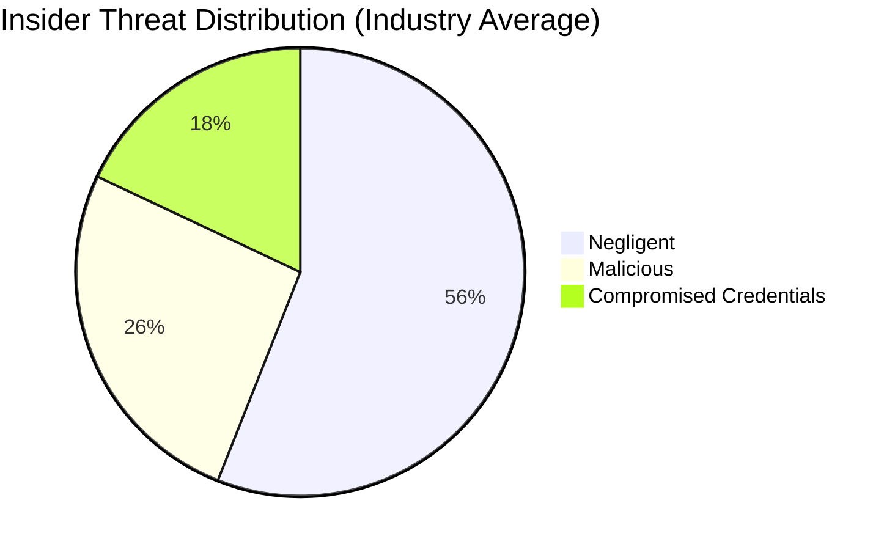
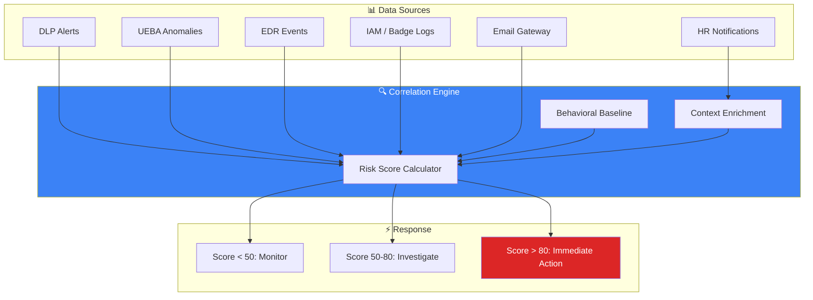
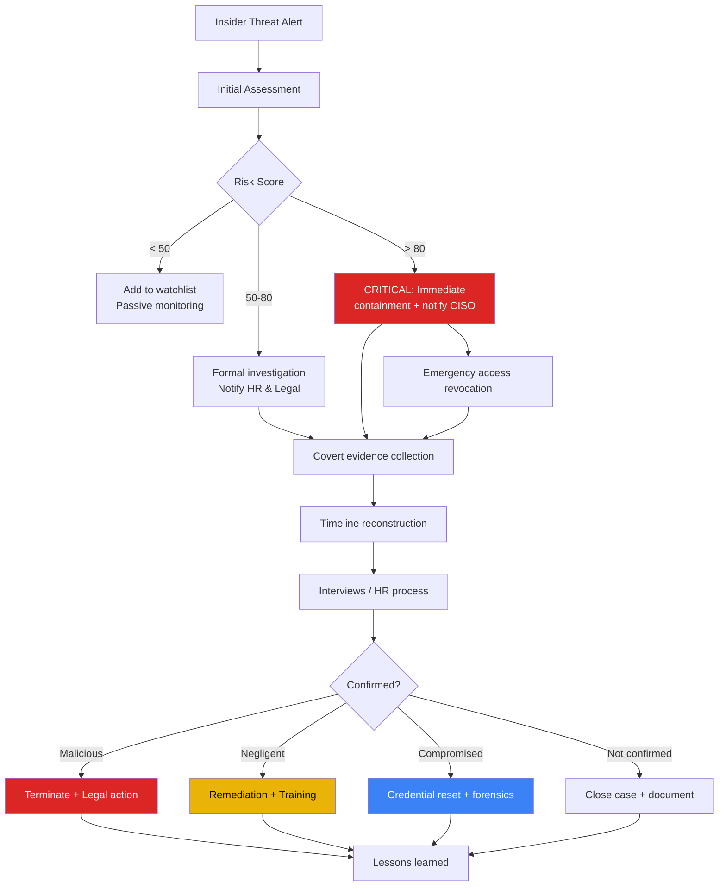
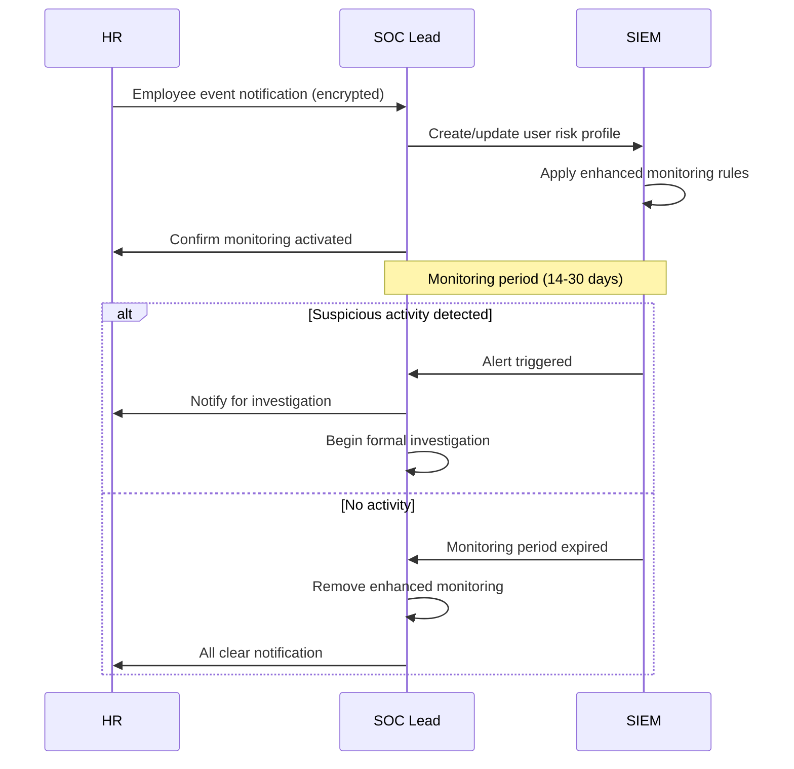

# Insider Threat Program

**Document ID**: OPS-SOP-019
**Version**: 1.0
**Classification**: Confidential
**Last Updated**: 2026-02-15

> A structured program for **detecting, investigating, and mitigating insider threats** — malicious, negligent, or compromised insiders. Covers behavioral indicators, detection use cases, investigation procedures, and prevention strategies.

---

## Insider Threat Categories

| Category | Description | Intent | Example |
|:---|:---|:---:|:---|
| **Malicious** | Deliberate harmful actions for personal gain or revenge | Intentional | Data theft, sabotage before resignation |
| **Negligent** | Unintentional harm through carelessness or policy violation | Unintentional | Sending PII to wrong recipient, weak passwords |
| **Compromised** | External attacker using legitimate insider credentials | N/A (external) | Phished credentials, stolen laptop |
| **Colluding** | Insider working with external threat actor | Intentional | Selling access, planting backdoors |

---

## Behavioral Indicators

### High-Risk Indicators (Immediate Investigation)

| # | Indicator | Data Source | Detection Method |
|:---:|:---|:---|:---|
| 1 | **Accessing data outside role** | DLP, CASB, file audit | UEBA anomaly |
| 2 | **Bulk download/copy to USB** | EDR, DLP, print logs | Threshold rule |
| 3 | **After-hours access to sensitive systems** | SIEM, badge logs | Time-based rule |
| 4 | **Email to personal accounts with attachments** | Email gateway, DLP | DLP policy |
| 5 | **Disabling security controls** | EDR, SIEM | Agent health monitoring |
| 6 | **Unauthorized cloud storage uploads** | CASB, proxy | URL category + volume |
| 7 | **Accessing terminated employee's data** | File audit, IAM | Access control monitoring |

### Medium-Risk Indicators (Monitor & Correlate)

| # | Indicator | Data Source | Detection Method |
|:---:|:---|:---|:---|
| 8 | **Frequent failed access attempts** | IAM, VPN, app logs | Threshold rule |
| 9 | **Printing large volumes** | Print server logs | Threshold rule |
| 10 | **VPN from unusual location** | VPN logs, GeoIP | GeoIP anomaly |
| 11 | **Privilege escalation requests** | IAM, ticketing | Trend analysis |
| 12 | **Working outside normal patterns** | Badge, VPN, SIEM | UEBA baseline |
| 13 | **Excessive use of tools** | EDR, SIEM | UEBA anomaly |

### Contextual Risk Multipliers

| Context | Risk Multiplier | Source |
|:---|:---:|:---|
| **Resignation submitted** | ×3 | HR notification |
| **PIP (Performance Improvement Plan)** | ×2 | HR notification |
| **Access to crown jewels** | ×2 | Data classification |
| **Privileged access (admin/root)** | ×2 | IAM roles |
| **Contractor/temporary staff** | ×1.5 | HR/vendor records |
| **Recent negative performance review** | ×1.5 | HR notification |
| **Accessing competitor's job sites** | ×1.5 | Proxy logs |

---

## Detection Architecture

### SIEM Detection Rules

| Rule | Logic | Severity | MITRE |
|:---|:---|:---:|:---|
| **Bulk data download** | > 500 MB downloaded in 1 hour by single user | P2 | T1530 |
| **USB mass storage** | USB device with > 100 MB write | P2 | T1052.001 |
| **Email to personal domain** | Attachment > 5 MB to non-corporate domain | P3 | T1567 |
| **Cloud upload spike** | > 200% increase in cloud upload vs 30-day baseline | P2 | T1567.002 |
| **Off-hours sensitive access** | Access to classified data 22:00–06:00 | P3 | T1530 |
| **Resignation + data access** | HR flag + any data access within 14 days | P2 | T1530 |
| **Multiple failed admin access** | > 5 failed admin login in 10 min | P2 | T1110 |
| **Security tool tampering** | EDR agent stopped/uninstalled | P1 | T1562.001 |
| **Printing sensitive docs** | Print job from classified document | P3 | T1052 |

---

## Investigation Procedures

### Investigation Workflow

### Investigation Checklist

- [ ] **Initial assessment** — Review alert details, check user context
- [ ] **Identity verification** — Confirm user behind the activity (not shared account)
- [ ] **HR notification** — Inform HR (mandatory for formal investigation)
- [ ] **Legal consultation** — Verify investigation is legally compliant
- [ ] **Evidence preservation** — Begin covert collection (do NOT alert subject)
- [ ] **Access review** — Document all systems/data subject can access
- [ ] **Timeline construction** — Build activity timeline (SIEM, email, badge, VPN)
- [ ] **Data exposure assessment** — Determine what data was accessed/exfiltrated
- [ ] **Interviews** — Coordinate with HR for subject interview
- [ ] **Documentation** — Complete investigation report
- [ ] **Remediation** — Implement corrective actions
- [ ] **Lessons learned** — Update detection rules if gaps found

### Evidence Sources (Priority Order)

| # | Source | What to Collect | Covert? |
|:---:|:---|:---|:---:|
| 1 | **SIEM logs** | All activity for subject (30-90 days) | ✅ Yes |
| 2 | **DLP alerts** | All DLP events for subject | ✅ Yes |
| 3 | **Email logs** | Sent emails with attachments | ✅ Yes |
| 4 | **Badge/physical access** | Entry/exit times, room access | ✅ Yes |
| 5 | **VPN logs** | Connection times, source IPs | ✅ Yes |
| 6 | **Proxy logs** | Web activity, cloud uploads | ✅ Yes |
| 7 | **EDR telemetry** | Process execution, file access | ✅ Yes |
| 8 | **Print server logs** | Print jobs, document names | ✅ Yes |
| 9 | **Cloud audit logs** | Cloud resource access | ✅ Yes |
| 10 | **Device forensics** | Disk image (only with legal approval) | ⚠️ Consult Legal |

---

## Prevention & Deterrence

### Pre-Employment

| Control | Description |
|:---|:---|
| Background checks | Verify identity, criminal record, employment history |
| Reference checks | Validate previous employers |
| NDA/Employment agreement | Include data handling obligations |

### During Employment

| Control | Description |
|:---|:---|
| **Least privilege access** | Only access needed for role |
| **Regular access reviews** | Quarterly review of permissions |
| **DLP policies** | Block/alert on sensitive data movement |
| **Security awareness training** | Annual training on data protection |
| **Clear desk / clean screen** | Physical security policies |
| **Mandatory vacation** | 2+ consecutive weeks (detect fraud) |
| **Separation of duties** | Critical actions require 2+ approvers |

### Off-boarding (Critical)

| Step | Timing | Owner |
|:---|:---:|:---|
| Disable all accounts | Within 1 hour of departure | IT |
| Revoke physical access | Same day | Facilities |
| Collect devices | Same day | IT |
| Revoke VPN/remote access | Within 1 hour | IT |
| Transfer data ownership | Within 1 week | Manager |
| Review last 30 days activity | Within 1 week | SOC |
| Archive mailbox | Within 1 day | IT |

---

## HR-SOC Integration

### Mandatory HR Notifications to SOC

| HR Event | Risk Level | SOC Action |
|:---|:---:|:---|
| **Resignation/termination notice** | 🔴 High | Enable enhanced monitoring for 14 days |
| **Performance improvement plan (PIP)** | 🟠 Medium | Add to watchlist |
| **Role change with access change** | 🟡 Low | Verify access adjustment |
| **Contractor onboarding** | 🟡 Low | Verify access scope |
| **Disciplinary action** | 🟠 Medium | Add to watchlist for 30 days |
| **Security policy violation** | 🟠 Medium | Investigate, add to watchlist |

### Notification Process

---

## Metrics

| Metric | Target | Measurement |
|:---|:---:|:---|
| Mean time to detect insider threat | < 48 hours | Alert timestamp vs first activity |
| Investigation completion time | < 10 business days | Ticket timestamps |
| False positive rate | < 40% | Confirmed vs total alerts |
| Off-boarding compliance (accounts disabled < 1hr) | 100% | IT audit |
| HR notification compliance | 100% | HR audit |
| DLP policy coverage | > 90% of sensitive data | DLP coverage report |
| Access review completion | 100% quarterly | IAM reports |

---

## Legal & Privacy Considerations

> ⚠️ **IMPORTANT**: Always consult Legal before conducting insider threat investigations.

| Topic | Guidance |
|:---|:---|
| **PDPA compliance** | Employee monitoring must be disclosed in privacy notice |
| **Proportionality** | Monitoring scope must be proportionate to risk |
| **Covert monitoring** | Requires legal authorization, document justification |
| **Device monitoring** | Company-owned devices only (unless BYOD agreement) |
| **Email review** | Only corporate email, with legal approval |
| **Interview procedures** | HR must be present, follow labor law |
| **Evidence admissibility** | Follow chain of custody for legal proceedings |

---

## Related Documents

-   [Forensic Investigation](../05_Incident_Response/Forensic_Investigation.en.md) — Evidence handling
-   [Incident Classification](../05_Incident_Response/Incident_Classification.en.md) — Severity classification
-   [Escalation Matrix](../05_Incident_Response/Escalation_Matrix.en.md) — Escalation procedures
-   [Alert Tuning SOP](Alert_Tuning.en.md) — UEBA tuning
-   [Third-Party Risk](Third_Party_Risk.en.md) — Contractor/vendor risk
-   [SOC Automation Catalog](SOC_Automation_Catalog.en.md) — Automated response
