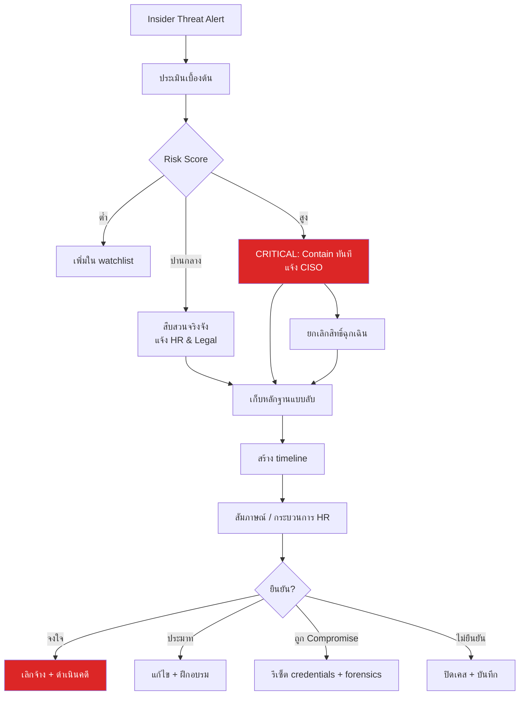
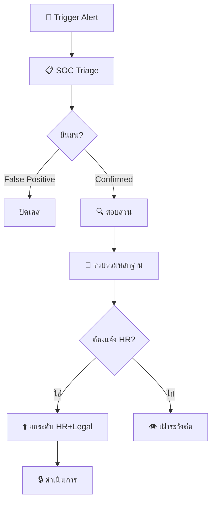

# Insider Threat Program / โปรแกรม Insider Threat

**รหัสเอกสาร**: OPS-SOP-019
**เวอร์ชัน**: 1.0
**การจัดชั้นความลับ**: ลับ
**อัปเดตล่าสุด**: 2026-02-15

> โปรแกรมสำหรับ **ตรวจจับ, สืบสวน, และบรรเทา insider threats** — ทั้งแบบจงใจ, ประมาท, หรือถูกใช้เป็นเครื่องมือ ครอบคลุม behavioral indicators, detection use cases, ขั้นตอนสืบสวน, และกลยุทธ์ป้องกัน

---

## ประเภท Insider Threat

| ประเภท | คำอธิบาย | เจตนา | ตัวอย่าง |
|:---|:---|:---:|:---|
| **Malicious** | กระทำเพื่อผลประโยชน์ส่วนตัว/แก้แค้น | จงใจ | ขโมยข้อมูลก่อนลาออก |
| **Negligent** | ทำผิดพลาดจากประมาท | ไม่จงใจ | ส่ง PII ไปผิดคน, รหัสผ่านอ่อน |
| **Compromised** | ถูกโจมตีจากภายนอกใช้ credentials ของ insider | ไม่มี (ภายนอก) | ถูก phish, แล็ปท็อปถูกขโมย |
| **Colluding** | ร่วมมือกับ threat actor ภายนอก | จงใจ | ขายสิทธิ์เข้าถึง |

---

## Behavioral Indicators

### ตัวบ่งชี้ความเสี่ยงสูง (สืบสวนทันที)

| # | ตัวบ่งชี้ | แหล่งข้อมูล | วิธีตรวจจับ |
|:---:|:---|:---|:---|
| 1 | **เข้าถึงข้อมูลนอกบทบาท** | DLP, CASB, file audit | UEBA anomaly |
| 2 | **ดาวน์โหลด/copy ข้อมูลจำนวนมากไป USB** | EDR, DLP, print logs | Threshold rule |
| 3 | **เข้าถึงระบบ sensitive นอกเวลา** | SIEM, badge logs | Time-based rule |
| 4 | **ส่ง email ไป personal account พร้อมไฟล์แนบ** | Email gateway, DLP | DLP policy |
| 5 | **ปิด security controls** | EDR, SIEM | Agent health monitoring |
| 6 | **Upload cloud storage โดยไม่ได้รับอนุญาต** | CASB, proxy | URL category + volume |

### ตัวคูณความเสี่ยงตามบริบท

| บริบท | ตัวคูณ | แหล่ง |
|:---|:---:|:---|
| **ยื่นลาออก** | ×3 | แจ้งจาก HR |
| **อยู่ใน PIP** | ×2 | แจ้งจาก HR |
| **เข้าถึง crown jewels** | ×2 | Data classification |
| **สิทธิ์ privileged (admin/root)** | ×2 | IAM roles |
| **ผู้รับเหมา/ชั่วคราว** | ×1.5 | HR/vendor records |
| **ผลประเมินเชิงลบล่าสุด** | ×1.5 | แจ้งจาก HR |

---

## Detection Rules ใน SIEM

| Rule | Logic | Severity | MITRE |
|:---|:---|:---:|:---|
| **Bulk data download** | > 500 MB ใน 1 ชม. | P2 | T1530 |
| **USB mass storage** | USB เขียน > 100 MB | P2 | T1052.001 |
| **Email ไป personal domain** | ไฟล์แนบ > 5 MB ไป non-corporate | P3 | T1567 |
| **Cloud upload spike** | เพิ่ม > 200% vs 30-day baseline | P2 | T1567.002 |
| **เข้าถึง sensitive นอกเวลา** | 22:00–06:00 | P3 | T1530 |
| **ลาออก + data access** | HR flag + data access ภายใน 14 วัน | P2 | T1530 |
| **Security tool tampering** | EDR agent ถูกหยุด/ลบ | P1 | T1562.001 |

---

## ขั้นตอนสืบสวน

### Investigation Workflow



### Checklist สืบสวน

- [ ] ประเมินเบื้องต้น — ตรวจสอบรายละเอียด alert, บริบทผู้ใช้
- [ ] ยืนยันตัวตน — ไม่ใช่ shared account
- [ ] แจ้ง HR — บังคับสำหรับการสืบสวนจริงจัง
- [ ] ปรึกษา Legal — ตรวจสอบว่าสืบสวนถูกกฎหมาย
- [ ] เก็บหลักฐาน — แบบลับ (**ห้ามแจ้งเป้าหมาย**)
- [ ] ตรวจสิทธิ์ — เอกสารทุกระบบ/ข้อมูลที่เข้าถึงได้
- [ ] สร้าง timeline — SIEM, email, badge, VPN
- [ ] ประเมินผลกระทบ — ข้อมูลอะไรถูกเข้าถึง/ถูกส่งออก
- [ ] สัมภาษณ์ — HR ต้องอยู่ด้วย
- [ ] Remediation — ดำเนินการแก้ไข
- [ ] Lessons learned — อัปเดต detection rules

---

## การป้องกัน

### Off-boarding (สำคัญมาก)

| ขั้นตอน | เวลา | ผู้รับผิดชอบ |
|:---|:---:|:---|
| ปิดทุก account | ภายใน 1 ชม. | IT |
| ยกเลิก physical access | วันเดียวกัน | Facilities |
| เก็บอุปกรณ์ | วันเดียวกัน | IT |
| ยกเลิก VPN/remote access | ภายใน 1 ชม. | IT |
| โอน data ownership | ภายใน 1 สัปดาห์ | ผู้จัดการ |
| ตรวจ activity 30 วัน | ภายใน 1 สัปดาห์ | SOC |
| Archive mailbox | ภายใน 1 วัน | IT |

---

## HR-SOC Integration

### การแจ้งบังคับจาก HR ไป SOC

| เหตุการณ์ HR | ระดับความเสี่ยง | SOC Action |
|:---|:---:|:---|
| **แจ้งลาออก/เลิกจ้าง** | 🔴 สูง | Enhanced monitoring 14 วัน |
| **PIP** | 🟠 ปานกลาง | เพิ่มใน watchlist |
| **เปลี่ยนบทบาท** | 🟡 ต่ำ | ตรวจสอบสิทธิ์ |
| **Onboard ผู้รับเหมา** | 🟡 ต่ำ | ตรวจสอบขอบเขตสิทธิ์ |
| **ดำเนินการทางวินัย** | 🟠 ปานกลาง | Watchlist 30 วัน |

---

## ข้อพิจารณาทางกฎหมาย

> ⚠️ **สำคัญ**: ปรึกษา Legal ก่อนสืบสวน insider threat เสมอ

| หัวข้อ | แนวทาง |
|:---|:---|
| **PDPA** | การ monitor พนักงานต้องแจ้งใน privacy notice |
| **สมส่วน** | ขอบเขต monitoring ต้องเหมาะสมกับความเสี่ยง |
| **Covert monitoring** | ต้องได้รับอนุญาต, บันทึกเหตุผล |
| **Monitor อุปกรณ์** | เฉพาะอุปกรณ์บริษัท (ยกเว้นมี BYOD agreement) |
| **ตรวจ email** | email บริษัทเท่านั้น, ต้องได้รับอนุมัติ Legal |
| **สัมภาษณ์** | HR ต้องร่วม, ปฏิบัติตามกฎหมายแรงงาน |

---

## ตัวชี้วัด

| ตัวชี้วัด | เป้าหมาย |
|:---|:---:|
| เวลาตรวจจับ insider threat | < 48 ชม. |
| เวลาสืบสวนเสร็จ | < 10 วันทำการ |
| False positive rate | < 40% |
| Off-boarding compliance (ปิด account < 1 ชม.) | 100% |
| HR notification compliance | 100% |
| DLP policy coverage | > 90% |

---

## Risk Scoring Model

| ปัจจัย | น้ำหนัก | ตัวอย่าง Indicator |
|:---|:---:|:---|
| **Access Level** | 25% | Admin access, database access, code repo |
| **Behavioral Anomaly** | 25% | ทำงานนอกเวลาผิดปกติ, download มากเกิน |
| **HR Factors** | 20% | PIP, resignation notice, disciplinary action |
| **Data Access** | 20% | เข้าถึงข้อมูลลับ, bulk export |
| **Technical Indicators** | 10% | USB usage, personal cloud upload |

### คำนวณคะแนนความเสี่ยง

```
Risk Score = Σ (Factor Weight × Factor Score)
โดย Factor Score = 0 (ไม่มี) / 1 (ต่ำ) / 2 (กลาง) / 3 (สูง)

ระดับ:
  0–3  = ปกติ (เฝ้าระวังมาตรฐาน)
  4–6  = เตือน (เพิ่มการ monitor)
  7–9  = สูง (สอบสวน)
  10+  = วิกฤต (ยกระดับทันที)
```

## Investigation Workflow



## เทมเพลต Investigation Report

| ส่วน | เนื้อหา |
|:---|:---|
| **Case ID** | INSIDER-YYYY-NNN |
| **Subject** | [ชื่อ/รหัสพนักงาน — ใช้ alias ก่อนยืนยัน] |
| **Trigger** | [สิ่งที่ทำให้เริ่มสอบสวน] |
| **Timeline** | [ลำดับเหตุการณ์] |
| **หลักฐาน** | [Log, screenshot, DLP alerts] |
| **ผลกระทบ** | [ข้อมูลที่ถูก access/exfiltrate] |
| **สรุป/ข้อเสนอแนะ** | [ผลสอบสวนและ action items] |

## ข้อพิจารณาทางกฎหมาย (PDPA)

| หัวข้อ | แนวปฏิบัติ |
|:---|:---|
| **สิทธิ์ในการ monitor** | ต้องมี policy ที่พนักงานรับทราบ |
| **ข้อมูลส่วนบุคคล** | Monitor เฉพาะกิจกรรมที่เกี่ยวกับงาน |
| **การเก็บหลักฐาน** | Chain of custody, encryption, access log |
| **การแจ้ง DPO** | แจ้ง DPO เมื่อพบการละเมิดข้อมูล |
| **Retention** | ลบหลักฐานที่ไม่เกี่ยวข้องหลังปิดเคส |

## Detection Use Cases

| Use Case | Log Source | Detection Logic | ระดับ |
|:---|:---|:---|:---:|
| Mass file download | DLP/CASB | > 100 files in 1 hour | 🔴 |
| After-hours access to sensitive data | SIEM | Access outside 08:00-18:00 + PII data | 🟡 |
| USB mass storage on critical host | EDR | USB device class = mass storage | 🟡 |
| Email to personal account + attachment | Email gateway | To: gmail/hotmail + attachment > 1MB | 🟡 |
| Privilege escalation attempt | AD logs | Non-admin adding self to admin group | 🔴 |
| Unusual VPN location | VPN logs | Login from country not in baseline | 🟡 |
| Badge access anomaly | Physical security | Tailgating / off-hours entry | 🟢 |

## Program Maturity Levels

| ระดับ | ลักษณะ | ตัวอย่าง |
|:---|:---|:---|
| **1 — Ad-hoc** | ไม่มี program, react เมื่อเกิดเหตุ | ตรวจสอบเมื่อ HR แจ้ง |
| **2 — Basic** | Policy + awareness training | มี acceptable use policy |
| **3 — Defined** | Technical controls + process | DLP deployed, UEBA basics |
| **4 — Managed** | Proactive monitoring + analytics | UEBA + risk scoring |
| **5 — Optimized** | Predictive, integrated with HR | ML-based anomaly + HR data feed |

## เอกสารที่เกี่ยวข้อง

-   [Forensic Investigation](../05_Incident_Response/Forensic_Investigation.en.md) — การเก็บหลักฐาน
-   [Incident Classification](../05_Incident_Response/Incident_Classification.en.md) — จำแนก severity
-   [Escalation Matrix](../05_Incident_Response/Escalation_Matrix.en.md) — ขั้นตอน escalation
-   [Alert Tuning SOP](Alert_Tuning.en.md) — การ tune UEBA
-   [Third-Party Risk](Third_Party_Risk.en.md) — ความเสี่ยง contractor/vendor
