# Log Source Matrix

**Document ID**: OPS-SOP-010
**Version**: 1.0
**Classification**: Internal
**Last Updated**: 2026-02-15

> The Log Source Matrix provides a **single-page view** of all data sources ingested (or required) by the SOC. Use it as a gap analysis tool to identify blind spots in your detection coverage.

---

## How to Use This Document

1. **Onboarding** → Verify all required log sources are connected
2. **Gap Analysis** → Identify missing sources (❌) and plan remediation
3. **Capacity Planning** → Estimate EPS and storage requirements
4. **Compliance** → Map log sources to regulatory requirements (PDPA, PCI-DSS, ISO 27001)
5. **Detection Tuning** → Correlate with MITRE ATT&CK coverage gaps

---

## Status Legend

| Symbol | Status | Action Required |
|:---:|:---|:---|
| ✅ | Collected & parsed | None — healthy |
| ⚠️ | Partial (collected but not parsed/normalized) | Needs parser development |
| ❌ | Not collected | Plan for integration |
| 🔜 | Planned / in progress | On roadmap |
| N/A | Not applicable to environment | Skip |

---

## 1. Endpoint & Host Logs

| # | Log Source | Type | Key Events | MITRE Coverage | EPS (est.) | Status |
|:---:|:---|:---|:---|:---|:---:|:---:|
| 1.1 | **Windows Security Event Log** | Host | 4624/4625 (Logon), 4688 (Process), 4698 (Scheduled Task), 7045 (Service) | T1078, T1053, T1543 | 500–5K | ✅ |
| 1.2 | **Windows Sysmon** | Host | Process create (1), Network (3), File create (11), Registry (13), DNS (22) | T1055, T1059, T1071 | 1K–10K | ✅ |
| 1.3 | **Windows PowerShell** | Host | 4103 (Module), 4104 (Script Block), 4105/4106 (Start/Stop) | T1059.001, T1027 | 100–1K | ✅ |
| 1.4 | **Linux Auditd / syslog** | Host | execve, file access, auth, sudo | T1548, T1059.004, T1070 | 200–2K | ✅ |
| 1.5 | **macOS Unified Log** | Host | Process exec, auth, network, file | T1059, T1078, T1547 | 100–500 | ⚠️ |
| 1.6 | **EDR Telemetry** (CrowdStrike / Defender / SentinelOne) | Endpoint | Process tree, file write, network, injection | Wide coverage (50+ TTPs) | 1K–20K | ✅ |
| 1.7 | **Antivirus / EPP** | Endpoint | Detection, quarantine, scan results | T1204, T1566 | 50–500 | ✅ |

---

## 2. Network Logs

| # | Log Source | Type | Key Events | MITRE Coverage | EPS (est.) | Status |
|:---:|:---|:---|:---|:---|:---:|:---:|
| 2.1 | **Firewall** (Palo Alto / Fortinet / pfSense) | Network | Allow/Deny, NAT, VPN tunnel, threat log | T1071, T1090, T1572 | 1K–50K | ✅ |
| 2.2 | **IDS/IPS** (Suricata / Snort) | Network | Signature alerts, protocol anomaly | T1190, T1071, T1040 | 100–5K | ✅ |
| 2.3 | **DNS Logs** (AD DNS / Pi-hole / Infoblox) | Network | Query/Response, NXDomain, TXT record | T1071.004, T1048.003, T1568 | 500–10K | ✅ |
| 2.4 | **Web Proxy / SWG** (Squid / Zscaler / Netskope) | Network | URL, user agent, response code, bytes | T1071.001, T1102, T1567 | 500–5K | ✅ |
| 2.5 | **NetFlow / IPFIX** | Network | IP pairs, ports, bytes, duration | T1046, T1571, T1572 | 1K–100K | ⚠️ |
| 2.6 | **DHCP Logs** | Network | Lease, MAC-to-IP binding | Asset identification | 10–100 | ⚠️ |
| 2.7 | **VPN Gateway** | Network | Connect/disconnect, user, source IP, duration | T1133, T1078 | 10–500 | ✅ |
| 2.8 | **Wireless Controller** | Network | Association, deauth, rogue AP | T1557, T1200 | 50–500 | ❌ |

---

## 3. Cloud & SaaS Logs

| # | Log Source | Type | Key Events | MITRE Coverage | EPS (est.) | Status |
|:---:|:---|:---|:---|:---|:---:|:---:|
| 3.1 | **AWS CloudTrail** | Cloud | API calls (all services), console sign-in | T1078.004, T1580, T1537 | 100–5K | ✅ |
| 3.2 | **AWS GuardDuty** | Cloud | Threat findings, anomaly detection | Multiple techniques | 1–50 | ✅ |
| 3.3 | **AWS VPC Flow Logs** | Cloud | Network flow within VPC | T1046, T1071 | 500–10K | ⚠️ |
| 3.4 | **Azure AD Sign-in Logs** | Cloud | Login events, MFA status, conditional access | T1078.004, T1556 | 100–2K | ✅ |
| 3.5 | **Azure Activity Log** | Cloud | Resource operations, RBAC changes | T1098, T1562 | 50–500 | ✅ |
| 3.6 | **GCP Cloud Audit Logs** | Cloud | Admin activity, data access | T1078.004, T1530 | 50–1K | ❌ |
| 3.7 | **Microsoft 365 UAL** | SaaS | Mail (Send/Receive/Forward), SharePoint, Teams | T1114, T1213, T1567 | 200–5K | ✅ |
| 3.8 | **Google Workspace** | SaaS | Drive, Gmail, Admin console | T1114, T1530 | 100–1K | ❌ |
| 3.9 | **Okta / Azure AD** (IdP) | Identity | Login, MFA challenge, app assignment | T1078, T1556, T1550 | 50–500 | ✅ |
| 3.10 | **SaaS Apps** (Salesforce, Slack, etc.) | SaaS | User activity, file share, admin changes | T1213, T1567 | 10–200 | 🔜 |

---

## 4. Identity & Access Logs

| # | Log Source | Type | Key Events | MITRE Coverage | EPS (est.) | Status |
|:---:|:---|:---|:---|:---|:---:|:---:|
| 4.1 | **Active Directory** (DC Security) | Identity | 4720 (Account Created), 4728/4732 (Group Add), 4768/4769 (Kerberos) | T1078, T1098, T1558 | 200–5K | ✅ |
| 4.2 | **LDAP Logs** | Identity | Bind, search, modify | T1087, T1018 | 50–500 | ⚠️ |
| 4.3 | **PAM / Vault** (CyberArk / HashiCorp) | Identity | Session recording, credential checkout, rotation | T1078.002, T1555 | 10–100 | 🔜 |
| 4.4 | **MFA Platform** | Identity | Challenge/Response, enrollment, bypass | T1556.006, T1621 | 10–200 | ✅ |
| 4.5 | **Certificate Authority** | Identity | Cert issuance, revocation, template changes | T1649, T1553 | 1–50 | ❌ |

---

## 5. Application & Database Logs

| # | Log Source | Type | Key Events | MITRE Coverage | EPS (est.) | Status |
|:---:|:---|:---|:---|:---|:---:|:---:|
| 5.1 | **Web Server** (Apache / Nginx / IIS) | Application | Access log, error log, WAF events | T1190, T1505, T1136 | 100–10K | ✅ |
| 5.2 | **WAF** (Cloudflare / AWS WAF / ModSecurity) | Application | Block, allow, challenge, bot score | T1190, T1595 | 100–5K | ✅ |
| 5.3 | **Database Audit** (MySQL / PostgreSQL / MSSQL) | Database | Login, query, schema change, bulk export | T1213, T1565, T1530 | 50–2K | ⚠️ |
| 5.4 | **Application Logs** (custom apps) | Application | Login, error, transaction, API call | T1078, T1190 | 50–5K | ⚠️ |
| 5.5 | **Container / K8s Audit** | Application | Pod create/delete, exec, RBAC change | T1610, T1611, T1613 | 100–2K | ❌ |

---

## 6. Email & Communication Logs

| # | Log Source | Type | Key Events | MITRE Coverage | EPS (est.) | Status |
|:---:|:---|:---|:---|:---|:---:|:---:|
| 6.1 | **Email Gateway** (Exchange Online / Proofpoint / Mimecast) | Email | Send/receive, attachment, phishing verdict | T1566, T1534 | 50–2K | ✅ |
| 6.2 | **Email DLP** | Email | Policy match, block, quarantine | T1048, T1567 | 10–200 | ✅ |
| 6.3 | **Anti-Spam / Anti-Phishing** | Email | Detection, URL sandbox, attachment detonate | T1566.001, T1566.002 | 10–500 | ✅ |

---

## 7. Security Tool Logs

| # | Log Source | Type | Key Events | MITRE Coverage | EPS (est.) | Status |
|:---:|:---|:---|:---|:---|:---:|:---:|
| 7.1 | **SIEM Internal** | Security | Health, ingestion rate, rule triggers | N/A (operational) | 10–100 | ✅ |
| 7.2 | **Vulnerability Scanner** (Qualys / Nessus / Rapid7) | Security | Scan results, new vuln, patch status | T1190, T1210 | 1–50 | ✅ |
| 7.3 | **DLP** (Endpoint / Network) | Security | Policy violation, block, alert | T1048, T1567 | 10–200 | ⚠️ |
| 7.4 | **CASB** (Netskope / Microsoft MCAS) | Security | Shadow IT, data exfil, anomalous usage | T1567, T1537, T1530 | 10–500 | 🔜 |
| 7.5 | **Threat Intelligence Platform** | Security | IOC match, feed update | Various | 1–50 | ✅ |

---

## Coverage Summary

```mermaid
pie title Log Source Status
    "Collected ✅" : 28
    "Partial ⚠️" : 9
    "Missing ❌" : 5
    "Planned 🔜" : 3
```



### Gap Remediation Priority

| Priority | Missing Source | Impact | Effort | Timeline |
|:---:|:---|:---|:---:|:---|
| 🔴 P1 | Container / K8s Audit | Blind to container-based attacks | Medium | Q1 |
| 🔴 P1 | Certificate Authority | Cannot detect Golden Certificate (T1649) | Low | Q1 |
| 🟡 P2 | GCP Cloud Audit | No visibility into GCP workloads | Medium | Q2 |
| 🟡 P2 | Google Workspace | Missing email/drive monitoring for Google users | Medium | Q2 |
| 🟢 P3 | Wireless Controller | Limited rogue AP detection | Low | Q3 |

---

## Capacity Planning

| Tier | Typical Total EPS | SIEM License Impact | Storage (90 days) |
|:---|:---:|:---|:---:|
| **Small SOC** (< 500 hosts) | 5K–15K | Standard tier | 500 GB – 1.5 TB |
| **Medium SOC** (500–5K hosts) | 15K–100K | Enterprise tier | 1.5 – 10 TB |
| **Large SOC** (5K+ hosts) | 100K–1M+ | Premium tier | 10 – 100+ TB |

### EPS Estimation Formula

```
Daily Events = EPS × 86,400
Storage (GB/day) = Daily Events × Avg Event Size (bytes) / 1,073,741,824
90-day Storage = Storage/day × 90
```

---

## MITRE ATT&CK Mapping

> This matrix shows which log sources contribute to detecting each ATT&CK tactic.

| Tactic | Primary Sources | Secondary Sources |
|:---|:---|:---|
| **Initial Access** | Email Gateway, WAF, Proxy | Firewall, VPN |
| **Execution** | EDR, Sysmon, PowerShell | App Logs |
| **Persistence** | Windows Events, EDR, Cloud Audit | AD, DNS |
| **Privilege Escalation** | Windows Events, EDR, AD | PAM, Sysmon |
| **Defense Evasion** | EDR, Sysmon, PowerShell | Firewall |
| **Credential Access** | AD, EDR, MFA Platform | PAM, Sysmon |
| **Discovery** | AD, EDR, DNS | NetFlow |
| **Lateral Movement** | Windows Events, EDR, Firewall | NetFlow, AD |
| **Collection** | DLP, EDR, DB Audit | Email, SaaS |
| **Command & Control** | DNS, Proxy, Firewall | IDS/IPS, NetFlow |
| **Exfiltration** | DLP, Proxy, DNS | Firewall, Email |
| **Impact** | EDR, App Logs, Cloud Audit | Backup Logs |

---

## Maintenance Schedule

| Task | Frequency | Owner |
|:---|:---:|:---|
| Review log source health | Daily | SOC Tier 1 |
| Validate EPS vs baseline | Weekly | SOC Engineering |
| Update matrix (new sources) | Monthly | SOC Lead |
| Full gap analysis review | Quarterly | SOC Manager + CISO |
| Compliance mapping audit | Annually | GRC / Compliance |

---

## Related Documents

-   [Threat Hunting Playbook](../05_Incident_Response/Threat_Hunting_Playbook.en.md)
-   [Detection Rule Testing SOP](../06_Operations_Management/Detection_Rule_Testing.en.md)
-   [TI Feeds Integration](../06_Operations_Management/TI_Feeds_Integration.en.md)
-   [SOC Metrics & KPIs](../06_Operations_Management/SOC_Metrics.en.md)
-   [Compliance Mapping](../10_Compliance/Compliance_Mapping.en.md)
-   [Infrastructure Setup](../01_SOC_Fundamentals/Infrastructure_Setup.en.md)
