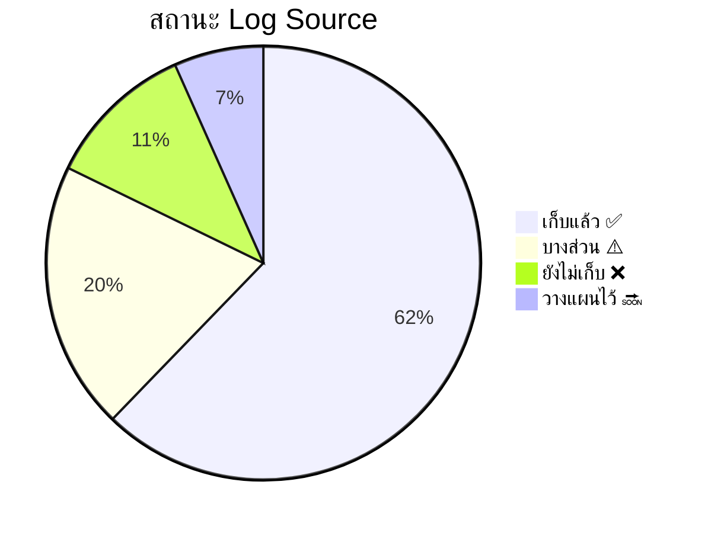

# Log Source Matrix / ตารางแหล่งข้อมูล Log

**รหัสเอกสาร**: OPS-SOP-010
**เวอร์ชัน**: 1.0
**การจัดชั้นความลับ**: ใช้ภายใน
**อัปเดตล่าสุด**: 2026-02-15

> Log Source Matrix แสดง **ภาพรวมหน้าเดียว** ของ data sources ทั้งหมดที่ SOC รับเข้าหรือต้องการ ใช้เป็นเครื่องมือ gap analysis เพื่อค้นหาจุดบอดในการตรวจจับ

---

## วิธีใช้เอกสารนี้

1. **Onboarding** → ตรวจสอบว่าเชื่อมต่อ log sources ที่ต้องการครบแล้ว
2. **Gap Analysis** → ระบุแหล่งที่ยังขาด (❌) และวางแผนแก้ไข
3. **Capacity Planning** → ประมาณ EPS และความต้องการพื้นที่จัดเก็บ
4. **Compliance** → แมป log sources กับข้อกำหนด (PDPA, PCI-DSS, ISO 27001)
5. **Detection Tuning** → เชื่อมโยงกับ MITRE ATT&CK coverage gaps

---

## สัญลักษณ์สถานะ

| สัญลักษณ์ | สถานะ | สิ่งที่ต้องทำ |
|:---:|:---|:---|
| ✅ | เก็บและ parse แล้ว | ไม่ต้องทำอะไร |
| ⚠️ | บางส่วน (เก็บแต่ยังไม่ parse/normalize) | ต้องพัฒนา parser |
| ❌ | ยังไม่ได้เก็บ | วางแผน integration |
| 🔜 | วางแผนไว้ / กำลังดำเนินการ | อยู่ใน roadmap |
| N/A | ไม่เกี่ยวข้องกับสภาพแวดล้อม | ข้าม |

---

## 1. Endpoint & Host Logs

| # | Log Source | ประเภท | Event สำคัญ | MITRE Coverage | EPS (ประมาณ) | สถานะ |
|:---:|:---|:---|:---|:---|:---:|:---:|
| 1.1 | **Windows Security Event Log** | Host | 4624/4625 (Logon), 4688 (Process), 4698 (Scheduled Task) | T1078, T1053, T1543 | 500–5K | ✅ |
| 1.2 | **Windows Sysmon** | Host | Process create (1), Network (3), File (11), Registry (13) | T1055, T1059, T1071 | 1K–10K | ✅ |
| 1.3 | **Windows PowerShell** | Host | 4103 (Module), 4104 (Script Block) | T1059.001, T1027 | 100–1K | ✅ |
| 1.4 | **Linux Auditd / syslog** | Host | execve, file access, auth, sudo | T1548, T1059.004 | 200–2K | ✅ |
| 1.5 | **macOS Unified Log** | Host | Process exec, auth, network | T1059, T1078 | 100–500 | ⚠️ |
| 1.6 | **EDR Telemetry** | Endpoint | Process tree, file write, network, injection | 50+ TTPs | 1K–20K | ✅ |
| 1.7 | **Antivirus / EPP** | Endpoint | Detection, quarantine, scan results | T1204, T1566 | 50–500 | ✅ |

---

## 2. Network Logs

| # | Log Source | ประเภท | Event สำคัญ | MITRE Coverage | EPS (ประมาณ) | สถานะ |
|:---:|:---|:---|:---|:---|:---:|:---:|
| 2.1 | **Firewall** | Network | Allow/Deny, NAT, VPN, threat log | T1071, T1090, T1572 | 1K–50K | ✅ |
| 2.2 | **IDS/IPS** (Suricata / Snort) | Network | Signature alerts, protocol anomaly | T1190, T1071 | 100–5K | ✅ |
| 2.3 | **DNS Logs** | Network | Query/Response, NXDomain, TXT | T1071.004, T1048.003 | 500–10K | ✅ |
| 2.4 | **Web Proxy / SWG** | Network | URL, user agent, response code | T1071.001, T1102 | 500–5K | ✅ |
| 2.5 | **NetFlow / IPFIX** | Network | IP pairs, ports, bytes, duration | T1046, T1571 | 1K–100K | ⚠️ |
| 2.6 | **DHCP Logs** | Network | Lease, MAC-to-IP binding | ระบุ asset | 10–100 | ⚠️ |
| 2.7 | **VPN Gateway** | Network | Connect/disconnect, user, source IP | T1133, T1078 | 10–500 | ✅ |
| 2.8 | **Wireless Controller** | Network | Association, deauth, rogue AP | T1557, T1200 | 50–500 | ❌ |

---

## 3. Cloud & SaaS Logs

| # | Log Source | ประเภท | Event สำคัญ | MITRE Coverage | EPS (ประมาณ) | สถานะ |
|:---:|:---|:---|:---|:---|:---:|:---:|
| 3.1 | **AWS CloudTrail** | Cloud | API calls, console sign-in | T1078.004, T1580 | 100–5K | ✅ |
| 3.2 | **AWS GuardDuty** | Cloud | Threat findings, anomaly | หลาย techniques | 1–50 | ✅ |
| 3.3 | **AWS VPC Flow Logs** | Cloud | Network flow within VPC | T1046, T1071 | 500–10K | ⚠️ |
| 3.4 | **Azure AD Sign-in Logs** | Cloud | Login, MFA, conditional access | T1078.004, T1556 | 100–2K | ✅ |
| 3.5 | **Azure Activity Log** | Cloud | Resource ops, RBAC changes | T1098, T1562 | 50–500 | ✅ |
| 3.6 | **GCP Cloud Audit** | Cloud | Admin activity, data access | T1078.004, T1530 | 50–1K | ❌ |
| 3.7 | **Microsoft 365 UAL** | SaaS | Mail, SharePoint, Teams | T1114, T1213 | 200–5K | ✅ |
| 3.8 | **Google Workspace** | SaaS | Drive, Gmail, Admin | T1114, T1530 | 100–1K | ❌ |
| 3.9 | **Okta / Azure AD** (IdP) | Identity | Login, MFA, app assignment | T1078, T1556 | 50–500 | ✅ |
| 3.10 | **SaaS Apps** | SaaS | User activity, file share | T1213, T1567 | 10–200 | 🔜 |

---

## 4. Identity & Access Logs

| # | Log Source | ประเภท | Event สำคัญ | MITRE Coverage | EPS (ประมาณ) | สถานะ |
|:---:|:---|:---|:---|:---|:---:|:---:|
| 4.1 | **Active Directory** | Identity | 4720 (สร้าง Account), 4728/4732 (เพิ่ม Group), Kerberos | T1078, T1098, T1558 | 200–5K | ✅ |
| 4.2 | **LDAP Logs** | Identity | Bind, search, modify | T1087, T1018 | 50–500 | ⚠️ |
| 4.3 | **PAM / Vault** | Identity | Session, credential checkout | T1078.002, T1555 | 10–100 | 🔜 |
| 4.4 | **MFA Platform** | Identity | Challenge/Response, enrollment | T1556.006, T1621 | 10–200 | ✅ |
| 4.5 | **Certificate Authority** | Identity | Cert issuance, revocation | T1649, T1553 | 1–50 | ❌ |

---

## 5. Application & Database Logs

| # | Log Source | ประเภท | Event สำคัญ | MITRE Coverage | EPS (ประมาณ) | สถานะ |
|:---:|:---|:---|:---|:---|:---:|:---:|
| 5.1 | **Web Server** | Application | Access log, error log, WAF | T1190, T1505 | 100–10K | ✅ |
| 5.2 | **WAF** | Application | Block, allow, bot score | T1190, T1595 | 100–5K | ✅ |
| 5.3 | **Database Audit** | Database | Login, query, schema change | T1213, T1565 | 50–2K | ⚠️ |
| 5.4 | **Application Logs** | Application | Login, error, API call | T1078, T1190 | 50–5K | ⚠️ |
| 5.5 | **Container / K8s Audit** | Application | Pod, exec, RBAC change | T1610, T1611 | 100–2K | ❌ |

---

## 6. Email & Communication Logs

| # | Log Source | ประเภท | Event สำคัญ | MITRE Coverage | EPS (ประมาณ) | สถานะ |
|:---:|:---|:---|:---|:---|:---:|:---:|
| 6.1 | **Email Gateway** | Email | Send/receive, phishing verdict | T1566, T1534 | 50–2K | ✅ |
| 6.2 | **Email DLP** | Email | Policy match, block | T1048, T1567 | 10–200 | ✅ |
| 6.3 | **Anti-Spam / Anti-Phishing** | Email | Detection, URL sandbox | T1566.001, T1566.002 | 10–500 | ✅ |

---

## 7. Security Tool Logs

| # | Log Source | ประเภท | Event สำคัญ | MITRE Coverage | EPS (ประมาณ) | สถานะ |
|:---:|:---|:---|:---|:---|:---:|:---:|
| 7.1 | **SIEM Internal** | Security | Health, ingestion rate | N/A (operational) | 10–100 | ✅ |
| 7.2 | **Vulnerability Scanner** | Security | Scan results, new vuln | T1190, T1210 | 1–50 | ✅ |
| 7.3 | **DLP** | Security | Policy violation, block | T1048, T1567 | 10–200 | ⚠️ |
| 7.4 | **CASB** | Security | Shadow IT, data exfil | T1567, T1537 | 10–500 | 🔜 |
| 7.5 | **Threat Intelligence Platform** | Security | IOC match, feed update | หลากหลาย | 1–50 | ✅ |

---

## สรุป Coverage



### ลำดับความสำคัญในการปิด Gap

| ลำดับ | แหล่งที่ขาด | ผลกระทบ | ความยาก | กำหนด |
|:---:|:---|:---|:---:|:---|
| 🔴 P1 | Container / K8s Audit | มองไม่เห็น container-based attacks | ปานกลาง | Q1 |
| 🔴 P1 | Certificate Authority | ตรวจจับ Golden Certificate (T1649) ไม่ได้ | ต่ำ | Q1 |
| 🟡 P2 | GCP Cloud Audit | ไม่มี visibility ใน GCP workloads | ปานกลาง | Q2 |
| 🟡 P2 | Google Workspace | ขาด email/drive monitoring สำหรับ Google | ปานกลาง | Q2 |
| 🟢 P3 | Wireless Controller | ตรวจจับ rogue AP ได้จำกัด | ต่ำ | Q3 |

---

## การวางแผน Capacity

| ระดับ | EPS รวม (ประมาณ) | SIEM License | Storage (90 วัน) |
|:---|:---:|:---|:---:|
| **SOC เล็ก** (< 500 hosts) | 5K–15K | Standard tier | 500 GB – 1.5 TB |
| **SOC กลาง** (500–5K hosts) | 15K–100K | Enterprise tier | 1.5 – 10 TB |
| **SOC ใหญ่** (5K+ hosts) | 100K–1M+ | Premium tier | 10 – 100+ TB |

### สูตรคำนวณ EPS

```
Events ต่อวัน = EPS × 86,400
Storage (GB/วัน) = Events ต่อวัน × ขนาดเฉลี่ยต่อ event (bytes) / 1,073,741,824
Storage 90 วัน = Storage/วัน × 90
```

---

## ตารางบำรุงรักษา

| งาน | ความถี่ | ผู้รับผิดชอบ |
|:---|:---:|:---|
| ตรวจสอบสุขภาพ log source | ทุกวัน | SOC Tier 1 |
| ตรวจสอบ EPS เทียบ baseline | ทุกสัปดาห์ | SOC Engineering |
| อัปเดตตาราง (sources ใหม่) | ทุกเดือน | SOC Lead |
| ทบทวน gap analysis ทั้งหมด | ทุกไตรมาส | SOC Manager + CISO |
| ตรวจสอบการแมปกับ compliance | ทุกปี | GRC / Compliance |

---

## เอกสารที่เกี่ยวข้อง

-   [Threat Hunting Playbook](../05_Incident_Response/Threat_Hunting_Playbook.en.md)
-   [Detection Rule Testing SOP](Detection_Rule_Testing.en.md)
-   [TI Feeds Integration](TI_Feeds_Integration.en.md)
-   [SOC Metrics & KPIs](SOC_Metrics.en.md)
-   [Compliance Mapping](../10_Compliance/Compliance_Mapping.en.md)
-   [Infrastructure Setup](../01_SOC_Fundamentals/Infrastructure_Setup.en.md)
