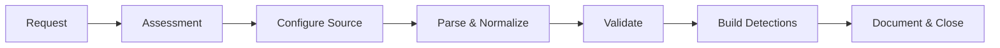

# Log Source Onboarding Guide

> **Document ID:** LOG-001  
> **Version:** 1.0  
> **Last Updated:** 2026-02-15  
> **Owner:** SOC Engineering / Detection Engineering

---

## Purpose

Step-by-step guide for onboarding new log sources into the SIEM. Proper onboarding ensures detection coverage, normalization, and alert quality.

---

## Onboarding Workflow



---

## Phase 1: Assessment Checklist

Before onboarding any new log source:

| Item | Details |
|:---|:---|
| **Log Source Name** | [System/application name] |
| **Log Type** | Auth / Network / Endpoint / Cloud / Application |
| **Volume Estimate** | [Events per second / per day] |
| **Format** | Syslog (RFC 3164/5424) / JSON / CEF / CSV / Windows Event |
| **Transport** | Syslog TCP/UDP / Filebeat / API / S3 / Kafka |
| **Retention** | [Days to retain in hot/warm/cold storage] |
| **Compliance** | Required by ISO/PCI/PDPA? |
| **Playbooks** | Which playbooks will this data support? |
| **Owner** | [Team responsible for the source system] |

---

## Phase 2: Configure by Source Type

### Windows Event Logs
```yaml
# Winlogbeat config
winlogbeat.event_logs:
  - name: Security
    event_id: 4624, 4625, 4648, 4672, 4688, 4720, 4726, 4732, 4756, 1102
  - name: System
    event_id: 7045, 7040
  - name: Microsoft-Windows-Sysmon/Operational
  - name: Microsoft-Windows-PowerShell/Operational
    event_id: 4103, 4104

output.elasticsearch:
  hosts: ["siem.company.local:9200"]
  index: "winlogbeat-%{+yyyy.MM.dd}"
```

### Linux Syslog
```yaml
# Filebeat config
filebeat.inputs:
  - type: log
    paths:
      - /var/log/auth.log
      - /var/log/syslog
      - /var/log/secure
    fields:
      log_type: linux_syslog
    multiline:
      pattern: '^\w{3}\s+\d{1,2}'
      negate: true
      match: after

  - type: log
    paths:
      - /var/log/audit/audit.log
    fields:
      log_type: linux_audit
```

### Firewall (Palo Alto / Fortinet)
```
# Syslog config — send to SIEM
# Palo Alto: Device > Server Profiles > Syslog
Server IP:    [SIEM_IP]
Port:         514 (UDP) or 6514 (TLS)
Format:       BSD
Facility:     LOG_USER

# Fortinet FortiGate
config log syslogd setting
    set status enable
    set server [SIEM_IP]
    set port 514
    set format cef
    set facility local7
end
```

### AWS CloudTrail
```bash
# Enable CloudTrail → S3 → SIEM
aws cloudtrail create-trail \
  --name soc-audit-trail \
  --s3-bucket-name company-cloudtrail-logs \
  --is-multi-region-trail \
  --enable-log-file-validation

# Enable CloudWatch Logs integration
aws cloudtrail update-trail \
  --name soc-audit-trail \
  --cloud-watch-logs-log-group-arn arn:aws:logs:... \
  --cloud-watch-logs-role-arn arn:aws:iam::...
```

### Azure Activity & Sign-in Logs
```
# Azure Portal → Azure AD → Diagnostic Settings
# Export to:
- Log Analytics Workspace (recommended)
- Event Hub → SIEM
- Storage Account

# Key log categories:
✅ AuditLogs
✅ SignInLogs
✅ NonInteractiveUserSignInLogs
✅ ServicePrincipalSignInLogs
✅ RiskyUsers
✅ UserRiskEvents
```

### Office 365 / Microsoft 365
```powershell
# Enable Unified Audit Log
Set-AdminAuditLogConfig -UnifiedAuditLogIngestionEnabled $true

# Verify
Get-AdminAuditLogConfig | FL UnifiedAuditLogIngestionEnabled

# Key events to monitor:
# - MailItemsAccessed
# - New-InboxRule / Set-InboxRule
# - FileDownloaded / FileUploaded (SharePoint/OneDrive)
# - UserLoggedIn (from unusual locations)
```

### EDR (CrowdStrike / Defender / SentinelOne)
```
# Typically via API or Syslog streaming
# CrowdStrike: SIEM Connector → Falcon Data Replicator
# Defender: Microsoft 365 Defender → Streaming API
# SentinelOne: Settings → Integrations → Syslog/CEF

# Key events:
✅ Detections / Alerts
✅ Process execution
✅ Network connections
✅ File modifications
✅ DNS queries
```

---

## Phase 3: Parse & Normalize

### Field Mapping Standard (ECS)

Map all sources to Elastic Common Schema (ECS) or similar:

| Standard Field | Description | Example |
|:---|:---|:---|
| `@timestamp` | Event time | 2026-02-15T08:30:00Z |
| `event.category` | Category | authentication, network, process |
| `event.action` | Action | login, file_create, dns_query |
| `event.outcome` | Result | success, failure |
| `source.ip` | Source IP | 10.0.1.50 |
| `destination.ip` | Dest IP | 8.8.8.8 |
| `user.name` | Username | john.doe |
| `host.name` | Hostname | WS-JOHN-01 |
| `process.name` | Process | powershell.exe |
| `file.hash.sha256` | File hash | abc123... |

---

## Phase 4: Validation

After onboarding, verify:

```
□ Logs are arriving (check last 5 min)
□ Parsing is correct (spot-check 10 events)
□ Timestamps are accurate (not off by timezone)
□ Fields are normalized to standard schema
□ No data loss (compare source count vs SIEM count, ±5%)
□ Test search query returns expected results
□ Volume matches estimate (not flooding or too low)
□ Alert rules fire on test data
```

### Test Queries
```
# Check data arrival
index=* sourcetype="new_source" earliest=-5m | stats count

# Verify field extraction
index=* sourcetype="new_source" | table _time, source.ip, user.name, event.action

# Count vs expected volume
index=* sourcetype="new_source" earliest=-1d | stats count
```

---

## Phase 5: Build Detections

After validation, create detection rules:

1. Review which Sigma rules apply to this log source
2. Convert relevant Sigma rules for your SIEM
3. Test detection rules against historical data
4. Set up alert routing (email, Slack, ticket)
5. Document false positive baseline (first 2 weeks)

---

## Log Source Priority Matrix

| Priority | Log Source | Playbooks Supported |
|:---:|:---|:---|
| 🔴 P1 | EDR / Endpoint | PB-01, PB-02, PB-03, PB-11, PB-12 |
| 🔴 P1 | Active Directory / Azure AD | PB-04, PB-05, PB-06, PB-07, PB-15, PB-26 |
| 🔴 P1 | Email Gateway | PB-01, PB-17 |
| 🟡 P2 | Firewall / IDS | PB-09, PB-13, PB-24 |
| 🟡 P2 | Cloud (AWS/Azure/GCP) | PB-16, PB-27 |
| 🟡 P2 | Proxy / Web Gateway | PB-10, PB-22, PB-29 |
| 🟢 P3 | DNS | PB-24 |
| 🟢 P3 | DLP | PB-08, PB-14 |
| 🟢 P3 | MDM | PB-19, PB-28 |
| ⚪ P4 | Badge / Physical | PB-14 |
| ⚪ P4 | OT/ICS | PB-30 |

---

## Related Documents

- [Detection Rules Index](../07_Detection_Rules/README.md)
- [Sigma Rule Validator](../tools/sigma_validator.py)
- [SOC Metrics & KPIs](SOC_Metrics.en.md)
