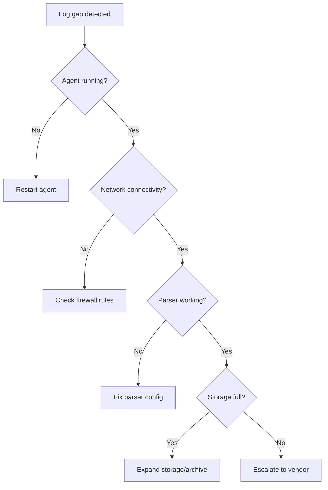

# คู่มือเพิ่ม Log Source เข้า SIEM

> **รหัสเอกสาร:** LOG-001  
> **เวอร์ชัน:** 1.0  
> **อัปเดตล่าสุด:** 2026-02-15  
> **เจ้าของ:** SOC Engineering

---

## วัตถุประสงค์

คู่มือทีละขั้นตอนสำหรับ onboard log source ใหม่เข้า SIEM เพื่อให้แน่ใจว่ามี detection coverage ถูกต้องและมีคุณภาพ

---

## ขั้นตอนการ Onboard

```
1. ประเมิน → 2. ตั้งค่า → 3. Parse → 4. ตรวจสอบ → 5. สร้าง Detection
```

---

## ขั้นที่ 1: ประเมิน

| รายการ | รายละเอียด |
|:---|:---|
| ชื่อ Log Source | [ชื่อระบบ] |
| ประเภท | Auth / Network / Endpoint / Cloud |
| ปริมาณ | [Events ต่อวัน] |
| รูปแบบ | Syslog / JSON / CEF / Windows Event |
| การส่ง | Syslog / Filebeat / API / S3 |
| Retention | [จำนวนวัน] |
| Playbooks | สนับสนุน playbook ไหนบ้าง? |

---

## ขั้นที่ 2: ตั้งค่า

### Windows
```yaml
# Winlogbeat — Event IDs สำคัญ
Security: 4624, 4625, 4648, 4672, 4688, 4720, 1102
Sysmon: ทั้งหมด
PowerShell: 4103, 4104
```

### Linux
```yaml
# Filebeat
/var/log/auth.log, /var/log/syslog, /var/log/audit/audit.log
```

### Cloud
```
AWS: CloudTrail → S3 → SIEM
Azure: Diagnostic Settings → Log Analytics / Event Hub
O365: Unified Audit Log → Streaming API
```

---

## ขั้นที่ 3: Normalize (ECS)

| Field มาตรฐาน | คำอธิบาย |
|:---|:---|
| `@timestamp` | เวลาเกิดเหตุ |
| `event.category` | หมวด (authentication, network) |
| `source.ip` | IP ต้นทาง |
| `user.name` | ชื่อผู้ใช้ |
| `host.name` | ชื่อเครื่อง |

---

## ขั้นที่ 4: ตรวจสอบ

```
□ Log มาถึงแล้ว (ตรวจ 5 นาทีล่าสุด)
□ Parse ถูกต้อง (spot-check 10 events)
□ Timestamp ถูก timezone
□ Fields normalize ตาม schema
□ ปริมาณตรงกับที่ประเมิน (±5%)
□ Alert rules ทำงาน
```

---

## ลำดับความสำคัญ

| ลำดับ | Log Source | Playbooks |
|:---:|:---|:---|
| 🔴 P1 | EDR / Endpoint | PB-01–03, PB-11–12 |
| 🔴 P1 | AD / Azure AD | PB-04–07, PB-15, PB-26 |
| 🔴 P1 | Email Gateway | PB-01, PB-17 |
| 🟡 P2 | Firewall / IDS | PB-09, PB-13, PB-24 |
| 🟡 P2 | Cloud (AWS/Azure) | PB-16, PB-27 |
| 🟢 P3 | DNS / DLP / MDM | PB-08, PB-19, PB-24 |

---

## Log Source Priority Matrix

| ลำดับ | แหล่ง Log | ความสำคัญ | MITRE Coverage |
|:---:|:---|:---:|:---|
| 1 | **Active Directory** | 🔴 Critical | T1078, T1110, T1098 |
| 2 | **Firewall / IDS** | 🔴 Critical | T1071, T1090, T1572 |
| 3 | **EDR (Endpoint)** | 🔴 Critical | T1059, T1055, T1053 |
| 4 | **Email Gateway** | 🟡 High | T1566, T1534 |
| 5 | **DNS** | 🟡 High | T1071.004, T1568 |
| 6 | **Web Proxy** | 🟡 High | T1071.001, T1102 |
| 7 | **VPN / Remote Access** | 🟡 High | T1133, T1021 |
| 8 | **Cloud Audit (AWS/Azure)** | 🟡 High | T1078.004, T1537 |
| 9 | **Database Audit** | 🟢 Medium | T1213, T1505 |
| 10 | **Application Logs** | 🟢 Medium | T1190, T1212 |

## Onboarding Checklist (Per Source)

| # | รายการ | สถานะ |
|:---:|:---|:---:|
| 1 | ระบุ log source owner และ contact | ☐ |
| 2 | กำหนดวิธีส่ง log (agent/syslog/API) | ☐ |
| 3 | ตั้งค่า parsing / field extraction | ☐ |
| 4 | สร้าง index pattern / data stream | ☐ |
| 5 | ตรวจสอบ log volume (EPS baseline) | ☐ |
| 6 | สร้าง health check alert (log stop flowing) | ☐ |
| 7 | Map fields ไปยัง normalization schema | ☐ |
| 8 | สร้าง detection rules สำหรับ source นี้ | ☐ |
| 9 | ทดสอบ alert triggering | ☐ |
| 10 | บันทึกใน Log Source Matrix | ☐ |

## Volume Planning

| แหล่ง Log | EPS โดยประมาณ | GB/วัน (ประมาณ) | Retention |
|:---|:---:|:---:|:---|
| Active Directory | 50–200 | 2–8 GB | 90 วัน |
| Firewall | 100–1,000 | 5–50 GB | 30 วัน |
| EDR | 20–100 | 1–5 GB | 90 วัน |
| DNS | 200–2,000 | 10–100 GB | 14 วัน |
| Web Proxy | 50–500 | 3–30 GB | 30 วัน |

## Troubleshooting Log Onboarding

| ปัญหา | สาเหตุ | วิธีแก้ |
|:---|:---|:---|
| Log ไม่เข้า SIEM | Port ถูก block | ตรวจสอบ firewall rules |
| Parsing ผิดพลาด | Format ไม่ตรงกับ parser | อัปเดต regex / grok pattern |
| Timestamp ไม่ตรง | Timezone mismatch | ตั้งค่า NTP + timezone ใน parser |
| Volume สูงเกินคาด | Debug logging เปิดอยู่ | ปรับ log level เป็น INFO |

## การทำ Normalization

### Field Mapping Standard

| Standard Field | ตัวอย่าง Source Fields | คำอธิบาย |
|:---|:---|:---|
| `src_ip` | src_addr, SrcIP, source.ip | IP ต้นทาง |
| `dst_ip` | dst_addr, DstIP, dest.ip | IP ปลายทาง |
| `user` | username, AccountName, user.name | ชื่อผู้ใช้ |
| `action` | EventAction, Action, event.action | การดำเนินการ |
| `timestamp` | @timestamp, EventTime, _time | เวลาเหตุการณ์ |
| `severity` | level, priority, rule.level | ระดับความรุนแรง |
| `hostname` | ComputerName, host.name | ชื่อเครื่อง |

### ตัวอย่าง Parser (Wazuh)

```xml
<!-- Custom decoder สำหรับ application log -->
<decoder name="custom_app">
  <program_name>myapp</program_name>
  <regex>^(\S+) (\S+) (\S+) "(\S+)"</regex>
  <order>timestamp,src_ip,user,action</order>
</decoder>
```

## Health Monitoring สำหรับ Log Sources

| ตรวจสอบ | เงื่อนไข Alert | ความรุนแรง |
|:---|:---|:---:|
| Log ไม่เข้ามา > 15 นาที | `count == 0 in 15m` | 🔴 High |
| EPS ลดลง > 50% | `eps < baseline * 0.5` | 🟡 Medium |
| EPS เพิ่มขึ้น > 200% | `eps > baseline * 2` | 🟡 Medium |
| Parsing error rate > 5% | `parse_error > 5%` | 🟡 Medium |
| Timestamp drift > 5 นาที | `time_diff > 5m` | 🟡 Medium |

## Log Source Retirement Process

| ขั้นตอน | กิจกรรม | ผู้รับผิดชอบ |
|:---|:---|:---|
| 1 | ประเมินว่ายังต้องการ log source นี้หรือไม่ | SOC Manager |
| 2 | ตรวจสอบ detection rules ที่ใช้ log source นี้ | Detection Engineer |
| 3 | อัปเดต/ลบ rules ที่ได้รับผลกระทบ | Detection Engineer |
| 4 | ปิด log collection | IT / System Owner |
| 5 | อัปเดต Log Source Matrix | SOC Analyst |
| 6 | Archive ข้อมูลตาม retention policy | IT |

## Log Source Health Monitoring

### Health Check Dashboard

| Log Source | Expected EPS | Actual EPS | Status | Last Event |
|:---|:---|:---|:---|:---|
| Firewall | 500 | 487 | ✅ ปกติ | 2 sec ago |
| AD/LDAP | 200 | 195 | ✅ ปกติ | 5 sec ago |
| EDR | 300 | 45 | 🔴 ต่ำผิดปกติ | 3 min ago |
| Web Proxy | 150 | 148 | ✅ ปกติ | 1 sec ago |
| DNS | 400 | 0 | 🔴 หยุดส่ง | 15 min ago |

### Troubleshooting Log Gaps



### Onboarding Checklist per Source Type

| ขั้นตอน | Firewall | Endpoint | Cloud | Application |
|:---|:---|:---|:---|:---|
| Network config | ✅ Syslog | ✅ Agent | API Key | ✅ Webhook |
| Parser setup | Custom | Built-in | Built-in | Custom |
| Field mapping | 15 fields | 25 fields | 20 fields | 10 fields |
| Baseline (days) | 7 | 14 | 7 | 14 |
| Alert rules | 5 | 10 | 8 | 3 |

### Log Quality Assurance

| Check | Target | Frequency |
|:---|:---|:---|
| Field completeness | > 95% | Weekly |
| Timestamp accuracy | ± 1 sec NTP | Monthly |
| Parser accuracy | > 98% | Per update |
| Normalization | CIM compliant | Per onboard |

### Onboarding Timeline Template

| Day | Activity | Owner |
|:---|:---|:---|
| 1 | Network/API config | IT + Vendor |
| 2-3 | Parser development | SOC Engineer |
| 4-5 | Baseline collection | SOC Analyst |
| 6-7 | Alert rule creation | SOC Engineer |

### Quick Reference

| Phase | Duration |
|:---|:---|
| Config | 1-2 days |
| Baseline | 7 days |

## เอกสารที่เกี่ยวข้อง

- [ดัชนี Detection Rules](../08_Detection_Engineering/README.th.md)
- [Sigma Validator](../tools/sigma_validator.py)
- [SOC Metrics](SOC_Metrics.th.md)
- [Log Source Matrix](Log_Source_Matrix.th.md)

## เกณฑ์ขั้นต่ำก่อนปิดงาน Onboarding (Minimum Acceptance Criteria Before Close)

| ข้อกำหนด | เหตุผล | ผู้รับผิดชอบ |
|:---|:---|:---|
| log flow เสถียรตามช่วงเวลาที่กำหนด | ยืนยันว่า source พร้อมใช้จริงใน production | SOC Engineer |
| parsing และ normalization ผ่านเกณฑ์คุณภาพ field | ทำให้ detection และ investigation ใช้งานได้ | Detection Engineer |
| source ถูกบันทึกใน Log Source Matrix แล้ว | คง inventory เรื่อง owner และ coverage ให้เป็นปัจจุบัน | SOC Analyst |
| มี health-check alert สำหรับ log หยุดไหลหรือ volume drift | ตรวจจับ silent failure หลัง onboard | Security Engineer |
| มีอย่างน้อย 1 detection หรือ monitoring use case ที่ validate แล้ว | ป้องกันการ onboard โดยไม่มี operational value | Detection Engineer |

## Trigger สำหรับการยกระดับระหว่าง Onboarding (Escalation Triggers During Onboarding)

| เงื่อนไข | ยกระดับถึง | SLA | การดำเนินการที่ต้องทำ |
|:---|:---|:---:|:---|
| volume สูงกว่าที่ประเมิน > 30% หรือเสี่ยงชนงบ | SOC Manager + Platform owner | ภายในวันทำการเดียวกัน | ทบทวน retention, filtering และต้นทุน |
| parsing failure rate สูงกว่าเกณฑ์ที่ตกลงไว้ | Detection Engineer + Source owner | ภายใน 24 ชม. | แก้ parser ก่อน go-live |
| security event สำคัญขาดหายจาก source logs | Source owner + SOC Manager | ภายในวันทำการเดียวกัน | เปิด audit category ที่ขาด |
| ไม่มี owner, maintenance window หรือ rollback path | SOC Manager | ก่อนตัดเข้า production | หยุด closeout จนกว่าจะชัดเจน |
| source รองรับ playbook สำคัญแต่ readiness ยังไม่ครบ | SOC Manager + IR lead | ทันทีสำหรับ critical gap | ติดตามเป็น monitoring blind spot |

## References

- [NIST SP 800-61r2](https://csrc.nist.gov/publications/detail/sp/800-61/rev-2/final)
- [MITRE ATT&CK](https://attack.mitre.org/)
