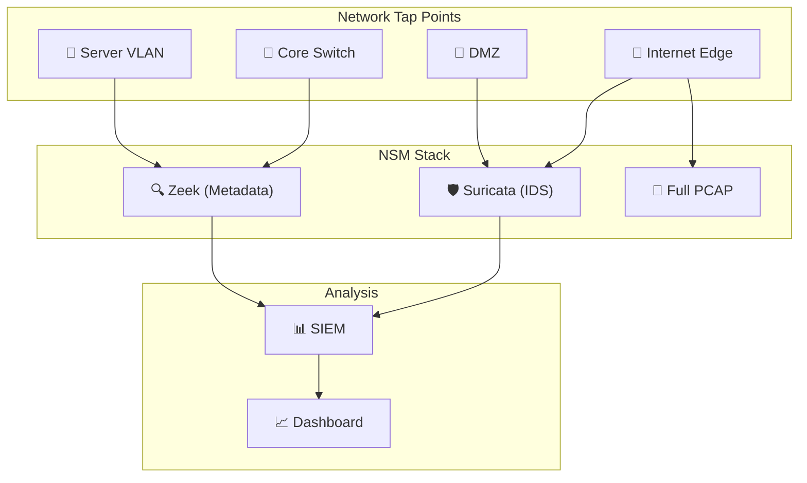

# Network Security Monitoring SOP / SOP การเฝ้าระวังความปลอดภัยเครือข่าย

**รหัสเอกสาร**: OPS-SOP-025
**เวอร์ชัน**: 1.0
**การจัดชั้นความลับ**: ใช้ภายใน
**อัปเดตล่าสุด**: 2026-02-15

> ขั้นตอน SOC สำหรับ **เฝ้าระวัง traffic เครือข่าย, ตรวจจับการโจมตี, และตอบสนอง** ครอบคลุม IDS/IPS, NDR, DNS monitoring, NetFlow, และ network forensics

---

## แหล่งข้อมูลเครือข่าย

| แหล่ง | ข้อมูลสำคัญ | เก็บ | ลำดับ |
|:---|:---|:---:|:---:|
| **Firewall logs** | Accept/deny, source/dest, port | 90 วัน | 🔴 Critical |
| **IDS/IPS alerts** | Signature matches, anomalies | 90 วัน | 🔴 Critical |
| **DNS query logs** | Domain, query types | 90 วัน | 🔴 Critical |
| **Proxy/web gateway** | URL, user agent, bytes | 90 วัน | 🔴 Critical |
| **NetFlow/sFlow** | Flow metadata | 30 วัน | 🟠 High |
| **Full packet capture** | Traffic content ทั้งหมด | 7 วัน | 🟠 High |
| **DHCP logs** | IP-to-MAC mapping | 90 วัน | 🟡 Medium |
| **VPN logs** | Connection times, IPs, users | 90 วัน | 🟡 Medium |

---

## Network Detections ที่สำคัญ

### Perimeter Attacks

| Detection | คำอธิบาย | Severity | MITRE |
|:---|:---|:---:|:---|
| Port scan | สแกน port อย่างเป็นระบบ | P3 | T1046 |
| Brute-force | เชื่อมต่อซ้ำ port เดียว | P2 | T1110 |
| Exploit attempt | IDS signature match | P1 | varies |
| DDoS indicators | Traffic volume ผิดปกติ | P1 | T1498 |

### Lateral Movement

| Detection | คำอธิบาย | Severity | MITRE |
|:---|:---|:---:|:---|
| Internal port scan | Host สแกน IP ภายใน | P2 | T1046 |
| SMB lateral movement | SMB connections ผิดปกติ | P1 | T1021.002 |
| RDP ไปยัง host ผิดปกติ | RDP ไป server ที่ไม่ปกติ | P2 | T1021.001 |
| Pass-the-hash | NTLM relay detected | P1 | T1550.002 |

### Command & Control

| Detection | คำอธิบาย | Severity | MITRE |
|:---|:---|:---:|:---|
| DNS tunneling | DNS query ถี่ + encoded data | P1 | T1071.004 |
| Beaconing pattern | เชื่อมต่อ outbound เป็นจังหวะ | P1 | T1071 |
| DGA detection | NXD responses จำนวนมาก | P2 | T1568.002 |
| Known C2 | เชื่อมต่อ TI-flagged IP/domain | P1 | T1071 |
| Encrypted C2 (JA3/JA4) | TLS fingerprint ผิดปกติ | P2 | T1573 |

### Data Exfiltration

| Detection | คำอธิบาย | Severity | MITRE |
|:---|:---|:---:|:---|
| Large outbound transfer | > 500 MB ไปยัง IP ภายนอก | P1 | T1048 |
| Upload ปลายทางใหม่ | Upload ไป IP/domain ที่ไม่เคยเห็น | P2 | T1567 |
| Exfil over DNS | DNS query + payload data | P1 | T1048.001 |
| After-hours data transfer | Transfer ขนาดใหญ่ 22:00–06:00 | P2 | T1048 |

---

## การเฝ้าระวัง Network Segmentation

### Zone Matrix

| Zone | อนุญาต | บล็อก | Monitoring |
|:---|:---|:---|:---|
| **DMZ** | Internet (ports เฉพาะ), Internal DB (เฉพาะ) | Internal อื่นๆ | Full PCAP + IDS |
| **Server** | Servers อื่น (เฉพาะ), DMZ (response) | Workstations (ตรง) | NetFlow + IDS |
| **Workstation** | DMZ (ผ่าน proxy), Server (เฉพาะ) | Internet ตรง | Proxy + NetFlow |
| **Management** | ทุก zone (admin ports) | Internet | Full PCAP + IDS |

### Cross-Zone Violations

| Violation | Severity | Response |
|:---|:---:|:---|
| Workstation → Server (non-standard port) | P2 | สืบสวน lateral movement |
| Server → Workstation | P1 | สืบสวนทันที |
| IoT → Server/Workstation | P1 | Contain ทันที |
| DMZ → Internal (non-standard) | P1 | อาจ DMZ breach |

---

## DNS Security Monitoring

| Detection | Logic | Severity |
|:---|:---|:---:|
| Domain ใหม่ (< 30 วัน) | ตรวจ domain creation date | P3 |
| DGA detection | Entropy analysis + NXD ratio | P2 |
| DNS tunneling | Query > 50 chars + ความถี่สูง | P1 |
| Typosquatting | Edit distance < 3 จาก corporate domains | P2 |
| DNS over HTTPS (DoH) | TLS ไป DoH providers | P3 |
| Fast-flux DNS | Domain → หลาย IP เร็ว | P2 |

---

## Network Incident Response

### Response Actions

| Action | เครื่องมือ | ผลกระทบ |
|:---|:---|:---|
| **บล็อก IP** | Firewall | ทันที |
| **บล็อก domain** | DNS Firewall/Proxy | ต่ำ |
| **แยก host** | Switch/NAC/EDR | Host offline |
| **Capture packets** | PCAP tool | ใช้ storage มาก |
| **Rate limit** | Firewall/IPS | บรรเทาบางส่วน |
| **Sinkhole domain** | DNS | ระบุ infected hosts |

---

## ตัวชี้วัด

| ตัวชี้วัด | เป้าหมาย |
|:---|:---:|
| Network alert MTTD | < 5 นาที |
| Network alert MTTR (P1) | < 30 นาที |
| IDS/IPS signature coverage | ≥ 95% |
| DNS monitoring coverage | 100% |
| NetFlow coverage | ≥ 90% |
| Zone violation detection | 100% |
| False positive rate | < 15% |

---

## NSM Architecture

## Detection Categories

| หมวด | ตัวอย่าง | เครื่องมือ | ลำดับ |
|:---|:---|:---|:---:|
| **Malware C2** | Beacon traffic, DNS tunneling | Suricata + JA3 | P1 |
| **Lateral Movement** | SMB/RDP ผิดปกติ, PsExec | Zeek + Suricata | P1 |
| **Data Exfiltration** | Large outbound transfers, encrypted channels | Zeek + DLP | P1 |
| **Reconnaissance** | Port scan, service enumeration | Suricata | P2 |
| **Protocol Anomaly** | Non-standard DNS, HTTP tunneling | Zeek | P2 |
| **Unauthorized Services** | Rogue DHCP, unauthorized VPN | Zeek | P3 |

## NSM KPIs

| ตัวชี้วัด | เป้าหมาย | ปัจจุบัน |
|:---|:---|:---|
| Network coverage (monitored segments) | ≥ 90% | [XX]% |
| IDS alert-to-incident ratio | < 100:1 | [XX]:1 |
| PCAP retention | ≥ 72 ชม. | [XX] ชม. |
| Zeek log retention | ≥ 30 วัน | [XX] วัน |
| Signature update frequency | ≤ 24 ชม. | [XX] ชม. |

## NSM Tool Comparison

| คุณสมบัติ | Suricata | Zeek | Arkime |
|:---|:---:|:---:|:---:|
| **Signature-based detection** | ✅ | ❌ | ❌ |
| **Protocol parsing** | ✅ | ✅ (ดีกว่า) | ✅ |
| **Full PCAP** | ❌ | ❌ | ✅ |
| **Metadata logging** | ✅ | ✅ (ดีกว่า) | ✅ |
| **JA3/JA4 fingerprinting** | ✅ | ✅ | ✅ |
| **ราคา** | ฟรี | ฟรี | ฟรี |
| **เหมาะกับ** | IDS/IPS | Traffic analysis | PCAP search |

## เอกสารที่เกี่ยวข้อง

-   [Log Source Matrix](Log_Source_Matrix.en.md) — แหล่งข้อมูลทั้งหมด
-   [Cloud Security Monitoring](Cloud_Security_Monitoring.en.md) — Cloud network
-   [DLP SOP](DLP_SOP.en.md) — Network DLP
-   [Alert Tuning SOP](Alert_Tuning.en.md) — การ tune network alerts
