# แม่แบบ SLA — ข้อตกลงระดับบริการ SOC

> **รหัสเอกสาร:** SLA-001  
> **เวอร์ชัน:** 1.0  
> **อัปเดตล่าสุด:** 2026-02-15  
> **ระหว่าง:** [ทีม SOC] กับ [หน่วยธุรกิจ / ผู้บริหาร]

---

## ขอบเขตบริการ

| บริการ | เวลา | คำอธิบาย |
|:---|:---:|:---|
| Security Monitoring | 24/7 หรือ 8/5 | ตรวจจับ alert ต่อเนื่อง |
| Incident Response | 24/7 หรือ 8/5 | สืบสวนและตอบสนอง |
| Threat Intelligence | เวลาทำการ | ติดตามภัยคุกคาม |
| รายงาน | รายเดือน | รายงานผลปฏิบัติการ |

---

## เวลาตอบสนอง SLA

| ระดับ | ตอบสนอง | Escalate | แก้ไข |
|:---:|:---:|:---:|:---:|
| **P1 วิกฤต** | ≤ 15 นาที | ≤ 30 นาที | ≤ 4 ชม. |
| **P2 สูง** | ≤ 30 นาที | ≤ 2 ชม. | ≤ 8 ชม. |
| **P3 กลาง** | ≤ 4 ชม. | ≤ 8 ชม. | ≤ 3 วันทำการ |
| **P4 ต่ำ** | ≤ 8 ชม. | N/A | ≤ 5 วันทำการ |

**กฎเวลา:**
- P1/P2: นับ **24/7** (ไม่หยุดวันหยุด)
- P3/P4: นับ **เวลาทำการ** (จ-ศ 08:00–17:00)

---

## Escalation

| ระดับ | ใคร | เมื่อไหร่ |
|:---:|:---|:---|
| L1 | SOC Analyst | Alert ทั้งหมด |
| L2 | Senior Analyst | แก้ไม่ได้ใน 30 นาที |
| L3 | IR Lead / SOC Manager | P1/P2 |
| L4 | CISO / CTO | Data breach |
| L5 | CEO / Board | ต้องแจ้งหน่วยงานกำกับ |

---

## KPIs

| ตัวชี้วัด | เป้า |
|:---|:---:|
| SLA Compliance (P1) | ≥ 95% |
| SLA Compliance (P2) | ≥ 90% |
| MTTD | ≤ 1 ชม. |
| MTTR | ≤ 4 ชม. |
| False Positive | ≤ 40% |

---

## รายงาน

| รายงาน | ความถี่ | กลุ่มเป้าหมาย |
|:---|:---:|:---|
| แจ้ง Incident | Real-time (P1/P2) | ผู้บริหาร |
| สรุปรายสัปดาห์ | รายสัปดาห์ | SOC Manager |
| รายงานเดือน | รายเดือน | CISO |
| สรุปผู้บริหาร | รายไตรมาส | Board |

---

## ลงชื่อ

```
SOC Manager:    ____________________ วันที่: __________
CISO:           ____________________ วันที่: __________
หัวหน้าหน่วย:    ____________________ วันที่: __________
```

---

## SLA Tiers

| Tier | เหมาะกับ | Response (P1) | Response (P2) | Monthly Report |
|:---|:---|:---:|:---:|:---:|
| **Platinum** | Critical infrastructure | ≤ 15 นาที | ≤ 30 นาที | ✅ |
| **Gold** | Enterprise | ≤ 30 นาที | ≤ 1 ชม. | ✅ |
| **Silver** | SMB | ≤ 1 ชม. | ≤ 4 ชม. | ✅ |
| **Bronze** | Startup | ≤ 4 ชม. | ≤ 8 ชม. | ❌ |

## SLA Breach Escalation

```mermaid
graph TD
    Breach["⏰ SLA ใกล้ Breach"] --> Warn["🟡 Warning (75% SLA)"]
    Warn --> Lead["แจ้ง Shift Lead"]
    Lead --> Breach2{"Breach แล้ว?"}
    Breach2 -->|ใช่| Manager["🔴 แจ้ง SOC Manager"]
    Breach2 -->|ไม่| Resolve["✅ แก้ไขทัน"]
    Manager --> Report["📊 บันทึกใน SLA Report"]
```



## Penalty & Credit Structure

| SLA Target | Uptime/Compliance | Credit |
|:---|:---:|:---|
| ≥ 99.9% | All SLAs met | 0% credit |
| 99.0–99.8% | Minor breaches | 5% credit |
| 95.0–98.9% | Moderate breaches | 10% credit |
| < 95.0% | Major breaches | 15% credit + review |

## SLA Reporting Template

| ตัวชี้วัด | เป้าหมาย | ผลจริง | สถานะ |
|:---|:---|:---|:---:|
| MTTA (P1) | ≤ 15 นาที | [XX] นาที | ✅/❌ |
| MTTA (P2) | ≤ 30 นาที | [XX] นาที | ✅/❌ |
| MTTR (P1) | ≤ 4 ชม. | [XX] ชม. | ✅/❌ |
| MTTR (P2) | ≤ 8 ชม. | [XX] ชม. | ✅/❌ |
| FP Rate | < 10% | [XX]% | ✅/❌ |
| Report Delivery | ภายใน 5 วันทำการ | [วันที่] | ✅/❌ |

## SLA Tier Definitions

### Response Time SLA

| Priority | Response | Update | Resolution |
|:---|:---|:---|:---|
| P1 Critical | 15 min | ทุก 30 min | 4 hrs |
| P2 High | 30 min | ทุก 1 hr | 8 hrs |
| P3 Medium | 2 hrs | ทุก 4 hrs | 24 hrs |
| P4 Low | 8 hrs | ทุก 24 hrs | 72 hrs |

### SLA Breach Escalation

| Breach Time | Escalation To | Action |
|:---|:---|:---|
| 50% of SLA | SOC Lead | Reprioritize resources |
| 75% of SLA | SOC Manager | Additional support |
| 100% of SLA | CISO | Executive escalation |

### SLA Reporting Template

| Period | P1 Met | P2 Met | P3 Met | Overall |
|:---|:---|:---|:---|:---|
| Week 1 | 100% | 95% | 98% | 97% |
| Week 2 | 90% | 100% | 95% | 95% |
| Month | 95% | 97% | 96% | 96% |

### SLA Review Cycle

| Activity | Frequency |
|:---|:---|
| SLA review | Monthly |
| SLA renegotiation | Annual |

## โครงสร้าง SLA Penalty / Credit

### สำหรับ SOC ภายใน

| SLA Breach | ผลกระทบ | Escalation |
|:---|:---|:---|
| P1 MTTR > 4 ชม. | ต้อง incident review | Auto-escalate ไป CISO |
| P2 MTTR > 8 ชม. | ต้อง post-mortem | SOC Manager review |
| SLA compliance < 90% (เดือน) | ต้องแผนปรับปรุง | ประชุม CISO + SOC Manager |
| SLA compliance < 80% (เดือน) | ทบทวน staffing/เครื่องมือ | แจ้ง Board |

### สำหรับสัญญา MSSP

| SLA Level | Credit | Trigger |
|:---|:---|:---|
| SLA เดือน 95-99% | ไม่มี penalty | ถึงเป้า |
| SLA เดือน 90-94.9% | Credit 5% ค่าบริการ | เตือน |
| SLA เดือน 85-89.9% | Credit 10% ค่าบริการ | แผนปรับปรุง |
| SLA เดือน < 85% | Credit 20% + ทบทวนสัญญา | แก้ไข |
| P1 พลาด 3 ครั้ง/ไตรมาส | สิทธิ์ยกเลิกสัญญา | Breach |

## วาระประชุม SLA Review รายไตรมาส

```markdown
## ประชุมทบทวน SLA — ไตรมาส [X] 25XX

### ผู้เข้าร่วม
- SOC Manager, CISO, [ตัวแทน MSSP ถ้ามี]

### วาระ
1. **สรุป SLA Performance** (10 นาที)
   - อัตรา compliance รวม
   - แยกตาม severity (P1/P2/P3/P4)
   - แนวโน้มเทียบไตรมาสก่อน

2. **วิเคราะห์ SLA Breaches** (15 นาที)
   - รายการ breach ทั้งหมดพร้อมสาเหตุ
   - รูปแบบหรือปัญหาที่เกิดซ้ำ
   - การแก้ไขที่ดำเนินการ

3. **KPI Deep Dive** (10 นาที)
   - แนวโน้ม MTTD / MTTR
   - แนวโน้ม alert volume และ FP rate
   - Staffing utilization

4. **การปรับปรุง** (10 นาที)
   - สถานะ actions ไตรมาสก่อน
   - ข้อเสนอปรับปรุงใหม่
   - ขอทรัพยากร

5. **ทบทวนเป้าหมาย SLA** (5 นาที)
   - เป้าปัจจุบันเหมาะสมไหม?
   - ข้อเสนอปรับไตรมาสหน้า
```

## เอกสารที่เกี่ยวข้อง

- [ตารางความรุนแรง](../05_Incident_Response/Severity_Matrix.th.md)
- [ตัวชี้วัด SOC](SOC_Metrics.th.md)
- [โครงสร้างทีม SOC](SOC_Team_Structure.th.md)
