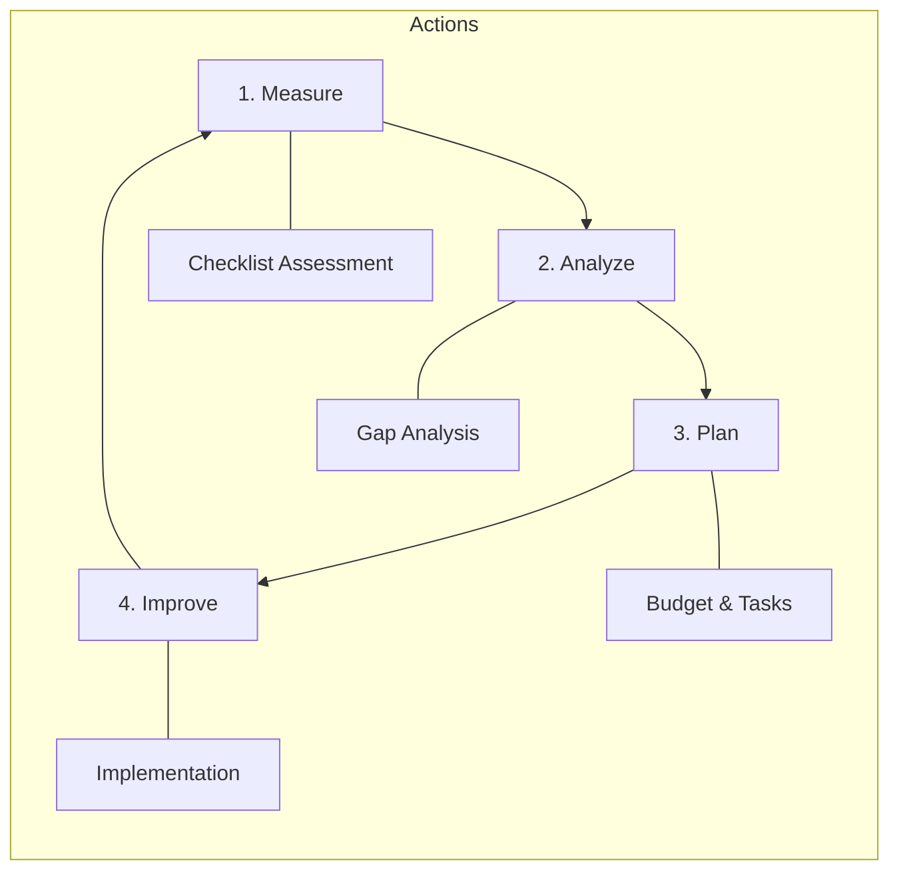

# SOC Capability Maturity Model (SOC-CMM) Assessment

**Assessment Period**: Quarterly

## 1. Improvement Cycle
We use a continuous improvement loop to advance our SOC maturity.

## 2. Maturity Levels
-   **Level 1 (Initial)**: Ad-hoc, chaotic, reactive.
-   **Level 2 (Managed)**: Processes defined but reactive.
-   **Level 3 (Defined)**: Proactive, documented standards (We are here).
-   **Level 4 (Quantitatively Managed)**: Metrics-driven (MTTD/MTTR).
-   **Level 5 (Optimizing)**: Automated, AI-driven, advanced hunting.

## 3. Assessment Checklist

### Domain 1: Business
- [ ] Defined SOC Charter & Strategy?
- [ ] Executive Sponsorship & Budget?
- [ ] Defined Metrics (KPIs) reporting?

### Domain 2: People
- [ ] 24/7 Shift Schedule operational?
- [ ] defined Onboarding Curriculum?
- [ ] Regular Skill Training (Purple Team)?

### Domain 3: Process
- [ ] SOPs for all major tasks?
- [ ] Playbooks for top 10 threats?
- [ ] Change Management (RFC) in place?

### Domain 4: Technology
- [ ] SIEM ingesting critical logs?
- [ ] EDR deployed on 95%+ endpoints?
- [ ] SOAR automation for repetitive tasks?

### Domain 5: Services
- [ ] Real-time Monitoring & Alerting?
- [ ] Incident Response Capability?
- [ ] Threat Intelligence integration?

## 4. Scoring
Count the "Yes" answers to determine approximate maturity.
-   0-5: Level 1
-   6-10: Level 2
-   11-15: Level 3 (Target Baseline)
-   16-18: Level 4
-   19+: Level 5

### Domain 6: Compliance & Governance
- [ ] PDPA / GDPR compliance procedures in place?
- [ ] Data classification and TLP standards followed?
- [ ] Regular compliance audits conducted?
- [ ] DPO coordination process established?

## 5. Gap Analysis Template

| Domain | Current Level | Target Level | Gap | Priority | Remediation |
|:---|:---:|:---:|:---:|:---:|:---|
| Business | [1-5] | [3+] | [Δ] | [H/M/L] | [Action items] |
| People | [1-5] | [3+] | [Δ] | [H/M/L] | [Action items] |
| Process | [1-5] | [3+] | [Δ] | [H/M/L] | [Action items] |
| Technology | [1-5] | [3+] | [Δ] | [H/M/L] | [Action items] |
| Services | [1-5] | [3+] | [Δ] | [H/M/L] | [Action items] |
| Compliance | [1-5] | [3+] | [Δ] | [H/M/L] | [Action items] |

## 6. Improvement Roadmap

| Quarter | Focus Area | Key Initiatives | Success Criteria |
|:---|:---|:---|:---|
| Q1 | Foundation | SOPs, shift schedule, log onboarding | Level 2 achieved |
| Q2 | Detection | Sigma rules, playbooks, alert tuning | 50 playbooks active |
| Q3 | Automation | SOAR workflows, auto-enrichment | MTTR < 60 min |
| Q4 | Advanced | Threat hunting, purple team, TI program | Level 3 achieved |

## 7. Assessment Schedule

| Assessment Type | Frequency | Participants | Output |
|:---|:---|:---|:---|
| Self-assessment (this checklist) | Quarterly | SOC Manager + Leads | Maturity score + gaps |
| Peer review | Semi-annually | Partner SOC / consultant | Independent assessment |
| External audit | Annually | Third-party assessor | Formal maturity report |

## 8. Detailed Scoring Rubric

### Domain 1: Business (0-20 points)

| Question | 0 pts | 1 pt | 2 pts | 3 pts | 4 pts |
|:---|:---|:---|:---|:---|:---|
| SOC Charter & Strategy | None | Draft | Approved | Reviewed annually | Aligned to business risk |
| Executive Sponsorship | None | Informal | Formal sponsor | Budget allocated | Board reporting |
| KPI Reporting | None | Ad-hoc | Monthly manual | Automated dashboard | Executive dashboard |
| Budget & Resources | No budget | Shared budget | Dedicated budget | Multi-year plan | ROI-linked |
| Business Alignment | No alignment | Partial | Mapped to risks | Risk-adjusted | Board-integrated |

### Domain 2: People (0-20 points)

| Question | 0 pts | 1 pt | 2 pts | 3 pts | 4 pts |
|:---|:---|:---|:---|:---|:---|
| Staffing Coverage | Business hours | Extended hours | 24/5 | 24/7 on-call | 24/7 fully staffed |
| Onboarding Program | None | Informal | Documented | Structured + testing | Mentorship program |
| Continuous Training | None | Annual | Quarterly | Monthly | Weekly CTF/exercises |
| Career Development | None | Job descriptions | Career paths | Growth plans | Retention strategy |
| Burnout Prevention | None | Awareness | Shift rotation | Wellness program | Proactive monitoring |

### Domain 3: Process (0-20 points)

| Question | 0 pts | 1 pt | 2 pts | 3 pts | 4 pts |
|:---|:---|:---|:---|:---|:---|
| SOPs Documentation | None | <50% covered | 50-80% covered | >80% covered | 100% + version control |
| Playbook Coverage | None | Top 5 threats | Top 10 threats | Top 20 threats | All threats + auto |
| Change Management | None | Informal | Documented RFC | Peer-reviewed RFC | Automated CI/CD |
| Lessons Learned | None | Ad-hoc | Per-incident | Trending analysis | Automated improvement |
| Process Metrics | None | Manual tracking | Monthly review | Real-time dashboard | Predictive analytics |

## 9. Previous Assessment Tracker

| Assessment Date | Overall Score | Level | Key Gaps | Actions Taken |
|:---|:---:|:---:|:---|:---|
| YYYY-MM-DD | __/100 | [1-5] | [List gaps] | [Actions completed] |
| YYYY-MM-DD | __/100 | [1-5] | [List gaps] | [Actions completed] |
| YYYY-MM-DD | __/100 | [1-5] | [List gaps] | [Actions completed] |
| YYYY-MM-DD | __/100 | [1-5] | [List gaps] | [Actions completed] |

## Industry Maturity Benchmarks

Compare your SOC maturity against industry averages:

| Domain | Level 1 (Initial) | Level 2 (Managed) | Level 3 (Defined) | Level 4 (Measured) | Level 5 (Optimized) |
|:---|:---|:---|:---|:---|:---|
| **People** | Ad-hoc staffing | Defined roles | Training program | Career paths | Continuous development |
| **Process** | Reactive only | Basic IR process | Documented SOPs | Metrics-driven | Continuous improvement |
| **Technology** | Basic SIEM | SIEM + EDR | SOAR integration | Full stack automated | AI/ML-assisted |
| **Detection** | Vendor defaults | Custom rules | MITRE-mapped | Threat-intel driven | Proactive hunting |
| **Response** | Manual, slow | Playbook-based | Partially automated | Mostly automated | Fully orchestrated |

### Typical Maturity by SOC Age

| SOC Age | Expected Level | Key Focus Area |
|:---|:---:|:---|
| 0-6 months | Level 1 | Getting basics running |
| 6-12 months | Level 1-2 | Documentation + staffing |
| 1-2 years | Level 2-3 | Process maturity + coverage |
| 2-3 years | Level 3-4 | Metrics + automation |
| 3+ years | Level 4-5 | Optimization + innovation |

## Related Documents
-   [Incident Response Framework](../05_Incident_Response/Framework.en.md)
-   [SOC Metrics & KPIs](SOC_Metrics.en.md)
-   [SOC Maturity Assessment](SOC_Maturity_Assessment.en.md)

## References
-   [SOC-CMM (Capability Maturity Model)](https://www.soc-cmm.com/)
-   [MITRE SOC Strategy](https://mitre.org/)
