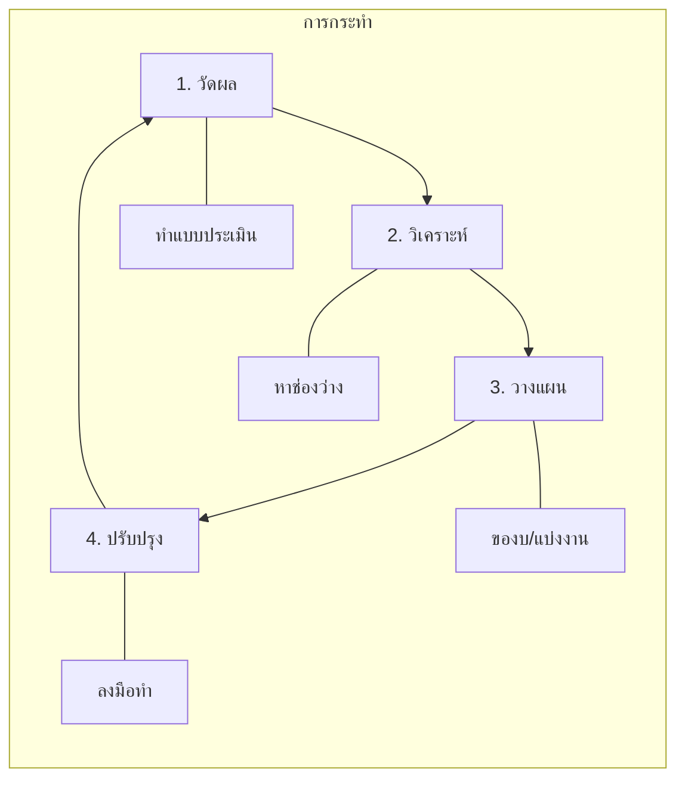

# แบบประเมินระดับความพร้อม SOC (SOC-CMM)

**รอบการประเมิน**: รายไตรมาส

## 1. วงจรการปรับปรุง (Improvement Cycle)
เราใช้วงจรการปรับปรุงอย่างต่อเนื่องเพื่อยกระดับความสามารถของ SOC

## 2. ระดับความพร้อม (Maturity Levels)
-   **Level 1 (Initial)**: ทำตามมีตามเกิด, แก้ปัญหาเฉพาะหน้า
-   **Level 2 (Managed)**: มีกระบวนการ แต่ยังทำงานเชิงรับ (Reactive)
-   **Level 3 (Defined)**: มีมาตรฐานชัดเจน, ทำงานเชิงรุก (Proactive) **(เป้าหมายปัจจุบัน)**
-   **Level 4 (Quantitatively Managed)**: ขับเคลื่อนด้วยข้อมูล (Metrics/KPIs)
-   **Level 5 (Optimizing)**: อัตโนมัติขั้นสูง, AI-driven

## 3. รายการตรวจเช็ค (Checklist)

### Domain 1: ธุรกิจ (Business)
- [ ] มีพ.ร.บ. หรือกฎบัตร (Charter) ของ SOC?
- [ ] ได้รับการสนับสนุนงบประมาณจากผู้บริหาร?
- [ ] มีการรายงานผล KPI สม่ำเสมอ?

### Domain 2: บุคลากร (People)
- [ ] มีตารางเวร 24/7 ที่ชัดเจน?
- [ ] มีหลักสูตร Onboarding พนักงานใหม่?
- [ ] มีการฝึกอบรมทักษะ (เช่น Purple Team) สม่ำเสมอ?

### Domain 3: กระบวนการ (Process)
- [ ] มี SOP ครอบคลุมงานหลัก?
- [ ] มี Playbook รับมือภัยคุกคาม 10 อันดับแรก?
- [ ] มีกระบวนการ Change Management (RFC)?

### Domain 4: เทคโนโลยี (Technology)
- [ ] SIEM รับ Log สำคัญครบถ้วน?
- [ ] EDR ติดตั้งครอบคลุม 95%+ ของเครื่อง?
- [ ] มีระบบ SOAR ช่วยงานซ้ำๆ?

### Domain 5: บริการ (Services)
- [ ] มีการเฝ้าระวังและแจ้งเตือนแบบ Real-time?
- [ ] มีขีดความสามารถในการตอบสนองเหตุการณ์ (IR)?
- [ ] มีการใช้ Threat Intelligence?

## 4. การให้คะแนน
นับจำนวนข้อที่ตอบ "ใช่" เพื่อประเมินระดับ
-   0-5: Level 1
-   6-10: Level 2
-   11-13: Level 3 (เกณฑ์มาตรฐาน)
-   14+: Level 4+

### โดเมน 6: การปฏิบัติตามและการกำกับดูแล
- [ ] มีขั้นตอน PDPA / GDPR?
- [ ] มาตรฐานการจำแนกข้อมูลและ TLP?
- [ ] ดำเนินการตรวจสอบการปฏิบัติตามเป็นประจำ?

## เทมเพลตวิเคราะห์ช่องว่าง

| โดเมน | ระดับปัจจุบัน | ระดับเป้าหมาย | ช่องว่าง | ลำดับ | การแก้ไข |
|:---|:---:|:---:|:---:|:---:|:---|
| ธุรกิจ | [1-5] | [3+] | [Δ] | [H/M/L] | [รายการดำเนินการ] |
| บุคลากร | [1-5] | [3+] | [Δ] | [H/M/L] | [รายการดำเนินการ] |
| กระบวนการ | [1-5] | [3+] | [Δ] | [H/M/L] | [รายการดำเนินการ] |
| เทคโนโลยี | [1-5] | [3+] | [Δ] | [H/M/L] | [รายการดำเนินการ] |
| บริการ | [1-5] | [3+] | [Δ] | [H/M/L] | [รายการดำเนินการ] |
| การปฏิบัติตาม | [1-5] | [3+] | [Δ] | [H/M/L] | [รายการดำเนินการ] |

## แผนการปรับปรุง

| ไตรมาส | พื้นที่เน้น | กิจกรรมหลัก | เกณฑ์ความสำเร็จ |
|:---|:---|:---|:---|
| Q1 | พื้นฐาน | SOPs, ตารางกะ, Log onboarding | ถึงระดับ 2 |
| Q2 | การตรวจจับ | Sigma rules, playbooks, การปรับจูน | 50 playbooks ใช้งาน |
| Q3 | ระบบอัตโนมัติ | SOAR workflows, auto-enrichment | MTTR < 60 นาที |
| Q4 | ขั้นสูง | Threat hunting, purple team, TI program | ถึงระดับ 3 |

## 8. เกณฑ์ให้คะแนนโดยละเอียด

### ด้าน 1: ธุรกิจ (0-20 คะแนน)

| คำถาม | 0 | 1 | 2 | 3 | 4 |
|:---|:---|:---|:---|:---|:---|
| SOC Charter | ไม่มี | ร่าง | อนุมัติ | ทบทวนรายปี | สอดคล้องความเสี่ยง |
| Executive Sponsorship | ไม่มี | ไม่เป็นทางการ | มี sponsor | จัดสรรงบ | รายงาน Board |
| KPI Reporting | ไม่มี | Ad-hoc | รายเดือน manual | Dashboard อัตโนมัติ | Executive dashboard |
| งบประมาณ | ไม่มีงบ | ใช้ร่วม | งบเฉพาะ | แผนหลายปี | ผูกกับ ROI |
| Business Alignment | ไม่สอดคล้อง | บางส่วน | Map กับเสี่ยง | ปรับตามความเสี่ยง | Board-integrated |

### ด้าน 2: คน (0-20 คะแนน)

| คำถาม | 0 | 1 | 2 | 3 | 4 |
|:---|:---|:---|:---|:---|:---|
| Staffing Coverage | เวลาทำการ | ขยายเวลา | 24/5 | 24/7 on-call | 24/7 เต็มอัตรา |
| โปรแกรม Onboarding | ไม่มี | ไม่เป็นทางการ | มีเอกสาร | มีโครงสร้าง+ทดสอบ | Mentorship |
| ฝึกอบรมต่อเนื่อง | ไม่มี | ปีละครั้ง | รายไตรมาส | รายเดือน | Weekly CTF |
| พัฒนาอาชีพ | ไม่มี | JD ชัด | Career path | แผนเติบโต | Retention strategy |
| ป้องกัน Burnout | ไม่มี | รับรู้ | หมุนกะ | Wellness program | ตรวจเชิงรุก |

### ด้าน 3: กระบวนการ (0-20 คะแนน)

| คำถาม | 0 | 1 | 2 | 3 | 4 |
|:---|:---|:---|:---|:---|:---|
| SOPs Documentation | ไม่มี | <50% | 50-80% | >80% | 100% + version control |
| Playbook Coverage | ไม่มี | Top 5 | Top 10 | Top 20 | ครบ + auto |
| Change Management | ไม่มี | ไม่เป็นทางการ | RFC เอกสาร | Peer-reviewed RFC | CI/CD อัตโนมัติ |
| Lessons Learned | ไม่มี | Ad-hoc | ทุก incident | วิเคราะห์แนวโน้ม | ปรับปรุงอัตโนมัติ |
| Process Metrics | ไม่มี | ติดตาม manual | ทบทวนรายเดือน | Real-time dashboard | Predictive analytics |

## 9. ตัวติดตามผลประเมินก่อนหน้า

| วันที่ประเมิน | คะแนนรวม | Level | ช่องโหว่หลัก | การดำเนินการ |
|:---|:---:|:---:|:---|:---|
| YYYY-MM-DD | __/100 | [1-5] | [ระบุช่องโหว่] | [สิ่งที่ทำแล้ว] |
| YYYY-MM-DD | __/100 | [1-5] | [ระบุช่องโหว่] | [สิ่งที่ทำแล้ว] |
| YYYY-MM-DD | __/100 | [1-5] | [ระบุช่องโหว่] | [สิ่งที่ทำแล้ว] |
| YYYY-MM-DD | __/100 | [1-5] | [ระบุช่องโหว่] | [สิ่งที่ทำแล้ว] |

## เกณฑ์ Maturity อุตสาหกรรม

เปรียบเทียบ maturity ของ SOC กับค่าเฉลี่ยอุตสาหกรรม:

| ด้าน | Level 1 (เริ่มต้น) | Level 2 (จัดการ) | Level 3 (กำหนด) | Level 4 (วัดผล) | Level 5 (ปรับปรุง) |
|:---|:---|:---|:---|:---|:---|
| **บุคลากร** | จ้างเฉพาะกิจ | กำหนดบทบาท | โปรแกรมฝึกอบรม | Career paths | พัฒนาต่อเนื่อง |
| **กระบวนการ** | Reactive เท่านั้น | IR process พื้นฐาน | SOPs บันทึกไว้ | ขับเคลื่อนด้วย metrics | ปรับปรุงต่อเนื่อง |
| **เทคโนโลยี** | SIEM พื้นฐาน | SIEM + EDR | SOAR integration | Full stack automated | AI/ML-assisted |
| **Detection** | Vendor defaults | Custom rules | MITRE-mapped | Threat-intel driven | Proactive hunting |
| **Response** | Manual, ช้า | Playbook-based | อัตโนมัติบางส่วน | อัตโนมัติส่วนใหญ่ | Fully orchestrated |

### Maturity ทั่วไปตามอายุ SOC

| อายุ SOC | Level คาดหวัง | จุดเน้นสำคัญ |
|:---|:---:|:---|
| 0-6 เดือน | Level 1 | ทำพื้นฐานให้ทำงานได้ |
| 6-12 เดือน | Level 1-2 | เอกสาร + กำลังคน |
| 1-2 ปี | Level 2-3 | กระบวนการ + coverage |
| 2-3 ปี | Level 3-4 | Metrics + automation |
| 3+ ปี | Level 4-5 | Optimization + innovation |

## เอกสารที่เกี่ยวข้อง (Related Documents)
-   [กรอบการตอบสนองเหตุการณ์](../05_Incident_Response/Framework.th.md)
-   [แบบประเมิน SOC](SOC_Assessment_Checklist.th.md)
-   [ตัวชี้วัด SOC](SOC_Metrics.th.md)

### Assessment Scoring Guide

| Score | Meaning | Action |
|:---|:---|:---|
| 0-2 | Critical gap | Immediate fix |
| 3-4 | Needs improvement | Plan within 30d |
| 5 | Meets standard | Maintain |

## References
-   [SOC-CMM (Capability Maturity Model)](https://www.soc-cmm.com/)
-   [MITRE SOC Strategy](https://mitre.org/)
-   14+: Level 4+
