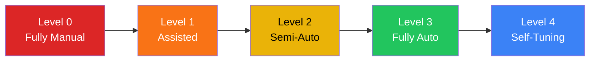

# SOC Automation Catalog

**Document ID**: OPS-SOP-012
**Version**: 1.0
**Classification**: Internal
**Last Updated**: 2026-02-15

> This catalog lists **every automation** the SOC uses or should implement, organized by category. Use it to track automation maturity, identify manual processes that should be automated, and onboard analysts to existing automations.

---

## Automation Maturity Levels



| Level | Name | Description | Example |
|:---:|:---|:---|:---|
| **L0** | Fully Manual | Analyst does everything by hand | Copy-paste IOCs into lookup tools |
| **L1** | Assisted | Tool provides suggestions, analyst acts | SIEM enriches alert with context |
| **L2** | Semi-Automated | Tool executes, analyst approves | SOAR submits ticket after analyst confirms |
| **L3** | Fully Automated | No human intervention needed | Auto-block IOCs from TI feeds |
| **L4** | Self-Tuning | System learns and adjusts automatically | ML-based alert prioritization |

---

## 1. Alert Triage & Enrichment

| # | Automation | Description | Trigger | Current | Target | Priority |
|:---:|:---|:---|:---|:---:|:---:|:---:|
| 1.1 | **IOC Auto-Enrichment** | Lookup hash/IP/domain against TI feeds on alert creation | New alert | L1 | L3 | 🔴 P1 |
| 1.2 | **Alert Deduplication** | Suppress duplicate alerts from same source within time window | Alert ingestion | L1 | L3 | 🔴 P1 |
| 1.3 | **Alert Priority Scoring** | Calculate severity based on asset criticality + TI + user risk | New alert | L0 | L2 | 🟠 P2 |
| 1.4 | **Context Enrichment** | Auto-add user info, asset details, recent activity to alert | New alert | L1 | L3 | 🔴 P1 |
| 1.5 | **False Positive Filtering** | Auto-close known FP patterns with documentation | Alert ingestion | L0 | L2 | 🟠 P2 |
| 1.6 | **Alert Correlation** | Group related alerts into incidents automatically | Multiple alerts | L1 | L3 | 🟠 P2 |
| 1.7 | **GeoIP Enrichment** | Add geographic info to IP-based alerts | IP in alert | L2 | L3 | 🟢 P3 |

---

## 2. Incident Response Automation

| # | Automation | Description | Trigger | Current | Target | Priority |
|:---:|:---|:---|:---|:---:|:---:|:---:|
| 2.1 | **Phishing Email Quarantine** | Auto-quarantine reported phishing emails org-wide | User report or detection | L1 | L3 | 🔴 P1 |
| 2.2 | **Endpoint Isolation** | Auto-isolate endpoint on confirmed malware/C2 | P1/P2 malware alert | L1 | L2 | 🔴 P1 |
| 2.3 | **Account Disable** | Auto-disable compromised account | Confirmed compromise (P1) | L1 | L2 | 🔴 P1 |
| 2.4 | **Firewall Block IOC** | Auto-add malicious IPs/domains to firewall block list | Confirmed malicious IOC | L1 | L3 | 🟠 P2 |
| 2.5 | **Ticket Creation** | Auto-create incident ticket with enriched context | New P1/P2 alert | L2 | L3 | 🟠 P2 |
| 2.6 | **Notification Dispatch** | Auto-send notifications based on severity and escalation matrix | Incident classification | L1 | L3 | 🟠 P2 |
| 2.7 | **Evidence Collection** | Auto-collect forensic artifacts (memory, logs) on trigger | P1 incident declared | L0 | L2 | 🟡 P3 |
| 2.8 | **MFA Reset** | Auto-trigger MFA re-enrollment after account compromise | Account recovery | L0 | L2 | 🟡 P3 |

---

## 3. Threat Intelligence Automation

| # | Automation | Description | Trigger | Current | Target | Priority |
|:---:|:---|:---|:---|:---:|:---:|:---:|
| 3.1 | **TI Feed Ingestion** | Auto-ingest IOCs from configured TI feeds | Scheduled (hourly) | L2 | L3 | 🔴 P1 |
| 3.2 | **IOC Expiry** | Auto-expire old IOCs based on age and confidence | Daily cleanup | L0 | L3 | 🟠 P2 |
| 3.3 | **Retroactive Hunting** | Re-scan historical logs when new high-confidence IOC arrives | New critical IOC | L0 | L2 | 🟠 P2 |
| 3.4 | **TI Report Parsing** | Extract IOCs from PDF/email threat reports automatically | Report received | L0 | L2 | 🟡 P3 |
| 3.5 | **MITRE Mapping** | Auto-tag alerts with ATT&CK techniques based on detection rule | Alert creation | L1 | L3 | 🟠 P2 |

---

## 4. Detection Engineering Automation

| # | Automation | Description | Trigger | Current | Target | Priority |
|:---:|:---|:---|:---|:---:|:---:|:---:|
| 4.1 | **Sigma Rule Deployment** | Auto-convert Sigma rules to SIEM query format and deploy | Git push to rules repo | L1 | L3 | 🔴 P1 |
| 4.2 | **Detection Rule Testing** | Auto-validate new rules against test data before production | PR to rules repo | L0 | L2 | 🟠 P2 |
| 4.3 | **Rule Performance Metrics** | Auto-track TP/FP ratio per rule, flag underperformers | Weekly schedule | L0 | L2 | 🟠 P2 |
| 4.4 | **Coverage Gap Report** | Auto-generate MITRE ATT&CK coverage heatmap | Monthly schedule | L0 | L2 | 🟡 P3 |
| 4.5 | **YARA Rule Scanning** | Auto-scan file submissions against YARA rule set | File submission | L1 | L3 | 🟠 P2 |

---

## 5. Operational Automation

| # | Automation | Description | Trigger | Current | Target | Priority |
|:---:|:---|:---|:---|:---:|:---:|:---:|
| 5.1 | **Shift Handoff Report** | Auto-generate shift summary from open tickets and alerts | Shift end | L0 | L2 | 🟠 P2 |
| 5.2 | **Log Source Health Check** | Auto-alert when log source stops sending for > threshold | Every 15 min | L1 | L3 | 🔴 P1 |
| 5.3 | **SIEM License Monitor** | Auto-alert when EPS approaches license limit | Hourly check | L0 | L2 | 🟠 P2 |
| 5.4 | **SLA Breach Warning** | Auto-notify when ticket approaches SLA deadline | Ticket age check | L1 | L3 | 🟠 P2 |
| 5.5 | **Monthly KPI Report** | Auto-generate SOC metrics dashboard for management | Monthly schedule | L0 | L2 | 🟡 P3 |
| 5.6 | **Analyst Workload Balance** | Auto-distribute alerts based on analyst availability/skill | Alert assignment | L0 | L2 | 🟡 P3 |
| 5.7 | **Compliance Evidence Export** | Auto-export evidence for audit (logs, tickets, metrics) | Quarterly schedule | L0 | L2 | 🟡 P3 |

---

## 6. User & Entity Behavior

| # | Automation | Description | Trigger | Current | Target | Priority |
|:---:|:---|:---|:---|:---:|:---:|:---:|
| 6.1 | **Impossible Travel Detection** | Auto-detect logins from geographically impossible locations | Login event | L2 | L3 | 🟠 P2 |
| 6.2 | **Baseline Deviation Alert** | Alert when user behavior deviates significantly from baseline | Continuous | L0 | L2 | 🟡 P3 |
| 6.3 | **Privileged Account Monitoring** | Auto-alert on unusual privileged account activity | Privileged event | L1 | L3 | 🟠 P2 |
| 6.4 | **Off-Hours Activity** | Auto-flag activity outside normal working hours | After-hours event | L1 | L2 | 🟡 P3 |

---

## Implementation Roadmap

```mermaid
gantt
    title SOC Automation Roadmap
    dateFormat  YYYY-Q
    axisFormat  %Y-Q%q

    section P1 Critical
    IOC Auto-Enrichment          :2026-Q1, 90d
    Alert Deduplication          :2026-Q1, 90d
    Phishing Quarantine          :2026-Q1, 90d
    Sigma Rule Deployment        :2026-Q1, 90d
    Log Source Health Check      :2026-Q1, 90d

    section P2 High
    Alert Priority Scoring       :2026-Q2, 90d
    Endpoint Isolation           :2026-Q2, 90d
    TI Feed Ingestion            :2026-Q2, 90d
    Rule Performance Metrics     :2026-Q2, 90d

    section P3 Medium
    Evidence Collection          :2026-Q3, 90d
    Shift Handoff Report         :2026-Q3, 90d
    Monthly KPI Report           :2026-Q3, 90d
```

---

## Automation Decision Framework

> Use this framework to decide whether to automate a process.

| Factor | Score 1 (Low) | Score 2 (Med) | Score 3 (High) |
|:---|:---|:---|:---|
| **Frequency** | Monthly or less | Weekly | Daily or more |
| **Time per execution** | < 5 min | 5–30 min | > 30 min |
| **Error risk (manual)** | Low | Medium | High |
| **Impact if delayed** | Informational | Operational | Security-critical |
| **Complexity to automate** | High (custom dev) | Medium (API calls) | Low (built-in feature) |

**Scoring:**
- **12–15**: Automate immediately
- **8–11**: Plan for next quarter
- **5–7**: Keep manual, reassess later

---

## Automation Metrics

| Metric | Target | Measurement |
|:---|:---:|:---|
| Automation coverage (% of catalog at L2+) | ≥ 50% | Count items at L2+ / total |
| Mean Time to Enrich (MTTE) | < 30 sec | Alert creation → enrichment complete |
| Auto-resolved alerts | ≥ 30% of P4 | Auto-closed / total P4 |
| SOAR playbook execution success rate | ≥ 95% | Successful runs / total runs |
| Analyst time saved per shift | ≥ 2 hours | Before vs after automation |
| False positive auto-filter accuracy | ≥ 98% | Correct FP / total auto-filtered |

---

## SOAR Playbook Quick Reference

> These map to the [SOAR Playbook Templates](../05_Incident_Response/SOAR_Playbooks.en.md).

| Playbook | Trigger | Key Actions | Auto Level |
|:---|:---|:---|:---:|
| PB-PHISH | User report / email alert | Quarantine → URL scan → notify user | L2 |
| PB-MALWARE | EDR detection | Isolate → collect evidence → ticket | L2 |
| PB-BRUTE | 10+ failed logins | Check geo → check MFA → block/alert | L2 |
| PB-IOC-BLOCK | TI feed match | Verify → add to blocklist → notify | L3 |
| PB-ACCT-COMP | Confirmed compromise | Disable → reset → MFA re-enroll → ticket | L2 |
| PB-LOG-HEALTH | Source silent > 30 min | Check → alert SOC → ticket to engineering | L3 |

---

## Related Documents

-   [SOAR Playbooks](../05_Incident_Response/SOAR_Playbooks.en.md) — Detailed playbook templates
-   [Threat Hunting Playbook](../05_Incident_Response/Threat_Hunting_Playbook.en.md) — Proactive hunting
-   [Detection Rule Testing SOP](../06_Operations_Management/Detection_Rule_Testing.en.md)
-   [TI Feeds Integration](../06_Operations_Management/TI_Feeds_Integration.en.md)
-   [SOC Metrics & KPIs](../06_Operations_Management/SOC_Metrics.en.md)
-   [Log Source Matrix](../06_Operations_Management/Log_Source_Matrix.en.md)
-   [SOC Checklists](../06_Operations_Management/SOC_Checklists.en.md)
