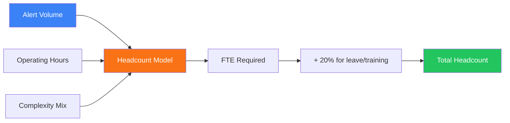

# SOC Capacity Planning

**Document ID**: OPS-SOP-026
**Version**: 1.0
**Classification**: Internal
**Last Updated**: 2026-02-16

> Framework for **planning SOC staffing, infrastructure, and budget** based on organizational growth, threat landscape changes, and operational requirements. Covers headcount modeling, infrastructure sizing, license planning, and budget forecasting.

---

## Staffing Model

### Headcount Calculator

### Staffing by Coverage Model

| Coverage Model | Shifts | Min Analysts | Lead/Manager | Total FTE |
|:---|:---:|:---:|:---:|:---:|
| **Business Hours** (8×5) | 1 | 2 | 1 | 3 |
| **Extended** (16×5) | 2 | 4 | 1 | 5 |
| **24/5** | 3 | 6 | 1 | 7 |
| **24/7** | 4 | 8 | 2 | 10 |
| **24/7 + Hunt** | 4 | 10 | 2 + 2 TH | 14 |

### Role-Based Capacity

| Role | Capacity per FTE | Notes |
|:---|:---|:---|
| **Tier 1 Analyst** | 30–50 alerts/shift | Triage and initial response |
| **Tier 2 Analyst** | 5–10 investigations/day | Deep investigation |
| **Tier 3 / Hunt** | 2–4 hunts/week | Proactive threat hunting |
| **Detection Engineer** | 5–10 rules/week | Rule creation, tuning, testing |
| **SOAR Engineer** | 2–3 playbooks/month | Automation development |
| **SOC Manager** | 8–12 direct reports | Team management, reporting |

---

## Infrastructure Sizing

### SIEM Sizing

| Factor | Measurement | Sizing Impact |
|:---|:---|:---|
| **Events per second (EPS)** | Avg + peak EPS | CPU, memory, indexing |
| **Daily ingest volume** | GB/day | Storage, license cost |
| **Retention period** | Hot/warm/cold days | Total storage |
| **Concurrent users** | Active searchers | Memory, CPU |
| **Correlation rules** | Number of active rules | CPU |
| **Searches/dashboards** | Concurrent queries | CPU, I/O |

### SIEM Sizing Tiers

| Tier | EPS | Daily Volume | Storage (1yr) | vCPU | RAM |
|:---|:---:|:---:|:---:|:---:|:---:|
| **Small** | < 5K | < 50 GB | 18 TB | 8 | 32 GB |
| **Medium** | 5–25K | 50–250 GB | 90 TB | 24 | 96 GB |
| **Large** | 25–100K | 250 GB–1 TB | 365 TB | 64 | 256 GB |
| **Enterprise** | > 100K | > 1 TB | 500+ TB | 128+ | 512+ GB |

### Log Volume Planning

| Log Source | Avg EPS / Device | Volume / Day | Growth Rate |
|:---|:---:|:---:|:---:|
| **Firewall** | 200–500 | 5–15 GB | 15%/yr |
| **IDS/IPS** | 50–200 | 2–8 GB | 10%/yr |
| **Endpoint (EDR)** | 10–50 / agent | 0.2–1 GB | 20%/yr |
| **Windows Event Log** | 5–20 / host | 0.1–0.5 GB | 10%/yr |
| **DNS** | 100–500 | 3–10 GB | 15%/yr |
| **Proxy / Web** | 50–300 | 2–10 GB | 20%/yr |
| **Cloud (AWS/Azure)** | 20–200 | 1–5 GB | 30%/yr |
| **Email Gateway** | 10–50 | 0.5–3 GB | 10%/yr |
| **VPN** | 5–20 | 0.1–0.5 GB | 15%/yr |

---

## License Planning

### Core Platform Licenses

| Platform | Metric | Typical Pricing Model |
|:---|:---|:---|
| **SIEM** | EPS / GB ingested / endpoints | Per GB/day or EPS tier |
| **SOAR** | Actions/month or users | Per user or action volume |
| **EDR** | Endpoints protected | Per endpoint/year |
| **TI Platform** | Users + API calls | Per user + API tier |
| **Vulnerability Scanner** | IPs / assets scanned | Per asset/year |
| **CASB** | Users protected | Per user/year |
| **Email Security** | Mailboxes | Per mailbox/year |

### License Growth Forecast

| Year | Endpoints | EPS | SIEM Storage | EDR Licenses | Est. Growth |
|:---:|:---:|:---:|:---:|:---:|:---:|
| Current | _____ | _____ | _____ TB | _____ | Baseline |
| +1 year | +15% | +20% | +25% | +15% | Organic |
| +2 years | +35% | +45% | +55% | +35% | Organic + M&A |
| +3 years | +60% | +75% | +90% | +60% | Strategic plan |

---

## Budget Planning

### SOC Budget Categories

| Category | % of SOC Budget | Components |
|:---|:---:|:---|
| **People** | 55–65% | Salaries, benefits, training, certifications |
| **Technology** | 25–35% | SIEM, SOAR, EDR, TI, cloud services |
| **Operations** | 5–10% | Facilities, power, network, travel |
| **Professional Services** | 3–5% | Consulting, managed services, pentest |
| **Contingency** | 3–5% | Incident response retainer, surge capacity |

### Cost Per Alert Analysis

| Component | Cost Factor | Calculation |
|:---|:---|:---|
| **Analyst time** | Avg salary ÷ alerts handled | ฿___ per alert |
| **Tool cost** | License ÷ alerts processed | ฿___ per alert |
| **Overhead** | Infrastructure ÷ total alerts | ฿___ per alert |
| **Total cost per alert** | Sum of above | ฿___ per alert |

### Automation ROI

| Before Automation | After Automation | Savings |
|:---|:---|:---|
| 50 alerts/analyst/shift | 80 alerts/analyst/shift | 37.5% capacity gain |
| 15 min avg triage time | 5 min with SOAR | 66% time reduction |
| 3 analysts for triage | 2 analysts for triage | 1 FTE saved |
| Manual enrichment 10 min | Auto enrichment 30 sec | 95% faster |

---

## Growth Triggers

### When to Scale

| Trigger | Indicator | Action |
|:---|:---|:---|
| **Alert volume > capacity** | Analysts consistently above 50/shift | Add analyst FTE |
| **MTTD increasing** | MTTD trending above SLA | Add monitoring capacity |
| **MTTR increasing** | MTTR trending above SLA | Add investigation capacity |
| **Alert backlog growing** | Unresolved alerts > 24h SLA | Add triage capacity |
| **New log sources** | EPS increase > 20% | Expand SIEM resources |
| **M&A / expansion** | New business units | Staff + tool expansion |
| **New compliance** | New framework requirement | Compliance + tool additions |
| **High attrition** | Turnover > 15% | Compensation review + hire |

### Scaling Decision Matrix

| Scale Type | Timeline | Approval | Budget Impact |
|:---|:---:|:---|:---|
| **Add shift coverage** | 3–6 months | SOC Manager | 2–3 FTE |
| **Expand SIEM** | 1–3 months | IT Director | Infrastructure + licensing |
| **New tool deployment** | 3–6 months | CISO | Tool license + integration |
| **Managed service augment** | 1–2 months | CISO | Service contract |
| **Full SOC expansion** | 6–12 months | CxO | Major CAPEX + OPEX |

---

## Annual Planning Cycle

| Month | Activity | Deliverable |
|:---|:---|:---|
| **Q4 (Oct–Nov)** | Capacity assessment, growth forecast | Current state report |
| **Q4 (Nov)** | Budget request preparation | Budget proposal |
| **Q4 (Dec)** | Budget negotiation, approval | Approved budget |
| **Q1 (Jan)** | Hiring plan execution | Job postings, interviews |
| **Q1–Q2** | Infrastructure procurement | POs, vendor contracts |
| **Q2–Q3** | Deploy and onboard | New staff trained, tools live |
| **Q3 (Sep)** | Mid-year review, adjust forecast | Updated forecast |

---

## Metrics

| Metric | Target | Review Cycle |
|:---|:---:|:---:|
| Analyst utilization rate | 70–80% | Monthly |
| Alert-to-analyst ratio | ≤ 50/shift | Weekly |
| SIEM capacity headroom | ≥ 20% | Monthly |
| Budget variance | ± 5% | Quarterly |
| Attrition rate | < 15% | Quarterly |
| Training hours per analyst | ≥ 40 hrs/year | Annual |
| Automation coverage | ≥ 50% of triage | Quarterly |

---

## Related Documents

-   [SOC Team Structure](SOC_Team_Structure.en.md) — Roles and responsibilities
-   [SOC Metrics & KPIs](SOC_Metrics.en.md) — Performance measurement
-   [KPI Dashboard Template](KPI_Dashboard_Template.en.md) — Dashboard building
-   [SOC Maturity Assessment](SOC_Maturity_Assessment.en.md) — Capability levels
-   [Log Source Matrix](Log_Source_Matrix.en.md) — Data volume sources
-   [SOC Automation Catalog](SOC_Automation_Catalog.en.md) — Automation savings
