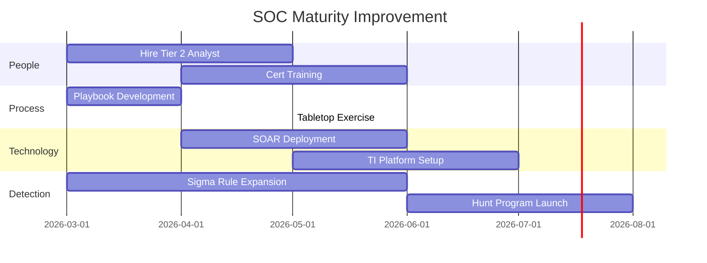

# SOC Maturity Assessment / การประเมินวุฒิภาวะ SOC

**รหัสเอกสาร**: OPS-SOP-015
**เวอร์ชัน**: 1.0
**การจัดชั้นความลับ**: ใช้ภายใน
**อัปเดตล่าสุด**: 2026-02-15

> เครื่องมือ **ประเมินตนเอง** สำหรับวัดวุฒิภาวะ SOC ใน 10 ด้าน ใช้ทุกไตรมาสเพื่อติดตามความก้าวหน้า, หาช่องว่าง, วางแผนลงทุน, และรายงานผู้บริหาร อิงหลักการ SOC-CMM

---

## ระดับวุฒิภาวะ

| ระดับ | ชื่อ | คำอธิบาย |
|:---:|:---|:---|
| **0** | ไม่มี | ไม่มีความสามารถ ไม่ตระหนัก |
| **1** | เริ่มต้น | ทำเป็นครั้งคราว, reactive, ไม่มีเอกสาร |
| **2** | จัดการ | กระบวนการพื้นฐาน, เอกสารบางส่วน |
| **3** | มาตรฐาน | กระบวนการเป็นมาตรฐาน, มี SOP, ปฏิบัติสม่ำเสมอ |
| **4** | วัดผลได้ | ขับเคลื่อนด้วย KPI, วัดผลต่อเนื่อง |
| **5** | ปรับปรุงต่อเนื่อง | ปรับปรุงอัตโนมัติ, เป็นผู้นำอุตสาหกรรม |

---

## ด้านที่ 1: คนและองค์กร

| # | ความสามารถ | ระดับ 1 | ระดับ 3 | ระดับ 5 | ปัจจุบัน | เป้าหมาย |
|:---:|:---|:---|:---|:---|:---:|:---:|
| 1.1 | **อัตรากำลัง** | กำลังคนไม่พอ, กะเดียว | 24×7, กำหนด tier | ยืดหยุ่น, cross-trained | __/5 | __/5 |
| 1.2 | **บทบาทหน้าที่** | ไม่เป็นทางการ | RACI กำหนดชัด | กำหนดตามทักษะแบบ dynamic | __/5 | __/5 |
| 1.3 | **โปรแกรมฝึกอบรม** | ไม่มี | แผนรายปี, ติดตาม cert | CTF, purple team, career path | __/5 | __/5 |
| 1.4 | **การจัดการความรู้** | ความรู้อยู่ในตัวบุคคล | Wiki, runbooks | KB ค้นหาได้, auto-suggest | __/5 | __/5 |
| 1.5 | **การรักษา analyst** | ลาออก > 30% | 15–30% | < 15%, เส้นทางเติบโตชัด | __/5 | __/5 |

**คะแนนด้าน**: \_\_/25

---

## ด้านที่ 2: กระบวนการ

| # | ความสามารถ | ระดับ 1 | ระดับ 3 | ระดับ 5 | ปัจจุบัน | เป้าหมาย |
|:---:|:---|:---|:---|:---|:---:|:---:|
| 2.1 | **Alert triage** | ไม่มีมาตรฐาน | Runbook, document | Auto triage + ML scoring | __/5 | __/5 |
| 2.2 | **IR** | Reactive, ไม่มี playbook | 15+ playbooks | 30+ playbooks, automated | __/5 | __/5 |
| 2.3 | **Escalation** | ไม่เป็นทางการ | Matrix + SLA | Auto-escalation + SOAR | __/5 | __/5 |
| 2.4 | **Change management** | ไม่มี | CAB review | CI/CD สำหรับ detection | __/5 | __/5 |
| 2.5 | **Shift handoff** | ปากเปล่า | Template มาตรฐาน | อัตโนมัติ + context | __/5 | __/5 |

**คะแนนด้าน**: \_\_/25

---

## ด้านที่ 3: เทคโนโลยี

| # | ความสามารถ | ระดับ 1 | ระดับ 3 | ระดับ 5 | ปัจจุบัน | เป้าหมาย |
|:---:|:---|:---|:---|:---|:---:|:---:|
| 3.1 | **SIEM** | Deploy พื้นฐาน | Tuned rules, 80%+ log sources | ATT&CK ครบ, ML models | __/5 | __/5 |
| 3.2 | **EDR** | Antivirus เท่านั้น | EDR + alerts ใน SIEM | XDR + auto-contain | __/5 | __/5 |
| 3.3 | **SOAR** | ไม่มี automation | Playbooks 5+ | Catalog 30+ | __/5 | __/5 |
| 3.4 | **Threat intelligence** | ไม่มี TI | 3+ feeds, IOC matching | TI platform, auto hunting | __/5 | __/5 |
| 3.5 | **Ticketing** | Email/spreadsheet | Ticketing + SLA tracking | ITSM + SOAR integrated | __/5 | __/5 |

**คะแนนด้าน**: \_\_/25

---

## ด้านที่ 4: Detection Engineering

| # | ความสามารถ | ระดับ 1 | ระดับ 3 | ระดับ 5 | ปัจจุบัน | เป้าหมาย |
|:---:|:---|:---|:---|:---|:---:|:---:|
| 4.1 | **Detection rules** | ค่าเริ่มต้น vendor | Custom rules, tested | DaC pipeline, version control | __/5 | __/5 |
| 4.2 | **ATT&CK coverage** | < 20% | 40–60% | > 80% | __/5 | __/5 |
| 4.3 | **False positive** | FP > 50% | FP < 30% | FP < 10%, auto-tune | __/5 | __/5 |
| 4.4 | **Detection testing** | ไม่ทดสอบ | Purple team รายปี | BAS ต่อเนื่อง | __/5 | __/5 |
| 4.5 | **Rule lifecycle** | ไม่มี lifecycle | Create/review/retire | Metrics-driven, auto-deprecate | __/5 | __/5 |

**คะแนนด้าน**: \_\_/25

---

## ด้านที่ 5: Log Management

| # | ความสามารถ | ระดับ 1 | ระดับ 3 | ระดับ 5 | ปัจจุบัน | เป้าหมาย |
|:---:|:---|:---|:---|:---|:---:|:---:|
| 5.1 | **Log source coverage** | < 30% | 60–80% | > 95% | __/5 | __/5 |
| 5.2 | **คุณภาพ log** | Raw, ไม่ parse | Parsed, normalized | Enriched, correlated | __/5 | __/5 |
| 5.3 | **Retention** | < 30 วัน | 90–180 วัน | 1+ ปี, tiered storage | __/5 | __/5 |
| 5.4 | **Log health** | ไม่ monitor | ตรวจ manual | Alert อัตโนมัติ | __/5 | __/5 |
| 5.5 | **Cloud visibility** | ไม่มี cloud logs | IAM + network พื้นฐาน | Full cloud trail + CSPM | __/5 | __/5 |

**คะแนนด้าน**: \_\_/25

---

## ด้านที่ 6–10: (สรุปย่อ)

| # | ด้าน | คะแนน | สูงสุด |
|:---:|:---|:---:|:---:|
| 6 | **Incident Response** (MTTR, containment, forensics, comms, PIR) | _____ | 25 |
| 7 | **Threat Intelligence** (consumption, production, hunting, integration, landscape) | _____ | 25 |
| 8 | **Metrics & Reporting** (KPI, SLA, executive, trends, benchmarks) | _____ | 25 |
| 9 | **Compliance & Governance** (regulatory, audit, privacy, policy, risk) | _____ | 25 |
| 10 | **Automation & Orchestration** (enrichment, playbooks, auto-response, integration, AI/ML) | _____ | 25 |

---

## ตารางสรุปคะแนน

| # | ด้าน | คะแนน | สูงสุด | % | ระดับ |
|:---:|:---|:---:|:---:|:---:|:---:|
| 1 | คนและองค์กร | _____ | 25 | ___% | L_ |
| 2 | กระบวนการ | _____ | 25 | ___% | L_ |
| 3 | เทคโนโลยี | _____ | 25 | ___% | L_ |
| 4 | Detection Engineering | _____ | 25 | ___% | L_ |
| 5 | Log Management | _____ | 25 | ___% | L_ |
| 6 | Incident Response | _____ | 25 | ___% | L_ |
| 7 | Threat Intelligence | _____ | 25 | ___% | L_ |
| 8 | Metrics & Reporting | _____ | 25 | ___% | L_ |
| 9 | Compliance & Governance | _____ | 25 | ___% | L_ |
| 10 | Automation & Orchestration | _____ | 25 | ___% | L_ |
| | **รวม** | **_____** | **250** | **___%** | **L_** |

### ตีความระดับ

| ช่วงคะแนน | ระดับ | ความหมาย |
|:---:|:---:|:---|
| 0–50 | **Level 1** | เริ่มต้น — ช่องว่างสำคัญ, reactive |
| 51–100 | **Level 2** | จัดการ — มีพื้นฐาน, ต้องปรับปรุงมาก |
| 101–150 | **Level 3** | มาตรฐาน — พื้นฐานแข็ง, มีพื้นที่ optimize |
| 151–200 | **Level 4** | วัดผลได้ — ขับเคลื่อนด้วย metrics |
| 201–250 | **Level 5** | ปรับปรุงต่อเนื่อง — ผู้นำอุตสาหกรรม |

---

## แผนปรับปรุง

### Quick Wins (0–3 เดือน)

| ช่องว่าง | ด้าน | ปัจจุบัน | เป้าหมาย | การดำเนินการ |
|:---|:---:|:---:|:---:|:---|
| ______________ | _____ | L_ | L_ | ________________________ |

### ระยะกลาง (3–6 เดือน)

| ช่องว่าง | ด้าน | ปัจจุบัน | เป้าหมาย | การดำเนินการ |
|:---|:---:|:---:|:---:|:---|
| ______________ | _____ | L_ | L_ | ________________________ |

### เชิงกลยุทธ์ (6–12 เดือน)

| ช่องว่าง | ด้าน | ปัจจุบัน | เป้าหมาย | การดำเนินการ | งบประมาณ |
|:---|:---:|:---:|:---:|:---|:---:|
| ______________ | _____ | L_ | L_ | ________________________ | $_____ |

---

## เทมเพลตการประเมิน

### Self-Assessment Questionnaire

| # | คำถาม | ระดับ (1-5) | หลักฐาน |
|:---:|:---|:---:|:---|
| 1 | มี SIEM ที่ทำงานและรับ log ครบ? | [X] | [ระบุ] |
| 2 | มี detection rules ที่ map กับ MITRE ATT&CK? | [X] | [ระบุ] |
| 3 | มี playbooks สำหรับ top 10 use cases? | [X] | [ระบุ] |
| 4 | มี shift rotation 24/7? | [X] | [ระบุ] |
| 5 | มี KPIs tracking (MTTD, MTTR)? | [X] | [ระบุ] |
| 6 | จัด tabletop exercise อย่างน้อยปีละ 2 ครั้ง? | [X] | [ระบุ] |
| 7 | มี threat hunting program? | [X] | [ระบุ] |
| 8 | มี SOAR automation? | [X] | [ระบุ] |
| 9 | มี CTI program ที่ feed เข้า detection? | [X] | [ระบุ] |
| 10 | มี continuous improvement process? | [X] | [ระบุ] |

### Scoring Guide

| คะแนนรวม | ระดับวุฒิภาวะ | สถานะ |
|:---|:---|:---|
| 10–15 | **Level 1 — Initial** | เริ่มต้น, reactive |
| 16–25 | **Level 2 — Managed** | มี process พื้นฐาน |
| 26–35 | **Level 3 — Defined** | Process ครบ, มี metrics |
| 36–45 | **Level 4 — Quantitative** | Data-driven, automated |
| 46–50 | **Level 5 — Optimizing** | Continuous improvement |

## Gap Analysis Template

| Domain | คะแนนปัจจุบัน | เป้าหมาย | Gap | ลำดับ | Action Plan |
|:---|:---:|:---:|:---:|:---:|:---|
| People | [X]/5 | [X]/5 | [X] | 🔴/🟡/🟢 | [ระบุ] |
| Process | [X]/5 | [X]/5 | [X] | 🔴/🟡/🟢 | [ระบุ] |
| Technology | [X]/5 | [X]/5 | [X] | 🔴/🟡/🟢 | [ระบุ] |
| Detection | [X]/5 | [X]/5 | [X] | 🔴/🟡/🟢 | [ระบุ] |
| Response | [X]/5 | [X]/5 | [X] | 🔴/🟡/🟢 | [ระบุ] |
| Intelligence | [X]/5 | [X]/5 | [X] | 🔴/🟡/🟢 | [ระบุ] |

## Improvement Roadmap

## Maturity Level Benchmarking

### Industry Comparison

| Level | Description | % ขององค์กรไทย |
|:---|:---|:---|
| Level 1 - Initial | Ad-hoc, reactive | 35% |
| Level 2 - Managed | Basic processes defined | 30% |
| Level 3 - Defined | Standardized SOPs | 20% |
| Level 4 - Measured | Metrics-driven | 10% |
| Level 5 - Optimized | Continuous improvement | 5% |

### Improvement Roadmap Template

| Current | Target | Gap Actions | Timeline |
|:---|:---|:---|:---|
| L1 | L2 | กำหนด SOP, สร้าง playbooks | 3-6 เดือน |
| L2 | L3 | Standardize, metrics, training | 6-12 เดือน |
| L3 | L4 | SOAR, KPI dashboards, automation | 12-18 เดือน |
| L4 | L5 | AI/ML, threat hunting, R&D | 18-24 เดือน |

## เอกสารที่เกี่ยวข้อง

-   [SOC Metrics & KPIs](SOC_Metrics.en.md) — ตัวชี้วัด
-   [KPI Dashboard Template](KPI_Dashboard_Template.en.md) — รายงานรายเดือน
-   [SOC Automation Catalog](SOC_Automation_Catalog.en.md) — วุฒิภาวะ automation
-   [Log Source Matrix](Log_Source_Matrix.en.md) — แหล่งข้อมูล
-   [Compliance Mapping](../10_Compliance/Compliance_Mapping.en.md) — การ comply กับ framework
-   [Third-Party Risk](Third_Party_Risk.en.md) — ความเสี่ยง vendor
