# SOC Metrics & KPIs Standard

This document defines the Key Performance Indicators (KPIs) and operational metrics used to measure SOC **effectiveness**, **efficiency**, and **team health**. Metrics drive continuous improvement and enable data-driven resource allocation.

---

## Overview

```mermaid
graph LR
    Data["📊 Raw Data"] --> Metrics["📈 Metrics"]
    Metrics --> KPIs["🎯 KPIs"]
    KPIs --> Decisions["💡 Decisions"]
    Decisions --> Actions["🔧 Improvements"]
    Actions --> Data
```

### Metric Categories

| Category | Focus | Example Metrics |
|:---|:---|:---|
| ⏱️ **Efficiency** | How fast we respond | MTTD, MTTR, MTTA |
| 🎯 **Effectiveness** | How well we detect | FPR, detection coverage, dwell time |
| 👥 **Capacity** | Team workload and health | Alerts per analyst, burnout, utilization |
| 💰 **Business** | Value delivered | Cost per incident, breach prevention |
| 📊 **Compliance** | Regulatory adherence | SLA met %, audit findings |

---

## 1. Efficiency Metrics (How Fast)

### 1.1 Mean Time To Detect (MTTD)

| Attribute | Detail |
|:---|:---|
| **Definition** | Average time from **threat intrusion** to **SOC detection** |
| **Formula** | `Σ(Detection Time − Intrusion Time) / Total Incidents` |
| **Target** | < 30 minutes |
| **Measurement** | Monthly average |
| **Data Source** | SIEM timestamps, EDR first-seen |

> 💡 **Improvement levers**: Better log coverage, behavioral analytics, automated correlation, threat intel feeds

### 1.2 Mean Time To Acknowledge (MTTA)

| Attribute | Detail |
|:---|:---|
| **Definition** | Average time from **alert firing** to **analyst pickup** |
| **Formula** | `Σ(Acknowledge Time − Alert Time) / Total Alerts` |
| **Target** | < 10 minutes |
| **Measurement** | Daily average |
| **Data Source** | Ticketing system timestamps |

> 💡 **Improvement levers**: SOAR auto-enrichment, queue prioritization, staffing optimization

### 1.3 Mean Time To Respond (MTTR)

| Attribute | Detail |
|:---|:---|
| **Definition** | Average time from **detection** to **containment + remediation** |
| **Formula** | `Σ(Resolution Time − Detection Time) / Total Incidents` |
| **Target** | < 60 minutes (Critical/High) · < 4 hours (Medium) |
| **Measurement** | Monthly average, segmented by severity |
| **Data Source** | Ticketing system, IR logs |

> 💡 **Improvement levers**: Pre-approved containment actions, SOAR playbooks, clear escalation paths

### 1.4 Mean Time To Close (MTTC)

| Attribute | Detail |
|:---|:---|
| **Definition** | Average time from **incident opened** to **fully closed** (including PIR) |
| **Formula** | `Σ(Close Time − Open Time) / Total Incidents` |
| **Target** | < 24 hours (Critical) · < 72 hours (High) |
| **Measurement** | Monthly average |

---

## 2. Effectiveness Metrics (How Well)

### 2.1 False Positive Rate (FPR)

| Attribute | Detail |
|:---|:---|
| **Definition** | Percentage of alerts that are **benign** after investigation |
| **Formula** | `(False Positive Alerts / Total Alerts) × 100%` |
| **Target** | < 10% |
| **Measurement** | Weekly trend |

#### FPR Improvement Actions

| FPR Level | Action Required |
|:---|:---|
| < 5% | ✅ Excellent — maintain current tuning |
| 5–10% | ⚠️ Acceptable — review top 5 noisiest rules |
| 10–25% | 🟠 Needs attention — dedicated tuning sprint |
| > 25% | 🔴 Critical — pause new detections, focus on tuning |

> 📚 **Tuning process**: [Alert Tuning SOP](Alert_Tuning_SOP.en.md)

### 2.2 Detection Coverage

| Attribute | Detail |
|:---|:---|
| **Definition** | Percentage of **MITRE ATT&CK techniques** with at least one detection |
| **Formula** | `(Techniques with Detection / Total Relevant Techniques) × 100%` |
| **Target** | ≥ 80% of top 50 techniques |
| **Measurement** | Quarterly assessment |

### 2.3 Dwell Time

| Attribute | Detail |
|:---|:---|
| **Definition** | Duration a threat actor remains **undetected** in the environment |
| **Formula** | `Compromise Time − Detection Time` |
| **Target** | < 24 hours (industry median: 16 days) |
| **Impact** | Longer dwell time = higher data breach risk and cost |

### 2.4 Escalation Accuracy

| Attribute | Detail |
|:---|:---|
| **Definition** | Percentage of escalations from T1→T2 that are **legitimate** |
| **Formula** | `(Valid Escalations / Total Escalations) × 100%` |
| **Target** | ≥ 85% |
| **Impact** | Poor accuracy wastes Tier 2 capacity |

---

## 3. Capacity Metrics (Team Health)

### 3.1 Alert Volume & Distribution

| Metric | Target | Action if Exceeded |
|:---|:---|:---|
| **Alerts per analyst per shift** | 15–25 | Add staff or automate triage |
| **Queue depth at shift end** | < 10 unassigned | Review staffing model |
| **Alert backlog (> 24h old)** | 0 | Immediate triage sprint |

### 3.2 Analyst Utilization

| Metric | Target | Notes |
|:---|:---|:---|
| **Utilization rate** | 60–80% | > 80% = risk of burnout |
| **Overtime hours** | < 10% of regular hours | Track monthly |
| **Training time** | ≥ 10% of work time | Per individual per month |

### 3.3 Team Health

| Metric | Target | Why It Matters |
|:---|:---|:---|
| **Annual turnover rate** | < 15% | SOC talent is expensive to replace |
| **Average tenure** | > 2 years | Institutional knowledge retention |
| **Certification rate** | ≥ 70% | Team capability baseline |
| **Job satisfaction score** | ≥ 4/5 | Quarterly anonymous survey |

---

## 4. Business Metrics (Value Delivered)

### 4.1 Cost Metrics

| Metric | Formula | Use |
|:---|:---|:---|
| **Cost per incident** | `Total SOC Cost / Total Incidents` | Budget planning |
| **Cost per alert** | `Total SOC Cost / Total Alerts` | Efficiency comparison |
| **Automation savings** | `(Manual Time − Automated Time) × Hourly Rate` | ROI justification |

### 4.2 Business Impact Metrics

| Metric | Definition |
|:---|:---|
| **Prevented breach value** | Estimated cost of breaches prevented by SOC detection |
| **Downtime prevented** | Hours of system downtime avoided through rapid response |
| **Compliance adherence** | % of regulatory requirements met (PDPA, ISO 27001) |

---

## 5. Reporting & Dashboards

### 5.1 Reporting Cadence

| Report | Frequency | Audience | Key Metrics |
|:---|:---|:---|:---|
| **Shift Report** | Per shift | SOC Lead | Queue depth, active incidents, system health |
| **Daily Brief** | Daily | SOC Manager | MTTA, alerts processed, escalations |
| **Weekly Summary** | Weekly | SOC Manager, CISO | MTTD, MTTR, FPR, trends |
| **Monthly SOC Report** | Monthly | CISO, Management | All KPIs, trends, improvements |
| **Quarterly Business Review** | Quarterly | C-Suite, Board | Business metrics, ROI, strategic |

> 📚 **Templates**: [Monthly SOC Report](../11_Reporting_Templates/Monthly_SOC_Report.en.md) · [QBR](../11_Reporting_Templates/Quarterly_Business_Review.en.md) · [KPI Dashboard](KPI_Dashboard_Template.en.md)

### 5.2 Dashboard Panels

Recommended real-time dashboard layout:

| Panel | Visualization | Refresh |
|:---|:---|:---|
| 🚨 Active Incidents by Severity | Pie/donut chart | Real-time |
| 📈 Alert Volume Trend | Line chart (7-day) | 5 min |
| ⏱️ MTTA / MTTR Real-time | Gauge | 5 min |
| 📊 Queue Depth | Bar chart by shift | 5 min |
| 🎯 FPR Weekly Trend | Line chart | Daily |
| 👥 Analyst Workload | Heatmap | 15 min |
| 🌍 Top Source Countries | Geo map | Hourly |
| 🛡️ Detection Coverage | MITRE heatmap | Weekly |

---

## 6. Targets Summary

Quick reference for all metric targets:

| Metric | Target | Severity Segmentation |
|:---|:---:|:---|
| **MTTD** | < 30 min | All severities |
| **MTTA** | < 10 min | All severities |
| **MTTR** | < 60 min | Critical/High |
| **MTTC** | < 24 hours | Critical |
| **FPR** | < 10% | Overall |
| **Detection Coverage** | ≥ 80% | Top 50 MITRE techniques |
| **Dwell Time** | < 24 hours | All incidents |
| **Escalation Accuracy** | ≥ 85% | T1→T2 |
| **Alerts per Analyst** | 15–25 | Per shift |
| **Utilization** | 60–80% | Per analyst |
| **Turnover** | < 15% | Annual |
| **SLA Adherence** | ≥ 95% | All incidents |

---

## Related Documents

- [IR Framework](../05_Incident_Response/Framework.en.md) — Incident lifecycle and SLAs
- [KPI Dashboard Template](KPI_Dashboard_Template.en.md) — Visual dashboard specification
- [Alert Tuning SOP](Alert_Tuning_SOP.en.md) — FPR reduction process
- [SOC Assessment Checklist](SOC_Assessment_Checklist.en.md) — Operational readiness
- [SOC Maturity Assessment](SOC_Maturity_Assessment.en.md) — Maturity scoring model
- [SOC Capacity Planning](SOC_Capacity_Planning.en.md) — Staffing and resource planning
- [Shift Handoff Standard](Shift_Handoff.en.md) — Shift operations
- [Monthly SOC Report](../11_Reporting_Templates/Monthly_SOC_Report.en.md) — Report template

## References

- [SANS SOC Metrics — What to Measure](https://www.sans.org/white-papers/soc-metrics/)
- [MITRE SOC Assessment (CAT)](https://cat.mitre.org/)
- [Gartner SOC KPIs](https://www.gartner.com/en/newsroom/press-releases/)
- [NIST Cybersecurity Framework — Measurement](https://csrc.nist.gov/projects/cybersecurity-framework)
