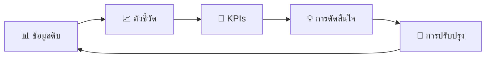

# มาตรฐานตัวชี้วัดและ KPIs ของ SOC

เอกสารนี้กำหนด Key Performance Indicators (KPIs) และตัวชี้วัดการปฏิบัติงานที่ใช้วัด **ประสิทธิผล**, **ประสิทธิภาพ**, และ **สุขภาพทีม** ของ SOC ตัวชี้วัดขับเคลื่อนการปรับปรุงอย่างต่อเนื่องและช่วยจัดสรรทรัพยากรตามข้อมูล

---

## ภาพรวม

```mermaid
graph LR
    Data["📊 ข้อมูลดิบ"] --> Metrics["📈 ตัวชี้วัด"]
    Metrics --> KPIs["🎯 KPIs"]
    KPIs --> Decisions["💡 การตัดสินใจ"]
    Decisions --> Actions["🔧 การปรับปรุง"]
    Actions --> Data
```

| หมวด | เน้น | ตัวอย่างตัวชี้วัด |
|:---|:---|:---|
| ⏱️ **ประสิทธิภาพ** | ตอบสนองเร็วแค่ไหน | MTTD, MTTR, MTTA |
| 🎯 **ประสิทธิผล** | ตรวจจับดีแค่ไหน | FPR, detection coverage, dwell time |
| 👥 **กำลังคน** | ภาระงานและสุขภาพทีม | Alerts ต่อ analyst, burnout, utilization |
| 💰 **ธุรกิจ** | คุณค่าที่ส่งมอบ | ต้นทุนต่อ incident, การป้องกัน breach |
| 📊 **Compliance** | การปฏิบัติตามข้อบังคับ | SLA met %, audit findings |

---

## 1. ตัวชี้วัดประสิทธิภาพ (How Fast)

### 1.1 Mean Time To Detect (MTTD)

| แอตทริบิวต์ | รายละเอียด |
|:---|:---|
| **คำจำกัดความ** | เวลาเฉลี่ยจาก **การบุกรุก** ถึง **SOC ตรวจจับได้** |
| **สูตร** | `Σ(Detection Time − Intrusion Time) / Total Incidents` |
| **เป้าหมาย** | < 30 นาที |
| **การวัด** | ค่าเฉลี่ยรายเดือน |

> 💡 **วิธีปรับปรุง**: เพิ่ม log coverage, behavioral analytics, automated correlation, threat intel feeds

### 1.2 Mean Time To Acknowledge (MTTA)

| แอตทริบิวต์ | รายละเอียด |
|:---|:---|
| **คำจำกัดความ** | เวลาเฉลี่ยจาก **alert ขึ้น** ถึง **analyst รับเรื่อง** |
| **สูตร** | `Σ(Acknowledge Time − Alert Time) / Total Alerts` |
| **เป้าหมาย** | < 10 นาที |
| **การวัด** | ค่าเฉลี่ยรายวัน |

### 1.3 Mean Time To Respond (MTTR)

| แอตทริบิวต์ | รายละเอียด |
|:---|:---|
| **คำจำกัดความ** | เวลาเฉลี่ยจาก **ตรวจจับ** ถึง **containment + remediation** |
| **สูตร** | `Σ(Resolution Time − Detection Time) / Total Incidents` |
| **เป้าหมาย** | < 60 นาที (Critical/High) · < 4 ชม. (Medium) |
| **การวัด** | ค่าเฉลี่ยรายเดือน แยกตามความรุนแรง |

### 1.4 Mean Time To Close (MTTC)

| แอตทริบิวต์ | รายละเอียด |
|:---|:---|
| **คำจำกัดความ** | เวลาเฉลี่ยจาก **เปิด incident** ถึง **ปิดทั้งหมด** (รวม PIR) |
| **เป้าหมาย** | < 24 ชม. (Critical) · < 72 ชม. (High) |

---

## 2. ตัวชี้วัดประสิทธิผล (How Well)

### 2.1 False Positive Rate (FPR)

| แอตทริบิวต์ | รายละเอียด |
|:---|:---|
| **คำจำกัดความ** | เปอร์เซ็นต์ alert ที่เป็น **benign** หลังสืบสวน |
| **สูตร** | `(False Positive Alerts / Total Alerts) × 100%` |
| **เป้าหมาย** | < 10% |

#### การดำเนินการตาม FPR

| ระดับ FPR | การดำเนินการ |
|:---|:---|
| < 5% | ✅ ดีเยี่ยม — คงค่า tuning ปัจจุบัน |
| 5–10% | ⚠️ ยอมรับได้ — ทบทวน 5 กฎที่ noise มากสุด |
| 10–25% | 🟠 ต้องดำเนินการ — sprint ปรับแต่ง |
| > 25% | 🔴 วิกฤต — เน้น tuning ก่อนสร้าง detection ใหม่ |

### 2.2 Detection Coverage

| แอตทริบิวต์ | รายละเอียด |
|:---|:---|
| **คำจำกัดความ** | เปอร์เซ็นต์ **MITRE ATT&CK techniques** ที่มี detection อย่างน้อย 1 ตัว |
| **เป้าหมาย** | ≥ 80% ของ 50 เทคนิคหลัก |
| **การวัด** | ประเมินรายไตรมาส |

### 2.3 Dwell Time

| แอตทริบิวต์ | รายละเอียด |
|:---|:---|
| **คำจำกัดความ** | ระยะเวลาที่ผู้โจมตีอยู่ใน **ระบบโดยไม่ถูกตรวจจับ** |
| **เป้าหมาย** | < 24 ชม. (ค่าเฉลี่ยอุตสาหกรรม: 16 วัน) |
| **ผลกระทบ** | Dwell time ยาว = ความเสี่ยง data breach สูงขึ้น |

### 2.4 Escalation Accuracy

| แอตทริบิวต์ | รายละเอียด |
|:---|:---|
| **คำจำกัดความ** | เปอร์เซ็นต์ escalation T1→T2 ที่ **ถูกต้อง** |
| **เป้าหมาย** | ≥ 85% |

---

## 3. ตัวชี้วัดกำลังคน (Team Health)

### 3.1 ปริมาณ Alert

| ตัวชี้วัด | เป้าหมาย | การดำเนินการเมื่อเกิน |
|:---|:---|:---|
| **Alerts ต่อ analyst ต่อกะ** | 15–25 | เพิ่มคนหรือ automate triage |
| **ความลึกคิวตอนสิ้นกะ** | < 10 | ทบทวน staffing model |
| **Alert backlog (> 24 ชม.)** | 0 | Triage sprint ทันที |

### 3.2 การใช้ประโยชน์ Analyst

| ตัวชี้วัด | เป้าหมาย | หมายเหตุ |
|:---|:---|:---|
| **Utilization rate** | 60–80% | > 80% = เสี่ยง burnout |
| **ชั่วโมง OT** | < 10% ของเวลาปกติ | ติดตามรายเดือน |
| **เวลาฝึกอบรม** | ≥ 10% ของเวลาทำงาน | ต่อคนต่อเดือน |

### 3.3 สุขภาพทีม

| ตัวชี้วัด | เป้าหมาย | ทำไมสำคัญ |
|:---|:---|:---|
| **อัตราลาออกรายปี** | < 15% | คน SOC มีราคาแพงในการทดแทน |
| **ระยะเวลาทำงานเฉลี่ย** | > 2 ปี | การรักษาความรู้องค์กร |
| **อัตราใบรับรอง** | ≥ 70% | baseline ความสามารถทีม |
| **คะแนนความพึงพอใจ** | ≥ 4/5 | สำรวจรายไตรมาส (ไม่ระบุตัวตน) |

---

## 4. ตัวชี้วัดธุรกิจ (Value Delivered)

| ตัวชี้วัด | สูตร | การใช้งาน |
|:---|:---|:---|
| **ต้นทุนต่อ incident** | `Total SOC Cost / Total Incidents` | วางแผนงบประมาณ |
| **ต้นทุนต่อ alert** | `Total SOC Cost / Total Alerts` | เปรียบเทียบประสิทธิภาพ |
| **ประหยัดจากระบบอัตโนมัติ** | `(เวลา manual − เวลา automated) × อัตราค่าจ้างรายชั่วโมง` | พิสูจน์ ROI |

---

## 5. การรายงานและ Dashboard

### 5.1 ความถี่การรายงาน

| รายงาน | ความถี่ | กลุ่มเป้าหมาย | ตัวชี้วัดหลัก |
|:---|:---|:---|:---|
| **Shift Report** | ทุกกะ | SOC Lead | ความลึกคิว, incidents active |
| **Daily Brief** | รายวัน | SOC Manager | MTTA, alerts ที่ประมวลผล |
| **Weekly Summary** | รายสัปดาห์ | SOC Manager, CISO | MTTD, MTTR, FPR, แนวโน้ม |
| **Monthly SOC Report** | รายเดือน | CISO, Management | KPIs ทั้งหมด |
| **QBR** | รายไตรมาส | C-Suite, Board | ตัวชี้วัดธุรกิจ, ROI |

### 5.2 แผง Dashboard

| แผง | รูปแบบการแสดงผล | รีเฟรช |
|:---|:---|:---|
| 🚨 Incidents ที่ Active ตามความรุนแรง | Pie/donut chart | เรียลไทม์ |
| 📈 แนวโน้มปริมาณ Alert | Line chart (7 วัน) | 5 นาที |
| ⏱️ MTTA / MTTR เรียลไทม์ | Gauge | 5 นาที |
| 📊 ความลึกคิว | Bar chart ตามกะ | 5 นาที |
| 🎯 แนวโน้ม FPR รายสัปดาห์ | Line chart | รายวัน |
| 👥 ภาระงาน Analyst | Heatmap | 15 นาที |
| 🌍 ประเทศต้นทาง Top | Geo map | รายชั่วโมง |
| 🛡️ Detection Coverage | MITRE heatmap | รายสัปดาห์ |

---

## 6. สรุปเป้าหมาย

| ตัวชี้วัด | เป้าหมาย | การแบ่งตามความรุนแรง |
|:---|:---:|:---|
| **MTTD** | < 30 นาที | ทุกระดับ |
| **MTTA** | < 10 นาที | ทุกระดับ |
| **MTTR** | < 60 นาที | Critical/High |
| **MTTC** | < 24 ชม. | Critical |
| **FPR** | < 10% | โดยรวม |
| **Detection Coverage** | ≥ 80% | 50 เทคนิค MITRE หลัก |
| **Dwell Time** | < 24 ชม. | ทุก incident |
| **Escalation Accuracy** | ≥ 85% | T1→T2 |
| **Alerts ต่อ Analyst** | 15–25 | ต่อกะ |
| **Utilization** | 60–80% | ต่อ analyst |
| **อัตราลาออก** | < 15% | รายปี |
| **SLA Adherence** | ≥ 95% | ทุก incident |

---

## 7. บทบาทใดควรใช้ Metric ใด

| บทบาท | การตัดสินใจหลัก | Metric ที่ควรดูเป็นลำดับแรก | จุดที่ต้องลงมือทันที |
|:---|:---|:---|:---|
| **CISO** | ความเสี่ยง, งบประมาณ, การยกระดับต่อผู้บริหาร | MTTD, MTTR, SLA adherence, แนวโน้ม critical incidents | KPI สำคัญต่ำกว่าเป้า 2 รอบติด |
| **SOC Manager** | กำลังคน, สุขภาพคิว, จังหวะปฏิบัติการ | MTTA, backlog, alerts ต่อ analyst, escalation accuracy | มีคิวค้างเกิน 24 ชม. หรือ utilization เกิน 80% |
| **SOC Analyst** | คุณภาพ triage, วินัยในการ escalate | MTTA, false positive rate, อายุเคส | รับงานช้าเกิน SLA หรือเจอ alert noise ซ้ำ |
| **Security Engineer** | ความพร้อมของ telemetry และระบบตรวจจับ | detection coverage, ingestion health, rule failure rate | log source หายหรือ query ช้ากระทบการตรวจจับ |
| **IR Engineer** | ความพร้อมในการ contain และกู้คืน | MTTR, dwell time, เวลาในการปิด PIR | critical case เกิน SLA หรือ recovery ล่าช้าซ้ำ |

## 8. Decision Matrix สำหรับ KPI

| เงื่อนไข | Owner หลัก | การตัดสินใจทันที | สิ่งที่ต้องทำต่อ |
|:---|:---|:---|:---|
| **MTTA สูงกว่าเป้า 3 วันติด** | SOC Manager | ปรับ owner ของคิวและกำลังคนต่อกะ | ทบทวน staffing และ automation ภายใน 5 วันทำการ |
| **MTTR ของ Critical incident สูงกว่าเป้า** | IR Engineer | เปิด service review หา containment blocker | brief CISO และติดตามจนปิด |
| **False positive rate เกิน 25%** | Detection Engineer | ชะลอ detection ใหม่ที่ไม่จำเป็นและเร่ง tuning | สรุป top noisy rules ใน weekly review |
| **Detection coverage ต่ำกว่าเป้า** | Security Engineer | แยกว่าเกิดจาก log source หายหรือ content gap | อัปเดต gap register และแผนปิดช่องว่าง |
| **Escalation accuracy ต่ำกว่า 85%** | SOC Manager | ทบทวนคุณภาพ handoff ระหว่าง T1/T2 | ทำ coaching plan และสุ่มตรวจเคสปิด |
| **Utilization เกิน 80% ตลอด 1 เดือน** | CISO + SOC Manager | อนุมัติมาตรการลดภาระงาน | ประเมินการจ้างเพิ่ม, automation, หรือปรับ scope |

## 9. คุณภาพข้อมูลขั้นต่ำที่ต้องมี

| Metric | ข้อมูลขั้นต่ำที่ต้องมี | Blind Spot หากข้อมูลไม่ครบ |
|:---|:---|:---|
| **MTTD** | เวลาที่คาดว่าเริ่ม compromise, เวลาที่ตรวจพบ, timestamp ที่ normalize แล้ว | จะวัดความเร็วตรวจจับผิดเพี้ยน |
| **MTTA** | เวลา alert ขึ้นและเวลา analyst รับเรื่องจาก workflow เดียวกัน | วัดความเร็วคิวไม่ได้จริง |
| **MTTR** | เวลาเริ่ม incident, เวลา contain, เวลาแก้ไขเสร็จ | แยกไม่ออกว่าช้าเพราะ response หรือปิด ticket ช้า |
| **FPR** | final disposition ของเคสพร้อม tag true/false positive | แยก noise จาก alert จริงไม่ได้ |
| **Coverage** | inventory ของ rules ที่ map กับ use case หรือ MITRE ATT&CK | coverage จะเป็นแค่ตัวเลขเชิง presentation |
| **Utilization** | ชั่วโมงกะ, ปริมาณ alert, OT, เวลาฝึกอบรม | มองไม่เห็น burnout จนเกิด attrition |

## 10. รอบการทบทวนและการยกระดับ

| ความถี่ | ผู้เข้าร่วม | ประเด็นหลัก | ต้อง escalate เมื่อ |
|:---|:---|:---|:---|
| **รายวัน** | Shift Lead, SOC Manager | MTTA, queue depth, P1/P2 ที่ยังเปิด | คิวเริ่มค้างหรือพลาด SLA ประจำกะ |
| **รายสัปดาห์** | SOC Manager, Detection Engineering | FPR, escalation accuracy, noisy rules | เจอ noise ซ้ำหรือคุณภาพเคสลดลง |
| **รายเดือน** | CISO, SOC Manager, IR Lead | MTTD, MTTR, utilization, business impact | KPI ต่ำกว่าเป้า 2 รอบติด |
| **รายไตรมาส** | CISO, ผู้บริหารที่เกี่ยวข้อง | แนวโน้ม, staffing, ความจำเป็นด้านงบ, risk reduction | underperformance ต่อเนื่องหรือ impact สูงขึ้น |

---

## เอกสารที่เกี่ยวข้อง

- [กรอบ IR](../05_Incident_Response/Framework.th.md) — วงจรชีวิต incident และ SLAs
- [KPI Dashboard Template](KPI_Dashboard_Template.th.md) — ข้อกำหนด dashboard
- [Alert Tuning SOP](Alert_Tuning.th.md) — กระบวนการลด FPR
- [เช็คลิสต์ประเมิน SOC](SOC_Assessment_Checklist.th.md) — ความพร้อมปฏิบัติการ
- [ประเมินวุฒิภาวะ SOC](SOC_Maturity_Assessment.th.md) — โมเดลให้คะแนน
- [การวางแผนกำลังคน SOC](SOC_Capacity_Planning.th.md) — การวางแผนคนและทรัพยากร
- [มาตรฐานส่งมอบกะ](Shift_Handoff.th.md) — การปฏิบัติงานกะ

## References

- [SANS SOC Metrics](https://www.sans.org/white-papers/soc-metrics/)
- [MITRE SOC Assessment (CAT)](https://cat.mitre.org/)
- [NIST Cybersecurity Framework](https://csrc.nist.gov/projects/cybersecurity-framework)
