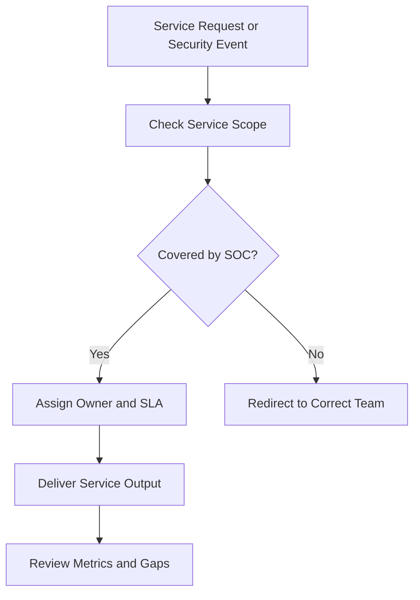

# SOC Service Catalog

**Audience**: CISO, SOC Manager, Business Service Owners, Security Engineer, IR Engineer
**Purpose**: Use this document to define what the SOC does, how services are requested, what outputs are expected, and where responsibility starts and ends.

## 1. When to Use This Document

-   [ ] Use this document when defining the operating model for a new SOC.
-   [ ] Use this document when onboarding a new business unit, platform, or service owner.
-   [ ] Use this document when stakeholders disagree about whether the SOC owns a specific task.
-   [ ] Use this document during annual scope review, SLA review, or staffing review.

## 2. Service Catalog Principles

-   [ ] Define each service with a named owner, intake path, target response, and minimum output.
-   [ ] Separate monitoring, engineering, advisory, and incident services so handoffs are explicit.
-   [ ] Record what is out of scope to avoid silent ownership gaps.
-   [ ] Review service performance using measurable demand, backlog, and quality metrics.

## 3. Core SOC Services

| Service | Primary Owner | Trigger / Intake | Target Response | Minimum Output |
|:---|:---|:---|:---:|:---|
| **Security Monitoring** | Tier 1 / Shift Lead | Production alert, monitoring queue, scheduled review | Per alert SLA | Triage decision, case record, escalation if required |
| **Incident Triage** | Tier 1 / Tier 2 | Alert requires deeper review | Within severity SLA | Classification, evidence notes, severity confirmation |
| **Incident Response** | Tier 2 / IR Lead | Confirmed or suspected incident | Immediate for P1/P2 | Containment plan, timeline, case updates, closure record |
| **Threat Hunting** | Tier 3 / Hunt Lead | Hypothesis, campaign review, risk request | Weekly or ad hoc | Hunt findings, gaps, new detection candidates |
| **Detection Engineering** | Detection Engineer | New use case, tuning need, missed detection | Based on backlog priority | Rule change, test evidence, deployment record |
| **Log Source Onboarding** | Security Engineer / Platform Owner | New system, new integration, telemetry gap | As scheduled | Data mapping, validation result, onboarding status |
| **Threat Intelligence Handling** | TI Analyst | New intel feed, campaign advisory, incident support | Same day for urgent intel | Advisory, IOC package, tracking notes |
| **Executive Reporting** | SOC Manager / CISO delegate | Monthly, quarterly, or post-incident reporting | Per reporting calendar | Approved dashboard, summary, action list |

## 4. Service Coverage and Hours

| Service | Coverage Window | Priority Mode | Notes |
|:---|:---|:---|:---|
| **Security Monitoring** | 24/7 or 8/5 | Always-on | Must match approved SOC operating model |
| **Incident Response** | 24/7 for P1/P2, business hours for lower severity unless approved otherwise | Severity-driven | Use on-call escalation for after-hours cases |
| **Threat Hunting** | Business hours | Planned work | Shift to incident support during major events |
| **Detection Engineering** | Business hours with emergency change path | Backlog-driven | Emergency tuning follows deployment controls |
| **Threat Intelligence** | Business hours with urgent advisory escalation | Risk-driven | Support major incidents outside normal cadence |
| **Executive Reporting** | Scheduled cadence | Calendar-driven | Post-incident reporting may override schedule |

## 5. Service Request and Intake Paths

| Service | Intake Path | Required Inputs | Reject or Redirect When |
|:---|:---|:---|:---|
| **Security Monitoring** | Monitoring platform / queue | Alert, source, timestamp, affected asset | Alert lacks source ownership or required telemetry |
| **Incident Response** | Escalation from triage or management declaration | Severity, summary, evidence, owner | Issue is operational outage with no security indicator |
| **Threat Hunting** | Hunt backlog / manager request | Hypothesis, scope, timeframe, success criteria | Request is pure tool troubleshooting or audit-only evidence gathering |
| **Detection Engineering** | Use case backlog / tuning queue | Detection goal, log source, false positive pattern, owner | Request lacks telemetry source or expected behavior definition |
| **Log Source Onboarding** | Onboarding request / platform intake | Data owner, source type, retention need, security use case | No data owner, no legal approval, or unsupported integration path |
| **Executive Reporting** | Reporting calendar / incident trigger | Audience, reporting period, metrics, approvals | Inputs are incomplete or incident facts remain unverified |

## 6. Handoff Boundaries

| From | To | Handoff Condition | Required Handoff Content |
|:---|:---|:---|:---|
| **Tier 1** | **Tier 2 / IR** | Alert confirmed or suspicion exceeds triage boundary | Severity, key evidence, affected scope, actions taken |
| **Tier 2 / IR** | **Security Engineer** | Telemetry, parser, or tooling defect blocks investigation | Missing data, timestamps, impacted detections, urgency |
| **Threat Hunter** | **Detection Engineer** | Hunt finding should become persistent coverage | Detection logic, sample artifacts, false positive considerations |
| **SOC Manager** | **CISO / Executive** | Business impact, regulatory trigger, or unresolved strategic gap | Impact summary, options, risk, decision required |
| **SOC** | **Business Owner / IT** | Containment or recovery requires system owner action | Action requested, deadline, business risk, contact point |

## 7. Out of Scope

-   [ ] General IT helpdesk, password reset, and endpoint support without a security trigger.
-   [ ] Penetration testing, red teaming, or application security review unless explicitly assigned.
-   [ ] Product feature delivery or platform engineering unrelated to security telemetry or response.
-   [ ] Legal interpretation, HR investigation, or public relations decision-making.
-   [ ] Vendor contract ownership outside security review or risk input.

## 8. Minimum Service Metrics

| Service | Metric | Why It Matters | Review Cadence |
|:---|:---|:---|:---|
| **Security Monitoring** | Alert response within SLA | Confirms coverage reliability | Weekly |
| **Incident Response** | MTTA / MTTR and escalation quality | Confirms investigation speed and decision quality | Weekly / Monthly |
| **Threat Hunting** | Hunts completed, findings converted to detections | Confirms proactive value | Monthly |
| **Detection Engineering** | Rule success rate, false positive reduction, rollback count | Confirms engineering quality | Monthly |
| **Log Source Onboarding** | Onboarding lead time and validation pass rate | Confirms telemetry delivery | Monthly |
| **Executive Reporting** | On-time delivery and action closure rate | Confirms management usefulness | Monthly / Quarterly |

## 9. Minimum Governance Outputs

-   [ ] A current catalog of active services, owners, and approved coverage hours.
-   [ ] A documented intake route and escalation path for each service.
-   [ ] A list of services deferred, excluded, or pending due to budget, tooling, or staffing constraints.
-   [ ] A quarterly review of service demand, backlog growth, and stakeholder complaints.

## Related Documents

-   [SOC Team Structure](SOC_Team_Structure.en.md)
-   [SLA Template](SLA_Template.en.md)
-   [SOC Communication SOP](SOC_Communication.en.md)
-   [SOC Metrics](SOC_Metrics.en.md)
-   [Log Source Onboarding](Log_Source_Onboarding.en.md)

## References

-   [NIST SP 800-61 Rev. 2](https://csrc.nist.gov/publications/detail/sp/800-61/rev-2/final)
-   [FIRST CSIRT Services Framework](https://www.first.org/standards/frameworks/csirts/FIRST_CSIRT_Services_Framework_v2.1)
-   [SOC-CMM](https://www.soc-cmm.com/)
