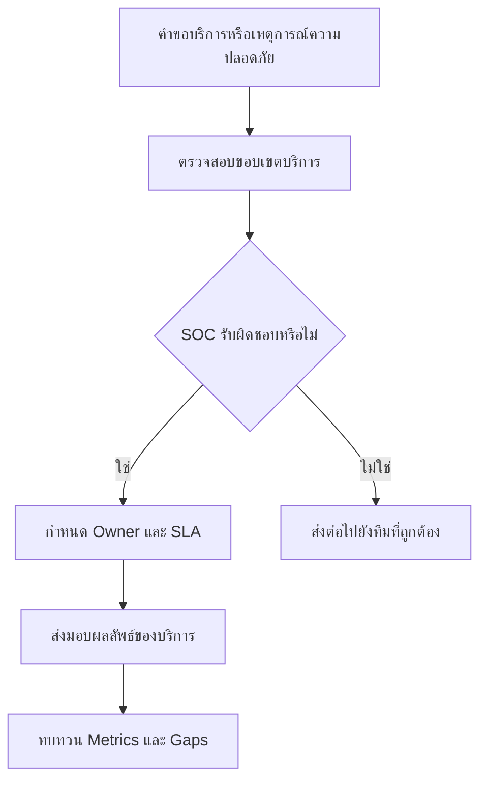

# แคตตาล็อกบริการของ SOC

**กลุ่มเป้าหมาย**: CISO, SOC Manager, Business Service Owners, Security Engineer, IR Engineer
**วัตถุประสงค์**: ใช้เอกสารนี้เพื่อกำหนดว่า SOC ให้บริการอะไร รับงานผ่านช่องทางใด ต้องส่งมอบอะไร และขอบเขตความรับผิดชอบเริ่มต้นและสิ้นสุดตรงไหน

## 1. ใช้เอกสารนี้เมื่อใด

-   [ ] ใช้เมื่อกำหนด operating model สำหรับ SOC ใหม่
-   [ ] ใช้เมื่อ onboard business unit, platform, หรือ service owner ใหม่
-   [ ] ใช้เมื่อ stakeholder ไม่ตรงกันว่าเรื่องใดเป็นหน้าที่ของ SOC
-   [ ] ใช้ระหว่าง annual scope review, SLA review, หรือ staffing review

## 2. หลักการของแคตตาล็อกบริการ

-   [ ] กำหนดให้แต่ละบริการมี owner, intake path, target response, และ minimum output ชัดเจน
-   [ ] แยก monitoring, engineering, advisory, และ incident services ออกจากกันเพื่อให้ handoff ชัด
-   [ ] บันทึกสิ่งที่อยู่นอกขอบเขตเพื่อไม่ให้เกิด ownership gap แบบเงียบ ๆ
-   [ ] ทบทวนประสิทธิภาพของบริการด้วย metric ที่วัด demand, backlog, และ quality ได้จริง

## 3. บริการหลักของ SOC

| Service | Primary Owner | Trigger / Intake | Target Response | Minimum Output |
|:---|:---|:---|:---:|:---|
| **Security Monitoring** | Tier 1 / Shift Lead | Production alert, monitoring queue, scheduled review | ตาม alert SLA | triage decision, case record, escalate เมื่อจำเป็น |
| **Incident Triage** | Tier 1 / Tier 2 | Alert ต้องตรวจเชิงลึกต่อ | ภายใน severity SLA | classification, evidence notes, severity confirmation |
| **Incident Response** | Tier 2 / IR Lead | Confirmed หรือ suspected incident | ทันทีสำหรับ P1/P2 | containment plan, timeline, case updates, closure record |
| **Threat Hunting** | Tier 3 / Hunt Lead | Hypothesis, campaign review, risk request | รายสัปดาห์หรือ ad hoc | hunt findings, gaps, new detection candidates |
| **Detection Engineering** | Detection Engineer | New use case, tuning need, missed detection | ตาม backlog priority | rule change, test evidence, deployment record |
| **Log Source Onboarding** | Security Engineer / Platform Owner | New system, new integration, telemetry gap | ตามแผนงาน | data mapping, validation result, onboarding status |
| **Threat Intelligence Handling** | TI Analyst | New intel feed, campaign advisory, incident support | ภายในวันเดียวกันสำหรับ urgent intel | advisory, IOC package, tracking notes |
| **Executive Reporting** | SOC Manager / CISO delegate | Monthly, quarterly, หรือ post-incident reporting | ตาม reporting calendar | approved dashboard, summary, action list |

## 4. ขอบเขตเวลาให้บริการ

| Service | Coverage Window | Priority Mode | Notes |
|:---|:---|:---|:---|
| **Security Monitoring** | 24/7 หรือ 8/5 | Always-on | ต้องตรงกับ operating model ที่อนุมัติไว้ |
| **Incident Response** | 24/7 สำหรับ P1/P2, business hours สำหรับความรุนแรงต่ำกว่าหากไม่ได้อนุมัติเป็นอย่างอื่น | Severity-driven | ใช้ on-call escalation สำหรับเคสนอกเวลา |
| **Threat Hunting** | Business hours | Planned work | ระหว่างเหตุการณ์ใหญ่ให้เปลี่ยนไปสนับสนุน incident |
| **Detection Engineering** | Business hours พร้อม emergency change path | Backlog-driven | การ tune แบบฉุกเฉินต้องตาม deployment controls |
| **Threat Intelligence** | Business hours พร้อม urgent advisory escalation | Risk-driven | สนับสนุน major incident นอก cadence ปกติได้ |
| **Executive Reporting** | Scheduled cadence | Calendar-driven | post-incident reporting อาจมาก่อนรอบปกติ |

## 5. ช่องทางรับงานและการเปิดคำขอ

| Service | Intake Path | Required Inputs | Reject หรือ Redirect เมื่อ |
|:---|:---|:---|:---|
| **Security Monitoring** | Monitoring platform / queue | Alert, source, timestamp, affected asset | ไม่มี source ownership หรือ telemetry ที่จำเป็น |
| **Incident Response** | Escalation จาก triage หรือ management declaration | Severity, summary, evidence, owner | เป็น operational outage ที่ยังไม่มี security indicator |
| **Threat Hunting** | Hunt backlog / manager request | Hypothesis, scope, timeframe, success criteria | เป็นงาน troubleshooting เครื่องมือหรือขอ evidence เพื่อ audit อย่างเดียว |
| **Detection Engineering** | Use case backlog / tuning queue | Detection goal, log source, false positive pattern, owner | ไม่มี telemetry source หรือยังไม่กำหนด expected behavior |
| **Log Source Onboarding** | Onboarding request / platform intake | Data owner, source type, retention need, security use case | ไม่มี data owner, ไม่มี legal approval, หรือไม่มี integration path ที่รองรับ |
| **Executive Reporting** | Reporting calendar / incident trigger | Audience, reporting period, metrics, approvals | Inputs ยังไม่ครบหรือข้อเท็จจริงของ incident ยังไม่ยืนยัน |

## 6. ขอบเขตของการส่งมอบงานระหว่างทีม

| From | To | Handoff Condition | Required Handoff Content |
|:---|:---|:---|:---|
| **Tier 1** | **Tier 2 / IR** | Alert ยืนยันแล้วหรือเกินขอบเขต triage | Severity, key evidence, affected scope, actions taken |
| **Tier 2 / IR** | **Security Engineer** | ปัญหา telemetry, parser, หรือ tooling block การสืบสวน | Missing data, timestamps, impacted detections, urgency |
| **Threat Hunter** | **Detection Engineer** | Hunt finding ควรถูกเปลี่ยนเป็น coverage ถาวร | Detection logic, sample artifacts, false positive considerations |
| **SOC Manager** | **CISO / Executive** | มี business impact, regulatory trigger, หรือ strategic gap ที่ยังไม่ปิด | Impact summary, options, risk, decision required |
| **SOC** | **Business Owner / IT** | การ containment หรือ recovery ต้องอาศัย system owner | Action requested, deadline, business risk, contact point |

## 7. สิ่งที่อยู่นอกขอบเขต

-   [ ] งาน IT helpdesk ทั่วไป การ reset รหัสผ่าน และ endpoint support ที่ไม่มี security trigger
-   [ ] Penetration testing, red teaming, หรือ application security review เว้นแต่มีการมอบหมายไว้ชัดเจน
-   [ ] Product feature delivery หรือ platform engineering ที่ไม่เกี่ยวกับ security telemetry หรือ response
-   [ ] การตีความทางกฎหมาย การสืบสวนด้าน HR หรือการตัดสินใจด้าน public relations
-   [ ] ความเป็นเจ้าของสัญญา vendor นอกเหนือจาก security review หรือการให้ความเห็นด้านความเสี่ยง

## 8. ตัวชี้วัดขั้นต่ำของบริการ

| Service | Metric | Why It Matters | Review Cadence |
|:---|:---|:---|:---|
| **Security Monitoring** | Alert response within SLA | ยืนยันความน่าเชื่อถือของ coverage | Weekly |
| **Incident Response** | MTTA / MTTR และ escalation quality | ยืนยันความเร็วและคุณภาพการตัดสินใจ | Weekly / Monthly |
| **Threat Hunting** | จำนวน hunt ที่เสร็จและ findings ที่แปลงเป็น detections | ยืนยันคุณค่าของงานเชิงรุก | Monthly |
| **Detection Engineering** | Rule success rate, false positive reduction, rollback count | ยืนยันคุณภาพของงานวิศวกรรม | Monthly |
| **Log Source Onboarding** | Onboarding lead time และ validation pass rate | ยืนยันการส่งมอบ telemetry | Monthly |
| **Executive Reporting** | On-time delivery และ action closure rate | ยืนยันว่ารายงานใช้บริหารได้จริง | Monthly / Quarterly |

## 9. ผลลัพธ์ขั้นต่ำด้านธรรมาภิบาล

-   [ ] แคตตาล็อกบริการปัจจุบันที่ระบุ active services, owners, และ approved coverage hours
-   [ ] ช่องทางรับงานและ escalation path ของแต่ละบริการที่มีการบันทึกไว้
-   [ ] รายการบริการที่ถูกเลื่อน ไม่รวมในขอบเขต หรือรอการตัดสินใจจากข้อจำกัดด้านงบประมาณ เครื่องมือ หรือกำลังคน
-   [ ] การทบทวนรายไตรมาสของ service demand, backlog growth, และ stakeholder complaints

## เอกสารที่เกี่ยวข้อง (Related Documents)

-   [SOC Team Structure](SOC_Team_Structure.th.md)
-   [SLA Template](SLA_Template.th.md)
-   [SOC Communication SOP](SOC_Communication.th.md)
-   [SOC Metrics](SOC_Metrics.th.md)
-   [Log Source Onboarding](Log_Source_Onboarding.th.md)

## References

-   [NIST SP 800-61 Rev. 2](https://csrc.nist.gov/publications/detail/sp/800-61/rev-2/final)
-   [FIRST CSIRT Services Framework](https://www.first.org/standards/frameworks/csirts/FIRST_CSIRT_Services_Framework_v2.1)
-   [SOC-CMM](https://www.soc-cmm.com/)
