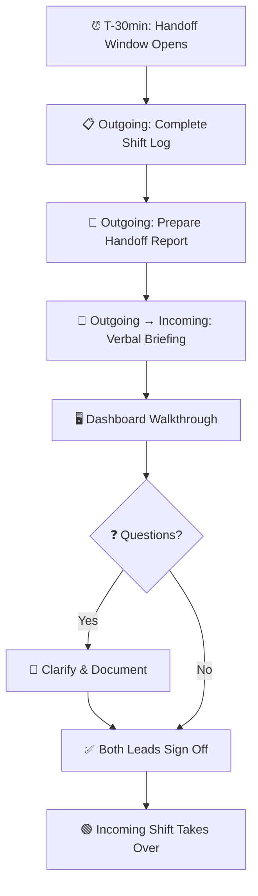

# Shift Operations & Handoff Standard

This document defines the standard procedures for managing SOC shifts and ensuring **zero-drop operational continuity** during shift handovers. A disciplined handoff process prevents incidents from falling through the cracks and ensures consistent service quality 24/7.

---

## 1. Shift Structure

### 1.1 Standard Rotation (24/7)

| Shift | Hours | Duration | Peak Alert Volume |
|:---|:---:|:---:|:---|
| ☀️ **Morning** | 08:00 – 16:00 | 8 hours | High (business hours, phishing, user reports) |
| 🌅 **Afternoon** | 16:00 – 00:00 | 8 hours | Medium (automated scans, overseas attackers) |
| 🌙 **Night** | 00:00 – 08:00 | 8 hours | Low–Medium (botnet activity, scheduled jobs) |

> ⚠️ **30-minute overlap** is required between shifts for proper handoff (e.g., outgoing shift stays 08:00–08:30 with incoming shift).

### 1.2 Alternative Rotation: 4-On-4-Off (12-Hour Shifts)

A compressed schedule using **2 shifts × 12 hours** with 4 consecutive working days followed by 4 days off. This model provides 24/7 coverage with fewer handoffs per day.

| Shift | Hours | Duration | Peak Alert Volume |
|:---|:---:|:---:|:---|
| ☀️ **Day Shift** | 08:00 – 20:00 | 12 hours | High (full business hours + early evening) |
| 🌙 **Night Shift** | 20:00 – 08:00 | 12 hours | Low–Medium (botnet, overnight scanning, APT) |

> ⚠️ **30-minute overlap** at 07:30–08:00 and 19:30–20:00 for handoff.

#### Team Rotation Calendar (4-Week Cycle)

Four teams (**Alpha, Bravo, Charlie, Delta**) rotate to ensure 24/7 coverage:

| Week | Mon | Tue | Wed | Thu | Fri | Sat | Sun |
|:---|:---:|:---:|:---:|:---:|:---:|:---:|:---:|
| **Week 1** | 🅰️D | 🅰️D | 🅰️D | 🅰️D | 🅱️D | 🅱️D | 🅱️D |
| **Week 2** | 🅱️D | 🅰️N | 🅰️N | 🅰️N | 🅰️N | 🅱️N | 🅱️N |
| **Week 3** | 🅱️N | 🅱️N | 🅲D | 🅲D | 🅲D | 🅲D | 🅳D |
| **Week 4** | 🅳D | 🅳D | 🅳D | 🅲N | 🅲N | 🅲N | 🅲N |

*D = Day (08:00–20:00), N = Night (20:00–08:00). Teams not shown are on their 4 days off.*

> **Note**: Teams on days off serve as **on-call backup** for the first 2 of their 4 off-days.

#### 4on4off vs 3-Shift Comparison

| Criteria | 3-Shift (8h) | 4on4off (12h) |
|:---|:---|:---|
| **Shifts per day** | 3 | 2 |
| **Handoffs per day** | 3 | 2 (fewer = less info loss) |
| **Hours per shift** | 8 hours | 12 hours |
| **Days on / off** | 5 on / 2 off | 4 on / 4 off |
| **Minimum FTE (24/7)** | 12–15 | 8–10 |
| **Fatigue risk** | Lower per shift | Higher per shift (mitigate with breaks) |
| **Work-life balance** | Standard schedule | More consecutive days off |
| **Best for** | Large SOC, high alert volume | Mid-size SOC, cost optimization |

#### Fatigue Mitigation (12-Hour Shifts)

| Measure | Implementation |
|:---|:---|
| **Mandatory breaks** | 30-min meal break + 15-min break every 3 hours |
| **Task rotation** | Switch between triage/investigation every 4 hours |
| **No consecutive blocks** | Max 4 consecutive 12h shifts before mandatory 4 days off |
| **Night-to-day transition** | Minimum 4 days off between switching Night → Day |
| **Workload cap** | Max 25 alerts per analyst per 12h shift |

### 1.3 Coverage Models

| Model | Staffing | Best For | Minimum FTE |
|:---|:---|:---|:---:|
| **24/7 Full** | 3 shifts × 365 days | Large SOC, critical infrastructure | 12–15 |
| **16/5 + On-Call** | 2 shifts weekdays + on-call nights/weekends | Mid-size SOC | 6–8 |
| **8/5 + On-Call** | Business hours + on-call | Small SOC, startup phase | 3–4 |
| **8/5 + MSSP** | Business hours in-house + MSSP after hours | Hybrid SOC | 2–3 + MSSP |

> 📚 **Detailed staffing**: [SOC Capacity Planning](SOC_Capacity_Planning.en.md) · [Team Structure](SOC_Team_Structure.en.md)

### 1.4 Shift Roles

| Role | Responsibilities |
|:---|:---|
| **Shift Lead** | Overall shift ownership, escalation decisions, handoff briefing |
| **Tier 1 Analyst** | Alert triage, initial classification, queue management |
| **Tier 2 Analyst** | Investigation, containment, playbook execution |
| **Tier 3 / Hunt** | Threat hunting, advanced forensics, detection engineering |

---

## 2. Handoff Procedure

### 2.1 Handoff Meeting Agenda (30 minutes)

| Time | Activity | Owner |
|:---:|:---|:---|
| 5 min | **Active Incidents** — Status, owner, next actions | Outgoing Lead |
| 5 min | **Pending Tasks** — Investigations awaiting results, follow-ups | Outgoing Lead |
| 5 min | **System Health** — SIEM/EDR/SOAR status, degradation, outages | Outgoing Lead |
| 5 min | **Intelligence Updates** — New campaigns, IoCs, vulnerabilities | Outgoing Lead |
| 5 min | **Dashboard Walkthrough** — Open tickets, queue depth, alert trends | Outgoing Lead |
| 5 min | **Q&A + Sign-Off** — Clarification, acknowledgment | Both Leads |

### 2.2 Handoff Report Content

The **Shift Handoff Report** must include:

| Section | Content | Mandatory? |
|:---|:---|:---:|
| **Active Incidents** | Incident ID, severity, status, assigned analyst, next action | ✅ |
| **Pending Investigations** | Ticket ID, description, awaiting what, ETA | ✅ |
| **System Health** | SIEM ingestion rate, EDR agent status, feed delays | ✅ |
| **Notable Events** | Unusual patterns, emerging threats, vulnerability disclosures | ✅ |
| **Escalations** | Items escalated to management, status, response received | If applicable |
| **Change Advisories** | Planned changes (patching, config changes) that may affect alerts | If applicable |
| **Compliance Deadlines** | PDPA notifications, SLA breaches approaching | If applicable |

> 📚 **Template**: [Shift Handover Log](../templates/shift_handover.en.md)

---

## 3. Start-of-Shift Checklist

Every incoming shift must complete this checklist within the first **15 minutes**:

| # | Check | Action |
|:---:|:---|:---|
| 1 | ✅ **Read Handoff Report** | Review outgoing shift log thoroughly |
| 2 | ✅ **Check Alert Queue** | Review unassigned and unacknowledged alerts |
| 3 | ✅ **Verify System Health** | SIEM dashboard, EDR console, SOAR status |
| 4 | ✅ **Review Active Incidents** | Take ownership of assigned incidents |
| 5 | ✅ **Check Email/Chat** | Management directives, advisories, intelligence |
| 6 | ✅ **Validate On-Call Roster** | Confirm escalation contacts are available |
| 7 | ✅ **Acknowledge Handoff** | Sign off in handoff system/log |

---

## 4. End-of-Shift Checklist

Every outgoing shift must complete this checklist before departure:

| # | Check | Action |
|:---:|:---|:---|
| 1 | ✅ **Update All Tickets** | Current status, investigation notes, next steps |
| 2 | ✅ **Document Incomplete Work** | What was started, what remains, where to resume |
| 3 | ✅ **Close Resolved Tickets** | Verify resolution, add closing notes |
| 4 | ✅ **Prepare Handoff Report** | Fill all mandatory sections |
| 5 | ✅ **Conduct Verbal Briefing** | Brief incoming Shift Lead face-to-face |
| 6 | ✅ **Sign Off** | Both leads sign handoff log |

---

## 5. Communication Protocols

### 5.1 During Shift

| Channel | Use For | Response Time |
|:---|:---|:---|
| **Ticketing System** | All incident communication (audit trail) | Per SLA |
| **Chat (Teams/Slack)** | Quick coordination, FYI alerts | < 5 min |
| **Phone** | Critical escalation, time-sensitive | Immediate |
| **Email** | Non-urgent updates, reports, documentation | < 1 hour |

### 5.2 Shift Lead Responsibilities

| Responsibility | Frequency |
|:---|:---|
| Monitor queue depth and analyst workload | Hourly |
| Triage and assign incoming alerts/tickets | Continuous |
| Approve containment actions (High/Critical) | As needed |
| Report system issues to IT/Engineering | As needed |
| Document notable events for handoff | End of shift |
| Conduct handoff briefing | End of shift |

---

## 6. Fatigue Management

SOC analyst burnout is a significant operational risk. The following measures help maintain alertness and quality:

| Measure | Implementation |
|:---|:---|
| **Rotation frequency** | Rotate shift patterns every 4–6 weeks |
| **Break schedule** | 15-min break every 2 hours during shift |
| **Task variety** | Rotate between triage, investigation, and hunt |
| **Workload balancing** | Max 15–20 alerts per analyst per shift |
| **Overtime limits** | Max 2 consecutive shift covers, escalate to management |
| **Mental health** | Access to employee assistance program |

---

## 7. Metrics & Quality

### 7.1 Shift KPIs

| Metric | Target | Owner |
|:---|:---|:---|
| Handoff completion rate | 100% | Shift Lead |
| Queue depth at shift end | < 10 unassigned | Shift Lead |
| Average alert response time | < 10 min (MTTA) | Analyst |
| Shift report quality score | ≥ 4/5 (peer review) | SOC Manager |

### 7.2 Handoff Quality Audit

SOC Manager should conduct monthly handoff quality audits:

- [ ] All mandatory sections completed?
- [ ] Active incidents accurately described?
- [ ] System health reported?
- [ ] Verbal briefing conducted (confirmed by both leads)?
- [ ] Issues from previous shift handoffs resolved?

---

## Related Documents

- [IR Framework](../05_Incident_Response/Framework.en.md) — Master incident response lifecycle
- [Escalation Matrix](Escalation_Matrix.en.md) — When and how to escalate
- [SOC Metrics & KPIs](SOC_Metrics.en.md) — Performance measurement
- [SOC Team Structure](SOC_Team_Structure.en.md) — Roles and responsibilities
- [SOC Capacity Planning](SOC_Capacity_Planning.en.md) — Staffing models and budgets
- [SOC Assessment Checklist](SOC_Assessment_Checklist.en.md) — Operational readiness
- [Shift Handover Template](../templates/shift_handover.en.md) — Handoff report form

## References

- [SANS SOC Handbook](https://www.sans.org/white-papers/soc-handbook/)
- [NIST SP 800-61r2 — Incident Handling](https://csrc.nist.gov/publications/detail/sp/800-61/rev-2/final)
- [MITRE 11 Strategies for a World-Class SOC](https://www.mitre.org/publications/technical-papers/11-strategies-world-class-cybersecurity-operations-center)
