# มาตรฐานการปฏิบัติงานกะและการส่งมอบงาน (Shift Operations & Handoff)

เอกสารนี้กำหนดขั้นตอนมาตรฐานสำหรับการจัดการกะของ SOC และการรับประกัน **ความต่อเนื่องในการปฏิบัติงานแบบไม่มีช่องว่าง** ระหว่างการส่งมอบกะ

---

## 1. โครงสร้างกะ

### 1.1 การหมุนเวียนมาตรฐาน (24/7)

| กะ | เวลา | ระยะเวลา | ปริมาณ Alert สูงสุด |
|:---|:---:|:---:|:---|
| ☀️ **กะเช้า** | 08:00 – 16:00 | 8 ชม. | สูง (ชั่วโมงทำงาน, phishing, รายงานจากผู้ใช้) |
| 🌅 **กะบ่าย** | 16:00 – 00:00 | 8 ชม. | ปานกลาง (สแกนอัตโนมัติ, ผู้โจมตีต่างประเทศ) |
| 🌙 **กะดึก** | 00:00 – 08:00 | 8 ชม. | ต่ำ–ปานกลาง (botnet, งาน scheduled) |

> ⚠️ **ทับซ้อน 30 นาที** ระหว่างกะสำหรับการส่งมอบที่ถูกต้อง

### 1.2 รูปแบบการให้บริการ

| รูปแบบ | จำนวนคน | เหมาะกับ | FTE ขั้นต่ำ |
|:---|:---|:---|:---:|
| **24/7 เต็ม** | 3 กะ × 365 วัน | SOC ขนาดใหญ่ | 12–15 |
| **16/5 + เวร** | 2 กะวันจันทร์-ศุกร์ + เวรนอกเวลา | SOC ขนาดกลาง | 6–8 |
| **8/5 + เวร** | เวลาทำการ + เวร | SOC ขนาดเล็ก | 3–4 |
| **8/5 + MSSP** | เวลาทำการ in-house + MSSP นอกเวลา | SOC แบบ Hybrid | 2–3 + MSSP |

### 1.3 บทบาทในกะ

| บทบาท | ความรับผิดชอบ |
|:---|:---|
| **Shift Lead** | ดูแลกะโดยรวม, ตัดสินใจ escalation, บรีฟส่งมอบ |
| **Tier 1 Analyst** | คัดกรอง alert, จำแนกเบื้องต้น, จัดการคิว |
| **Tier 2 Analyst** | สืบสวน, containment, ปฏิบัติตาม playbook |
| **Tier 3 / Hunt** | Threat hunting, forensics ขั้นสูง, detection engineering |

---

## 2. ขั้นตอนการส่งมอบกะ

```mermaid
graph TD
    Start["⏰ T-30นาที: หน้าต่างส่งมอบเปิด"] --> Review["📋 กะเก่า: เขียน Shift Log"]
    Review --> Prepare["📝 กะเก่า: เตรียมรายงานส่งมอบ"]
    Prepare --> Brief["🤝 กะเก่า → กะใหม่: บรีฟด้วยวาจา"]
    Brief --> Walk["🖥️ Walkthrough Dashboard"]
    Walk --> Questions{"❓ มีคำถาม?"}
    Questions -->|ใช่| Clarify["💬 ชี้แจงและบันทึก"]
    Clarify --> Sign
    Questions -->|ไม่| Sign["✅ ทั้งสอง Lead ลงชื่อ"]
    Sign --> Incoming["🟢 กะใหม่เข้ารับหน้าที่"]
```

### 2.1 วาระการประชุมส่งมอบ (30 นาที)

| เวลา | กิจกรรม | ผู้นำ |
|:---:|:---|:---|
| 5 นาที | **Incidents ที่กำลังดำเนินการ** — สถานะ, เจ้าของ, ขั้นตอนถัดไป | Lead กะเก่า |
| 5 นาที | **งานที่ค้าง** — การสืบสวนที่รอผล, follow-ups | Lead กะเก่า |
| 5 นาที | **สถานะระบบ** — SIEM/EDR/SOAR, ระบบขัดข้อง | Lead กะเก่า |
| 5 นาที | **อัปเดตข่าวกรอง** — แคมเปญใหม่, IoCs, ช่องโหว่ | Lead กะเก่า |
| 5 นาที | **Walkthrough Dashboard** — ตั๋วเปิด, ความลึกของคิว, แนวโน้ม alert | Lead กะเก่า |
| 5 นาที | **ถาม-ตอบ + ลงชื่อ** — ชี้แจง, รับทราบ | ทั้งสอง Lead |

### 2.2 เนื้อหารายงานส่งมอบ

| ส่วน | เนื้อหา | บังคับ? |
|:---|:---|:---:|
| **Incidents ที่ active** | ID, ความรุนแรง, สถานะ, analyst ที่รับผิดชอบ, ขั้นตอนถัดไป | ✅ |
| **การสืบสวนที่ค้าง** | Ticket ID, รายละเอียด, รออะไร, ETA | ✅ |
| **สถานะระบบ** | SIEM ingestion rate, EDR agent status, feed delays | ✅ |
| **เหตุการณ์สำคัญ** | รูปแบบผิดปกติ, ภัยเกิดใหม่, ช่องโหว่ที่ประกาศ | ✅ |
| **Escalations** | รายการที่ส่งต่อผู้บริหาร, สถานะ | ถ้ามี |
| **ประกาศการเปลี่ยนแปลง** | การ patching, การเปลี่ยนแปลง config | ถ้ามี |

---

## 3. เช็คลิสต์เริ่มกะ

| # | ตรวจสอบ | การดำเนินการ |
|:---:|:---|:---|
| 1 | ✅ **อ่านรายงานส่งมอบ** | ทบทวน shift log ของกะก่อนอย่างละเอียด |
| 2 | ✅ **ตรวจคิว Alert** | ตรวจ alert ที่ยังไม่ได้รับและยังไม่ได้มอบหมาย |
| 3 | ✅ **ตรวจสุขภาพระบบ** | SIEM dashboard, EDR console, SOAR status |
| 4 | ✅ **ทบทวน Incidents ที่ active** | รับเป็นเจ้าของ incidents ที่มอบหมาย |
| 5 | ✅ **ตรวจอีเมล/แชท** | คำสั่งผู้บริหาร, ข่าวกรอง |
| 6 | ✅ **ตรวจรายชื่อเวร** | ยืนยันผู้ติดต่อ escalation พร้อม |
| 7 | ✅ **รับรองการส่งมอบ** | ลงชื่อในระบบ/บันทึกส่งมอบ |

---

## 4. เช็คลิสต์สิ้นกะ

| # | ตรวจสอบ | การดำเนินการ |
|:---:|:---|:---|
| 1 | ✅ **อัปเดตตั๋วทั้งหมด** | สถานะปัจจุบัน, บันทึกการสืบสวน, ขั้นตอนถัดไป |
| 2 | ✅ **บันทึกงานที่ยังไม่เสร็จ** | เริ่มอะไรไว้, เหลืออะไร, จะกลับมาตรงไหน |
| 3 | ✅ **ปิดตั๋วที่แก้ไขแล้ว** | ตรวจสอบผล, เพิ่มบันทึกปิด |
| 4 | ✅ **เตรียมรายงานส่งมอบ** | กรอกทุกส่วนที่บังคับ |
| 5 | ✅ **บรีฟด้วยวาจา** | บรีฟ Shift Lead กะใหม่แบบเผชิญหน้า |
| 6 | ✅ **ลงชื่อ** | ทั้งสอง Lead ลงชื่อในบันทึก |

---

## 5. การสื่อสารระหว่างกะ

| ช่องทาง | ใช้สำหรับ | เวลาตอบ |
|:---|:---|:---|
| **ระบบ Ticketing** | การสื่อสาร incident ทั้งหมด (audit trail) | ตาม SLA |
| **แชท (Teams/Slack)** | ประสานงานด่วน, แจ้งข้อมูล | < 5 นาที |
| **โทรศัพท์** | Escalation เร่งด่วน | ทันที |
| **อีเมล** | อัปเดตไม่เร่งด่วน, รายงาน | < 1 ชม. |

---

## 6. การจัดการความเหนื่อยล้า

| มาตรการ | การดำเนินการ |
|:---|:---|
| **ความถี่หมุนเวียน** | เปลี่ยนรูปแบบกะทุก 4–6 สัปดาห์ |
| **ตารางพัก** | พัก 15 นาทีทุก 2 ชม. |
| **ความหลากหลายของงาน** | สลับระหว่าง triage, investigation, และ hunt |
| **สมดุลภาระงาน** | สูงสุด 15–20 alerts ต่อ analyst ต่อกะ |
| **จำกัด OT** | สูงสุด 2 กะต่อเนื่อง, escalate ถึงผู้บริหาร |

---

## 7. ตัวชี้วัดคุณภาพ

| ตัวชี้วัด | เป้าหมาย | ผู้รับผิดชอบ |
|:---|:---|:---|
| อัตราส่งมอบสำเร็จ | 100% | Shift Lead |
| ความลึกคิวตอนสิ้นกะ | < 10 ที่ยังไม่มอบหมาย | Shift Lead |
| เวลาตอบสนอง alert เฉลี่ย | < 10 นาที (MTTA) | Analyst |
| คะแนนคุณภาพรายงาน | ≥ 4/5 (peer review) | SOC Manager |

---

## เอกสารที่เกี่ยวข้อง

- [กรอบ IR](../05_Incident_Response/Framework.th.md) — วงจรชีวิตการตอบสนองต่อเหตุการณ์
- [Escalation Matrix](Escalation_Matrix.th.md) — เมื่อไหร่และอย่างไรที่จะ escalate
- [ตัวชี้วัด SOC & KPIs](SOC_Metrics.th.md) — การวัดผลการปฏิบัติงาน
- [โครงสร้างทีม SOC](SOC_Team_Structure.th.md) — บทบาทและความรับผิดชอบ
- [การวางแผนกำลังคน SOC](SOC_Capacity_Planning.th.md) — รูปแบบการจัดคน
- [แบบฟอร์มส่งมอบกะ](../templates/shift_handover.th.md) — ฟอร์มรายงานส่งมอบ

## อ้างอิง (References)

- [SANS SOC Handbook](https://www.sans.org/white-papers/soc-handbook/)
- [NIST SP 800-61r2 — Incident Handling](https://csrc.nist.gov/publications/detail/sp/800-61/rev-2/final)
- [MITRE 11 Strategies for a World-Class SOC](https://www.mitre.org/publications/technical-papers/11-strategies-world-class-cybersecurity-operations-center)
