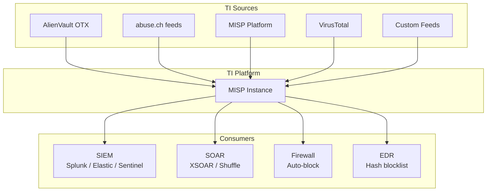

# Threat Intelligence Feeds Integration Guide

> **Document ID:** TI-FEEDS-001  
> **Version:** 1.0  
> **Last Updated:** 2026-02-15  
> **Owner:** SOC Engineer / Threat Intel Analyst  

---

## Purpose

This guide provides step-by-step instructions for integrating **Threat Intelligence (TI) feeds** into your SOC infrastructure. Covers free, open-source, and commercial feeds with configuration examples for major SIEM/SOAR platforms.

---

## Recommended TI Feeds

### Free & Open Source

| Feed | Type | Update Freq | Format | API Key | Use For |
|:---|:---|:---:|:---|:---:|:---|
| [AlienVault OTX](https://otx.alienvault.com/) | IP, Domain, Hash, URL | Real-time | STIX/JSON | ✅ Free | General threat intel |
| [AbuseIPDB](https://www.abuseipdb.com/) | IP reputation | Real-time | JSON | ✅ Free | Brute force, scanning IPs |
| [URLhaus](https://urlhaus.abuse.ch/) | Malicious URLs | Every 5 min | CSV/JSON | ❌ | Malware distribution URLs |
| [MalwareBazaar](https://bazaar.abuse.ch/) | Malware samples | Real-time | JSON | ❌ | Hash lookups |
| [ThreatFox](https://threatfox.abuse.ch/) | IOCs (IP, Domain, Hash) | Real-time | JSON | ❌ | C2, botnet IOCs |
| [Feodo Tracker](https://feodotracker.abuse.ch/) | Botnet C2 IPs | Daily | CSV/JSON | ❌ | Banking trojan C2 |
| [MISP Default Feeds](https://www.misp-project.org/) | Mixed IOCs | Varies | MISP JSON | ❌ | Comprehensive threat sharing |
| [PhishTank](https://phishtank.org/) | Phishing URLs | Hourly | JSON/CSV | ✅ Free | Phishing detection |
| [Emerging Threats](https://rules.emergingthreats.net/) | Snort/Suricata rules | Daily | Rules | ❌ | Network IDS |

### Commercial (Recommended)

| Feed | Specialty | Integrations |
|:---|:---|:---|
| [VirusTotal](https://www.virustotal.com/) | Multi-engine file/URL/IP | All SIEMs, EDR, SOAR |
| [Recorded Future](https://www.recordedfuture.com/) | Risk scoring, APT tracking | Splunk, XSOAR, QRadar |
| [CrowdStrike Falcon Intel](https://www.crowdstrike.com/) | APT attribution, malware | CrowdStrike, Splunk |
| [Mandiant Advantage](https://www.mandiant.com/) | APT campaigns, vulnerabilities | Splunk, Sentinel, XSOAR |

---

## Integration Architecture



---

## Setup Instructions

### 1. MISP — Central TI Platform

```bash
# Docker deployment (recommended)
git clone https://github.com/MISP/misp-docker.git
cd misp-docker
cp template.env .env
# Edit .env with your settings
docker-compose up -d
```

**Enable default feeds:**
1. Login to MISP Web UI → **Sync Actions → Feeds**
2. Click **Load default feed metadata**
3. Enable: CIRCL OSINT, Botvrij.eu, URLhaus, abuse.ch
4. Set **Pull frequency**: Every 1 hour
5. Click **Fetch and store all feeds**

### 2. AlienVault OTX

```python
# Python example — fetch OTX pulses
from OTXv2 import OTXv2, IndicatorTypes

API_KEY = "your_otx_api_key"
otx = OTXv2(API_KEY)

# Get subscribed pulses (last 7 days)
pulses = otx.getall(modified_since="2026-02-08")

for pulse in pulses:
    print(f"Pulse: {pulse['name']}")
    for indicator in pulse['indicators']:
        print(f"  {indicator['type']}: {indicator['indicator']}")
```

**SIEM integration (Splunk):**
```ini
# inputs.conf — OTX Threat Intel
[script://./bin/otx_feed.py]
interval = 3600
sourcetype = otx:pulses
index = threat_intel
```

### 3. abuse.ch Feeds

```bash
# Download URLhaus feed (cron every 5 min)
*/5 * * * * curl -s https://urlhaus.abuse.ch/downloads/csv_recent/ \
  | tail -n +10 > /opt/ti/urlhaus_recent.csv

# Download MalwareBazaar recent (hourly)
0 * * * * curl -s -X POST https://mb-api.abuse.ch/api/v1/ \
  -d "query=get_recent&selector=time" \
  -o /opt/ti/malwarebazaar_recent.json

# Download Feodo Tracker C2 IPs (daily)
0 6 * * * curl -s https://feodotracker.abuse.ch/downloads/ipblocklist_recommended.txt \
  > /opt/ti/feodo_c2_ips.txt
```

### 4. AbuseIPDB

```python
# Python example — check IP reputation
import requests

API_KEY = "your_abuseipdb_key"

def check_ip(ip):
    resp = requests.get(
        "https://api.abuseipdb.com/api/v2/check",
        headers={"Key": API_KEY, "Accept": "application/json"},
        params={"ipAddress": ip, "maxAgeInDays": 90}
    )
    data = resp.json()["data"]
    return {
        "ip": data["ipAddress"],
        "score": data["abuseConfidenceScore"],
        "country": data["countryCode"],
        "reports": data["totalReports"],
        "is_tor": data["isTor"]
    }
```

### 5. VirusTotal

```python
# Python example — file hash lookup
import requests

API_KEY = "your_vt_api_key"

def vt_hash_lookup(file_hash):
    resp = requests.get(
        f"https://www.virustotal.com/api/v3/files/{file_hash}",
        headers={"x-apikey": API_KEY}
    )
    if resp.status_code == 200:
        stats = resp.json()["data"]["attributes"]["last_analysis_stats"]
        return {
            "malicious": stats["malicious"],
            "suspicious": stats["suspicious"],
            "total": sum(stats.values())
        }
    return None
```

---

## SIEM Integration Patterns

### Elastic / OpenSearch

```yaml
# Filebeat — threat intel module
filebeat.modules:
  - module: threatintel
    abuseurl:
      enabled: true
      interval: 5m
    abusemalware:
      enabled: true
      interval: 1h
    misp:
      enabled: true
      var.url: "https://misp.local"
      var.api_token: "${MISP_API_TOKEN}"
      interval: 1h
    otx:
      enabled: true
      var.api_token: "${OTX_API_KEY}"
      interval: 1h
```

### Splunk

```ini
# Splunk ES — Threat Intel Framework
# Configure in Enterprise Security → Configure → Threat Intelligence

[threatlist://urlhaus]
url = https://urlhaus.abuse.ch/downloads/csv_recent/
type = ip
weight = 3
interval = 300
disabled = false

[threatlist://feodo_c2]
url = https://feodotracker.abuse.ch/downloads/ipblocklist_recommended.txt
type = ip
weight = 5
interval = 86400
disabled = false
```

### Microsoft Sentinel

```kusto
// KQL — Match TI indicators against network logs
let TI_IPs = ThreatIntelligenceIndicator
    | where Active == true and ExpirationDateTime > now()
    | where isnotempty(NetworkIP)
    | summarize by NetworkIP;

CommonSecurityLog
| where TimeGenerated > ago(1d)
| where DestinationIP in (TI_IPs) or SourceIP in (TI_IPs)
| project TimeGenerated, SourceIP, DestinationIP, DeviceAction, Activity
```

---

## Feed Lifecycle Management

| Stage | Action | Frequency |
|:---|:---|:---|
| **Ingest** | Pull feeds into MISP/SIEM | Per feed schedule |
| **Normalize** | Convert to standard format (STIX 2.1) | On ingest |
| **Score** | Assign confidence score based on source reliability | On ingest |
| **Correlate** | Match against live logs and alerts | Real-time |
| **Expire** | Remove stale IOCs (default: 90 days) | Daily |
| **Review** | Audit false positive rates per feed | Monthly |
| **Prune** | Disable low-quality feeds | Quarterly |

---

## Related Documents

- [Detection Rules (Sigma)](../07_Detection_Rules/README.md)
- [SOAR Playbook Templates](SOAR_Playbooks.en.md)
- [Threat Intelligence Lifecycle](../06_Operations_Management/Threat_Intelligence_Lifecycle.en.md)
- [IOC Enrichment Sub-Playbook](SOAR_Playbooks.en.md#6-ioc-enrichment)
