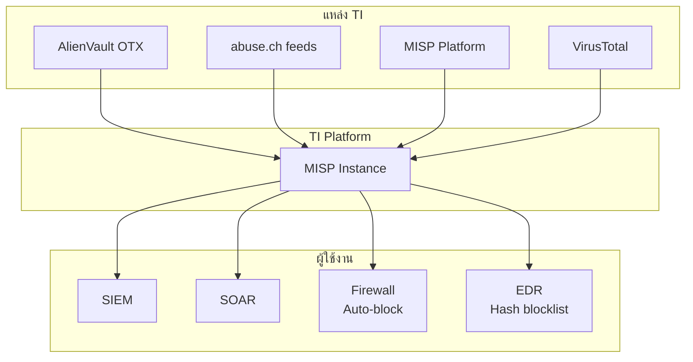
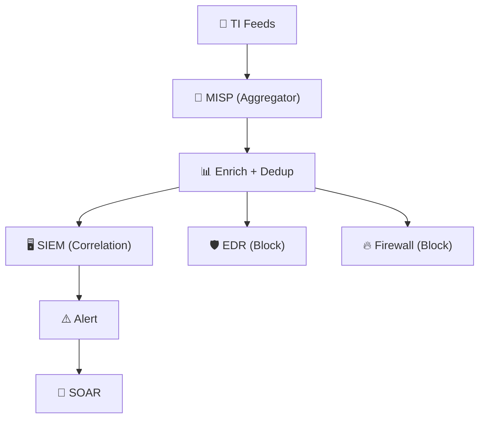

# คู่มือเชื่อมต่อ Threat Intelligence Feeds

> **รหัสเอกสาร:** TI-FEEDS-001  
> **เวอร์ชัน:** 1.0  
> **อัปเดตล่าสุด:** 2026-02-15  
> **เจ้าของ:** SOC Engineer / Threat Intel Analyst  

---

## วัตถุประสงค์

คู่มือนี้ให้คำแนะนำขั้นตอนการเชื่อมต่อ **Threat Intelligence (TI) feeds** เข้ากับโครงสร้าง SOC ครอบคลุมทั้งฟรี, open-source, และ commercial พร้อมตัวอย่าง config สำหรับ SIEM/SOAR หลัก

---

## TI Feeds ที่แนะนำ

### ฟรี & Open Source

| Feed | ประเภท | ความถี่ | Format | API Key | ใช้สำหรับ |
|:---|:---|:---:|:---|:---:|:---|
| [AlienVault OTX](https://otx.alienvault.com/) | IP, Domain, Hash, URL | Real-time | STIX/JSON | ✅ ฟรี | Threat intel ทั่วไป |
| [AbuseIPDB](https://www.abuseipdb.com/) | IP reputation | Real-time | JSON | ✅ ฟรี | Brute force, scanning |
| [URLhaus](https://urlhaus.abuse.ch/) | Malicious URLs | ทุก 5 นาที | CSV/JSON | ❌ | URL กระจาย malware |
| [MalwareBazaar](https://bazaar.abuse.ch/) | ตัวอย่าง malware | Real-time | JSON | ❌ | ค้นหา hash |
| [ThreatFox](https://threatfox.abuse.ch/) | IOCs | Real-time | JSON | ❌ | C2, botnet |
| [Feodo Tracker](https://feodotracker.abuse.ch/) | Botnet C2 IPs | รายวัน | CSV/JSON | ❌ | Banking trojan C2 |
| [MISP Default Feeds](https://www.misp-project.org/) | IOC รวม | แตกต่างกัน | MISP JSON | ❌ | แชร์ข้อมูลภัยครอบคลุม |
| [PhishTank](https://phishtank.org/) | Phishing URLs | รายชั่วโมง | JSON/CSV | ✅ ฟรี | ตรวจจับ phishing |

### Commercial (แนะนำ)

| Feed | ความเชี่ยวชาญ | เชื่อมต่อ |
|:---|:---|:---|
| [VirusTotal](https://www.virustotal.com/) | Multi-engine file/URL/IP | ทุก SIEM, EDR, SOAR |
| [Recorded Future](https://www.recordedfuture.com/) | Risk scoring, APT tracking | Splunk, XSOAR, QRadar |
| [CrowdStrike](https://www.crowdstrike.com/) | APT attribution | CrowdStrike, Splunk |
| [Mandiant](https://www.mandiant.com/) | APT campaigns | Splunk, Sentinel, XSOAR |

---

## สถาปัตยกรรมการเชื่อมต่อ



---

## คำแนะนำการติดตั้ง

### 1. MISP — ศูนย์กลาง TI

```bash
# Deploy ด้วย Docker (แนะนำ)
git clone https://github.com/MISP/misp-docker.git
cd misp-docker
cp template.env .env
# แก้ไข .env ตามต้องการ
docker-compose up -d
```

**เปิด default feeds:**
1. เข้า MISP Web UI → **Sync Actions → Feeds**
2. คลิก **Load default feed metadata**
3. เปิด: CIRCL OSINT, Botvrij.eu, URLhaus, abuse.ch
4. ตั้ง **Pull frequency**: ทุก 1 ชั่วโมง
5. คลิก **Fetch and store all feeds**

### 2. AlienVault OTX

```python
# Python — ดึง OTX pulses
from OTXv2 import OTXv2, IndicatorTypes

API_KEY = "your_otx_api_key"
otx = OTXv2(API_KEY)

pulses = otx.getall(modified_since="2026-02-08")
for pulse in pulses:
    print(f"Pulse: {pulse['name']}")
    for indicator in pulse['indicators']:
        print(f"  {indicator['type']}: {indicator['indicator']}")
```

### 3. abuse.ch Feeds

```bash
# Cron สำหรับดึง feed อัตโนมัติ
*/5 * * * * curl -s https://urlhaus.abuse.ch/downloads/csv_recent/ \
  | tail -n +10 > /opt/ti/urlhaus_recent.csv

0 * * * * curl -s -X POST https://mb-api.abuse.ch/api/v1/ \
  -d "query=get_recent&selector=time" \
  -o /opt/ti/malwarebazaar_recent.json

0 6 * * * curl -s https://feodotracker.abuse.ch/downloads/ipblocklist_recommended.txt \
  > /opt/ti/feodo_c2_ips.txt
```

### 4. AbuseIPDB

```python
import requests

API_KEY = "your_abuseipdb_key"

def check_ip(ip):
    resp = requests.get(
        "https://api.abuseipdb.com/api/v2/check",
        headers={"Key": API_KEY, "Accept": "application/json"},
        params={"ipAddress": ip, "maxAgeInDays": 90}
    )
    data = resp.json()["data"]
    return {
        "ip": data["ipAddress"],
        "score": data["abuseConfidenceScore"],
        "country": data["countryCode"],
        "reports": data["totalReports"]
    }
```

---

## รูปแบบเชื่อมต่อ SIEM

### Elastic / OpenSearch

```yaml
filebeat.modules:
  - module: threatintel
    abuseurl:
      enabled: true
      interval: 5m
    misp:
      enabled: true
      var.url: "https://misp.local"
      var.api_token: "${MISP_API_TOKEN}"
      interval: 1h
    otx:
      enabled: true
      var.api_token: "${OTX_API_KEY}"
      interval: 1h
```

### Splunk

```ini
[threatlist://urlhaus]
url = https://urlhaus.abuse.ch/downloads/csv_recent/
type = ip
weight = 3
interval = 300

[threatlist://feodo_c2]
url = https://feodotracker.abuse.ch/downloads/ipblocklist_recommended.txt
type = ip
weight = 5
interval = 86400
```

### Microsoft Sentinel

```kusto
let TI_IPs = ThreatIntelligenceIndicator
    | where Active == true and ExpirationDateTime > now()
    | where isnotempty(NetworkIP)
    | summarize by NetworkIP;

CommonSecurityLog
| where TimeGenerated > ago(1d)
| where DestinationIP in (TI_IPs) or SourceIP in (TI_IPs)
| project TimeGenerated, SourceIP, DestinationIP, DeviceAction
```

---

## วงจร Feed Management

| ขั้นตอน | การดำเนินการ | ความถี่ |
|:---|:---|:---|
| **Ingest** | ดึง feeds เข้า MISP/SIEM | ตาม feed schedule |
| **Normalize** | แปลงเป็น STIX 2.1 | เมื่อ ingest |
| **Score** | ให้ confidence score | เมื่อ ingest |
| **Correlate** | จับคู่กับ logs/alerts | Real-time |
| **Expire** | ลบ IOC ที่เก่า (default: 90 วัน) | รายวัน |
| **Review** | ตรวจ false positive rate | รายเดือน |
| **Prune** | ปิด feed คุณภาพต่ำ | รายไตรมาส |

---

## Feed Quality Assessment

| Feed | ประเภท | Volume/วัน | FP Rate | Actionable? | ค่าใช้จ่าย |
|:---|:---|:---:|:---:|:---:|:---|
| AlienVault OTX | Open | ~1,000 IoCs | 15–25% | ปานกลาง | ฟรี |
| Abuse.ch (URLhaus/ThreatFox) | Open | ~500 | 5–10% | สูง | ฟรี |
| MISP Community | Open | ~200 | 10–15% | สูง | ฟรี |
| VirusTotal | Commercial | Unlimited | < 5% | สูงมาก | $$$ |
| Recorded Future | Commercial | ~2,000 | < 3% | สูงมาก | $$$ |

## TI Feed Integration Architecture



## Feed Lifecycle Management

| กิจกรรม | ความถี่ |
|:---|:---|
| ทบทวน feed quality + FP rate | รายเดือน |
| ลบ IoCs ที่หมดอายุ | อัตโนมัติ (TTL) |
| ประเมิน feed ใหม่ | รายไตรมาส |
| ทบทวน commercial feed ROI | รายปี |

## เอกสารที่เกี่ยวข้อง

- [Detection Rules (Sigma)](../07_Detection_Rules/README.md)
- [SOAR Playbook Templates](../05_Incident_Response/SOAR_Playbooks.th.md)
- [วงจร Threat Intelligence](Threat_Intelligence_Lifecycle.th.md)
