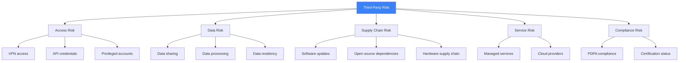
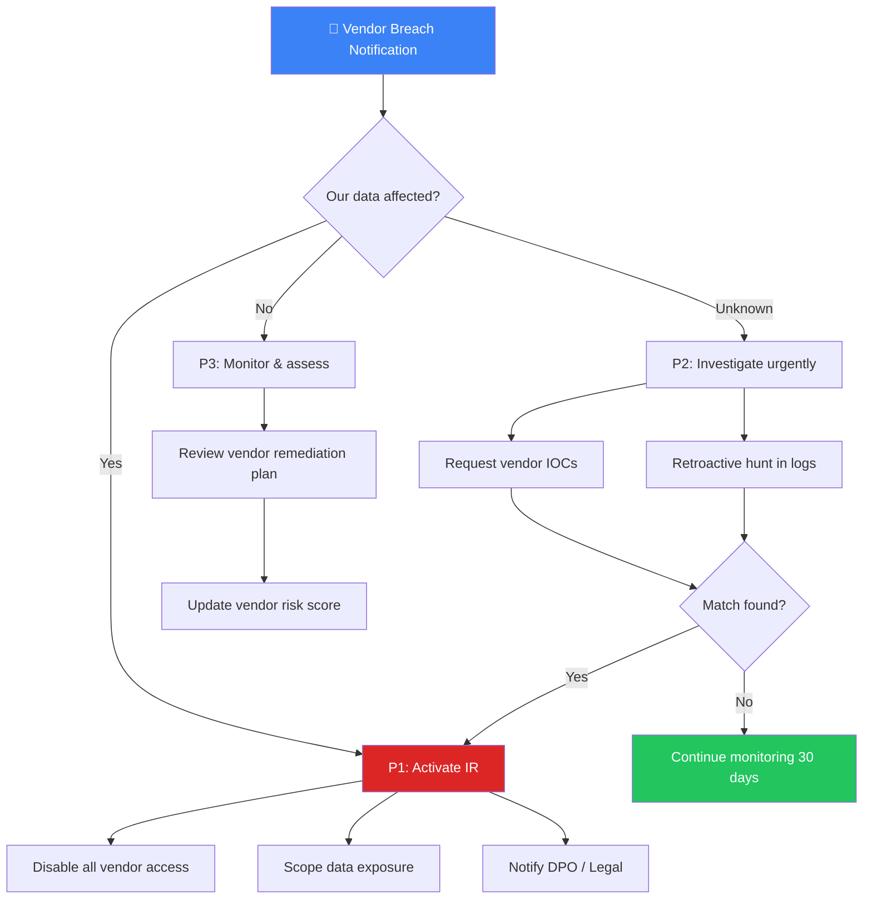

# Third-Party Risk — SOC Integration SOP

**Document ID**: OPS-SOP-014
**Version**: 1.0
**Classification**: Internal
**Last Updated**: 2026-02-15

> Third parties and supply chain partners extend your attack surface. This SOP defines how the SOC **monitors**, **responds to**, and **manages risk** from vendors, contractors, APIs, and outsourced services.

---

## Scope

| In Scope | Out of Scope |
|:---|:---|
| Vendor VPN/remote access monitoring | Vendor financial risk assessment |
| Third-party API security monitoring | Contract negotiation |
| Supply chain attack detection | Procurement process |
| Vendor incident notification & response | Vendor selection |
| MSSP / outsourced SOC coordination | Legal liability determination |
| SaaS/Cloud provider security monitoring | Insurance claims |

---

## Third-Party Risk Categories

---

## Vendor Risk Tiering

| Tier | Criteria | SOC Monitoring Level | Review Frequency | Access Type |
|:---:|:---|:---:|:---:|:---|
| **Tier 1** 🔴 Critical | Direct access to production, handles PII, provides security services | **Full** — real-time + dedicated alerts | Monthly | VPN + privileged accounts |
| **Tier 2** 🟠 High | Access to staging/dev, handles business data, SaaS with sensitive data | **Enhanced** — daily log review + alerts | Quarterly | Limited VPN / API keys |
| **Tier 3** 🟡 Medium | Limited access, no sensitive data, non-critical services | **Standard** — weekly review | Semi-annually | Portal / restricted API |
| **Tier 4** 🟢 Low | No direct access, public-facing only | **Basic** — event-driven | Annually | None / public API only |

---

## SOC Monitoring Requirements by Tier

### Tier 1 — Critical Vendors

| # | Monitoring Requirement | Data Source | Alert Rule |
|:---:|:---|:---|:---|
| 1 | Login/logout from vendor accounts | IAM / AD | Login outside approved hours, from new IP/country |
| 2 | Privileged commands executed | EDR / cmdline logs | Admin command from vendor account |
| 3 | Data access patterns | DLP / file access logs | Bulk download, access outside scope |
| 4 | Network traffic anomalies | Firewall / NDR | Large outbound transfer, unusual ports |
| 5 | API call volume & patterns | API gateway logs | Spike in API calls, new endpoints accessed |
| 6 | File modifications | FIM | Changes to critical files during vendor session |
| 7 | Lateral movement attempts | EDR / SIEM | Access to systems outside approved scope |

### Tier 2 — High Risk Vendors

| # | Monitoring Requirement | Data Source |
|:---:|:---|:---|
| 1 | Login/logout tracking | IAM / AD |
| 2 | Data access patterns | DLP |
| 3 | API usage monitoring | API gateway |
| 4 | Session duration tracking | VPN / firewall |

### Tier 3–4 — Medium/Low Risk

| # | Monitoring Requirement | Data Source |
|:---:|:---|:---|
| 1 | Authentication events | IAM |
| 2 | API rate limiting alerts | API gateway |

---

## Vendor Access Controls

### Pre-Access Checklist

- [ ] Vendor registered in vendor inventory
- [ ] Tier classification assigned
- [ ] Access request approved by system owner
- [ ] MFA enforced for all vendor accounts
- [ ] Time-limited access window configured
- [ ] IP allowlist configured (where applicable)
- [ ] Monitoring rules deployed per tier
- [ ] Break-glass procedure confirmed

### Access Monitoring Dashboard

| Metric | Current | Alert Threshold |
|:---|:---:|:---:|
| Active vendor sessions | _____ | > 10 concurrent |
| Vendor accounts with recent password change | _____ | < 90 days required |
| Vendor accounts without MFA | _____ | Must be 0 |
| Dormant vendor accounts (no login 90 days) | _____ | Auto-disable |
| Vendor sessions outside approved hours | _____ | Auto-alert |

---

## Third-Party Incident Response

### When a Vendor Is Compromised

### Response Steps

| Step | Action | Owner | SLA |
|:---:|:---|:---|:---:|
| 1 | Receive vendor breach notification | SOC Tier 2 | — |
| 2 | Assess impact: Is our data/access affected? | SOC Lead | 1 hour |
| 3 | If affected: **Disable all vendor access immediately** | SOC Engineering | 15 min |
| 4 | Request vendor IOCs (IPs, domains, hashes, TTPs) | SOC Lead | 2 hours |
| 5 | Hunt for vendor IOCs in our logs (retroactive 90 days) | SOC Tier 2/3 | 4 hours |
| 6 | If match found: **Escalate to P1, full IR activation** | IR Manager | Immediate |
| 7 | Notify DPO/Legal if PII potentially exposed | SOC Manager | 4 hours |
| 8 | PDPA notification if Thai citizen data affected | DPO | < 72 hours |
| 9 | Monitor vendor remediation progress | Vendor Manager | Weekly |
| 10 | Vendor must provide root cause + remediation report | Vendor | 30 days |
| 11 | Update vendor risk tier based on incident | SOC Manager | Post-incident |

### When SOC Detects Suspicious Vendor Activity

| Step | Action | Owner |
|:---:|:---|:---|
| 1 | Alert triggered by vendor monitoring rule | SOC Tier 1 |
| 2 | Verify: Is this authorized activity? | SOC Tier 2 |
| 3 | If unauthorized: **Suspend vendor access** | SOC Engineering |
| 4 | Contact vendor's security team | SOC Lead |
| 5 | Conduct forensic investigation if needed | SOC Tier 3 |
| 6 | Document findings and update vendor risk score | SOC Lead |

---

## Supply Chain Attack Detection

### Red Flags to Watch For

| Signal | Detection Method | Rule Example |
|:---|:---|:---|
| Software update from unexpected source | Hash verification | Update hash ≠ vendor's published hash |
| Unexpected code in dependency | SCA tools (Snyk, etc.) | New dependency with low reputation |
| Vendor tool making unusual network calls | NDR / firewall | Vendor agent connecting to unknown IPs |
| Certificate change on vendor portal | Certificate monitoring | Cert issuer changed unexpectedly |
| Sudden change in vendor API behavior | API monitoring | New endpoints, changed data formats |
| Vendor domain DNS changes | DNS monitoring | Nameserver change, new CNAME records |

### SolarWinds-Style Defense Checklist

- [ ] Validate update hashes before deployment
- [ ] Monitor vendor software network behavior post-update
- [ ] Segment vendor tools on separate network segment
- [ ] Run vendor binaries in monitored sandbox first
- [ ] Subscribe to vendor security advisories
- [ ] Maintain vendor software bill of materials (SBOM)

---

## Vendor Inventory Template

| Vendor Name | Tier | Service Provided | Data Access | Access Method | Monitoring Level | Contract Expiry | Last Review | Risk Score |
|:---|:---:|:---|:---|:---|:---:|:---:|:---:|:---:|
| ____________ | 1/2/3/4 | ____________ | PII/Business/None | VPN/API/Portal | Full/Enhanced/Standard/Basic | ____-__-__ | ____-__-__ | __/10 |
| ____________ | 1/2/3/4 | ____________ | PII/Business/None | VPN/API/Portal | Full/Enhanced/Standard/Basic | ____-__-__ | ____-__-__ | __/10 |

---

## MSSP / Outsourced SOC Coordination

> If parts of SOC operations are outsourced, these additional controls apply.

| Requirement | Details |
|:---|:---|
| **Shared playbooks** | MSSP must follow same playbooks as internal team |
| **Escalation path** | MSSP → Internal SOC Lead → IR Manager (documented) |
| **Data handling** | MSSP cannot export data without approval |
| **SLA monitoring** | Track MSSP MTTD, MTTR, SLA compliance separately |
| **Audit rights** | Quarterly review of MSSP operations and access |
| **Termination plan** | Documented plan for transitioning away from MSSP |

---

## Metrics

| Metric | Target | Measurement |
|:---|:---:|:---|
| Vendor access reviews completed on time | 100% | Per tier schedule |
| Vendor accounts with MFA | 100% | Monthly check |
| Dormant vendor accounts disabled | 100% (> 90 days) | Automated check |
| Vendor incidents detected internally | Track | Before vendor notification |
| Mean time to disable compromised vendor | < 15 min | From detection to disable |
| Vendor IOC hunt completion | < 4 hours | From IOC receipt to scan complete |

---

## Related Documents

-   [Escalation Matrix](../05_Incident_Response/Escalation_Matrix.en.md) — Who to escalate to
-   [Incident Classification](../05_Incident_Response/Incident_Classification.en.md) — Classify vendor incidents
-   [Forensic Investigation](../05_Incident_Response/Forensic_Investigation.en.md) — If forensics needed
-   [Vendor Evaluation](Vendor_Evaluation.en.md) — Tool/vendor evaluation template
-   [SLA Template](SLA_Template.en.md) — SLA definitions
-   [Log Source Matrix](Log_Source_Matrix.en.md) — Data source coverage
-   [SOC Automation Catalog](SOC_Automation_Catalog.en.md) — Automation for vendor monitoring
