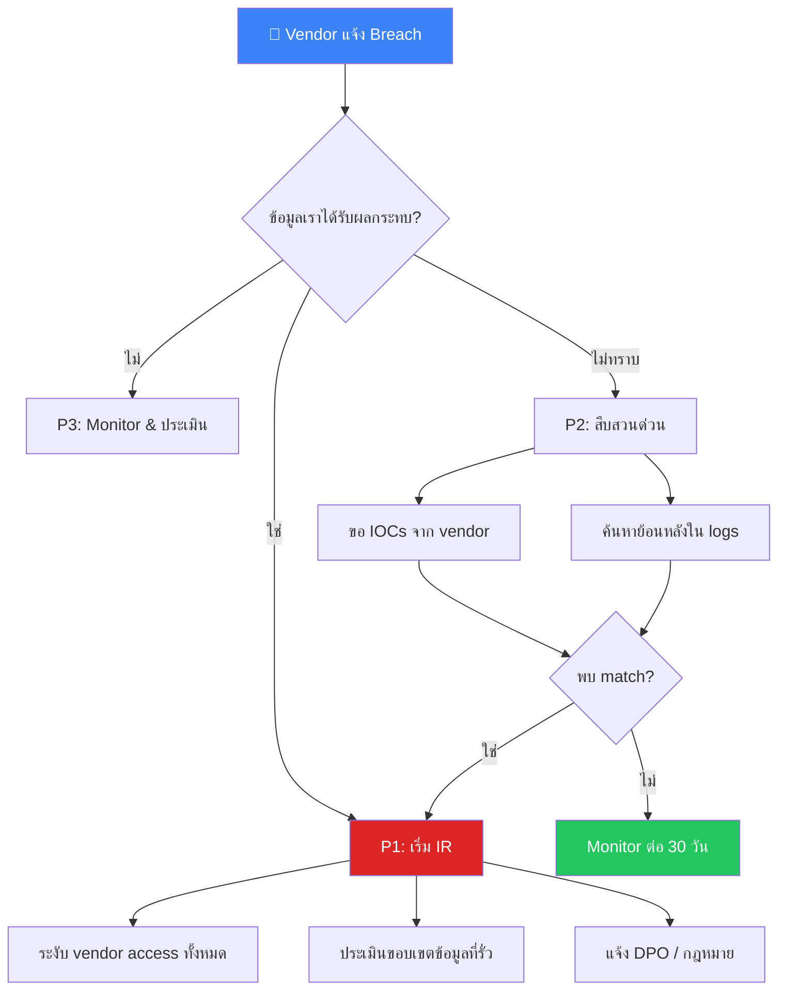

# Third-Party Risk — SOC Integration SOP / SOP ความเสี่ยงจากบุคคลที่สาม

**รหัสเอกสาร**: OPS-SOP-014
**เวอร์ชัน**: 1.0
**การจัดชั้นความลับ**: ใช้ภายใน
**อัปเดตล่าสุด**: 2026-02-15

> บุคคลที่สามและ supply chain ขยายพื้นผิวโจมตีขององค์กร SOP นี้กำหนดวิธีที่ SOC **ติดตาม**, **ตอบสนอง**, และ **จัดการความเสี่ยง** จาก vendors, ผู้รับเหมา, APIs, และบริการ outsource

---

## การจัดชั้นความเสี่ยง Vendor

| ชั้น | เกณฑ์ | ระดับ SOC Monitoring | ความถี่ทบทวน | ประเภทการเข้าถึง |
|:---:|:---|:---:|:---:|:---|
| **Tier 1** 🔴 | เข้าถึง production, จัดการ PII, ให้บริการด้าน security | **เต็มรูปแบบ** — real-time + dedicated alerts | รายเดือน | VPN + privileged accounts |
| **Tier 2** 🟠 | เข้าถึง staging/dev, จัดการข้อมูลธุรกิจ | **เข้มข้น** — ตรวจ log รายวัน + alerts | รายไตรมาส | VPN จำกัด / API keys |
| **Tier 3** 🟡 | เข้าถึงจำกัด, ไม่มีข้อมูลสำคัญ | **มาตรฐาน** — ตรวจรายสัปดาห์ | ทุก 6 เดือน | Portal / restricted API |
| **Tier 4** 🟢 | ไม่มีการเข้าถึงโดยตรง | **พื้นฐาน** — ตามเหตุการณ์ | รายปี | ไม่มี / public API |

---

## ข้อกำหนดการ Monitor ตามชั้น

### Tier 1 — Vendor วิกฤต

| # | ข้อกำหนด | แหล่งข้อมูล | Alert Rule |
|:---:|:---|:---|:---|
| 1 | Login/logout จาก vendor accounts | IAM / AD | Login นอกเวลาที่อนุมัติ, IP/ประเทศใหม่ |
| 2 | คำสั่ง privileged ที่ทำ | EDR / cmdline logs | Admin command จาก vendor account |
| 3 | รูปแบบการเข้าถึงข้อมูล | DLP / file access logs | Bulk download, เข้าถึงนอกขอบเขต |
| 4 | Network traffic anomalies | Firewall / NDR | โอนข้อมูลขนาดใหญ่, port ผิดปกติ |
| 5 | ปริมาณ API calls | API gateway logs | Spike ใน API calls |
| 6 | การแก้ไขไฟล์ | FIM | เปลี่ยนไฟล์สำคัญระหว่าง vendor session |
| 7 | Lateral movement | EDR / SIEM | เข้าถึงระบบนอกขอบเขตที่อนุมัติ |

---

## การควบคุมการเข้าถึง Vendor

### Checklist ก่อนอนุญาตเข้าถึง

- [ ] ลงทะเบียน vendor ในทะเบียน vendor inventory
- [ ] กำหนดชั้นความเสี่ยง
- [ ] ได้รับอนุมัติจาก system owner
- [ ] บังคับ MFA สำหรับ vendor accounts ทั้งหมด
- [ ] กำหนดช่วงเวลาเข้าถึง (time-limited)
- [ ] กำหนด IP allowlist (ถ้าเป็นไปได้)
- [ ] Deploy monitoring rules ตามชั้น
- [ ] ยืนยัน break-glass procedure

---

## การตอบสนองเมื่อ Vendor ถูกบุกรุก

### ขั้นตอนตอบสนอง

| ขั้น | การดำเนินการ | ผู้รับผิดชอบ | SLA |
|:---:|:---|:---|:---:|
| 1 | รับการแจ้ง breach จาก vendor | SOC Tier 2 | — |
| 2 | ประเมินผลกระทบ: ข้อมูล/การเข้าถึงของเราได้รับผลกระทบ? | SOC Lead | 1 ชม. |
| 3 | ถ้าได้รับผลกระทบ: **ระงับ vendor access ทันที** | SOC Engineering | 15 นาที |
| 4 | ขอ IOCs จาก vendor (IPs, domains, hashes, TTPs) | SOC Lead | 2 ชม. |
| 5 | ค้นหา IOCs ใน logs (ย้อนหลัง 90 วัน) | SOC Tier 2/3 | 4 ชม. |
| 6 | ถ้าพบ match: **Escalate เป็น P1** | IR Manager | ทันที |
| 7 | แจ้ง DPO/กฎหมายถ้า PII อาจรั่วไหล | SOC Manager | 4 ชม. |
| 8 | แจ้ง PDPA ถ้ามีข้อมูลคนไทยได้รับผลกระทบ | DPO | < 72 ชม. |
| 9 | Vendor ต้องส่ง root cause + แผนแก้ไข | Vendor | 30 วัน |

---

## การตรวจจับ Supply Chain Attack

### สัญญาณเตือน

| สัญญาณ | วิธีตรวจจับ | ตัวอย่าง Rule |
|:---|:---|:---|
| Software update จากแหล่งไม่คาดหมาย | ตรวจ Hash | Hash ≠ hash ที่ vendor ประกาศ |
| Code ไม่คาดหมายใน dependency | SCA tools (Snyk ฯลฯ) | Dependency ใหม่ที่ไม่น่าเชื่อถือ |
| Vendor tool เชื่อมต่อ network ผิดปกติ | NDR / firewall | Agent เชื่อมต่อ IP ไม่รู้จัก |
| Certificate ของ vendor portal เปลี่ยน | Certificate monitoring | Cert issuer เปลี่ยนกะทันหัน |

### Checklist ป้องกันแบบ SolarWinds

- [ ] ตรวจ hash ของ update ก่อน deploy
- [ ] Monitor พฤติกรรม network ของ vendor software หลัง update
- [ ] แยก vendor tools บน network segment แยก
- [ ] รัน vendor binaries ใน sandbox ที่ monitor ก่อน
- [ ] สมัครรับ vendor security advisories
- [ ] จัดทำ SBOM ของ vendor software

---

## Template Vendor Inventory

| Vendor | ชั้น | บริการ | ข้อมูลที่เข้าถึง | วิธีเข้าถึง | การ Monitor | หมดสัญญา | ทบทวนล่าสุด | คะแนนเสี่ยง |
|:---|:---:|:---|:---|:---|:---:|:---:|:---:|:---:|
| ____________ | 1/2/3/4 | ____________ | PII/ธุรกิจ/ไม่มี | VPN/API/Portal | เต็ม/เข้มข้น/มาตรฐาน/พื้นฐาน | ____-__-__ | ____-__-__ | __/10 |

---

## การประสานงานกับ MSSP

| ข้อกำหนด | รายละเอียด |
|:---|:---|
| **Playbook ร่วม** | MSSP ต้องใช้ playbook เดียวกับทีมภายใน |
| **เส้นทาง Escalation** | MSSP → SOC Lead ภายใน → IR Manager (บันทึกไว้) |
| **การจัดการข้อมูล** | MSSP ไม่สามารถส่งออกข้อมูลได้โดยไม่ได้รับอนุมัติ |
| **SLA monitoring** | ติดตาม MTTD, MTTR, SLA ของ MSSP แยกต่างหาก |
| **สิทธิ์ audit** | ทบทวน MSSP operations รายไตรมาส |
| **แผนยุติสัญญา** | แผนการ transition เมื่อต้องเปลี่ยน MSSP |

---

## ตัวชี้วัด

| ตัวชี้วัด | เป้าหมาย | วิธีวัด |
|:---|:---:|:---|
| ทบทวน vendor access ตรงเวลา | 100% | ตามตารางแต่ละชั้น |
| Vendor accounts ที่มี MFA | 100% | ตรวจรายเดือน |
| Dormant vendor accounts ที่ disable | 100% (> 90 วัน) | ตรวจอัตโนมัติ |
| เวลาในการ disable vendor ที่ถูกบุกรุก | < 15 นาที | จากตรวจพบถึง disable |
| Vendor IOC hunt เสร็จ | < 4 ชม. | จากได้รับ IOC ถึงสแกนเสร็จ |

---

## เทมเพลตแบบประเมินผู้ให้บริการ

### Security Assessment Questionnaire

| # | หมวด | คำถาม | คำตอบ | Risk |
|:---:|:---|:---|:---|:---:|
| 1 | **Certifications** | มี ISO 27001 / SOC 2? | [ใช่/ไม่] | 🔴/🟢 |
| 2 | **Data Handling** | ข้อมูลเข้ารหัสระหว่างจัดเก็บ? | [ใช่/ไม่] | 🔴/🟢 |
| 3 | **Data Location** | ข้อมูลจัดเก็บในประเทศไทย? | [ใช่/ไม่] | 🔴/🟢 |
| 4 | **Access Control** | ใช้ MFA สำหรับ admin access? | [ใช่/ไม่] | 🔴/🟢 |
| 5 | **Incident Response** | มีแผน IR ที่ทดสอบแล้ว? | [ใช่/ไม่] | 🔴/🟢 |
| 6 | **BCP/DR** | มีแผน BCP/DR? | [ใช่/ไม่] | 🔴/🟢 |
| 7 | **PDPA** | ปฏิบัติตาม PDPA? | [ใช่/ไม่] | 🔴/🟢 |

### Risk Scoring

| คะแนนรวม | Risk Level | Action |
|:---|:---|:---|
| 0–2 🔴 flags | **Low Risk** | อนุมัติ, review ปีละครั้ง |
| 3–4 🔴 flags | **Medium Risk** | อนุมัติแบบมีเงื่อนไข |
| 5–6 🔴 flags | **High Risk** | ต้อง remediate ก่อนอนุมัติ |
| 7 🔴 flags | **Critical** | ไม่อนุมัติ |

## Continuous Monitoring

| ตรวจสอบ | ความถี่ | เครื่องมือ |
|:---|:---|:---|
| Security scorecard | รายเดือน | SecurityScorecard / BitSight |
| Certificate expiry | อัตโนมัติ | SSL monitoring |
| Dark web mentions | รายสัปดาห์ | TI platform |
| Service availability | Real-time | Uptime monitoring |

## Vendor Incident SLA

| ระดับ | คำอธิบาย | Notification SLA | Resolution SLA |
|:---|:---|:---:|:---:|
| 🔴 Critical | Data breach | ≤ 1 ชม. | ≤ 24 ชม. |
| 🟡 High | Security incident | ≤ 4 ชม. | ≤ 48 ชม. |
| 🟠 Medium | Vulnerability | ≤ 24 ชม. | ≤ 7 วัน |
| 🟢 Low | Config issue | ≤ 72 ชม. | ≤ 30 วัน |

## เอกสารที่เกี่ยวข้อง

-   [Escalation Matrix](../05_Incident_Response/Escalation_Matrix.en.md)
-   [Incident Classification](../05_Incident_Response/Incident_Classification.en.md)
-   [Forensic Investigation](../05_Incident_Response/Forensic_Investigation.en.md)
-   [Vendor Evaluation](Vendor_Evaluation.en.md)
-   [SLA Template](SLA_Template.en.md)
-   [Log Source Matrix](Log_Source_Matrix.en.md)
