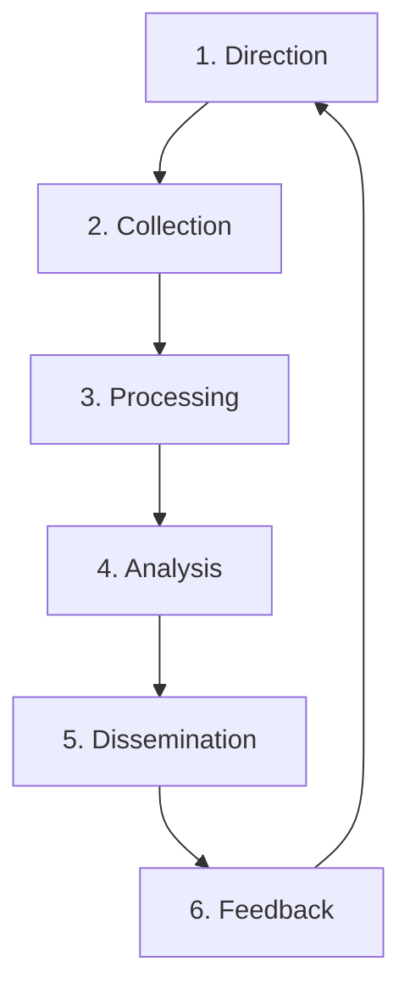

# Threat Intelligence Lifecycle (CTI)

**Version**: 1.0
**Owner**: CTI Analyst / SOC Manager

## 1. Overview
Cyber Threat Intelligence (CTI) is the process of collecting, analyzing, and disseminating information about current and potential attacks. This standard ensures our SOC moves from "Reactive" to "Proactive".

## 2. Phases

### Phase 1: Direction (Requirement)
-   **Goal**: Define what we are protecting and what questions we need answered.
-   **Key Intelligence Questions (KIQs)**:
    -   "Is the new 'ABC Ransomware' targeting our industry?"
    -   "Do we have exposure to the CVE-2026-XXXX vulnerability?"

### Phase 2: Collection
-   **Internal Sources**: SIEM Logs, Incident Tickets, EDR Alerts.
-   **External Sources**:
    -   **Open Source (OSINT)**: Twitter, Blogs, CISA Alerts.
    -   **Commercial Feeds**: Vendor reports, Paid API feeds.
    -   **Communities**: ISACs, CERTs, Trusted Partner Peers.

### Phase 3: Processing
-   **Normalization**: Converting raw data (PDFs, Tweets) into standard formats (STIX/TAXII, CSV).
-   **Validation**: Confirming that an Indicator of Compromise (IoC) is valid and not a False Positive (e.g., verifying a "malicious IP" isn't actually Google DNS).

### Phase 4: Analysis
-   **Contextualization**: Adding "So What?".
    -   *Raw Data*: "IP 1.2.3.4 is bad."
    -   *Intelligence*: "IP 1.2.3.4 is a C2 server for APT29 targeting Banks. We are a Bank. Severity = Critical."

### Phase 5: Dissemination
-   **Tactical**: IoCs sent to SIEM/Firewall for blocking (TLP:GREEN).
-   **Operational**: Reports sent to SOC Manager for awareness (TLP:AMBER).
-   **Strategic**: Trend reports sent to CISO/Board (TLP:CLEAR/WHITE).

### Phase 6: Feedback
-   **Review**: Did the intel help? Did it cause false positives?
-   **Action**: Tune sources or refine requirements.

## 3. IoC Management Policy
All Indicators of Compromise (IoCs) must go through the **Review Process** before blocking:
1.  Analyst collects IoC.
2.  Analyst checks reputation (VirusTotal / internal logs).
3.  Analyst updates reference list in SIEM (Test Mode).
4.  If stable > 24 hours, move to Block Mode.
