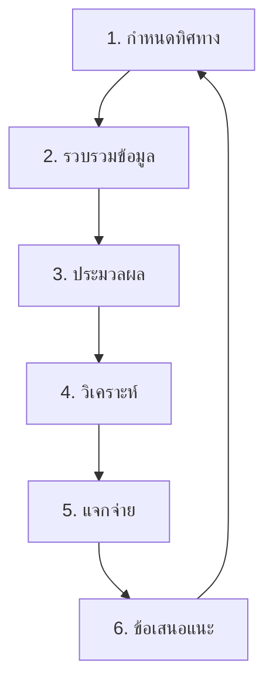

# วงจรข่าวกรองภัยคุกคาม (Threat Intelligence Lifecycle)

**เวอร์ชัน**: 1.0
**ผู้รับผิดชอบ**: CTI Analyst / SOC Manager

## 1. ภาพรวม
Cyber Threat Intelligence (CTI) คือกระบวนการรวบรวม วิเคราะห์ และแจกจ่ายข้อมูลเกี่ยวกับภัยคุกคาม เพื่อให้ SOC สามารถป้องกันตนเองได้ก่อนที่จะเกิดเหตุ (Proactive)

## 2. ขั้นตอนการทำงาน (Phases)

### Phase 1: Direction (กำหนดโจทย์)
-   **เป้าหมาย**: ระบุว่าเราต้องการรู้อะไร?
-   **คำถามหลัก (KIQs)**:
    -   "กลุ่มแฮกเกอร์ ABC กำลังโจมตีธุรกิจประเภทเดียวกับเราหรือไม่?"
    -   "เรามีความเสี่ยงต่อช่องโหว่ใหม่ CVE-2026-XXXX หรือไม่?"

### Phase 2: Collection (รวบรวม)
-   **แหล่งภายใน**: SIEM Logs, เคสเก่าๆ
-   **แหล่งภายนอก**:
    -   **OSINT**: Twitter, ข่าวความปลอดภัย, CISA
    -   **Commercial**: Feed ที่เสียเงินซื้อ
    -   **Communities**: กลุ่ม ThaiCERT, TB-CERT

### Phase 3: Processing (ประมวลผล)
-   **จัดระเบียบ**: แปลงข้อมูลจากข่าว/PDF ให้เป็น Format ที่คอมพิวเตอร์อ่านได้ (STIX, CSV)
-   **ตรวจสอบ**: ยืนยันว่าข้อมูลถูกต้อง (Validation) เพื่อลด False Positive

### Phase 4: Analysis (วิเคราะห์)
-   **การให้บริบท**: เปลี่ยน "ข้อมูลดิบ" เป็น "ข่าวกรอง"
    -   *ข้อมูลดิบ*: "IP 1.2.3.4 เป็นอันตราย"
    -   *ข่าวกรอง*: "IP 1.2.3.4 เป็น C2 ของ APT29 ที่เล็งเป้าธนาคาร และเราเป็นธนาคาร ดังนั้นความเสี่ยง = สูงมาก"

### Phase 5: Dissemination (แจกจ่าย)
-   **Tactical**: ส่ง IP/Hash ลง SIEM/Firewall เพื่อบล็อก (TLP:GREEN)
-   **Operational**: ส่งรายงานให้หัวหน้าทีม SOC (TLP:AMBER)
-   **Strategic**: ส่งสรุปแนวโน้มให้ผู้บริหาร (TLP:CLEAR/WHITE)

### Phase 6: Feedback (ปรับปรุง)
-   **ทบทวน**: ข่าวกรองที่ได้มามีประโยชน์ไหม? แจ้งเตือนมั่วซั่วหรือไม่?

## 3. นโยบายการจัดการ IoC
Indicators of Compromise (IoCs) ทุกตัวต้องผ่านกระบวนการตรวจสอบก่อนบล็อก:
1.  Analyst รวบรวม IoC
2.  ตรวจสอบค่าชื่อเสียง (Reputation Check)
3.  ใส่ใน SIEM ระบบ Test Mode (Monitor Only)
4.  ถ้าไม่มี False Positive นาน 24 ชม. จึงเปิด Block Mode
