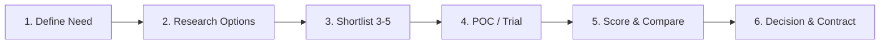

# SOC Vendor & Tool Evaluation Template

> **Document ID:** VENDOR-001  
> **Version:** 1.0  
> **Last Updated:** 2026-02-15  
> **Owner:** SOC Manager / CISO

---

## Purpose

Provides a structured framework for evaluating and comparing SOC tools and vendor solutions. Use this template when considering new SIEM, EDR, SOAR, TI, or any security tool.

---

## Evaluation Process



---

## Evaluation Criteria (Scoring Matrix)

Score each criterion **1–5** (1 = Poor, 5 = Excellent)

### Core Capabilities

| # | Criterion | Weight | Vendor A | Vendor B | Vendor C |
|:---:|:---|:---:|:---:|:---:|:---:|
| 1 | **Detection accuracy** (true positive rate) | 3× | /5 | /5 | /5 |
| 2 | **Log ingestion capacity** (EPS/GB per day) | 3× | /5 | /5 | /5 |
| 3 | **Query performance** (search speed) | 2× | /5 | /5 | /5 |
| 4 | **Alert customization** (rule creation flexibility) | 2× | /5 | /5 | /5 |
| 5 | **MITRE ATT&CK coverage** (built-in detections) | 2× | /5 | /5 | /5 |
| 6 | **Dashboard & visualization** quality | 1× | /5 | /5 | /5 |

### Integration & Compatibility

| # | Criterion | Weight | Vendor A | Vendor B | Vendor C |
|:---:|:---|:---:|:---:|:---:|:---:|
| 7 | **API availability** (REST API, webhooks) | 2× | /5 | /5 | /5 |
| 8 | **Integration with existing stack** | 3× | /5 | /5 | /5 |
| 9 | **Log source support** (OS, cloud, network, app) | 2× | /5 | /5 | /5 |
| 10 | **SOAR integration** (playbook automation) | 2× | /5 | /5 | /5 |

### Operations & Management

| # | Criterion | Weight | Vendor A | Vendor B | Vendor C |
|:---:|:---|:---:|:---:|:---:|:---:|
| 11 | **Ease of deployment** | 1× | /5 | /5 | /5 |
| 12 | **Administration overhead** | 2× | /5 | /5 | /5 |
| 13 | **Scalability** | 2× | /5 | /5 | /5 |
| 14 | **Documentation quality** | 1× | /5 | /5 | /5 |
| 15 | **Training resources** (academy, videos, docs) | 1× | /5 | /5 | /5 |

### Support & Vendor

| # | Criterion | Weight | Vendor A | Vendor B | Vendor C |
|:---:|:---|:---:|:---:|:---:|:---:|
| 16 | **Support SLA** (response time, 24/7) | 2× | /5 | /5 | /5 |
| 17 | **Vendor stability** (market presence, funding) | 1× | /5 | /5 | /5 |
| 18 | **Local support** (Thailand office/partner) | 2× | /5 | /5 | /5 |
| 19 | **Community & ecosystem** | 1× | /5 | /5 | /5 |

### Cost

| # | Criterion | Weight | Vendor A | Vendor B | Vendor C |
|:---:|:---|:---:|:---:|:---:|:---:|
| 20 | **License cost** (per node/EPS/GB) | 3× | /5 | /5 | /5 |
| 21 | **Implementation cost** | 2× | /5 | /5 | /5 |
| 22 | **Ongoing maintenance cost** | 2× | /5 | /5 | /5 |
| 23 | **Hidden costs** (storage, overages, add-ons) | 2× | /5 | /5 | /5 |
| 24 | **Contract flexibility** (term, exit clause) | 1× | /5 | /5 | /5 |

---

## Total Score Calculation

```
Weighted Score = Σ (Score × Weight) for each criterion
Max Score = Σ (5 × Weight) = 5 × total_weight
Final % = (Weighted Score / Max Score) × 100

Recommendation thresholds:
  ≥ 80% → Strong recommendation
  60-79% → Acceptable with caveats
  < 60% → Not recommended
```

---

## POC Checklist

During the Proof-of-Concept trial (recommend 2–4 weeks):

```
□ Deploy in test/staging environment
□ Ingest real log data (anonymized if needed)
□ Create 5 detection rules
□ Test alert workflow end-to-end
□ Measure query performance vs current solution
□ Test API integrations with existing tools
□ Evaluate admin UI and daily workflow
□ Test at expected data volume (EPS/GB)
□ Get feedback from 2+ analysts who used it daily
□ Document any bugs or limitations found
□ Verify support response time (open a test ticket)
```

---

## Cost Comparison Template

| Cost Item | Vendor A | Vendor B | Vendor C |
|:---|---:|---:|---:|
| Year 1 License | ฿___ | ฿___ | ฿___ |
| Implementation/Professional Services | ฿___ | ฿___ | ฿___ |
| Training | ฿___ | ฿___ | ฿___ |
| Infrastructure (servers/cloud) | ฿___ | ฿___ | ฿___ |
| **Year 1 Total** | **฿___** | **฿___** | **฿___** |
| Year 2+ Annual (license + support) | ฿___ | ฿___ | ฿___ |
| **3-Year TCO** | **฿___** | **฿___** | **฿___** |

---

## Decision Record

| Field | Detail |
|:---|:---|
| **Tool category** | (SIEM / EDR / SOAR / TI / Other) |
| **Vendors evaluated** | Vendor A, Vendor B, Vendor C |
| **Winner** | ___________ |
| **Key reasons** | (top 3 differentiators) |
| **Risks/concerns** | (known limitations to monitor) |
| **Decision date** | YYYY-MM-DD |
| **Approved by** | SOC Manager / CISO |
| **Contract term** | ___ years |
| **Go-live target** | YYYY-MM-DD |

---

## Total Cost of Ownership (TCO) Model

### 3-Year TCO Comparison Template

| Cost Category | Vendor A | Vendor B | Vendor C |
|:---|:---:|:---:|:---:|
| **Year 1** | | | |
| License/subscription | $ | $ | $ |
| Implementation/deployment | $ | $ | $ |
| Training | $ | $ | $ |
| Hardware (if on-prem) | $ | $ | $ |
| **Year 2** | | | |
| License renewal | $ | $ | $ |
| Support/maintenance | $ | $ | $ |
| Staff time for management | $ | $ | $ |
| **Year 3** | | | |
| License renewal | $ | $ | $ |
| Upgrade costs | $ | $ | $ |
| **Total 3-Year TCO** | **$** | **$** | **$** |
| **Cost per protected endpoint/user** | $ | $ | $ |

## Proof of Concept (POC) Checklist

### Pre-POC
```
□ Define success criteria (minimum 5 measurable criteria)
□ Identify test environment (isolated lab or staging)
□ Assign POC lead and evaluation team
□ Set POC duration (recommended: 2-4 weeks)
□ Prepare test data and scenarios
□ Sign NDA and POC agreement
```

### During POC
```
□ Install/configure per vendor guidance
□ Test integration with existing tools (SIEM, EDR, SOAR)
□ Run detection tests (Atomic Red Team scenarios)
□ Measure false positive rate
□ Test alert response time
□ Evaluate UI/UX for daily analyst workflows
□ Test API capabilities
□ Measure resource consumption (CPU, RAM, storage)
□ Test at expected data volume
```

### Post-POC
```
□ Score against success criteria
□ Collect feedback from all evaluators
□ Compare against current solution (if upgrading)
□ Calculate actual vs. estimated TCO
□ Present findings to SOC Manager / CISO
□ Make recommendation with justification
```

## Related Documents

- [Technology Stack Selection Guide](../01_SOC_Fundamentals/Technology_Stack.en.md)
- [Budget & Staffing](../01_SOC_Fundamentals/Budget_Staffing.en.md)
- [Change Management SOP](Change_Management.en.md)
