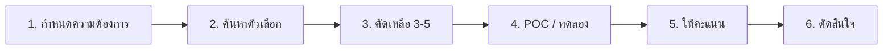

# แม่แบบประเมินเครื่องมือ SOC

> **รหัสเอกสาร:** VENDOR-001  
> **เวอร์ชัน:** 1.0  
> **อัปเดตล่าสุด:** 2026-02-15  
> **เจ้าของ:** SOC Manager / CISO

---

## ขั้นตอนการประเมิน



---

## เกณฑ์ให้คะแนน (1–5)

### ความสามารถหลัก (Weight สูง)
| # | เกณฑ์ | น้ำหนัก |
|:---:|:---|:---:|
| 1 | ความแม่นยำ detection | 3× |
| 2 | รับ log ได้ (EPS/GB ต่อวัน) | 3× |
| 3 | ความเร็ว query | 2× |
| 4 | ปรับแต่ง rule ได้ | 2× |
| 5 | MITRE ATT&CK coverage | 2× |

### Integration
| # | เกณฑ์ | น้ำหนัก |
|:---:|:---|:---:|
| 6 | API (REST, webhooks) | 2× |
| 7 | เข้ากับ stack ปัจจุบัน | 3× |
| 8 | รองรับ log source | 2× |
| 9 | เชื่อม SOAR ได้ | 2× |

### ต้นทุน
| # | เกณฑ์ | น้ำหนัก |
|:---:|:---|:---:|
| 10 | ค่า license | 3× |
| 11 | ค่า implement | 2× |
| 12 | ค่า maintain ต่อเนื่อง | 2× |
| 13 | ค่าใช้จ่ายแอบแฝง | 2× |

### Support
| # | เกณฑ์ | น้ำหนัก |
|:---:|:---|:---:|
| 14 | Support SLA (24/7?) | 2× |
| 15 | มี office/partner ในไทย | 2× |
| 16 | เสถียรภาพ vendor | 1× |

---

## คำนวณคะแนน

```
คะแนนรวม = Σ (คะแนน × น้ำหนัก)
≥ 80% → แนะนำอย่างยิ่ง
60-79% → รับได้ มีข้อจำกัด
< 60% → ไม่แนะนำ
```

---

## Checklist POC (2–4 สัปดาห์)

```
□ Deploy ในสภาพแวดล้อมทดสอบ
□ ใส่ log จริง
□ สร้าง 5 detection rules
□ ทดสอบ alert workflow ตลอดสาย
□ วัดความเร็ว query
□ ทดสอบ API กับเครื่องมือที่มี
□ ให้ analyst 2+ คนใช้จริง แล้วเก็บ feedback
□ เปิด ticket ทดสอบ support response time
```

---

## ตารางเปรียบเทียบต้นทุน

| รายการ | Vendor A | Vendor B | Vendor C |
|:---|---:|---:|---:|
| License ปี 1 | ฿___ | ฿___ | ฿___ |
| Implement | ฿___ | ฿___ | ฿___ |
| Training | ฿___ | ฿___ | ฿___ |
| **รวมปี 1** | **฿___** | **฿___** | **฿___** |
| ปี 2+ ต่อปี | ฿___ | ฿___ | ฿___ |
| **TCO 3 ปี** | **฿___** | **฿___** | **฿___** |

---

## Evaluation Scorecard

| เกณฑ์ | น้ำหนัก | Vendor A | Vendor B | Vendor C |
|:---|:---:|:---:|:---:|:---:|
| Functionality | 30% | [X]/5 | [X]/5 | [X]/5 |
| Integration | 20% | [X]/5 | [X]/5 | [X]/5 |
| Ease of Use | 15% | [X]/5 | [X]/5 | [X]/5 |
| Support | 15% | [X]/5 | [X]/5 | [X]/5 |
| Cost (TCO 3yr) | 20% | [X]/5 | [X]/5 | [X]/5 |
| **Total** | 100% | [XX] | [XX] | [XX] |

## POC (Proof of Concept) Checklist

| # | Test Case | ผลลัพธ์ที่คาดหวัง | ผ่าน? |
|:---:|:---|:---|:---:|
| 1 | Log ingestion ≥ 500 EPS | ไม่มี data loss | ☐ |
| 2 | Detection rule deployment | Rule trigger ภายใน 5 นาที | ☐ |
| 3 | API integration (SIEM↔SOAR) | Bidirectional data flow | ☐ |
| 4 | Dashboard performance | Load < 3 วินาที | ☐ |
| 5 | Fail-over / HA test | Auto-failover < 5 นาที | ☐ |

## Negotiation Checklist

- [ ] Volume discount สำหรับ multi-year
- [ ] Free training included
- [ ] SLA ที่มี penalty clause
- [ ] Data portability clause (exit strategy)
- [ ] Right to audit (security)
- [ ] PDPA-compliant DPA signed

## เอกสารที่เกี่ยวข้อง

- [คู่มือเลือกเครื่องมือ](../01_SOC_Fundamentals/Technology_Stack.th.md)
- [งบประมาณและจัดคน](../01_SOC_Fundamentals/Budget_Staffing.th.md)
- [SOP จัดการเปลี่ยนแปลง](Change_Management.th.md)
