# Vulnerability Management SOP

**Document ID**: OPS-SOP-020
**Version**: 1.0
**Classification**: Internal
**Last Updated**: 2026-02-15

> SOC procedures for **vulnerability scanning, prioritization, tracking, and remediation validation**. Integrates with patching teams, IT operations, and risk management to ensure vulnerabilities are addressed within SLA.

---

## Vulnerability Management Lifecycle


---

## Scanning Schedule

| Scan Type | Scope | Frequency | Tool | Owner |
|:---|:---|:---:|:---|:---|
| **Network vulnerability** | All IP ranges | Weekly | Nessus / Qualys / OpenVAS | Vuln Management |
| **Web application** | All web apps | Monthly | Burp Suite / OWASP ZAP | AppSec |
| **Cloud posture** | AWS / Azure / GCP | Daily | CSPM tool | Cloud Security |
| **Container images** | CI/CD pipeline | Per build | Trivy / Grype | DevSecOps |
| **Configuration audit** | Servers, endpoints | Monthly | CIS Benchmarks | IT Operations |
| **AD/Identity** | Active Directory | Monthly | PingCastle / BloodHound | Identity team |
| **External attack surface** | Public-facing assets | Weekly | EASM tool | SOC |

---

## Severity Classification (CVSS + Context)

### Base CVSS → SOC Priority

| CVSS Score | Base Severity | SOC Priority | Remediation SLA |
|:---:|:---|:---:|:---:|
| 9.0–10.0 | 🔴 Critical | **P1** | 24 hours |
| 7.0–8.9 | 🟠 High | **P2** | 7 days |
| 4.0–6.9 | 🟡 Medium | **P3** | 30 days |
| 0.1–3.9 | 🟢 Low | **P4** | 90 days |
| 0.0 | ⬜ Informational | **P5** | Best effort |

### Contextual Risk Adjustments

| Factor | Adjustment | Example |
|:---|:---:|:---|
| **Internet-facing asset** | +1 Priority | CVSS 7.5 High → P1 |
| **Contains PII / payment data** | +1 Priority | CVSS 5.0 Med → P2 |
| **Active exploitation (CISA KEV)** | → P1 regardless | Any CVE in KEV list |
| **Compensating control in place** | −1 Priority | WAF blocking exploit |
| **Isolated network** | −1 Priority | Air-gapped system |
| **End-of-life system** | +1 Priority | Unpatched, no vendor support |

### Priority Decision Matrix

```mermaid
flowchart TD
    A[New Vulnerability] --> B{In CISA KEV?}
    B -->|Yes| C[🔴 P1 — 24hr SLA]
    B -->|No| D{CVSS Score?}
    
    D -->|9.0+| E{Internet-facing?}
    E -->|Yes| C
    E -->|No| F[🟠 P2 — 7 day SLA]
    
    D -->|7.0-8.9| G{Contains sensitive data?}
    G -->|Yes| F
    G -->|No| H{Compensating control?}
    H -->|Yes| I[🟡 P3 — 30 day SLA]
    H -->|No| F
    
    D -->|4.0-6.9| I
    D -->|< 4.0| J[🟢 P4 — 90 day SLA]

    style C fill:#dc2626,color:#fff
    style F fill:#f97316,color:#fff
    style I fill:#eab308,color:#000
    style J fill:#22c55e,color:#fff
```



---

## SOC Role in Vulnerability Management

### What SOC Does

| Activity | Description | Frequency |
|:---|:---|:---:|
| **Monitor for zero-days** | Track advisories, CISA KEV, vendor bulletins | Daily |
| **Correlate vulns with threats** | Match CVEs to active threat campaigns | Per advisory |
| **Validate exploitability** | Test if vulnerability is exploitable in our env | Per P1/P2 |
| **Track remediation** | Monitor patching progress vs SLA | Weekly |
| **Verify remediation** | Re-scan after patch to confirm fix | Per remediation |
| **Detect exploitation** | SIEM rules for known exploit patterns | Continuous |
| **Report metrics** | Vulnerability posture to management | Monthly |

### What SOC Does NOT Do

| Activity | Responsible Team |
|:---|:---|
| Apply patches | IT Operations / System Admins |
| Deploy WAF rules | Network Security |
| Fix application code | Development teams |
| Manage VM scanner infrastructure | Vulnerability Management team |

---

## Zero-Day Response Procedure

```mermaid
flowchart TD
    A[Zero-Day Announced] --> B[SOC assesses exposure]
    B --> C{Are we affected?}
    
    C -->|No| D[Document, close]
    C -->|Unknown| E[Run asset scan]
    C -->|Yes| F[🔴 Declare P1 Vulnerability]
    
    E --> C
    
    F --> G[Notify CISO + IT Ops]
    F --> H[Create detection rules]
    F --> I[Assess compensating controls]
    
    G --> J[Emergency patch / mitigate]
    H --> K[Monitor for exploitation]
    I --> J
    
    J --> L[Verify fix]
    K --> L
    L --> M[Post-incident review]

    style F fill:#dc2626,color:#fff
    style J fill:#22c55e,color:#fff
```



### Zero-Day Checklist

- [ ] Advisory received and reviewed
- [ ] Affected asset inventory completed
- [ ] Impact assessment documented
- [ ] CISO notified (if P1)
- [ ] Detection rules deployed
- [ ] Compensating controls assessed/applied
- [ ] Emergency patching initiated
- [ ] Exploitation monitoring active
- [ ] Re-scan completed post-patch
- [ ] Stakeholders updated

---

## Remediation Tracking

### Remediation Ticket Template

| Field | Value |
|:---|:---|
| **CVE ID** | CVE-____-_____ |
| **CVSS Score** | ___._ |
| **SOC Priority** | P_ |
| **Affected Assets** | ______________ (count: ___) |
| **Asset Criticality** | Critical / High / Medium / Low |
| **SLA Deadline** | ____-__-__ |
| **Current Status** | Open / In Progress / Patched / Verified / Closed |
| **Assigned To** | ______________ (team) |
| **Compensating Control** | ______________ (if any) |
| **Verification Scan Date** | ____-__-__ |
| **Verified Fixed** | ⬜ Yes / ⬜ No |

### SLA Tracking Dashboard

| Priority | Total Open | Within SLA | Overdue | % Compliant |
|:---:|:---:|:---:|:---:|:---:|
| 🔴 P1 | _____ | _____ | _____ | ___% |
| 🟠 P2 | _____ | _____ | _____ | ___% |
| 🟡 P3 | _____ | _____ | _____ | ___% |
| 🟢 P4 | _____ | _____ | _____ | ___% |
| **Total** | **_____** | **_____** | **_____** | **___%** |

### Exception/Risk Acceptance Process

| Step | Owner | Output |
|:---:|:---|:---|
| 1 | Asset owner requests exception | Exception request form |
| 2 | SOC validates risk and compensating controls | Risk assessment |
| 3 | Risk Manager reviews | Risk acceptance recommendation |
| 4 | CISO approves (P1/P2) or Security Manager (P3/P4) | Signed acceptance |
| 5 | SOC adds to exception tracker | Tracked with review date |
| 6 | Re-review at expiration (max 90 days) | Renewed or remediated |

---

## Detection Rules for Known Exploits

| CVE Category | Detection Approach | Source |
|:---|:---|:---|
| **Web exploits** | WAF signatures + SIEM correlation | WAF logs + IDS |
| **RCE exploits** | Process execution anomalies post-exploit | EDR + Sysmon |
| **Privilege escalation** | Unexpected privilege changes | Windows Event logs |
| **Credential theft** | Post-exploitation lateral movement | EDR + AD logs |
| **Supply chain** | Unexpected outbound connections from updated software | Proxy + DNS |

### Threat Intel Integration

```
[Vendor Advisory] → [CVE Published] → [SOC Reviews]
                                            ↓
[CISA KEV Update] → [Auto-priority P1] → [SOC Deploys Detection]
                                            ↓
[Exploit-DB / PoC] → [SOC Validates] → [Update Detection Rules]
```

---

## Metrics

| Metric | Target | Measurement |
|:---|:---:|:---|
| P1 remediation within SLA | ≥ 95% | Ticket tracking |
| P2 remediation within SLA | ≥ 90% | Ticket tracking |
| Mean time to remediate (P1) | < 24 hours | Ticket timestamps |
| Mean time to remediate (P2) | < 7 days | Ticket timestamps |
| Scan coverage (assets scanned / total) | ≥ 95% | VM tool reports |
| Re-scan compliance (verified post-patch) | ≥ 90% | Re-scan reports |
| Open P1/P2 vulnerabilities (current) | 0 beyond SLA | Dashboard |
| Exception count (active) | < 10 | Exception tracker |
| Detection rule coverage for KEV | 100% | Detection audit |

---

## Related Documents

-   [Threat Landscape Report](Threat_Landscape_Report.en.md) — CVE tracking
-   [Log Source Matrix](Log_Source_Matrix.en.md) — Scan data sources
-   [Cloud Security Monitoring](Cloud_Security_Monitoring.en.md) — Cloud vulns
-   [SOC Automation Catalog](SOC_Automation_Catalog.en.md) — Auto-scan automation
-   [Escalation Matrix](../05_Incident_Response/Escalation_Matrix.en.md) — Zero-day escalation
-   [KPI Dashboard Template](KPI_Dashboard_Template.en.md) — Vuln reporting
